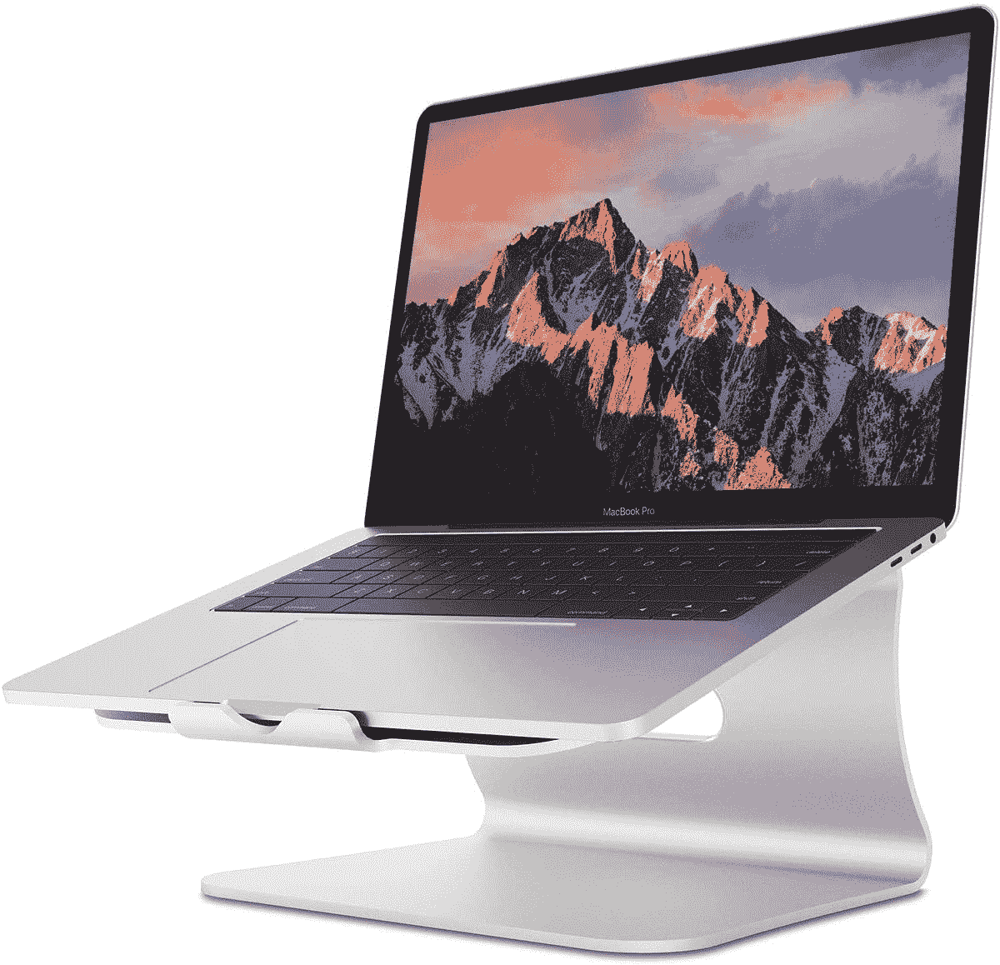

# 2023 年最佳苹果 MacBook Pro (2023)配件

> 原文：<https://www.xda-developers.com/best-macbook-pro-2023-accessories/>

# 2023 年最佳苹果 MacBook Pro (2023)配件

MacBook Pro (2023)装有 M2 Pro 或 M2 Max 芯片。以下是可以帮助您充分利用这款功能强大的笔记本电脑的最佳配件。

[MacBook Pro (2023)](https://www.xda-developers.com/macbook-pro-2023/) 是目前可用的[最好的 MAC 电脑](https://www.xda-developers.com/best-macs/)之一。它装有 [macOS Ventura](https://www.xda-developers.com/macos-ventura/) 和 M2 Pro/Max 芯片，使它成为一款经得起未来考验的笔记本电脑，可以让用户使用很多很多年。尽管如此，这种耐用的设备本身可能会有所欠缺。这就像有一颗强大的心，但没有足够的四肢来利用其无与伦比的力量。幸运的是，你可以通过购买配件来改变这种情况。下面你会发现各种各样的配件类型，可以帮助更好地利用 MacBook Pro (2023)。这样，您就可以在计算机的漫长生命周期中充分利用它。

*   ##### 苹果 ai rpods Pro 2

    ai rpods Pro 2 拥有大量功能，包括主动降噪(ANC)、杜比 Atmos 内容和无线充电，尽管它们的结构紧凑。macOS 完全支持这些无线耳塞。

    T13
*   ##### 苹果 ai rpods 3

    ai rpods 3 的设计与 AirPods Pro 相似，但没有硅胶吸头。如果你不喜欢 AirPods Pro 的入耳式设计，你可以得到 AirPods 3。

*   ##### 苹果 AirPods Max

    和 AirPods Pro 一样，AirPods Max 自带主动降噪(ANC)和杜比 Atmos 支持。不过，由于尺寸更大，Max 变种提供了更多的音频沉浸感。

    T33
*   ##### JBL GO3 便携式无线音箱

    JBL Go 3 是我们最喜欢的便携式无线音箱之一。它防水，电池续航时间长，可以播放你在 MacBook Pro 上播放的音频。

*   <picture></picture>

    索尼 DualSense 控制器

    ##### 索尼 PlayStation DualSense 控制器

    索尼全新 DualSesne 为游戏控制器树立了新标杆。它具有自适应触发器和改进的触觉，可提供身临其境的游戏体验。macOS 原生支持这个控制器。

    T34
*   <picture></picture>

    罗技 G502 光速

    ##### 罗技 G502 英雄光速

    这款高端游戏鼠标拥有 25K DPI 传感器和低延迟无线。

*   ##### Apple Magic Mouse 2

    如果你正在寻找无缝兼容性和功能支持，Apple Magic Mouse 是目前最好的鼠标选择。它采用了圆滑的设计，看起来很好，你也可以在其光滑的表面上执行各种手势命令。

    T34
*   ##### Apple Magic Trackpad 2

    除了无忧无虑的体验，Apple Magic Trackpad 还在 macOS 上提供精确的控制和广泛的手势支持，包括 force-touch 兼容性。

*   ##### 苹果魔法键盘搭配触控 ID

    不仅是苹果的第一方设备，而且这一款还包含了触控 ID 传感器。

    T17
*   ##### 苹果魔法键盘，带触控 ID 和数字小键盘

    这款键盘包括了上一款的所有功能，还带有数字小键盘。它非常适合那些与数字打交道的人。

*   ##### Blue Yeti X

    Blue Yeti X 是最好的麦克风之一，除了游戏和流媒体之外，它甚至可以用于专业录音使用案例。

    T37
*   <picture></picture>

    best and 铝制支架

    ##### best and 铝制支架

    这款铝制支架非常适合那些想要抬起和倾斜 MacBooks 以获得完美工作角度的人。它有硅胶垫，可以避免刮伤你的 Mac，并防滑。

*   ##### NexiGo 144Hz 17.3 英寸便携式游戏显示器

    这款便携式显示器与众不同。它的刷新率为 144 赫兹，专为游戏设计。它非常适合那些希望在旅途中将外接显示器与 MacBook Pro 配对的人。

    T34
*   ##### 苹果 Pro 显示器 XDR

    苹果 Pro 显示器 XDR 提供了令人疯狂的 6016×3384 像素分辨率。它的对比度是 1，000，000:1，拥有超宽视角。

*   ##### SanDisk Extreme Portable SSD

    SanDisk Extreme Portable 是一款专为户外设计的 SSD，其坚固的机箱可以承受两米的跌落，并具有 IP55 防水和防尘性能。它甚至还有一个登山扣环，速度也相当快，读取速度高达 1050 MB/s。

*   ##### 希捷扩展硬盘

    大多数人可能想要快速存储，但有时，你只是想要大规模备份。这款巨大的希捷硬盘容量高达 18TB，因此您可以以比同等容量的固态硬盘存储低得多的价格存储您的所有文件。

*   ##### 肯辛顿 SD5780T 雷电 4 坞站

*   ##### CalDigit TS4 Thunderbolt 4 Dock

    Thunderbolt docks 比 CalDigit TS4 好不了多少。总共有 18 个端口，包括 Thunderbolt 下游端口、DisplayPort、USB-C、USB-A 和超快 2.5Gb 以太网，这一个是另一回事。它还具有坚固的金属结构，这有助于它感觉优质和耐用。

*   ##### Anker 341 7 合 1 USB-C Hub

    这个坞站比以前的更紧凑，更庞大，但它只会给你最基本的东西。它包括 HDMI、SD 卡、USB Type-C 和 Type-A 端口等。如果您需要更多端口，但又不想花很多钱，这是一个不错的选择。

    T17
*   <picture></picture>

    cloud valley 网络摄像头盖

    ##### cloud valley 网络摄像头盖

    担心隐私？为您的 MacBook Pro 购买这款简单易用的网络摄像头滑盖。它使用 3M 强力粘合剂附着在边框上。

*   ##### Spigen Rugged Armor Pro 笔记本电脑保护套

    这款 Spigen 保护套非常适合那些倾向于经常摔 MacBooks 的人。它提供了一个坚固的建筑，具有显著的抗冲击能力。此外，它还有一个专用的 AirTag 插槽，以防您将笔记本电脑放错地方。

    T34

正如我们的列表所反映的，有大量不同种类的配件可以与 MacBook Pro (2023)一起使用或配对。就我个人而言，我的 MacBook 使用铝制支架、无线扬声器、套筒和 AirPods。如果您依赖外部显示器，那么您可能需要购买鼠标和键盘。同样，如果您倾向于在本地存储大文件，您可能会发现自己需要一个外部存储。

##### 苹果 MacBook Pro (2023)

14 和 16 英寸 MacBook Pro (2023)型号采用了 2021 年首次推出的相同外部机箱。他们提供增强的 M2 Pro 和 M2 Max 芯片，Wi-Fi 6E 和蓝牙 5.3 支持，HDMI 2.1 兼容性，凹槽显示屏等等。

*你的 MacBook Pro (2023)配什么配件？请在下面的评论区告诉我们。*