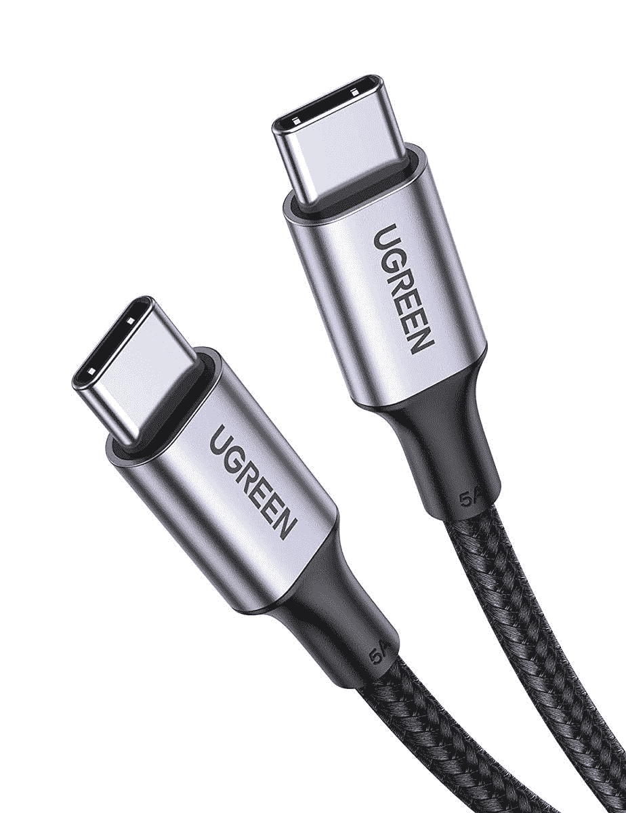
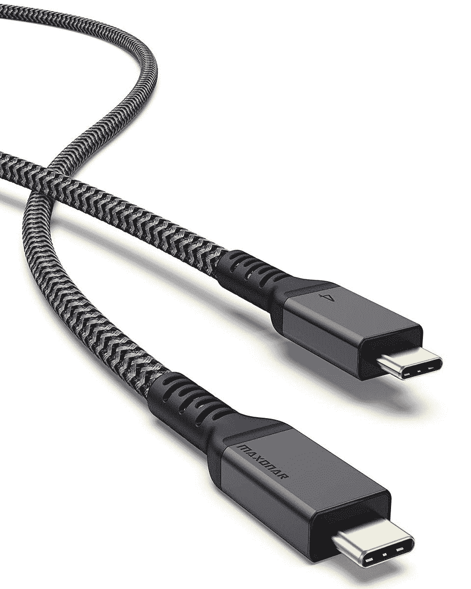
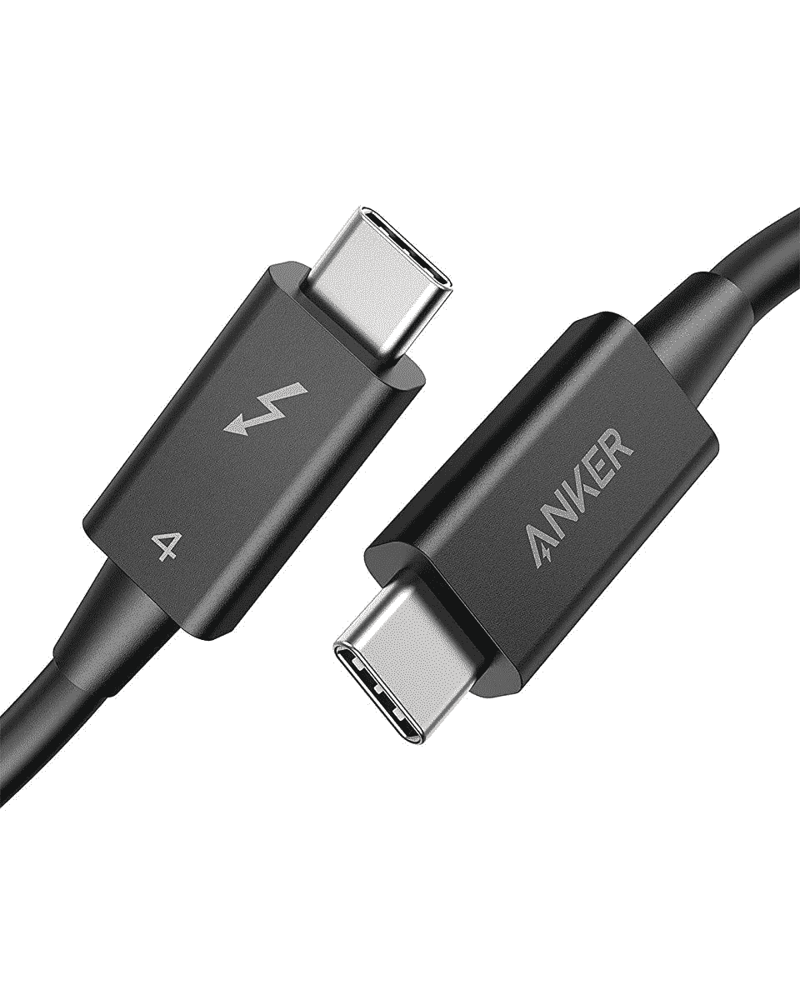
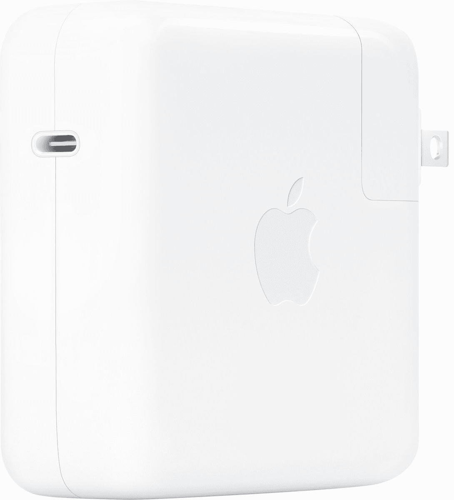

# 2023 年最佳苹果 MacBook Pro (2023)充电器

> 原文：<https://www.xda-developers.com/best-macbook-pro-2023-chargers/>

# 2023 年最佳苹果 MacBook Pro (2023)充电器

MacBook Pro (2023)支持通过 MagSafe 3 和 USB Type-C 端口充电。以下是你能为这台 Mac 找到的最好的替代充电器。

升级的 14 英寸和 16 英寸的 MacBook Pro (2023 年)型号已经到来，包装了 T2 的 MAC OS Ventura(T3)和苹果 M2 Pro/Max 芯片。可以说，由于其无与伦比的处理能力、能效、现代设计和端口多样性，它们是目前可用的[最好的 MAC 电脑](https://www.xda-developers.com/best-macs/)。这些型号上的端口包括 HDMI、SD 卡插槽、耳机插孔、三个 Thunderbolt 4 和 MagSafe 3，用于充电。许多用户不知道的是，MagSafe 3 端口并不是这些 MacBook Pro 型号的唯一充电方式。事实上，你也可以使用三个 Thunderbolt 4 端口中的任何一个来给这个发电站充电。如果您对 MacBook Pro 包装盒中包含的 MagSafe 3 充电器不满意，我们编辑了一份您现在可以找到的最佳替代充电器列表。

## 最佳 MacBook Pro (2023)充电电缆

除了苹果官方的 MagSafe 3 转 USB-C 线，从第三方找 MagSafe 3 充电线几乎是不可能的。因此，我们将只列出 USB-C 到 USB-C 充电电缆。你可以依靠这些来通过三个 Thunderbolt 4 端口中的任何一个为 MacBook Pro (2023)充电。

*   ##### 苹果 USB-C 转 Magsafe 3 线

    这是 MacBook Pro (2023)的官方 MagSafe 3 充电线。它类似于 Mac 包装盒中包含的那个。如果您需要备用单元，这可能是您在 MagSafe 部门的唯一选择。

    T13
*   <picture></picture>

    ugre suc w USB C 转 USB C 线

    ##### ugre suc w USB C 转 USB C 线

    这款优质线价格实惠，支持 100W 快充和 480Mbps 数据传输速度。

*   ##### 苹果 USB-C 充电线

    苹果官方 USB-C 充电线有一米和两米两种长度。它支持高达 96W 的功率输出。

    T34
*   <picture></picture>

    Maxonar Thunderbolt 4 线缆

    ##### Maxonar Thunderbolt 4 线缆

    为了额外的耐用性，这款 Maxonar 线缆完全包裹在尼龙之中。它支持 Thunderbolt 4 的所有功能，最长可达 6.6 英尺

*   <picture></picture>

    Anker Thunderbolt 4 线缆

    ##### Anker Thunderbolt 4 线缆

    这款 Anker 线缆带给你 Thunderbolt 4 的全部功能，包括 40Gbps 带宽和 100W 功率。它有 2.2 英尺长，对于大多数用途来说已经足够了。

*   ##### 亚马逊基础 USB-C 转 USB-C 6 英尺线缆

    亚马逊基础的这款线缆是一款价格实惠的选择，有白色和黑色两种颜色，价格在 10 美元左右。

    T34

* * *

## 最佳充电器

根据你选择的 MacBook Pro (2023)型号，包装盒可能包括 67W 或 96W 的砖块。下面是一些替代方案，可用于我们上面列出的任何 USB-C 电缆选项。

*   ##### Anker 715 充电器(Nano II 65W)

    这是一款来自 Anker 的微型充电器，可以实现高达 65W 的输出。你可以用这个给你的 MacBook Pro 充电。

*   <picture></picture>

    苹果 67W USB-C 电源适配器

    ##### 苹果 67W USB-C 电源适配器

    这是苹果官方收录在 base MacBook Pro (2023)的 s box 中的充电砖。如果你需要一个相同的替代品或备用单元，这是一个去。

    T34
*   <picture></picture>

    Anker power port III 100W

    ##### Anker power port III 100 w 充电器

    Anker 还有一个 2 口 100 w 充电器。您可以在两个端口之间分配 100 瓦功率，或者通过一个端口全部使用。

*   ##### IFEART 96W 充电器

    这款快速充电器支持高达 96W 的输出，并附带一根 USB C 转 USB C 线作为额外奖励。

    T34
*   ##### u green 140 w NEX ode GaN 3 端口充电器

    u green NEX ode 140 w USB PD 3.1 充电器也是为您的设备充电的绝佳选择。这种特殊的 GaN 充电器配有 6 英尺 USB-C 到 USB-C 电缆，可为您的所有最新设备充电。

*   ##### 苹果 96W USB-C 电源适配器

    苹果的另一款官方充电砖是更高端的 MacBook Pro (2023)机型自带的。它会以更快的速度给你的笔记本电脑充电。

    T17

* * *

尽管第三方 MagSafe 3 充电器有限且难以获得，但幸运的是，用户至少可以通过 MacBook Pro (2023)的 USB-C 端口依赖第三方解决方案。就个人而言，我依赖 MagSafe 3 充电器，因为它使用起来更方便，不需要太多的努力来连接和断开。

##### 苹果 MacBook Pro (2023)

14 和 16 英寸 MacBook Pro (2023)型号采用了 2021 年首次推出的相同外部机箱。他们提供增强的 M2 Pro 和 M2 Max 芯片，Wi-Fi 6E 和蓝牙 5.3 支持，HDMI 2.1 兼容性，凹槽显示屏等等。