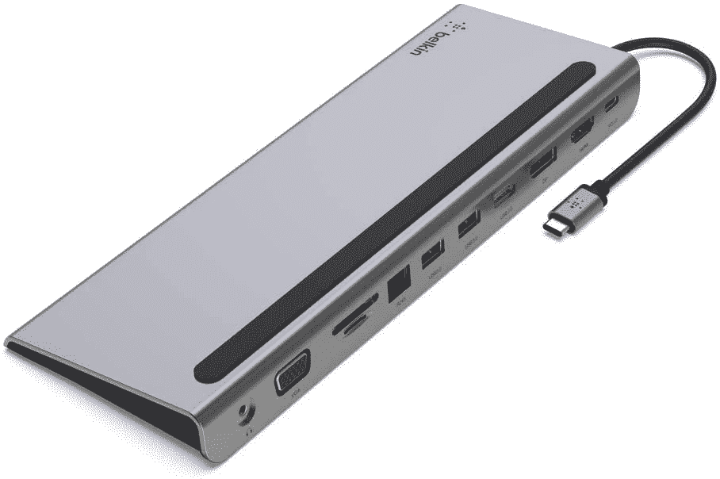

# 2023 年最佳苹果 MacBook Pro (2023)扩展坞

> 原文：<https://www.xda-developers.com/best-macbook-pro-2023-docking-stations/>

# 2023 年最佳苹果 MacBook Pro (2023)扩展坞

扩展坞可以帮助您充分利用苹果 M2 专业版和 M2 Max 芯片的功能。以下是适用于您的 MacBook Pro (2023)的最佳坞站。

功能强大的苹果电脑家族进一步扩大。由 [macOS Ventura](https://www.xda-developers.com/macos-ventura/) 和 M2 Pro/Max 芯片驱动，苹果发布了全新的 [MacBook Pro (2023)](https://www.xda-developers.com/macbook-pro-2023/) 型号。尽管有不同的 14 英寸和 16 英寸尺寸，但这两款 MacBook Pro 都提供了相同的 I/O 设置。其中包括 HDMI、三个 Thunderbolt 4、MagSafe 3 充电端口。除此之外，还有粉丝们的最爱——3.5 毫米耳机插孔和 SD 卡插槽。尽管端口种类繁多，但许多用户可能会发现自己需要更多的端口。为了帮助您充分利用您的 MacBook Pro (2023)，我们准备了一份当前可用的最佳坞站列表。根据您的个人需求和期望选择一两个码头。

## 最佳 MacBook Pro (2023)坞站

*   ##### CalDigit TS4 Thunderbolt 4 Dock

    Thunderbolt Dock 比 CalDigit TS4 好不了多少。总共有 18 个端口，包括 Thunderbolt 下游端口、DisplayPort、USB-C、USB-A 和超快 2.5Gb 以太网，这一个是另一回事。它还具有坚固的金属结构，这有助于它感觉优质和耐用。

    T13
*   <picture></picture>

    肯辛顿迅雷 4 扩展坞

    ##### 肯辛顿 SD5700T 迅雷 4 扩展坞

    这款肯辛顿迅雷扩展坞增加了 USB 端口、SD 读卡器、以太网和迅雷菊花链。它还可以为您的 MacBook Pro 提供 90W 的功率，无论您将它连接到什么设备。

*   <picture></picture>

    Belkin Connect USB-c11-in-1 多端口坞站

    ##### Belkin Connect USB-c11-in-1 多端口坞站

    这款坞站提供多种端口、SD 卡读卡器以及 100W USB-PD，可将您的游戏体验转化为功能齐全的工作站成角度的设计还可以让您将 MacBook Pro 支撑在基座上。

*   <picture></picture>

    可插拔雷电 3 坞站

    ##### 可插拔 14 合 1 雷电 3 坞站

    该坞站可以作为桌面设置的中央集线器，具有多个显示器输出、USB 端口和以太网，因此您可以将更多外围设备连接到 MacBook Pro。它还提供高达 100 瓦的功率，因此您可以在一个紧凑的包装中拥有您需要的一切。

*   ##### Anker 575 USB-C 坞站(13 合 1)

    Anker 的这款坞站通过提供 13 个额外的端口，将您的 MacBook Pro 提升到一个新的水平。其中包括 SD 卡、以太网和 USB-A 支持。

*   ##### CalDigit Element Hub

    如果你想要一个非常紧凑的坞站，并且你主要依赖于基于 Thunderbolt 的外设，CalDigit Element Hub 可能适合你。它只有几个端口，但有三个 Thunderbolt 下游连接和四个 USB Type-A 端口，它仍然非常强大。

    T17

* * *

这些是你能为你的苹果 MacBook Pro (2023)找到的最好的扩展坞。如您所见，有许多不同的选项，具有不同的大小和端口号。这样，无论你的预算或需求是什么，你都有可能找到一款适合你的新 Mac。就我个人而言，如果我不得不选择一个，我会选择 CalDigit TS4 码头，因为它的港口品种和坚实的建设质量。

##### 苹果 MacBook Pro (2023)

14 和 16 英寸 MacBook Pro (2023)型号采用了 2021 年首次推出的相同外部机箱。他们提供增强的 M2 Pro 和 M2 Max 芯片，Wi-Fi 6E 和蓝牙 5.3 支持，HDMI 2.1 兼容性，凹槽显示屏等等。

*您会购买这些 MacBook Pro (2023)坞站中的哪一个，为什么？请在下面的评论区告诉我们。*