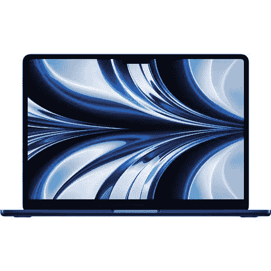
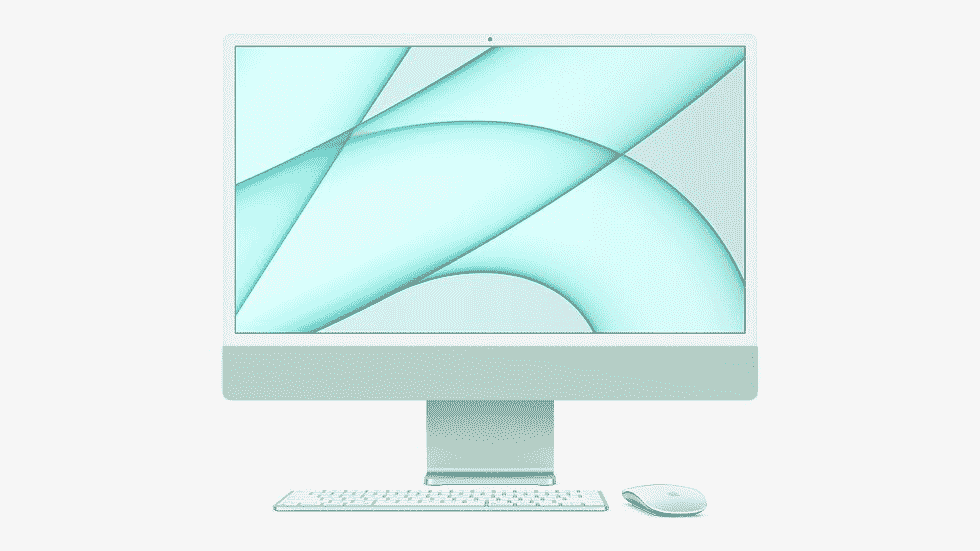

# 2023 年最佳苹果电脑

> 原文：<https://www.xda-developers.com/best-macs/>

苹果公司以其生产的高质量电脑而闻名。尤其是苹果电脑，是许多学生和创造者的最爱。与竞争对手相比，它们往往拥有紧凑的结构，并配备了一些目前最快、最节能的计算芯片组。不过，考虑到该公司销售的大量型号和尺寸，选择正确的设备可能具有挑战性。这就是为什么我们将苹果目前销售的最好的 MAC 电脑进行了分类，以帮助你找到最适合你工作流程的电脑。

## 最佳整体:MacBook Air M2 13 英寸

十多年前，史蒂夫·乔布斯从一个马尼拉信封里拿出了第一台 MacBook Air。它是作为一款拥有强大功能的轻薄设备推出的，直到今天，它仍然是同类产品中最轻薄、功能最强大的设备之一。在苹果公司推出 M1 和 M2 芯片后，情况尤其如此。苹果在 WWDC22 期间发布了 [MacBook Air M2](https://www.xda-developers.com/macbook-air-m2-2022-review/) 13 英寸，它很快夺走了我们最好的 Mac 王冠。

总的来说，MacBook Air 在我心中一直有着特殊的地位，但它已经发展成为性能和价格的标志性融合。它只是将两个世界的精华融合在一个具有未来感的机箱中。深受学生和员工的喜爱，这款 Mac 重量轻，功能强大，简直令人惊叹。只要把它放进你的背包里，无论你去哪里，它都会陪着你。

2023 款 MacBook Air 拥有 13.6 英寸的 LED 背光显示屏，分辨率为 2560 x 1664，分辨率为 224 PPI，支持数百万种颜色。它的屏幕还支持 True Tone，使颜色在特定的光线条件下变得更温暖。

M2 芯片有一个永远在线的处理器，一个带有四个性能核心和四个效率核心的八核 CPU，一个八核 GPU 和一个 16 核神经引擎。与价格相似的笔记本电脑相比，这使它成为了一个动力室。它的能力和能效达到了苹果实际上从内部移除了风扇的程度。MacBook Air M2 在一般使用情况下根本不会发热。

说到续航，它内置了 52.6Wh 锂聚合物电池。据苹果公司称，一次充电后，它可以持续 15 个小时浏览网页。它配有一个 30W 的 USB-C 电源适配器，充满电不需要很长时间，相对来说。

MacBook Air M2 包括两个 USB-C 端口，令人惊讶的是，还有一个 3.5 毫米耳机插孔。此外，苹果公司重新推出了 MagSafe 3 充电端口。因此，您可能需要购买额外的加密狗，或者依赖基于云计算和其他无线解决方案。就我个人而言，我并不感到困扰，因为我的设置是完全无线的，我的工作是基于互联网浏览器的，至少在很大程度上是这样。我只用 MagSafe 3 端口给它充电。两个雷电 3 端口和耳机插孔保持不变。

这款强大的笔记本配备了 8GB 内存，但如果您需要额外的内存，它可以升级到 24GB。基本型号有 256GB 的 SSD 存储，可以升级到 512GB、1TB 或 2TB。这些配置应该足以满足普通用户的需求。

苹果 MacBook Air M2 支持 macOS Ventura，并且它应该在未来几年支持未来的 macOS 更新。因此，您可以利用最新的功能、错误修复和安全补丁。它有四种颜色可供选择:银色、星光、太空灰和午夜。因此，如果你喜欢更鲜艳的颜色，你将不得不满足于你的新笔记本电脑的外壳或皮肤。基本款在美国的售价为 1，199 美元。

 <picture></picture> 

MacBook Air (M2, 2022)

##### 苹果 MacBook Air (2022)

这款 MacBook Air 采用苹果 M2 芯片，这是该公司迄今为止功能最强大、效率最高的芯片。

## 最适合创作者:配备 M2 专业版的 MacBook Pro(14 英寸)

苹果 MacBook Pro 已经成为最强大的笔记本电脑之一有一段时间了。它很强大，有坚实的构建，支持来自苹果和第三方开发者的各种专业编辑工具。搭载 M2 Pro 的 14.2 英寸 MacBook Pro 提供了一种极简主义的高端设计，这是其配备类似功能的竞争对手无法比拟的。它提供了很好的耐用性和便携性，并且可能至少在七年内得到更新。总而言之，这是一项面向未来的投资。

最新的 MacBook Pro 由苹果 M2 Pro 芯片提供支持，拥有 14.2 英寸的液态视网膜 XDR 显示屏，分辨率为 3024 x 1964，分辨率为 254 PPI。它的屏幕还支持 True Tone，使颜色在特定的光线条件下看起来更温暖，以及推广技术，允许您利用 120Hz 的刷新率。

说到电池寿命，它内置了 70Wh 的锂聚合物电池。据苹果公司称，一次充电观看视频时，它可以持续长达 18 个小时。它配有 67W USB-C 电源适配器，因此充满电不会花很长时间，即使完全耗尽。

MacBook Pro M2 Pro 包括三个 Thunderbolt 4 端口、一个 3.5 毫米耳机插孔、一个 HDMI 端口、一个 SD 卡插槽和一个 MagSafe 3 充电端口。所以你可能不需要购买额外的加密狗，因为这种港口品种可能符合大多数人的需求。

这种动力配备了 16GB 的内存，但如果您需要额外的内存，它可以升级到 32GB。基本型号有 512GB 的 SSD 存储，可以升级到 1TB、2TB、4TB 或 8TB。M2 Pro 芯片有一个永远在线的处理器，多达 12 个 CPU 核心，多达 19 个 GPU 核心和 16 核神经引擎。与价格相似的笔记本电脑相比，这使它变成了一只不可阻挡的野兽。苹果 MacBook Pro M2 Pro 预装了 macOS Ventura。

配备 M2 Pro 的 MacBook Pro 对普通人来说绰绰有余，因此它更适合从事音频/视频编辑和其他密集型任务的人。它只有两种颜色——银色和太空灰——基本款在美国的售价为 1999 美元。

##### 苹果 MacBook Pro (2023)

14 和 16 英寸 MacBook Pro (2023)型号采用了 2021 年首次推出的相同外部机箱。他们提供增强的 M2 Pro 和 M2 Max 芯片，Wi-Fi 6E 和蓝牙 5.3 支持，HDMI 2.1 兼容性，凹槽显示屏等等。

## 最适合专业创作者:MacBook Pro 和 M2 Max (16 英寸)

如果 14 英寸的 MacBook Pro 不足以满足你的需求，你很幸运。苹果还宣布了 2023 年的 16 英寸 MacBook Pro 变种。它配备了 M2 Max 芯片，使设备能够执行密集的任务，它是苹果目前产品阵容中最强大的。它是无与伦比的，尤其是与不同制造商生产的价格相似的笔记本电脑相比。

这款 [16.2 英寸 MacBook Pro](https://www.xda-developers.com/macbook-pro-2023/) 拥有液态视网膜 XDR 显示屏，分辨率为 3456 x 2234，分辨率为 254 PPI，支持十亿种颜色。它还支持真实色调，使颜色在某些照明条件下变得更温暖。然而，它缺少一个触摸条，因为该公司已经在最高端的型号上放弃了对它的支持。

说到电池寿命，它内置了 100 瓦时的锂聚合物电池，根据苹果公司的说法，一次充电可以持续 22 小时观看视频，并配有 140 瓦的 USB-C 电源适配器。这款 MacBook Pro 还包括一个 MagSafe 3 端口充电，允许您方便地连接和断开电缆。

这个庞然大物配有 32GB 的内存，但它可以升级到高达 96GB。基本型号有 1TB 的 SSD 存储，可以升级到 8TB。无论你在做什么，这些配置都足以满足你的需求，甚至可能超越它们。就像最近的其他 Mac 一样，它支持 [macOS Ventura](http://xda-developers.com/macos-ventura)

我个人不会购买这款 MacBook，因为它对于我的一般计算需求来说太强大了。但是，如果您在繁重的编辑或其他需要这种处理能力的领域工作，这就是您正在寻找的。和今年的另一款 MacBook Pro 一样，只有银色和太空灰两种颜色。这款机型在美国的售价为 3，499 美元，但增加更多内存或存储空间将会进一步提高价格。

##### 苹果 MacBook Pro (2023)

14 和 16 英寸 MacBook Pro (2023)型号采用了 2021 年首次推出的相同外部机箱。他们提供增强的 M2 Pro 和 M2 Max 芯片，Wi-Fi 6E 和蓝牙 5.3 支持，HDMI 2.1 兼容性，凹槽显示屏等等。

## 最佳台式机:iMac M1 24 英寸

苹果 iMac M1(T1)是一款新的一体机，最近进行了彻底的重新设计。它功能强大，有多种颜色可供选择，支持来自苹果和第三方开发者的各种专业编辑工具。这款台式机提供了类似一体机无法比拟的现代高端设计。它非常耐用，通常至少七年都有软件更新。总而言之，我们可以有把握地说，这是一项经得起未来考验的投资，将会在未来几年放在你的办公桌上。

最新的 iMac 采用苹果 M1 芯片，拥有 24 英寸 4.5K 视网膜显示屏，分辨率为 4480 x 2520，218 PPI，支持 10 亿种颜色。它的屏幕还支持 True Tone，使颜色在特定的光线条件下变得更温暖。此外，它还包括一个带 M1 图像信号处理器的 1080p FaceTime 高清摄像头，以便您可以放心地参加虚拟课程或工作会议。

说到电源，iMac 不包括电池。它必须一直插着电源，这是有道理的，因为它是一台固定的台式电脑。然而，如果你住在经常停电的地区，你可能会考虑购买 MacBook。iMac M1 也只包括四个 USB-C 端口，一个 3.5 毫米耳机插孔，并支持千兆以太网。

这款动力系统配有 8GB 内存，但如果您需要额外的内存，它可以升级到 16GB。基本型号有 256GB 的 SSD 存储，可以升级到 512GB、1TB 或 2TB。M1 芯片有一个永远在线的处理器，一个带有四个性能核心和四个效率核心的八核 CPU，一个八核 GPU 和一个 16 核神经引擎。与类似的计算机相比，这使它成为一台强大的机器。这些配置无论你的职业是什么，满足你的需求都应该绰绰有余，甚至超越。

iMac 支持一个外部显示器，分辨率高达 6K，频率为 60Hz，具有高保真的六扬声器系统，带有力消除低音扬声器，宽立体声支持，播放音乐或视频时支持杜比 Atmos 的空间音频，具有高信噪比和定向波束形成的录音室质量三麦克风阵列，以及 Hey Siri 支持。

苹果 iMac M1 还预装了 macOS 11 Big Sur。但是，您可以将其更新到 macOS Ventura，以利用最新的功能、错误修复和安全补丁。这种台式电脑非常适合那些一直远程学习或工作的人，因为它是静止的。因此，如果你去上课或亲自去办公室，你可能会想买一台 MacBook。它对普通用户来说绰绰有余，所以它更适合从事音频/视频编辑和其他密集型任务的人。

iMac M1 也非常适合那些喜欢鲜艳颜色的人，因为它有七种颜色可供选择:蓝色、绿色、粉色、银色、黄色、橙色和紫色。基本款在美国的售价为 1，499 美元，它配有一个带触控 ID 和魔法鼠标的魔法键盘。

 <picture></picture> 

Apple iMac M1

##### 苹果 iMac (2021 年)

这款 iMac 是一款强大的台式电脑，有七种不同的颜色可供选择。它由苹果 M1 芯片驱动。

## 最佳预算:Mac Mini M2

如果你想花不到 1000 美元买一台 Mac 电脑，那么 Mac Mini M2 就是你的救星！顾名思义，这是一个小苹果，但不要让它的大小欺骗了你——它有明显的冲击力。

说到电源，这台 Mac 不包括电池。它必须随时插上电源，这很有意义，因为它是一台设计紧凑的固定式台式电脑。虽然它可以很容易地移动，但你仍然需要打包它的鼠标、键盘、屏幕和其他附件。

Mac Mini 目前支持 macOS Ventura。然而，出乎意料的是，它没有配备显示屏、魔法鼠标或魔法键盘。它只配有电源线。所以你必须单独购买所有配件。考虑到这是市面上最便宜的 Mac，这并不奇怪。为了降低价格，苹果不得不牺牲某些元素。它最多可以同时支持三个显示器:两个显示器通过 Thunderbolt 以 60Hz 的速度提供高达 6K 的分辨率，一个显示器通过 HDMI 以 60Hz 的速度提供高达 4K 的分辨率。它还有一个内置扬声器。

Mac Mini M2 包括两个 USB-C 端口(或者四个，如果你选择 M2 Pro 版本)，两个 USB-A 端口，一个 HDMI 2.1 端口，一个 3.5 毫米耳机插孔，并支持千兆以太网。与其他一些 Mac 机型相比，它有相当多的端口，但并不能满足所有用户的需求。

这个小小的喜悦包配有 8GB 的内存，但它可以升级到 32GB。基本型号有 256GB 的 SSD 存储，可以升级到 512GB、1TB、2TB、4TB 或 8TB。M2 芯片有一个永远在线的处理器，一个带有四个性能核心和四个效率核心的八核 CPU，一个十核 GPU 和一个 16 核神经引擎。无论您从事何种职业，这些配置都足以满足您的需求。如果不是这样，你可以通过 M2 Pro 模型获得一个十核 CPU，六个性能核心和四个效率核心，一个 16 核 GPU 和一个 16 核神经引擎。

这款 Mac 非常适合预算有限的人。您可以以相对较低的价格获得强大的计算和处理能力。你总是可以买到便宜或二手的键盘、鼠标和屏幕。最终，计算机本身的质量才是最重要的。苹果 Mac Mini M2 只有银色款。它的基本型号售价为 599 美元，而且，提醒一下，它只配有一根电源线。

##### 苹果苹果迷你电脑(2023)

Mac Mini (2023)在一个微小的外形中集成了苹果的 M2 或 M2 Pro 芯片。由于其低廉的价格，它将动力与经济性融为一体。

## 专业创作者的最佳桌面:Mac Studio

[Mac Studio](https://www.xda-developers.com/apple-mac-studio-m1-ultra-review/) 是面向需要非凡处理能力的创作者的 2022 款苹果台式电脑。如果您积极编辑视频、照片或音频文件，那么这台 Mac 将提供您需要的强大功能。它也非常适合那些处理 3D 渲染和编译大文件的人。

Mac Studio 不包括内置显示器、键盘或鼠标，因此您必须单独购买自己的配件才能实际使用它们。它的包装盒只包括实际的 Mac Studio 及其电源线。因此，如果你正在寻找一台一体机(AiO)电脑，这台 Mac 不适合你。此外，如果你只需要一台 Mac 来完成基本的日常任务，你可能会想看看其他更便宜的选择，因为 M1 Max 和 M1 Ultra 的功能不是针对普通用户的。

说到电源，这台 Mac Studio 不包括电池。它必须一直插着电源，这是有道理的，因为它是一台固定的台式电脑。然而，如果你住在经常停电的地区，你可能会考虑购买 MacBook。

Mac Studio 包括四个 Thunderbolt 4 端口、两个 USB-A 端口、一个 SDXC 卡插槽、一个 3.5 毫米耳机插孔、一个 HDMI 端口，并支持千兆以太网。M1 超变种包括两个额外的 Thunderbolt 4 端口，而 M1 Max 型号使用两个 USB-C 端口。您可能不需要购买额外的加密狗，因为这些端口选项对于大多数人来说已经足够了。

这个强大的包带有 32GB 的内存，但它可以升级到 64GB 甚至 128GB。这款机型拥有 512GB 的 SSD 存储，可以升级到 1TB、2TB、4TB 或 8TB。它由苹果 M1 Max 或 M1 Ultra 芯片驱动，与类似设备相比，这两者都使它成为一台不可阻挡的计算机。这些配置无论你的职业是什么，满足你的需求都应该绰绰有余，甚至超越。像最近的许多其他 MAC 一样，它支持 macOS Ventura。与其他 MAC 不同，它只有一种颜色:银色。

这种台式电脑非常适合远程工作的人，因为它可以保持静止。因此，如果你亲自去办公室，你可能会考虑买一台 MacBook。它对普通用户来说绰绰有余，因此它更适合从事高级照片、视频或音频编辑以及其他密集型任务的人。这款机型在美国的起价为 1，999 美元，除了电源线之外，不包括任何配件。

 <picture></picture> 

Apple Mac Studio

##### 苹果 Mac 工作室

Mac Studio 由苹果 M1 Max 或 M1 Ultra 芯片驱动。它只有银色可选，起价 1999 美元。

## 最适合企业主:Mac Pro Intel

 <picture></picture> 

Apple Mac Pro Intel

苹果 Mac Pro 也被称为奶酪刨丝器-是一款针对专业人士的台式电脑，他们需要其他 Mac 电脑无法提供的更高功率。你更可能发现它被放在公司办公室而不是家里。如果你是一个普通用户，这一款比你需要的更强大。

说到电源，这台 Mac 不包括电池。它必须一直插着电源，这是有道理的，因为它是一台固定的台式电脑。这没什么大不了的，因为它不是为可移植性而设计的。然而，如果你打算推着它到处走，你可以额外支付 400 美元，包括轮子。

像最近的其他 Mac 一样，它支持 macOS Ventura。不过，这款 Mac 没有配备显示屏。它只配有独家的黑色和银色魔法鼠标和带数字键盘的魔法键盘。虽然苹果销售 Pro Display XDR，但它的起价高达 4999 美元，可选支架的价格为 999 美元。所以你可能想从第三方购买显示器。

那么 Mac Pro 内部是什么样的呢？英特尔驱动的 iMac 包括两个 USB-A 端口、六个 USB-C 端口、一个 3.5 毫米耳机插孔、两个 10GB 以太网端口和一个扬声器。谈到内存、存储和处理器，我们将列出最强大的配置。这是为了表示该设备的能力范围。这一先进计算能力的缩影支持高达 1.5TB 的内存、8TB 的固态硬盘、28 核英特尔至强 W 处理器和 AMD 镭龙 Pro W6800X 双核处理器。再说一次，这款设备不是针对普通人的，更不用说它已经达到极限了。这是一台运行复杂任务和流程的计算机，它有两种形式:塔式或机架式。

如果你最大限度地利用存储、内存、显卡和处理器，Mac Pro 的价格超过 50，000 美元，而且只有银色。这又一次提醒我们，这款设备，尤其是其最强大的形式，并不意味着可以随便使用。

 <picture></picture> 

Apple Mac Pro Intel

##### 苹果 Mac Pro (2019)

这台 Mac 的功能和台式电脑一样强大。它的目标是企业主和公司。

* * *

苹果设备，尤其是苹果电脑，被很好地构建和支持。当你投资一款苹果产品时，你知道你得到的是出色的支持、卓越的品质和经得起未来考验的设备。苹果公司已经确保有一台适合每个人的 Mac 电脑，无论你是学生、员工还是企业主。如果你在寻找力量，你已经得到了。寻找实惠的价格？你也有那个。两者之间的平衡？有一款 Mac 符合这些标准。

我个人最喜欢的是 M2 的 MacBook Air。这是我在动力和负担能力之间的平衡。它还增加了混合物的便携性、轻便性和简约性。在可预见的未来，MacBook Air 将永远是我的日常座驾。