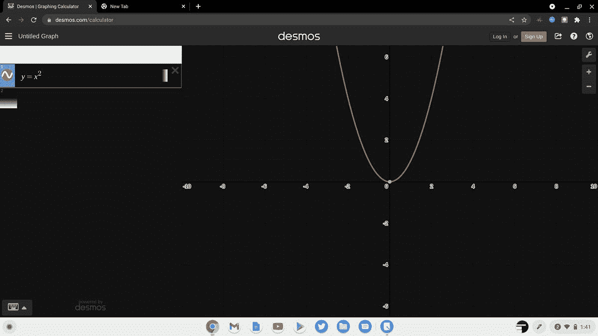

# Chromebooks 的最佳数学应用

> 原文：<https://www.xda-developers.com/best-math-apps-chromebooks/>

无论你是想帮助你的孩子做数学作业，还是在你自己的大学课程中需要帮助，数学应用程序都会很有帮助。如果你将 Chromebook 用作日常笔记本电脑，有许多数学应用程序可用，包括 web 应用程序和 Android 应用程序。这些应用程序中的许多也存在于 iOS、Windows 和其他平台上。许多应用程序专注于图形功能，而其他应用程序可以帮助进行单位转换、符号代数或其他高级数学，如微积分或微分方程。在这篇文章中，我们看了一下 Chromebooks 上最好的数学应用程序，它们可以帮助任何水平的数学作业。

### 浏览这篇文章:

## 沃尔夫拉姆阿尔法

作为一个网络应用和移动应用， [Wolfram Alpha](https://www.wolframalpha.com) 是由流行的计算软件 Mathematica 的制造商提供的计算知识引擎。Mathematica 本身作为代数和微积分运算的最佳符号计算器之一，在高等教育中有着悠久的历史。随着时间的推移，Wolfram 开始开发可以在 Mathematica 更复杂的编程框架之外使用的工具。开发的结果是 Wolfram Alpha web 应用程序以及随后的 iOS 和 Android 移动应用程序。

Wolfram Alpha 可以帮助任何级别的数学，从基本的数字计算一直到工程微分方程。此外，你还可以获得大量关于任何主题的有用信息。你可以输入你的物理，生物，化学，甚至历史问题，并从 Wolfram AI 引擎获得答案。Alpha 的一个很好的新特性是能够用图形用户界面在教科书符号中输入数学。这个特性使程序更加直观，因为您不再需要熟悉 Mathematica 语法约定就可以将一个高等数学问题输入到 Alpha 引擎中。

在 ChromeOS 上，你最好的选择是在浏览器中运行 Wolfram Alpha。你可以像 ChromeOS 上的任何其他浏览器应用程序一样，将 Mathematica 作为 web 应用程序快捷方式安装。如果你想一步一步地计算你的数学问题，你需要订阅 Wolfram Pro，注册学生每月 4.75 美元。这听起来可能很多，但如果你考虑一下一个个人数学家教的花费，这是一笔大买卖。Wolfram Alpha 还为专业用户的每个热门主题提供了特定的网络应用，特别是为代数、微积分和金融数学量身定制的应用。凭借用户界面的改进和令人印象深刻的计算引擎，Wolfram Alpha 是 Chromebooks 上最好的数学应用之一。这是一个你可以用来帮助家庭作业或者作为研究人员的参考。

## 德斯莫斯

德斯莫斯希望建立一个每个学生都学习数学并热爱学习数学的世界，在这个世界中，学生获得数学的力量和美丽不取决于他们的出生地、种族、民族、性别或他们身份的任何其他方面。

他们的免费数学软件工具套件，包括著名的 [Desmos 图形计算器和科学计算器](https://www.desmos.com)，每年被全球超过 4000 万教师和学生使用。这些工具为许多世界上最大的出版商的核心数学课程提供支持，我们的计算器内置于大多数美国州级评估和数字化大学入学考试中。Desmos 还与智能平衡评估联盟、MYP 国际文凭组织和 NWEA 合作(点击此处查看完整的评估列表)。

事实上，Desmos 的尖端技术也为我们的免费数字课堂活动提供了动力，这些活动由教师精心设计，旨在支持和庆祝学生了解数学的不同方式。这些活动以我们的教学理念为指导，为学生更深入地探索概念、与同龄人合作解决问题以及作为数学家创造性地应用知识开辟了一个可能性的世界。

总的来说，Desmos 有一个比其他数学应用更直观的图形计算器界面。这个界面在全国各地的教室中广泛使用，并且在帮助学生学习代数和微积分方面有着良好的记录。如果你想有一个很好的网络绘图应用程序，又不想花 100 多美元在 Target 买一个绘图计算器，Desmos 是完美的选择。

## Geogebra

[GeoGebra](https://www.geogebra.org/download) 是一款面向各级教育的动态数学软件，它将几何、代数、电子表格、绘图、统计和微积分集成在一个易于使用的软件包中。GeoGebra 是一个迅速扩大的社区，拥有数百万用户，分布在几乎每个国家。GeoGebra 已成为动态数学软件的领先提供商，支持全球科学、技术、工程和数学(STEM)教育以及教学和学习创新。

当涉及到几何时，大多数数学计算器都缺乏功能，但 Geogebra 擅长将几何学习与其他数学学科相结合。除了一个网络应用程序，Geogebra 还有专门为 ChromeOS 和所有其他流行的桌面操作系统设计的应用程序。特定的计算器可用于几何、代数、电子表格(用于统计)等。你还可以通过谷歌账户登录，在不同设备之间同步你在 Geogebra 中的作品，这非常适合 Chromebook 用户。除了这些计算工具，Geogebra 还提供了一个基于网络的笔记本来记录你的数学笔记和计算，以备日后查阅。

## 照片数学

[app box Google play id = com . microb link . photo math]

Photomath 是由一位父亲创建的，他正在寻找一种方法来帮助他的孩子做数学作业。作为一名工程师，Damir 经常发现试图用一种简单易懂的方式解释数学概念是一项挑战，因此正是他个人的奋斗激发了 Photomath 的想法。

现在，Photomath 有超过 2.2 亿次下载，是世界上使用最多的数学应用程序。它目前的使命是帮助人们理解数学，一步一个脚印，公司相信每个人都能擅长数学。

Photomath 没有原生的 ChromeOS 应用程序，也不能在浏览器中使用，但有一个 Android 应用程序可以在 Chromebook 上使用。这有点尴尬，但该应用的核心功能仍然可以在我所有的 Chromebooks 上正常工作。我不喜欢 Photomath 的一点是，它将重点从学习数学概念上转移开，而是更多地从一张图片中给出即时解决方案。想在考试甚至作业中作弊的学生发现，拍一张简单的照片就能立刻解决所有问题的诱惑太大了。这种方法比正确地将问题公式化以输入 Wolfram Alpha 要少得多，这也可能导致在使用应用程序时整体学习较少。

你仍然可以通过付费订阅获得一步一步的解决方案，但我仍然觉得 Wolfram Alpha 在每个解释的严谨性方面更好一些。Photomath 对于代数和基础数学来说总体来说相当不错，但是对于更高级的课程，可以看看 Wolfram Alpha 以获得更有效的计算和技术层面上更深入的解释。

## Mathway

Mathway 是另一个非常受学生欢迎的应用，就像 Photomath 一样。这种流行的原因也是使用的简单性和提交给计算引擎的答案的快速结果。几年前，Mathway 被受欢迎的家庭作业帮助网站 Chegg 收购，Chegg 是全国高校考试作弊的罪魁祸首。虽然 Mathway 当然有各种各样的计算器来帮助所有级别的数学，但在我看来，简单地复制精确的解决方案或通过 Chegg 访问它们的诱惑有点不好。

谢天谢地，如果你想在 Chromebook 上使用 Mathway，它确实有一个网络门户。如果您愿意，也可以选择使用 Android 应用程序。如果您需要 Photomath 的功能，还可以快速拍摄照片。代数步骤在这个应用程序中有很好的解释，所以如果你特别需要这个主题的帮助，它可能是值得考虑的。

## Microsoft 数学规划求解

如果你是微软的忠实用户，[微软数学求解器](https://math.microsoft.com/en)可能是你最喜欢的数学应用。界面与 Wolfram Alpha 非常相似，功能也日益完善。这是一个较新的应用程序，但它有各种各样的主题，计算引擎是坚实的。你可以在主页上看到一个很好的主题分类，这使得这个应用程序更容易导航。图形用户界面比 Wolfram Alpha 更直观，但你无法获得像实分析或抽象代数这样的更高级主题的帮助。

总的来说，我认为微软数学求解器是比大多数数学应用程序更好的选择，除了 Wolfram Alpha。您可以将公式复制并粘贴到 Word 或 Excel 文档中，并探索一般来说非常好的分步解决方案。如果微软继续开发，这可能是 Chromebooks 最好的数学应用之一。

## 所有数学公式

对于研究人员或数学专业的学生来说，有时你需要的只是一个可靠的数学公式和定理参考应用程序。所有数学公式是一个完美的应用程序，它提供了所有的数学公式。有 30 多种语言版本。现在不用记笔记记数学公式了。轻松搜索任何公式。在适当的地方，公式用必要的数字非常简单地解释。

这个应用程序包括几何，代数，微积分，微分方程，分析等公式。这款应用程序可以作为 Android 应用程序使用，但该应用程序运行良好，易于在 Chromebook 上导航。如果你不需要数学帮助，但只是一个很好的参考，这是我在 ChromeOS 和 Android 上的首选，它绝对是 Chromebooks 最好的数学应用之一。

这些是我们为 chrome book 挑选的最佳数学应用[。请记住，许多这些应用程序也可以在 Mac、Windows、Android 和 iOS 上使用。数学帮助的最佳选择是 Wolfram Alpha。它不仅拥有最长的开发历史，而且还拥有最强大的计算知识库和帮助完成最高级课程的能力。微软数学求解器是一个较新的应用程序，它也有一个干净的界面和一个相当令人印象深刻的计算引擎。对于那些经常使用微软应用程序的人来说，这可能是你的最佳选择。我建议避免那些只需要一张图片就能获得即时帮助的应用，但这只是因为它往往会阻碍真正的学习和更深层次的数学理解。如果你想在 ChromeOS 生态系统中起步，请查看我们在百思买](https://www.xda-developers.com/best-chromebooks/)提供的[最佳 Chromebooks 列表。](https://www.xda-developers.com/best-chromebooks-best-buy/)