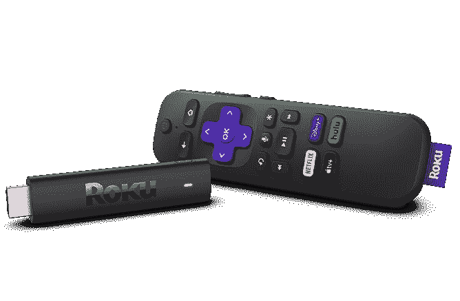
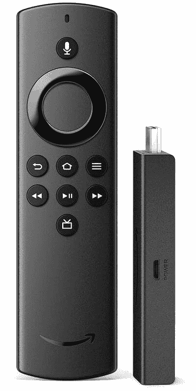
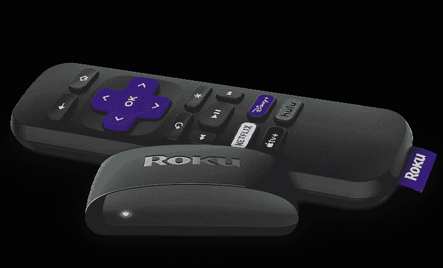
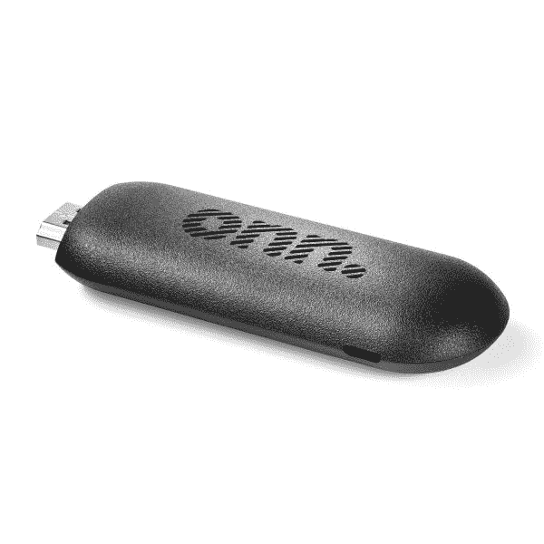

# 2023 年最佳流媒体设备

> 原文：<https://www.xda-developers.com/best-media-streaming-devices/>

无论你是想让你的“哑电视”变得智能，还是在寻找一种替代你的电视的乏味的智能电视平台，流媒体设备都是有帮助的。它们插入电视的 HDMI 端口，可以访问大量应用程序、游戏和其他功能。然而，并不是所有的流媒体设备都是一样的，所以你需要一个适合你需求的流媒体工具。为了提供帮助，我们挑选了你现在能买到的最好的流媒体设备。

## 最佳整体流媒体设备:带谷歌电视的 Chromecast

配备谷歌电视的 Chromecast 是大多数人的最佳流媒体设备。它运行在 Android TV 11 平台上，具有谷歌电视界面。该界面是该设备的亮点之一，目前仍可在有限数量的设备上使用。它采用内容第一的方法，它的建议实际上是有帮助的。

你可以获得几乎所有的流媒体服务，通过 YouTube 和 Sling 观看直播电视，通过 Stadia 观看云游戏。此外，你还可以从智能手机或电脑上播放内容。在技术方面，该设备可以传输 4K 内容，并支持 HDR10、HDR10+和杜比视觉。

最后，捆绑的遥控器有一个用于谷歌助手的麦克风，你可以用它来打开应用程序，找到内容，并做其他助手的事情。

 <picture></picture> 

Chromecast with Google TV (4K) - Snow

##### 带谷歌电视的谷歌 Chromecast)

搭载谷歌电视的 Chromecast 售价 49.99 美元，但经常打折到 39.99 美元。

## 也很棒:Roku 流媒体棒 4K

如果你更喜欢 Roku OS 或者只是不喜欢 Android 电视，Roku 流媒体棒 4K 是另一个优秀的流媒体设备。Roku 平台可以说是市场上最简单的智能电视平台，它可以通过 Roku 频道访问几乎所有流行的流媒体服务和直播电视。

Roku 的内置搜索是该平台的一大亮点，可以超级容易地找到你想看的内容。在技术方面，正如其名称所示，Roku 流媒体棒 4K 可以在 4K 播放内容。它还支持高动态范围内容的 HDR10、HDR10+和杜比视觉 HDR。此外，该设备可以与苹果 AirPlay 和 HomeKit 配合使用，并包括 Alexa 和谷歌助手。您必须使用随附的遥控器进行语音控制。

 <picture></picture> 

Roku Streaming Stick 4K

##### Roku 流媒体棒 4K

Roku Streaming Stick 4K 售价 49.99 美元，但你经常可以发现它以 39.99 美元的价格出售。

## 也很棒:亚马逊 Fire 电视棒 4K

亚马逊也是智能电视领域的一大玩家。内置 Fire TV 平台的电视可能不是市场上最好的，但亚马逊 Fire TV 流媒体设备非常棒。该公司提供了许多流媒体设备，但我们建议大多数人使用 Fire TV Stick 4K。

Fire TV 操作系统还采用了内容优先的方法，并建议您可能喜欢看的内容。它提供了对所有流行流媒体平台的访问，你将能够通过 YouTube、Sling 和其他服务观看直播电视。作为亚马逊产品，它配有 Alexa 语音助手，您可以使用它来控制设备或兼容的智能家庭设备。

在技术方面，该设备支持 4K 流媒体，并支持杜比视觉、HDR10+和 HDR10。此外，与谷歌电视的 Chromecast 和 4K 的 Roku Streaming Stick 不同，亚马逊的 Fire TV Stick 4K 可以对其进行解码，前者只是将 Dolby Atmos 的数据传递给你的电视或 AV 接收器。如果您的电视或影音接收器无法解码 Atmos，这将很有帮助。

 <picture></picture> 

Fire TV Stick 4K

##### 亚马逊消防电视棒 4K

亚马逊消防电视棒 4K 售价 49.99 美元，但当它在打折时，你可以低至 29.99 美元买到。

* * *

## 最佳预算选择:亚马逊消防电视棒精简版

Fire TV Stick Lite 是亚马逊的另一款出色的流媒体设备，但它为实现低价做出了一些牺牲。例如，它只支持最高全高清分辨率的流媒体内容，没有 Atmos 或任何其他杜比格式的板载解码。但它仍然可以将这些数据传输到您的电视或影音接收器。

该设备与亚马逊的 4K 棒运行在同一平台上，因此您可以获得相同的体验、相同的应用程序、相同的直播电视选项以及 Alexa 的支持。不幸的是，没有 Dolby Vision 的支持，但您可以获得 HDR10 和 HDR10+。

 <picture></picture> 

Amazon Fire TV Stick Lite

##### 亚马逊消防电视棒精简版

Fire TV Stick Lite 的价格为 29.99 美元，但你可以在打折时以 19.99 美元的低价购买。

## 也很棒:罗库快车

与亚马逊一样，Roku 也为不需要 4K 流媒体和其他高级功能的消费者提供流媒体设备。它被称为 Roku Express，能够以最高全高清分辨率播放内容。此外，Roku Express 使用相同的平台，因此您可以获得相同的流媒体应用和直播电视选项。

不幸的是，它只有单波段无线网络，不支持 HDR，它的遥控器没有麦克风来控制声音。您获得了基本体验，但设备完成了工作。

 <picture></picture> 

Roku Express

##### Roku Express (2019)

Roku Express 票价为 29.99 美元，但通常折扣为 19.99 美元。

## 同样出色:Onn FHD 流媒体设备

如果你不想要 Fire OS 或 Roku OS，沃尔玛的 Onn 品牌提供了一种便宜的流媒体设备，简称 FHD 流媒体设备，它运行在 Android 电视平台上。顾名思义，它可以以全高清分辨率播放。

在平台端没有谷歌电视界面，所以你会得到原始的安卓电视界面，这没问题，但是没有新界面那么精致。但是，通过 YouTube 或 Sling，以及谷歌助手，你可以得到同样的应用程序，同样的直播电视选项。您也可以使用该设备从您的智能手机或电脑中播放内容。遗憾的是，没有 Dolby Vision 或 HDR10+支持，但 HDR10 可用。

 <picture></picture> 

Roku Express

##### Roku Express (2019)

Onn FHD 流媒体设备售价为 24.88 美元，但你可以在打折时以 14.88 美元的低价购买。

* * *

## 苹果粉丝的最佳选择:4K 苹果电视

如果你是苹果生态系统的一部分，并准备为苹果品牌的媒体流支付溢价，苹果电视 4K 是你最好的选择。以典型的苹果方式，这款设备提供了全面的卓越体验。它有一个干净易用的界面，可以访问所有流行的流媒体应用程序和直播电视。

此外，您还可以支持 Apple Arcade 游戏、Fitness+健身和 HomeKit 来控制智能家居设备。还有许多其他漂亮的功能，比如对你观看的内容进行色彩平衡的能力，以及将音频共享到 AirPods。

在技术方面，Apple TV 4K 可以传输 4K 内容，并支持杜比视界、HDR10 和杜比全景声。可惜没有 HDR10+支持。

 <picture></picture> 

Apple TV 4K

##### 苹果电视 4K (2021 年)

苹果电视 4K 32GB 版售价 179 美元，64GB 版售价 199 美元。

* * *

## 最适合游戏玩家:Nvidia Shield TV

Nvidia Shield TV 是市场上功能最丰富的媒体流之一。如果你喜欢玩很多游戏，这也是你能买到的最好的流媒体设备，因为 Shield TV 让你可以访问 Nvidia 的 GeForce Now 云游戏服务。此外，你可以在设备上玩大量的 Android 游戏，或者用它从 GeForce RTX 或 GTX 驱动的 PC 上播放游戏。还提供了 Steam Link 支持。

Shield TV 运行在 Android TV 平台上，使您能够访问所有流行的流媒体服务和直播电视选项。

在技术方面，它可以以高达 4K 的分辨率传输内容，并包括一个人工智能引擎，以将较低分辨率的内容升级到 4K。因此，如果你不喜欢电视的升级，Shield TV 可以提供帮助。该设备还支持 HDR10、Dolby Vision 和 Dolby Atmos。像苹果电视 4K 一样，它缺少 HDR10+支持。也就是说，它是这个列表中唯一一个通过 HDMI 将 DTS:X 传送到您的 AV 接收器的媒体流

 <picture></picture> 

NVIDIA Shield TV

##### 英伟达盾电视

Nvidia Shield TV 的售价为 149.99 美元，你必须为 Shield 控制器再支付 47.99 美元。

* * *

这些是市场上最好的流媒体设备。如果你正在寻找一个严肃的流媒体工具，带谷歌电视的 Chromecast 是你的最佳选择。不过，如果你不喜欢谷歌的电视操作系统，Roku 流媒体棒 4K 和亚马逊 Fire 电视棒 4K 也很棒。

您打算购买哪个媒体流媒体工具？请在评论区告诉我们。与此同时，你也可以查看我们的[最佳安卓电视流媒体精选](https://www.xda-developers.com/best-android-tv-box/)和[最佳电视](https://www.xda-developers.com/best-tv/)，你今天就可以买到。