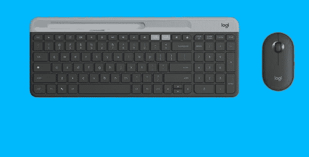
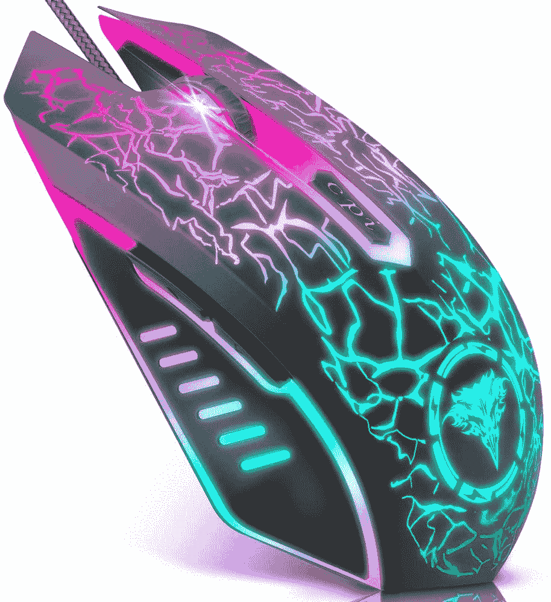

# 2023 年 Chromebooks 最佳鼠标

> 原文：<https://www.xda-developers.com/best-mice-chromebooks/>

# 2023 年 Chromebooks 最佳鼠标

这份列表列出了 Chromebooks、Chrome box 或其他运行 Chrome OS 的硬件的前十二款鼠标。给出了各种价位

Chromebooks 既可用于工作，也可用于个人使用。如果你在工作或学校使用 Chromebook，你可以使用一个[扩展坞](https://www.xda-developers.com/best-docking-stations-chromebooks/)和外部显示器。使用外接显示器可以提供更多的屏幕空间，坞站可以提供额外的端口用于多任务处理。当然，你还需要一个优秀的鼠标来完成你的工作站。

选择日常使用的鼠标时，您会希望既舒适又可靠。购买鼠标时，有一系列人体工程学设计、按钮布局和高级功能可供考虑。在这份列表中，我们将看看各种价位的 Chromebook 的最佳鼠标。在购买新鼠标来搭配你最喜欢的 Chromebook 时，舒适才是王道。在此列表中，我们将每个鼠标的舒适操作置于其他高级功能之上。在考虑了日常使用后，我们将关注电池寿命、价格点，当然还有与 Chrome OS 的集成。鼠标有各种形状和大小，所以在做出最终决定之前，查看大量选项是值得的。

*   <picture></picture>

    罗技 MX 垂直

    ##### 罗技 MX 垂直

    很多人不知道这一点，但垂直鼠标是你能得到的最好的姿势。这个罗技选项为您提供了长期舒适的理想设计，它具有蓝牙和无线加密狗连接选项的全部功能。

*   <picture></picture>

    罗技 K580 超薄多设备键盘+ M350 无线鼠标组合

    ##### 罗技 K580 超薄多设备键盘+ M350 无线鼠标组合

    这是一款专门为 ChromeOS 设计的键盘鼠标组合。键盘有特殊的 ChromeOS 布局，鼠标小巧紧凑，点击安静。

*   <picture></picture>

    罗技 MX Master 3S

    ##### 罗技 MX Master 3S

    谈论最好的鼠标而不提罗技 MX Master 3S 将是过分的。它有一个快速的 8,000 DPI 传感器，甚至可以在玻璃上工作，它有一个金属滚轮(和一个用于水平滚动的滚轮)的高级构造，它超级舒适。此外，它支持蓝牙或无线加密狗。

*   <picture></picture>

    外星人有线游戏鼠标

    ##### 外星人有线游戏鼠标

    如果你有兴趣在 Chromebook 上玩云游戏，外星人 AW610M 是一款舒适时尚的鼠标，如果你想要更定制化的东西，它还具有 RGB 照明。它有一个 16K DPI 和 7 个可编程按钮，所以它是游戏的理想选择。

*   ##### 罗技 M355

    有些鼠标要求你选择是左撇子还是右撇子，但罗技 M355 不是。这款鼠标采用超薄扁平设计，非常适合双手灵巧的用户。此外，超薄的外形和超静音的点击使这款鼠标非常适合在工作中使用。

*   <picture></picture>

    罗技 M570

    ##### 罗技 M570

    罗技的 M570 具有鲜明且可立即辨认的外形。使用鼠标时，很容易发现巨大的蓝绿色轨迹球。如果你在工作中经常滚动屏幕，并且觉得轨迹球很舒服，这是目前最好的选择。这是长时间使用最舒适的鼠标之一。

*   ##### 间歇泉静音无线鼠标

    工作时保持安静有时很重要。如果您想要找一种几乎不会发声的老鼠，Geyes 可以帮您搞定。这款轻巧的鼠标也可充电，并采用舒适的蜂窝设计。朋友和家人一定会注意到你的新鼠标的醒目设计。

*   <picture></picture>

    BENGOO 游戏鼠标

    ##### BENGOO 游戏鼠标

    BENGOO 游戏鼠标提供 RGB 灯光秀，突显您的游戏氛围。速度 DPI 开关允许四个可调设置。这款鼠标也很超值，符合人体工程学设计，按键灵活，价格低于 10 美元。

*   <picture></picture>

    罗技 M510

    ##### 罗技 M510

    罗技在鼠标方面显然有几种选择。M510 之所以脱颖而出，是因为它一直被评为电池续航时间冠军。用户报告一次充电平均使用一年或更长时间。凭借舒适的设计和低于 25 美元的价格，这是一个很好的选择。

*   ##### NORMIA RITA 弧形鼠标

    微软的弧形鼠标设计有很多粉丝。不幸的是，官方的微软 Arc 鼠标与 Chromebooks 不兼容。如果你喜欢微软鼠标的设计，NORMIA RITA Arc 鼠标是一个很好的替代品，价格不到一半。

*   ##### Anker 立式人体工学鼠标

    另一个流行的外形是立式鼠标设计。这种布局允许您在类似手柄的方向上使用鼠标。许多用户发现这是长时间使用鼠标最舒适的方式。Anker 还将出色的功能集和电池寿命融入了这一独特的设计中。

    T17
*   <picture></picture>

    ICLEVER 人体工学鼠标

    ##### I clever 人体工学鼠标

    如果你觉得 Anker 垂直鼠标有点太高或太死板，I clever 还有另一个令人兴奋的选择。这款垂直鼠标具有更引人注目的曲线，以更浅的角度贴合手部轮廓。这款鼠标售价不到 25 美元，带有静音键，非常适合家庭或工作使用。

这十二款鼠标最适合你的 Chromebook、Chromebox 或运行 Chrome OS 的平板电脑。无论你选择哪个选项，一定要在下面的评论区让我们知道你最喜欢的 Chrome OS 鼠标。