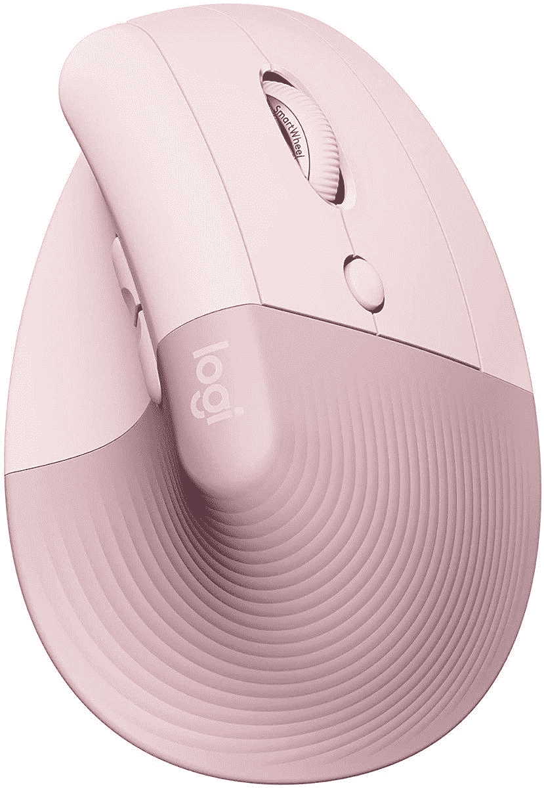

# 2023 年 Surface Laptop 4 的最佳鼠标

> 原文：<https://www.xda-developers.com/best-mice-surface-laptop-4/>

如果你正在寻找一个优质产品，或者至少在发布时是这样，微软的 Surface Laptop 4 是一个很好的笔记本电脑。此后，Surface Laptop 5 接替了它的位置，但这仍然是一台很棒的机器，尤其是如果你能在销售中找到它的话。它可以在英特尔端配备多达四核基于 Tiger Lake 的英特尔酷睿 i7-1165G7，在 AMD 端配备八核基于 Renoir 的 AMD 锐龙 7 4980U，并且根据您选择的大小和处理器，您可以获得高达 32GB 的 RAM 和 1TB 的 SSD。

但是如果你打算长时间在笔记本电脑上工作，你可能会想要一个更舒适的体验。触摸板并不适合所有人，鼠标只是更快一些。

在本文中，我们将为 [Surface Laptop 4](https://www.xda-developers.com/microsoft-surface-laptop-4-review/) 挑选一些最好的鼠标。无论您是在寻找微软的官方产品、非常高端的产品，还是更实惠的型号，我们都有适合您的产品。

*   <picture></picture>

    微软现代移动鼠标

    ##### 微软现代移动鼠标

    这款来自微软的官方鼠标在紧凑的设计中为您提供了基本的功能，并有多种颜色可供选择，因此您可以获得符合您个人风格的产品。

*   ##### 罗技 MX Master 3S

    可以说是市场上最好的鼠标，罗技 MX Master 3S 采用了高级人体工程学设计，配有金属 MagSpeed 滚动条，用于水平滚动的第二个滚轮，以及几乎可以在任何表面上跟踪的 8K DPI 传感器。

*   <picture></picture>

    Razer Pro Click

    ##### Razer Pro Click

    Razer 大多以其游戏外设而闻名，但 Razer Pro Click 是一款出色的生产力鼠标，采用光滑的白色设计，八个可编程按钮，以及 16，000 DPI 的传感器。

*   ##### 微软 Arc 鼠标

    微软的 Arc 鼠标是一款相当独特的鼠标，它采用了灵活的设计，可以折叠放平以便于运输，但向上弯曲可以让你更舒适地使用它。为滚轮配备触摸板可能需要一些时间来适应，但这是一种有趣的便携性方法。
*   <picture></picture>

    罗技升降立式人体工学鼠标

    ##### 罗技升降立式人体工学鼠标

    如果你整天都在使用鼠标，舒适是必不可少的，立式鼠标可以帮助你做到这一点。标题透视可能看起来很奇怪，但它有助于你的手腕更自然地休息，以避免紧张。此外，这款鼠标有几种颜色，甚至还有一个面向左撇子用户的版本。

*   ##### Kensington Pro Fit Ergo 立式轨迹球鼠标

    这款鼠标结合了符合人体工程学的立式设计和轨迹球，增加了移动的自由度，让您可以更加舒适地使用电脑。

    T34
*   ##### 罗技设计系列无线鼠标

    如果你想要看起来很独特的东西，并且不需要花哨的功能，罗技设计系列有几个很好看的图案可供选择。

*   ##### sate chi M1

    sate chi M1 是一款非常简单的鼠标，但与市场上大多数其他鼠标相比，它的金属紧凑型设计看起来很有趣。另外，它有几种不同的配色。

    T17
*   <picture></picture>

    雷蛇蛇怪 V3

    ##### 雷蛇蛇怪 V3

    虽然 Surface Laptop 4 并不是真正为了游戏而设计的，但游戏鼠标看起来仍然非常漂亮，蛇怪 V3 拥有精确的 26，000 DPI 传感器，11 个区域的 RGB 照明和 11 个可编程按钮

如果你正在为 Surface Laptop 4 寻找最好的鼠标，这个列表上有很多不错的选择。当然，拿微软的第一方配件来说，你是不会错的。虽然与竞争对手提供的产品相比，它们可能会稍微贵一点，主要是因为品牌名称，但它们也是“安全”的产品，不会出错，它们与 Windows 和 Microsoft 硬件完全兼容，总体来说是一个不错的选择。

当然，第三方选项也很棒，其中许多选项要么比微软的产品功能更多，要么更实惠。罗技 MX Master 3S 无疑是一个亮点，其优质的设计和功能集使其成为几乎任何笔记本电脑的简单推荐，如果你能承受价格的话。还有一些更非传统的选择，像垂直鼠标，这是专门为长期舒适而设计的。

如果你正在选购其他 Surface Laptop 配件，请查看 Surface Laptop 4 的[最佳外部显示器和显示器](https://www.xda-developers.com/best-monitors-surface-laptop-4/)和 Surface Laptop 4 的[最佳坞站](https://www.xda-developers.com/best-docks-surface-laptop-4/)。