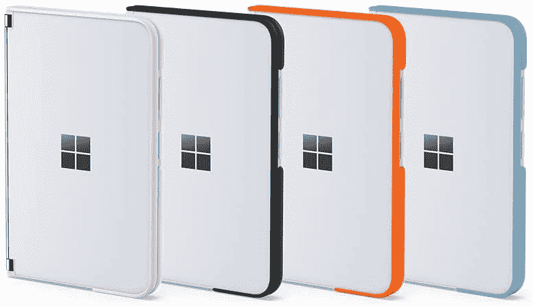
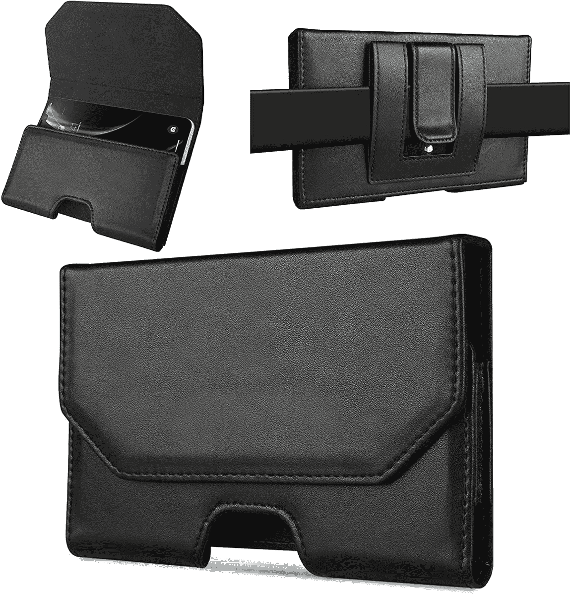

# 2023 年最佳微软 Surface Duo 2 案例

> 原文：<https://www.xda-developers.com/best-microsoft-surface-duo-2-cases/>

# 2023 年最佳微软 Surface Duo 2 案例

微软的 Surface Duo 2 是一个易碎的可折叠产品，有两个屏幕。使用这些保护套，防止意外跌落和磨损。

微软的双屏手机已经推出一段时间了，在过去的几个月里，随着一系列更新，它变得更好了。与上市价格相比，它现在也便宜得多，所以如果你想尝试一款不同的手机，它可能值得在 2023 年考虑。但请记住，这是一款比普通平板手机更脆弱的双屏设备，对于这样的设备来说，维修费用可能相当昂贵。你肯定需要用箱子来保护它，以确保它处于良好状态。如果你想知道为 Surface Duo 2 买哪个外壳，那么这里有一些好的选择供你考虑。

*   <picture></picture>

    Surface Duo 2 Bumper

    ##### 微软 Surface Duo 2 Bumper

    这是一款柔软的硅胶 Bumper 保护套，您可以沿着设备的所有边缘进行连接。这是官方案件，所以它会有最好的适合，但它不会提供大量的保护。

*   ##### Happer Studio 皮套

    这款微软 Surface Duo 2 的皮套有三种不同的颜色，侧面都带有缝线图案。您还可以获得一个笔筒来存放 Surface Pen，非常方便携带。

    T34
*   ##### Otterbox 铆钉箱

    如果你不介意使用笨重的箱子，那么你可以考虑为 Surface Duo 2 购买 Otterbox 铆钉箱。这是一个有点昂贵的一面，但它提供了最好的保护设备的所有案件中提到的这个集合。

*   ##### Foluu 保护套

    这是该系列中最实惠的保护套，为您的设备提供了良好的保护。它在坚硬的 PC 背面配有合成革，提供了风格和保护的良好组合。

    T17
*   <picture></picture>

    Surface Duo 2 皮套盒

    ##### 微软 Surface Duo 2 皮套盒

    这更像是一个便携包，您可以安全地将设备藏在其中。它为设备提供了很好的保护，但你在实际使用它的时候还是要小心。

*   ##### d brand Surface Duo 2 皮肤

    Dbrand 不为 Surface Duo 2 做握套，但是你可以买他们的一个皮肤来保护。有大量不同的皮肤可供选择，它们会保护你的设备免受刮擦。

    T34

这就把我们带到了这个系列的最后，在这个系列中，我们强调了 2023 年最好的微软 Surface Duo 2 外壳。Surface Duo 2 是一款非常独特的设备，因此市场上没有太多这种产品。我们仍然设法在这个帖子中添加了一些精选的案例，所以每个人都有所收获。如果你正在寻找购买微软 Surface Duo 2，你可以查看一下[最划算的交易](https://www.xda-developers.com/best-surface-duo-2-deals/)，看看你是否能在购买上节省一些钱。你总是可以用额外的现金购买一些配件，如[最好的充电器](https://www.xda-developers.com/best-surface-duo-2-chargers/)或[最好的笔](https://www.xda-developers.com/best-surface-duo-2-pens/)。

 <picture></picture> 

Microsoft Surface Duo 2

##### 微软 Surface Duo 2

Surface Duo 2 并不是市场上最新的可折叠设备，但它仍然非常独特。与最初的发布价格相比，它现在也便宜了很多，你可以通过点击下面的链接在网上找到它的最佳价格。