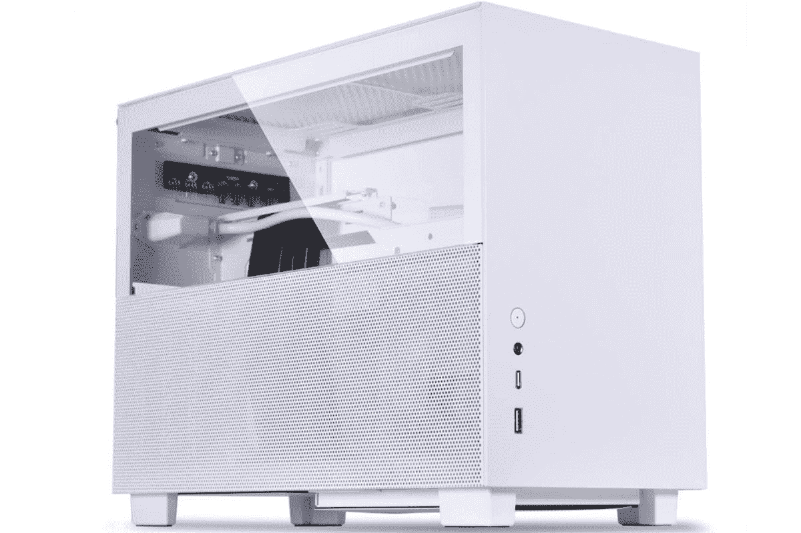
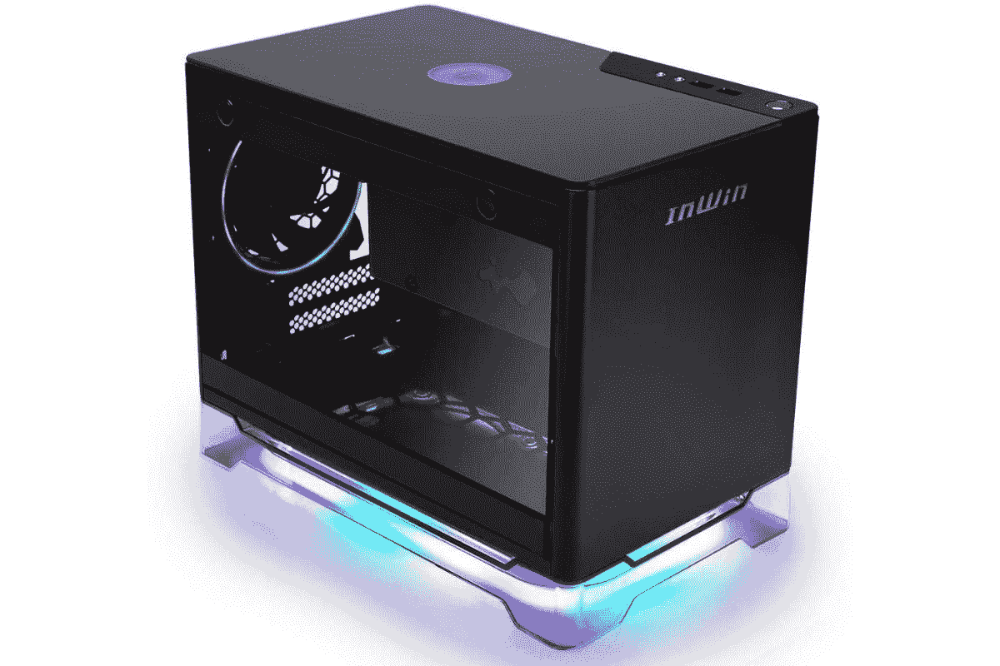
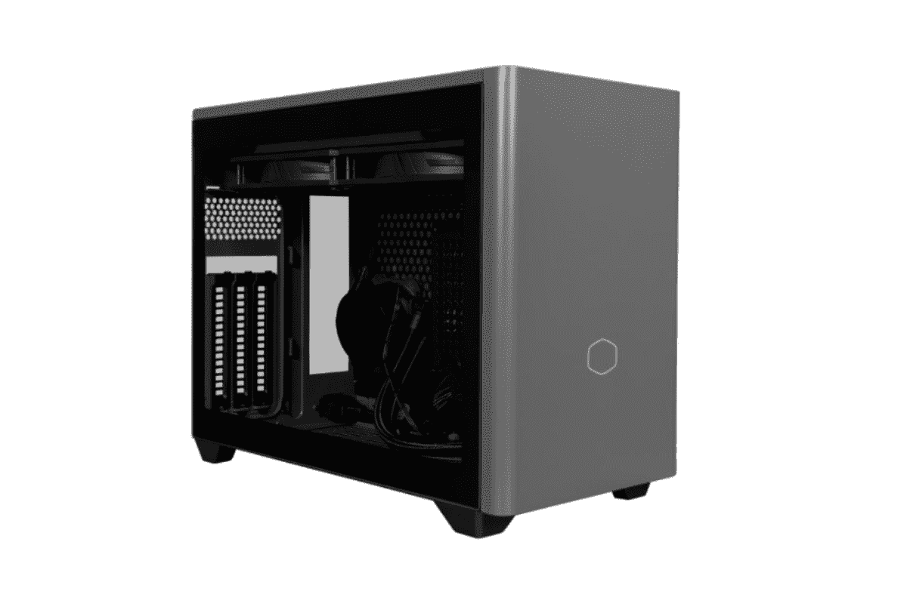
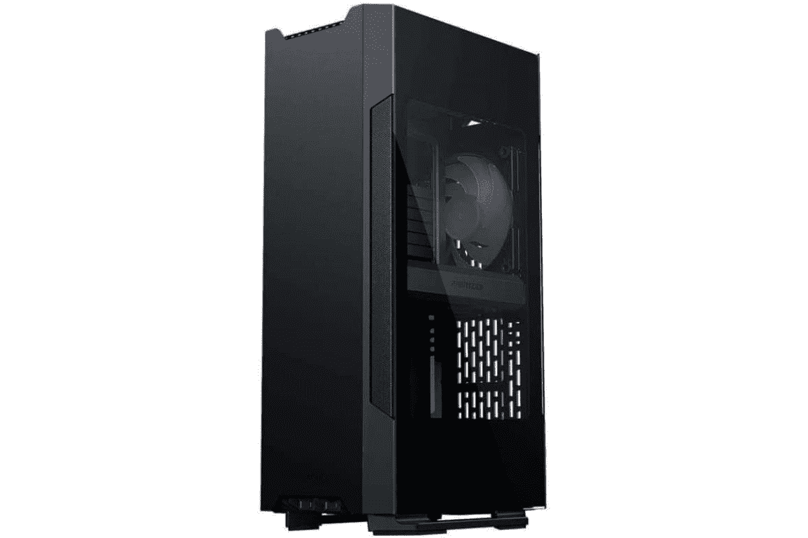

# 2023 年最佳迷你 ITX 电脑机箱

> 原文：<https://www.xda-developers.com/best-mini-itx-cases/>

电脑机箱有各种形状和大小，但它们都属于三种主要类型的机箱——全尺寸的 ATX、microATX 和迷你 ITX。这是构成电脑机箱市场的三个主要因素。我们在一些收藏文章中添加了大量全塔式和中塔式机箱，包括[最佳电脑机箱](https://www.xda-developers.com/best-pc-cases/)、[游戏玩家最佳电脑机箱](https://www.xda-developers.com/best-pc-case-gamers/)等等。在这篇文章中，我们将看看 2022 年你能买到的最好的迷你 ITX 电脑包的专门列表。

如果你不熟悉迷你 ITX，这些箱子比其他的都要小。迷你 ITX 电脑通常被认为是那些办公空间狭小的人的最佳选择。虽然大多数迷你 ITX 案例首先关注的是大小，其次才是性能，但也有一些案例甚至可以支持可用的[最佳 CPU](https://www.xda-developers.com/best-cpus/)和[最快 GPU](https://www.xda-developers.com/best-gaming-graphics-cards/)。

## 最佳迷你 ITX 电脑包:联力 Q58

李连杰是计算机领域最受欢迎的名字之一。该公司制造了很多电脑外设，包括机箱、AIO 冷却器、风扇等等。虽然该公司主要以中塔式和全塔式机箱闻名，但它最近决定以 Q58 机箱进入 ITX 市场。这很快成为市场上最受欢迎的迷你 ITX 选项之一。有很多喜欢这个特殊的迷你 ITX 机箱，它是我们挑选的最好的迷你 ITX 电脑机箱，你现在可以在市场上买到。

你首先会注意到这种特殊的情况是其令人印象深刻的设计和外观。它有黑色和白色两种颜色，是一款漂亮的机箱，由铝、玻璃和网状面板组合而成。两侧面板的上半部分由玻璃制成，而下半部分是网状面板。前面板完全由铝制成，但它在中间涂了一层完工的裂缝，以匹配其他面板。顶部面板也是由铝制成，它有一个网格完成作为排气面板。

这种情况下，还设计了一种方式，使用户更容易轻松地访问内部。它还具有可交换的铰接玻璃和网格面板，这意味着您可以选择在同一侧添加玻璃或网格面板。另一个有趣的事情是，这种特殊的迷你 ITX 个人电脑外壳兼容 SFX 和 ATX PSU。Q58 外壳带有一个额外的支架，可以从 SFX PSU 模式转换为 ATX PSU 模式，这很棒。

在规格方面，联立 Q58 机箱支持迷你 ITX 主板。即使机箱没有预装任何风扇，也有足够的空间来手动添加风扇。您可以在顶部面板上添加最多两个 120 毫米或两个 140 毫米风扇，在底部添加一个 120 毫米风扇。至于散热器支架，可以在顶板上增加一个 240 毫米或 280 毫米的散热器，在底板上增加一个 120 毫米的散热器。谈到间隙，联立 Q58 为最大长度高达 320 毫米的 GPU 和最大高度高达 67 毫米的 CPU 冷却器提供了足够的空间。

联力 Q58 配有三个扩展槽，让您可以垂直安装 GPU。您还可以使用兼容 PCIe 3.0 和 PCIe 4.0 的竖板电缆进行安装。机箱底部还有两个磁性灰尘过滤器，防止灰尘进入内部。总的来说，联力 Q58 有很多优点，我们认为它是一个完美的选择，即使对于要求苛刻的 PC 构建也是如此。此外，139 美元(有时更低，因为这种情况下是 100 美元)，连李 Q58 几乎没有任何抱怨的余地。

 <picture></picture> 

Lian Li Q58

##### 李连杰 Q58

联立 Q58 是一款高级迷你 ITX 包，以实惠的价格提供了大量出色的功能。

## 备选最佳整体迷你 ITX 电脑机箱:NZXT H210

从全塔式机箱到广受欢迎的中塔式机箱，NZXT 的产品组合中有许多电脑机箱。在发现其他外形的成功后，NZXT 决定以 NZXT H210 进入迷你 ITX 外形的世界。正如你所看到的，这个特殊的电脑机箱看起来和其他的机箱非常相似。它从年长的兄弟姐妹那里借用了很多视觉线索，这很好。事实上，NZXT H210 也获得了许多我们喜欢的 NZXT 其他外壳的良好特性。

关于这个特殊的案例，你首先会注意到的一件事是，它与 NZXT 的其他案例非常相似。NZXT H210 几乎感觉像是 H510i 的缩小版。H210 的尺寸为 210 x 349 x 372mm 毫米，重量为 6.0 千克。这个特殊的外壳明显比我们刚刚看到的李连 Q58 外壳大。事实上，可以肯定地说，NZXT H210 是市场上最大的迷你 ITX 机箱之一。不过，不要担心，它仍然可以放入空间有限的桌子中，并且比中塔式机箱占用的空间少得多。

关于这个特殊的 PC 外壳的最好的事情之一是它与 Aer F 120mm 风扇捆绑在一起。你也可以买一个带有 RGB LED 灯条的版本，以及一个控制灯和风扇的控制器。一个风扇安装在顶部面板上作为进气口，另一个风扇安装在后面作为排气口。NZXT H210 的前面板上也有与其前辈相同的端口选择，这很棒。前部和 PSU 进气口都覆盖着网状过滤器，可以防止灰尘进入电脑内部。

H210 的另一个非常好的特性是它支持定制液体冷却。在里面，你会发现主板和前面板之间有一个小金属条，你可以在那里附加一个自定义循环的小容器，尽管必须提到的是，这个容器必须非常小，才能适合。H210 也只能在前面安装 240 毫米的散热器，限制了定制回路的性能(或者如果你不想定制，可以为你的 CPU 或 GPU 安装 AIO 冷却器)。

H210 最大的弱点是它缺乏 GPU 的喘息空间。几乎没有空间容纳任何大于 2 个插槽的 GPU，即使这样，你也会发现 PSU 护罩位于 GPU 风扇的正下方，限制了气流，并可能提高 GPU 的温度。理想情况下，你应该让你的 GPU 使用液体冷却来避免过热。否则，你必须确保你的 GPU 既足够小，又足够省电，不会过热，这将限制你使用更多的中档显卡。

总的来说，对于那些将要使用定制液体冷却的人来说，NZXT H210 迷你 ITX PC 机箱有很多值得喜欢的地方。对于其他人来说，由于其次优的 GPU 气流和空间限制，它不是一个很好的选择，但仍然可以完成工作。它也可以找到大约 70 至 80 美元，这对于这种质量的情况是一个很大的交易。

 <picture></picture> 

NZXT H210

##### NZXT H210

NZXT H210 是一款坚固的迷你 ITX 机箱，提供充足的空间，适合多种构建。

## 最佳高端迷你 ITX 电脑包:InWin A1 Plus

 <picture></picture> 

InWin A1 Plus

InWin 在计算领域也是一个受欢迎的名字，有着特别坚实的 PC 外壳选择。你可能已经看到了一吨的 InWin 全塔和中塔的情况下，但值得指出的是，该公司也作出了一些伟大的迷你 ITX 机箱。就像它的其他个人电脑外壳一样，InWin 的迷你 ITX 同样高档，如果不是更高档的话。因此，我们推荐 InWin A1 Plus 作为我们目前在市场上可以买到的最好的高端迷你 ITX 电脑外壳。

这款电脑外壳的亮点是发光的 RGB 底座。它本质上是一个有色的透明支架，配有可寻址的 RGB 灯。A1 Plus 还配备了两个预先安装在盒子外面的 Sirius Loop ASL120 风扇，一个 650 瓦的金牌 PSU，InWin A1 Plus 的顶部面板还装有一个无线充电板，允许您为包括智能手机在内的设备充电。兼容 WPC Qi 1.2，支持 10W 充电。

至于规格，这款迷你 ITX 机箱支持迷你 ITX 主板，有两个扩展槽。您还可以在机箱内获得最多安装两个 2.5 英寸硬盘的空间。至于间隙，InWin A1 Plus 将允许您安装最大高度可达 160 毫米的 CPU 冷却器。还可以安装最大长度达 325mm 的 GPU，相当不错。你可能无法安装所有大尺寸的 CPU 冷却器，但你应该没有问题安装一些新的 GPU。

散热器支撑有点差，因为 InWin A1 Plus 后面只有一个 120 毫米散热器的空间。这意味着您将无法安装复杂的冷却解决方案；最好只用风冷。除了两个预装的风扇，底部还有空间再添加两个 120 毫米的风扇。

总的来说，InWin A1 Plus 是一款坚固的迷你 ITX 电脑机箱，绝对会为您的设置增添更多视觉吸引力。由于发光的 RGB 底座和无线充电顶部面板，不可否认，这款保护套将吸引所有的注意力。然而，200 美元的 InWin A1 Plus 相当昂贵，甚至比许多其他中塔机箱还要贵。但其中包括一台 650 瓦的 PSU，零售价约为 80 至 100 美元。

 <picture></picture> 

InWin A1 Plus

##### InWin A1 Plus

InWin A1 Plus 是一款优质的迷你 ITX 机箱，顶部面板配有无线充电器，底部配有发光的 RGB 支架。

## 高性能构建的最佳紧凑型外壳:Corsair Crystal 280X RGB

迷你 ITX 外形通常不是寻求生产高性能产品的发烧友的首选。然而，在这种外形规格中，也有一些情况会带来挑战，即如何在一个小区域内安装大量的计算能力。海盗船水晶 280X RGB 就是其中之一。从技术上来说，这种情况下是微型 ATX 主板，但迷你 ITX 板仍然可以放在里面，所有额外的空间对于注重性能的紧凑构建来说是理想的。

这款电脑机箱最大的优点之一是它配有三块钢化玻璃面板。顶部有一个，侧面有一个，还有一个盖住前面板的一半。尽管外形相对较小，但 Crystal 280X RGB 外壳采用了双室设计，这意味着主板、GPU 和冷却组件位于一个室内，而 PSU、电缆和存储设备位于另一个室内。这种双室设计通常是为更大的情况保留的，但我们很高兴 Corsair 成功地将它带到了紧凑的外形空间。

280X 配有两个 LL120 RGB 风扇，安装在前面。这可能不足以实现最佳气流，但考虑到有足够的空间来添加更多风扇，这不是问题。您可以在顶部面板安装两个 120 毫米风扇，在底部面板安装两个额外的风扇。Crystal 280X RGB 也可以与市场上的 AIO 和定制液体冷却器配合使用。您可以在顶部和底部面板上安装高达 280 毫米的散热器，而前面板可以安装 240 毫米的散热器。

至于组件间隙，Crystal 280X RGB 会让你安装一个 CPU 冷却器，最大高度可达 150mm。此外，您还可以安装最大长度达 300 毫米的 GPU。说到 PSU，你可以安装一个最大长度达 180 毫米。这款机箱还有多达四个扩展槽，这意味着安装市场上的一些现代三插槽 GPU 应该没有问题。

对于 120 美元左右，Corsair Crystal 280X RGB 有点贵，但它可以构成一个伟大的游戏 PC 的基础。相对于该系列中的其他 ITX 机箱，它也很大，真正扩展了“小外形”的定义，但即使与中塔式机箱相比，280X 也非常紧凑。

 <picture></picture> 

Corsair Crystal Series 280X

##### 海盗船水晶 280X

Corsair Crystal 280X 是该系列中最大的表壳，因此适合更高端的款式。

## 初学者最佳迷你 ITX 机箱:酷派大师 NR200P Max

虽然使用迷你 ITX 机箱的想法听起来很酷，但不可否认的是，在迷你 ITX 机箱内进行构建绝非易事。即使是狂热的个人电脑制造商也常常难以在迷你 ITX SFF 机箱内正确构建。考虑到这一点，我们推荐更酷的主 NR200P Max 作为新人的最佳选择之一。

较冷的主 NR200P Max 本质上是旧 NR200 外壳的升级版本。case 的新版本解决了许多困扰最初迭代的问题。此外，新机箱还让用户可以更轻松地安装 280 毫米 AIO 冷却器和 850 瓦的金牌 SFX PSU。这应该足以支持目前市场上最好的 CPU。

冷却器主 NR200P Max 还配有 PCIe 第四代兼容的 GPU 竖板电缆。它有三个扩展槽，这意味着您甚至可以在机箱内垂直安装新的三槽 GPU。至于净空，可以安装最大长度可达 336mm 的 GPU 和最大高度可达 67mm 的 CPU 冷却器。这种情况下最好的一点是，所有的进气和排气都有灰尘过滤器，使灰尘远离零部件。

总的来说，NR200P Max 迷你 ITX 底盘有很多值得喜欢的地方，我们认为它绝对值得成为我们系列中的佼佼者。然而，售价 450 美元的 NR200P Max 是该系列中最昂贵的表壳之一。这包括 PCIe 立管，PSU 和 AIO 冷却器，这是大约 200 至 250 美元的价值。如果你不想要这些捆绑的物品，你可以花 130 美元左右购买仅仅是 PC 外壳的 NR200P(非 Max)。

 <picture></picture> 

Cooler Master NR200P Max

##### 冷却器主机 NR200P 最大值

冷却器大师 NR200P Max 是初学者的绝佳选择，因为它预装了 PSU 和 AIO 冷却器。

## 最佳预算迷你 ITX 案例:Thermaltake 核心 V1 极端

如果你想用尽可能少的预算建造一台迷你 ITX 游戏电脑，Thermaltake Core V1 至尊版是个不错的选择。售价仅为 40 至 50 美元，是你能买到的最便宜的机箱之一，而且对于迷你 ITX 版本来说，它支持全尺寸 PSU、CPU 空气冷却器和显卡。然而，核心 V1 是几年前推出的，从那时起，“全尺寸”的含义已经发生了变化，所以这种情况在某种程度上仅限于更多的中端选项。

从美学角度来看，核心 V1 并不惊人，但也不丑陋。它的前面板和侧面板(可更换)穿孔很多，因此气流基本不受阻碍，而顶部面板有一个丙烯酸窗户。在内部，你会发现一个巨大的 200 毫米风扇，为整个 PC 提供气流，通过 CPU 冷却器，GPU，主板和 PSU，以及 PSU 的灰尘过滤器。您也可以在背面安装两个 80 毫米的风扇来排出气流。核心 V1 在气流部相当不错。

就组件兼容性而言，核心 V1 支持正常大小的 PSU，长度高达 260 毫米和两个插槽高度的 GPU，以及高达 140 毫米的 CPU 空气冷却器。也有 120 毫米或 140 毫米散热器的选择，但在这个尺寸的空气冷却器将为您提供更好的服务。缺乏 GPU 和 CPU 冷却器的间隙意味着你将无法在核心 V1 中放置高端组件甚至一些中档部件，但我们不认为你会想要在这里放置 [RTX 4090](https://www.xda-developers.com/nvidia-geforce-rtx-4090-review/) 或[核心 i9-13900K](https://www.xda-developers.com/intel-core-i9-13900k-review/) 。

核心 V1 有其缺陷:它是旧的，它没有很好的散热器支持，它不是最紧凑的情况下，它对 GPU 的兼容性有重大限制。但它的成本只有 40 美元，所以我们给核心 V1 竖起大拇指为任何人建立一个低端或中端迷你 ITX 个人电脑。

##### Thermaltake 核心 V1 极端迷你 ITX 立方体底盘

Thermaltake 核心 V1 极端是一个迷你 ITX 电脑的预算情况。它可以容纳一个大型 CPU 空气冷却器和一个双槽 GPU。

## 最好看的迷你 ITX 铁塔:幻影 Evolv Shift 2

如果你在市场上购买迷你 ITX 铁塔，Phanteks Evolv Shift 2 是你的最佳选择之一。120 美元相对便宜，又瘦又高，看起来很棒。如果你喜欢 Xbox 系列 X 的外观，那么 Evolv Shift 2 是一个很好的选择。

Phanteks Evolv Shift 2 采用玻璃和铝制结构，比该系列中的大多数其他表壳更好看。这种时尚的塔式外形并不适合所有人，但我们认为爱好者会在这种情况下找到很多他们喜欢的东西。关于这个特殊的电脑机箱，你首先会注意到的是它到底有多高。它高 19 英寸，是该系列中最高的箱子之一，但它占用的桌面空间也比典型形状的机箱少。

Evolv Shift 2 的内部布局是我们见过的最不寻常的布局之一。整个底盘分为三个主要部分。机箱的下部装有 SFX-L PSU 和一个 120 毫米的散热器用于冷却。顶部是借助垂直电缆安装主板和 GPU 的地方，这是 PCIe 3.0 而不是 4.0，但即使使用高端 GPU，也不太可能遇到性能问题。中间还有更多空间来添加固态硬盘和 3.5 英寸硬盘。

Phanteks 在这种情况下只包括一个 140 毫米的 RGB 风扇，或者如果你最终购买了“气流”型号，则是一个普通的无 RGB 风扇，它有网状侧板而不是钢化玻璃。然而，无论哪一个版本，你仍然会得到一个 RGB 控制器。对 CPU 冷却的支持有点差，因为只能安装 120 毫米的 AIO 或 85 毫米高的空气冷却器。至于显卡，机箱有足够的空间容纳一个最大长度为 335 毫米、最大厚度为 2.9 个插槽的 GPU。如果你主要对游戏感兴趣，这种安排应该很好，因为你可以将一个好的中端游戏 CPU 与一个高端 GPU 配对。

总的来说，Phanteks Evolv Shift 2 是一个梦幻般的迷你 ITX 塔。显然，这并不适合所有人，但我们认为，对于那些想尝试迷你 ITX 世界的爱好者来说，这是一个不错的选择。我们不建议初学者使用这种特殊的情况，因为整个安装过程可能会非常繁重。

 <picture></picture> 

Phanteks Evolv Shift 2

##### 幻像 Evolv Shift 2

Phanteks Evolv Shift 2 是市场上最好看的电脑保护套之一。这不是最容易的情况下工作，但爱好者会发现很多喜欢它。

## 备选最佳迷你 ITX 铁塔:NZXT H1 版本 2

如果你想买一个迷你 ITX 铁塔，我们也推荐你去看看 NZXT H1 第二版。H1 的整体外形与 Evolv Shift 2 非常相似，但它有自己的独特之处。NZXT 出售这种情况下，包括 140 毫米 AIO 液体冷却器，750 瓦的黄金级 PSU，和 PCIe 4.0 提升器，所以自然这一包零件去约 350 美元。确保你得到了更新的版本 2 模型，因为原来的有一个缺陷，有时会导致它短路和着火。

NZXT H1 塔有黑色和白色两种，高 15 英寸，比 Evolv Shift 2 短得多。然而，整体外形保持不变，这意味着在 H1 铁塔内部建造仍然有些困难。对迷你 ITX 塔几乎没有经验的新人绝对应该看看市场上的其他选择，如 H210 或 NR200P Max。

在组件间隙方面，NZXT H1 将允许您安装最大长度可达 305 毫米的 GPU，这很体面，但只有两个扩展槽，您在可以安装哪种显卡方面受到限制。内含的 140 毫米 AIO 对于功耗较低的中端 CPU 来说很好，但仅此而已。在 Evolv Shift 2 之后，H1 的图形处理能力将会有所限制。

与 Phanteks Evolv Shift 2 相比，NZXT H1 版本 2 更贵，但也预装了 PSU 和 AIO 冷却器，这很好，但我们不确定它是否会额外增加 400 美元。如果 Evolv Shift 2 不存在，我们肯定会说 H1 是最好的塔式迷你 ITX 案例。

##### NZXT H1 版本 2

NZXT H1 版本 2 是一个塔风格的迷你 ITX 系统的电脑机箱。它支持中端至高端组件，同时占用的桌面空间比典型机箱少得多。

## 2022 年最佳迷你 ITX 电脑包:最终想法

就像全塔和中塔选项一样，现在市场上有很多迷你 ITX 机箱。根据您的预算或您正在寻找的构建类型，您可以选择最实惠的选项或预装组件的高级选项。总的来说，我们认为联立 Q58 和 NZXT H210 是你在 2022 年可以买到的最好的迷你 ITX 电脑包。这两种机型都以相对实惠的价格提供了大量出色的功能。更先进的个人电脑制造商也可以查看 Phanteks Evolv Shift 2，而迷你 ITX 世界的新来者可以查看更酷的主 NR200P Max 机箱。

除了海盗船晶体 280X，所有这些情况下都需要一个迷你 ITX 主板。我们建议查看我们收集的市场上的[最佳主板](https://www.xda-developers.com/best-motherboard/),在那里找到一些好的选择。此外，您还可以查看我们收集的[最佳显卡](https://www.xda-developers.com/these-are-the-best-graphics-cards-you-can-buy-nvidia-geforce-rtx-3080-amd-radeon-rx-6800-xt-and-more/)，挑选适合 SFF 机箱的 GPU。一如既往，我们也鼓励您加入我们的 [XDA 计算论坛](https://forum.xda-developers.com/c/xda-computing.12289/)，讨论您的构建，并从我们社区的专家那里获得更多产品建议。