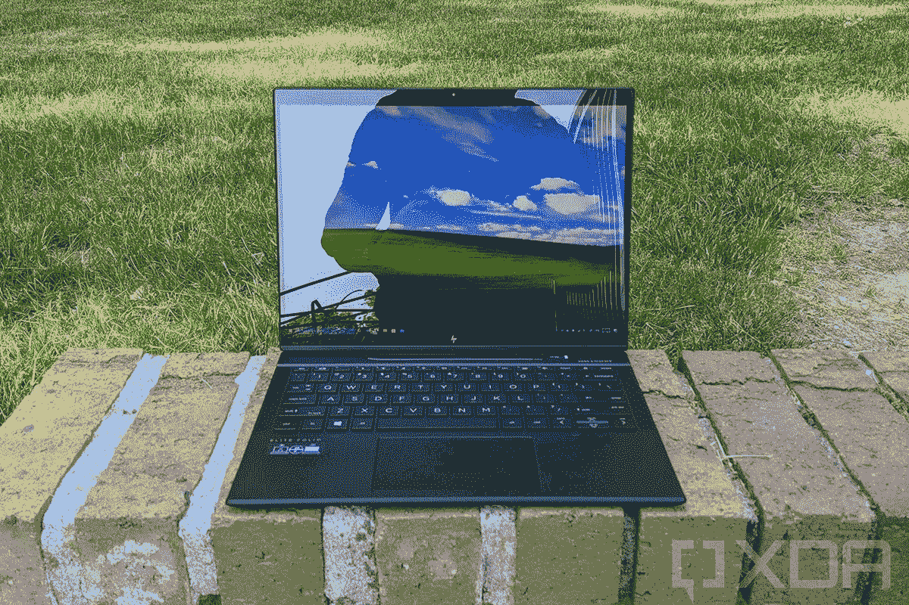

# 2023 年惠普蜻蜓 Folio G3 最佳显示器

> 原文：<https://www.xda-developers.com/best-monitor-hp-dragonfly-folio-g3/>

# 2023 年惠普蜻蜓 Folio G3 最佳显示器

添加一些额外的屏幕房地产到惠普的真棒蜻蜓对开。

 <picture></picture> 

HP Dragonfly Folio G3

惠普更新的蜻蜓 Folio G3 的最佳显示器让您可以设置一个真正的工作站，将生产力提升到一个新的水平。这款笔记本电脑的双 Thunderbolt 4 端口使其即使没有[大 Thunderbolt 坞站](https://www.xda-developers.com/best-thunderbolt-docks/)也可以轻松连接外部显示器，尽管如果你添加了不止一个显示器，你可能会希望使用额外的端口来检查一些东西。如果你在办公桌前工作时需要处理一些墨迹，你甚至可以继续使用蜻蜓 Folio 上的内置“向前拉”显示器。我们收集了适用于惠普蜻蜓 Folio G3 的最佳显示器，帮助您获得适合您工作流程的显示器。

*   ##### 戴尔 UltraSharp U2723QE

    最佳显示器

    就您现在可以购买的最佳显示器[而言，戴尔的 U2723QE 是我们的选择之一。它的尺寸为 27 英寸，分辨率为 3840x2160 (UHD)，刷新率为 60Hz，为您提供了充足的像素。它的超薄边框意味着您可以将两个放在一起，内置的可调高度、旋转、侧转和倾斜功能可以让您的桌子按照您想要的方式摆放。sRGB、DCI-P3 和 Rec 的精确色彩再现。709 gamuts 使其成为创作者的绝佳选择，它绝对装载了端口(包括 HDMI、DP 和 USB-C)。](https://www.xda-developers.com/best-monitors)

    T17
*   ##### LG Gram+View

    便携式显示器

    想要一台额外的显示器，让您出门在外也能随身带着您的蜻蜓对开本吗？LG 的 gram +view 便携式显示器采用 16 英寸 IPS 显示屏，分辨率为 2560x1600 (QHD+)，刷新率为 60Hz，宽高比为 16:10。它的防眩光涂层让您可以在更明亮的环境中工作，附加的可折叠支架可以平放，以在旅行时保护屏幕安全。使用 USB-C 连接显示信号和电源，由于没有额外的电源适配器，因此便于携带。

*   ##### 华硕 ProArt PA278CV 27 英寸 WQHD 显示器

    面向专业人士的特性

    如果您想要一台价格相当实惠的专业级显示器，华硕 ProArt PA278CV 是一个出色的选择。其 27 英寸 IPS 面板提供 100% sRGB 和 Rec 709 色彩再现，其 2560x1440 分辨率和自适应刷新率(48Hz 至 75Hz 之间)使一切看起来清晰明了。有大量端口可供选择，包括 USB-C、DP 1.2 和 HDMI 1.4，您可以调整倾斜、侧转、高度和枢轴，以更加符合人体工程学。

*   ##### 惠普 24MH FHD 显示器

    经济实惠精选

    惠普的这款经济实惠的显示器提供 1920x1080 (FHD)分辨率的 23.8 英寸 IPS 显示器，非常适合桌面空间有限的人。它的 75Hz 刷新率比通常的 60Hz 更高，画面更流畅，你可以获得大约 250 尼特的亮度。尽管其预算定价，惠普 24mh 内置 2W 扬声器，当你不想使用耳塞时。它没有 USB-C 连接，所以你必须使用一个适配器或蜻蜓对开坞站。

*   <picture></picture>

    宏碁 sb 220 q

    ##### 宏碁 SB220Q

    紧凑尺寸

    需要比惠普 24mh 显示器更小更实惠的东西吗？Acer SB220Q 是一款 21.5 英寸显示器，分辨率为 1920x1080 (FHD)，采用 IPS 面板。它的刷新率达到 75Hz，它有一个现代的外观和更容易耦合的薄边框，它配有 HDMI 和 VGA 输入。你将不得不在显示器和你的蜻蜓 Folio 之间添加一个坞站或适配器，但与本综述中的其他选项相比，以这个价格，你仍将节省一大笔钱。

*   ##### 三星 CJ791 34 英寸超宽曲面 QLED 显示器

    双屏合一

    三星的显示器很少让人失望，想要一台超宽(基本上就是两个显示器一个包装)的人应该考虑三星 CJ791。它的分辨率为 3440x1440，宽高比为 21:9，34 英寸的面板具有 100Hz 的刷新率，让一切看起来都很流畅。它有大量的端口，可以轻松连接您的蜻蜓对开本，并且可以调节倾斜度和高度。当你不想使用耳机时，它甚至内置了一些扬声器。

*   ##### LG 28mq 870-B dual up 显示器

    堆叠式显示器

    这款来自 LG 的独特显示器基本上将两个显示器合二为一，没有通常的超宽空间抓取。LG 通过将两个显示器“堆叠”到一个包装中来实现这一点；28 英寸面板具有 16:18 的高纵横比，分辨率为 2560x2880，98% DCI-P3 色彩再现，HDR10。它甚至拥有双 7W 扬声器，音频输出令人印象深刻。所有这些都放在一个狭窄的支架上，与您的桌子相连，节省空间。查看我们的 [LG DualUp 评论](https://www.xda-developers.com/lg-dualup-monitor-review/)了解更多信息。

*   <picture></picture>

    惠普 U28 4K

    ##### 惠普 U28 4K HDR 显示器

    华丽 4K

    惠普自家的 U28 显示器虽然规格令人印象深刻，但相对来说还是比较实惠的选择。它的 28 英寸 IPS 面板具有 3840x2160 (UHD)分辨率、60Hz 刷新率和 HDR 功能，让一切都变得流行。符合人体工程学的支架允许高度、枢轴和旋转调节，并且有大量端口可用。看起来这里的 USB-C 端口可能只能为你的笔记本电脑供电(最高 65 瓦)，所以你可能需要添加一个适配器或基座来配合蜻蜓 Folio G3 使用。

*   ##### LG 29WP60G-B

    经济实惠的超宽显示器

    并非每台超宽显示器的价格都像抵押贷款一样高，LG 的 29wp 60g-B 就证明了这一点。你正在寻找的是一台 29 英寸、宽高比为 21:9、分辨率为 2560x1080 的漂亮显示器，价格不到 250 美元。它具有出色的 sRGB 色彩再现能力、HDR10 功能和 75Hz 刷新率。HDMI、DP 和 USB-C 端口可用于尽可能轻松地连接任何笔记本电脑。

## 适合您的惠普蜻蜓 Folio G3 显示器

在我们的[惠普蜻蜓 Folio G3 评测](https://www.xda-developers.com/hp-dragonfly-folio-g3-review/)中，我们注意到它是当今市场上最好的商务笔记本电脑之一，适合那些无论走到哪里都想回头的专业人士。就功能而言，这款笔记本电脑是全面的，但在 13.5 英寸的显示屏上进行真正繁重的工作可能会束缚一些人的风格。幸运的是，在为惠普蜻蜓 Folio G3 增加一两个新显示器时，有很多很好的选择。

那些想要 4K 分辨率的人应该看看戴尔 UltraSharp U2723QE 或惠普自己的 U28 显示器。它们都为任何从事照片编辑等更专业工作的创作者提供了大尺寸、高分辨率的图片，并具有精确的色彩再现。

如果你想看看超宽显示器，29 英寸的 LG 29WP60G-B 是一个 2560x1080 分辨率的低成本选择。如果你想要更高级的东西，三星的强大 CJ791 是一款 34 英寸、分辨率为 3440x1440、刷新率为 100Hz 的产品。它花费更多，但是如果你有预算的话，它是值得的。

对于那些只想要一个不太贵的实心 QHD 屏幕的人来说，华硕 ProArt PA278CV 凭借其 1440p 分辨率、自适应刷新率和出色的色彩还原能力可以完成任务。请务必查看我们收集的[最佳显示器](https://www.xda-developers.com/best-monitors)，了解更多精彩选项。