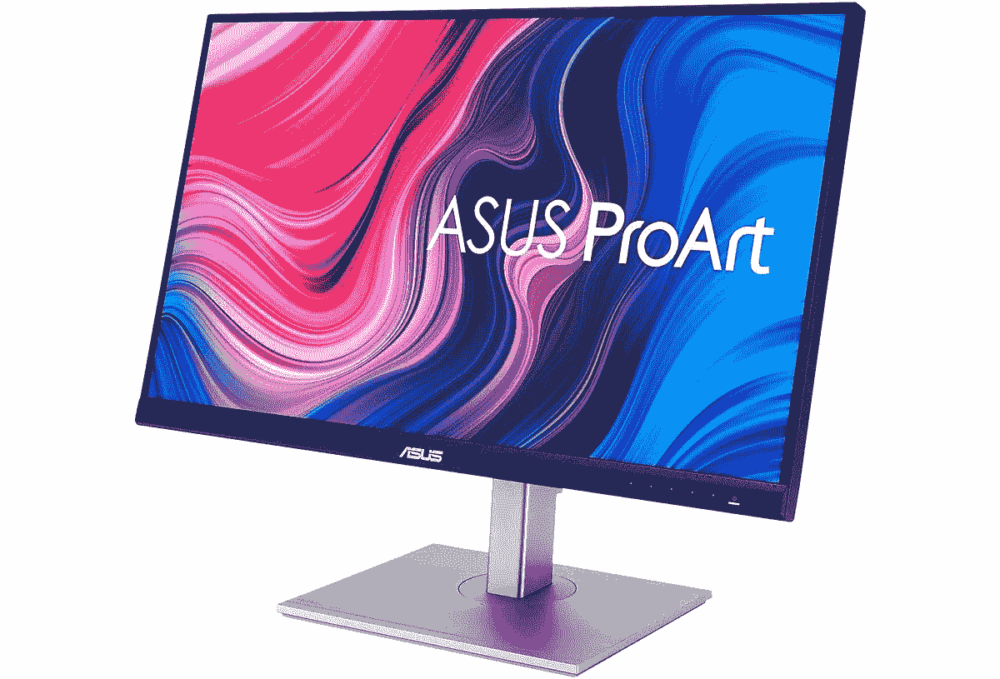
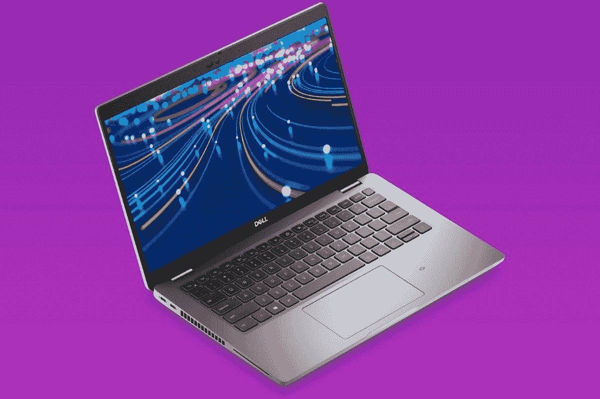

# Dell Latitude 5430 的最佳显示器

> 原文：<https://www.xda-developers.com/best-monitors-dell-latitude-5430/>

# Dell Latitude 5430 的最佳显示器

想要为您的 Dell Latitude 5430 添加第二台显示器吗？这里有一些很棒的选项，可以帮助你扩展你的工作空间。

戴尔最近推出了 [Latitude 5430](https://www.xda-developers.com/dell-latitude-5430/) ，这是其面向主流的[商务笔记本电脑](https://www.xda-developers.com/best-business-laptops/)系列的最新产品。与该系列中的其他笔记本电脑一样，Dell Latitude 5430 采用了英特尔的第 12 代 Alder Lake 处理器，并采用了高端设计以及商用笔记本电脑应有的可升级性。虽然笔记本电脑很好，但是没有什么比在系统中安装第二(或第三)块屏幕更能帮助你提高工作效率了。因此，我们收集了一些您可以与 Dell Latitude 5430 搭配使用的最佳显示器，以提高您的工作效率。

拥有第二个屏幕总是一个受欢迎的桌面设置，因为它允许你一次显示更多的信息。不仅如此，外部屏幕也必然会更大，因此可以容纳更多的内容。当您考虑到 Dell Latitude 5430 的显示器只有 16:9 的宽高比时，您真的会想要第二台显示器带来的额外空间。让我们开始吧。

*   <picture></picture>

    LG ultra wide 34wk 80c-B

    ##### LG ultra wide 34wk 80c-B

    ultra wide 显示器是许多用户的首选工具，因为它们给了你更多的工作空间。LG 34WN80C-B 是一个很好的选择，具有一个弯曲尖锐的 WQHD IPS 面板，覆盖 99%的 sRGB 和支持 HDR 10。此外，它通过 USB-C 连接，所以它也可以充电到笔记本电脑高达 60 瓦。
*   <picture></picture>

    华硕 ProArt PA278CV

    ##### 华硕 ProArt PA278CV 27 英寸 WQHD 显示器

    像华硕 pro art pa 278 cv 这样检查所有正确框的显示器数不胜数。具有清晰的四核高清分辨率，100%覆盖 sRGB 和 Rec。709，Delta E < 2 色彩精度，75Hz 刷新率，这几乎是完美的工作显示器。它还可以通过 USB-C 连接，为您的笔记本电脑充电。

*   <picture></picture>

    HP 24MH

    ##### HP 24MH FHD 显示器

    想要便宜但有能力的东西？这款惠普显示器配有全高清 24 英寸 IPS 面板，甚至还包括内置扬声器——这是你在这个价格的许多显示器上找不到的。它的刷新率高达 75Hz，支持 HDMI、DisplayPort 和 VGA 输入，甚至支持侧转和枢轴旋转。

*   <picture></picture>

    三星智能显示器 M8

    ##### 三星智能显示器 M8

    如果你的显示器不止是一个屏幕呢？三星的智能显示器 M8 就是这么做的。除了是一个夏普 4K 显示器，它还运行 Tizen，所以你可以运行你在三星智能电视上找到的所有应用程序，所以你甚至可以在没有笔记本电脑的情况下观看网飞等节目。此外，它还包括一个磁性网络摄像头，用于更好的视频通话。

*   <picture></picture>

    AOC 27g 2

    ##### AOC 27g 2

    我们不确定您为什么想要使用戴尔 Latitude 5430 来玩游戏，但是如果您确实想要，那么这款显示器是一个不错的入门方式。这是一款相当基本的游戏显示器，分辨率为 1080p，刷新率为 144Hz，以其价格计算，已经可以为您提供稳定的游戏体验。它还有 24 英寸的版本。

*   <picture></picture>

    戴尔 UltraSharp 27 up 2720 q

    ##### 戴尔 UltraSharp UP2720Q

    如果您需要专业的色彩调节和尽可能高的精确度，戴尔 UltraSharp up 2720 q 可能适合您。它有一个内置的色度计，所以你可以根据自己的需要调整颜色再现，此外，它覆盖了 100%的 Adobe RGB 和 98%的 DCI-P3，它甚至包括一个遮光罩，以减少分心。这也是一款 4K 显示器，通过 Thunderbolt 工作，甚至支持菊花链。

*   <picture></picture>

    宏碁 SB220Q

    ##### 宏碁 SB220Q

    如果你只想以尽可能低的价格获得额外的屏幕空间，宏碁 sb 220 q 可能适合你。这是一款 21 英寸全高清 IPS 显示器，视角极佳，刷新率为 75Hz，完全支持 AMD FreeSync，在日常使用中更加流畅。它的尺寸很小，更容易放在更小的桌子上，而且它有 HDMI 和 VGA 输入。

*   <picture></picture>

    Arzopa 便携显示器

    ##### Arzopa 便携显示器

    离不开第二屏？这款 Arzopa 便携式显示器可让您将双屏设置带到任何地方，为您提供一台 14 英寸全高清显示器，可通过 USB Type-C 或 mini-HDMI 轻松连接。这是一款 IPS 面板，视角极佳，另外还配有磁性外壳，可兼作支架，因此您可以在横向或纵向模式下使用它。

这就是我们认为的 Dell Latitude 5430 最佳显示器。根据您的需求，这些都是很好的选择，并没有一个适合所有人的解决方案，但我们可以说 Dell UltraSharp U2723QE 是您可以购买的最佳办公显示器之一。它清晰、色彩准确，并使用新的 IPS 黑科技，在提供出色视角的同时，大大提高了对比度。华硕 ProArt PA278CV 价格更合理，但也是一个不错的选择。

如果您还没有，您可以从下面的戴尔网站购买 Dell Latitude 5430。尽管市场上有更多的[高端笔记本电脑](https://www.xda-developers.com/best-laptops/)，但这仍然是一款非常吸引人的产品，它肯定会是戴尔今年最好的笔记本电脑之一，尤其是如果您是一名寻求可靠和简单产品的企业用户。

 <picture></picture> 

Dell Latitude 5430

##### 戴尔 Latitude 5430

Dell Latitude 5430 是一款高度可配置的商用笔记本电脑，采用第 12 代英特尔处理器和高端设计。