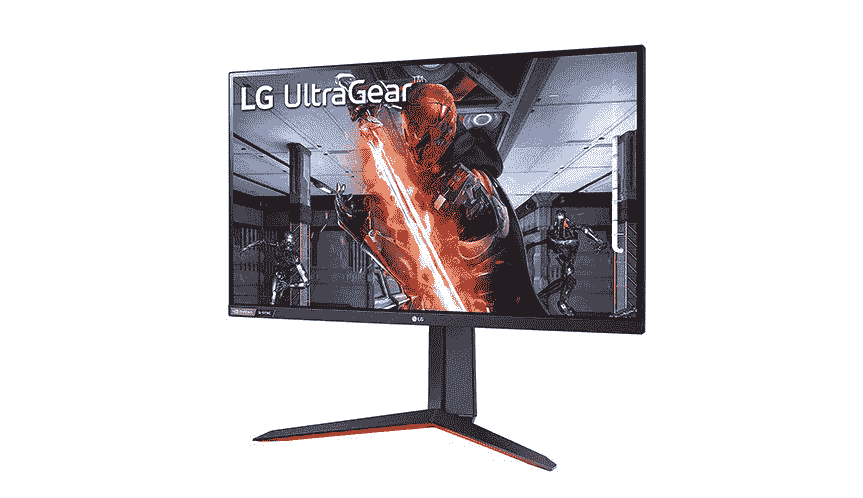
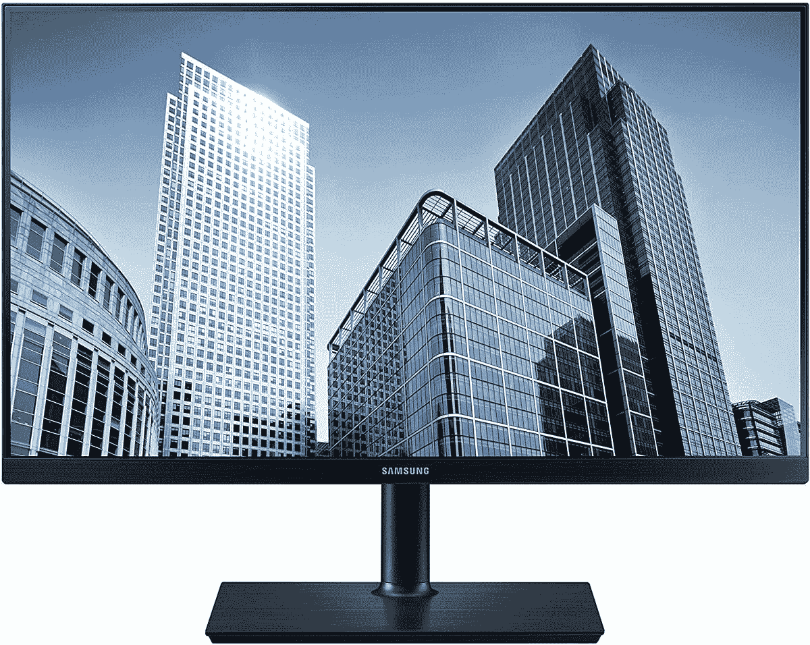

# 配备 M1 的 24 英寸苹果 iMac 的最佳外接显示器

> 原文：<https://www.xda-developers.com/best-monitors-for-imac/>

# 配备 M1 的 24 英寸苹果 iMac 的最佳外接显示器

苹果 M1 驱动的 24 英寸 iMac 最多支持一个外部显示器。这些是目前适用于这台 Mac 的最好的显示器。

苹果在 2021 年透露了重新设计的 iMac。这款经过彻底改造的 Mac 有多种颜色，采用了未来主义设计。更重要的是，它装有 M1 芯片组——苹果公司内部的芯片。如果你打算购买这款 24 英寸的 iMac，尤其是多显示器设置，我们为你准备了一些注意事项。首先，这款 iMac 只支持一个分辨率高达 6K、刷新率为 60Hz 的外接显示器。如果您试图[使用多个外部屏幕](https://www.xda-developers.com/use-external-monitor-with-m1-imac/)，它只会镜像显示。如果您使用适配器/坞站，这同样适用。这意味着您受限于双显示器设置。iMac 也只有两个 Thunderbolt 端口。这意味着如果你打算连接第二台显示器，你将失去一个 Thunderbolt 端口。如果你只需要一个额外的显示器，那么这里有一些适用于 [M1 iMac](https://www.xda-developers.com/imac-24-inch-review/) 的最好的显示器。

*   <picture></picture>

    华硕 ProArt 显示器 27

    ##### 华硕 ProArt PA279CV 27 英寸 4K UHD 显示器

    如果您打算使用您的新 iMac 进行照片或视频编辑等创造性任务，华硕 ProArt PA279CV 是一款固态显示器。它配备了一个 27 英寸 4K 分辨率 IPS 面板，提供 100%的 sRGB 覆盖率，工厂校准为 Delta E < 2 颜色精度，以及一个 USB-C 端口，用于无缝连接。

*   <picture></picture>

    LG 38WN95C-W

    ##### LG 38wn 95 c-W

    38 英寸 LG 38wn 95 c-W 是目前市面上最好的超宽显示器之一。它具有雷电 3 连接功能，因此很容易连接，面板本身通过了 VESA DisplayHDR 600 认证，DCI-P3 覆盖率达到 98%，令人印象深刻。它还配备了 144Hz 的刷新率，1 毫秒的响应时间，带来流畅的体验。

*   <picture></picture>

    华硕 ZenScreen 便携显示器(MB 16 AC)

    ##### 华硕 ZenScreen MB16AC

    华硕的 ZenScreen 便携显示器应该是新款 iMac 的绝佳伴侣。它具有紧凑、便携的设计，可以轻松安装并从您的办公桌上移走。它提供了 15.6 英寸 IPS 面板，而 USB-C 端口确保了单端口连接解决方案。

*   <picture></picture>

    LG Ultragear 27GN650-B

    ##### LG Ultragear 27gn 650-B

    就其价格而言，如果你正在寻找最好的 1080p 性能，27 英寸的 LG Ultragear 27gn 650-B 是一个赢家。该显示器配有 IPS 面板，支持基本 HDR、144Hz 刷新率，并支持 FreeSync 和 G-SYNC。

*   <picture></picture>

    三星商务 sh 850

    ##### 三星商务 SH850

    三星最新的商务系列显示器，要价其实还不错。SH850 有一个 24 英寸的面板，这使它与 iMac 上的显示器对称，尽管它无法匹配分辨率，但它仍然是这个预算中最好的 QHD 显示器之一。作为奖励，它配有 USB-C 连接和 3 年保修。

* * *

苹果专业显示器 XDR 将成为 24 英寸 M1 iMac 的首选，但它也是较贵的选择之一。如果你是一个内容创作者，你也会得到体面的服务与[华硕 ProArt 显示器](https://www.amazon.com/ASUS-ProArt-Display-Monitor-PA279CV/dp/B08K2GFDKM?tag=xda-5sehdfd-20&ascsubtag=UUxdaUeUpU3014&asc_refurl=https%3A%2F%2Fwww.xda-developers.com%2Fbest-monitors-for-imac%2F&asc_campaign=Affiliate)。或者，如果你只是需要一个辅助显示器来运行一些聊天应用，那么[三星商务系列](https://www.amazon.com/Samsung-2560x1440-Business-DisplayPort-S24H851QFN/dp/B07STYFWC5?tag=xda-5sehdfd-20&ascsubtag=UUxdaUeUpU3014&asc_refurl=https%3A%2F%2Fwww.xda-developers.com%2Fbest-monitors-for-imac%2F&asc_campaign=Affiliate)也可以很好地完成这项工作。

如果你打算给你的新 iMac 增加一个外接显示器，我们建议你使用 Thunderbolt dock，这样你就不会错过宝贵的 Thunderbolt 端口。我们最近列出了当今市场上一些最好的 Thunderbolt 坞站。此外，如果您感兴趣，我们还列出了一些[雷电 3 最佳笔记本电脑](https://www.xda-developers.com/best-thunderbolt-3-laptops/)。

*您会为您的 iMac 购买哪种外接显示器，为什么？请在下面的评论区告诉我们。*