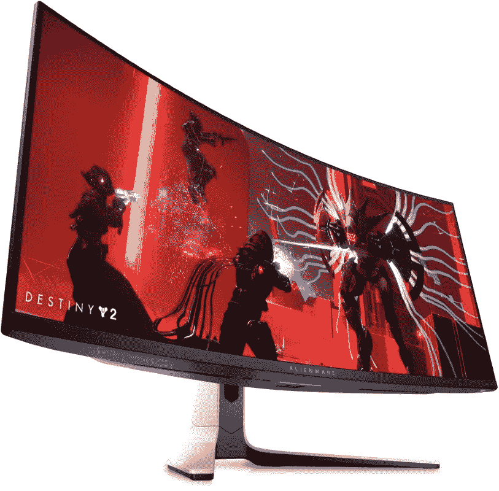

# 2023 年联想 ThinkPad X1 Yoga Gen 7 最佳显示器

> 原文：<https://www.xda-developers.com/best-monitors-lenovo-thinkpad-x1-yoga-gen-7/>

联想最近推出了 ThinkPad X1 Yoga Gen 7，这是其梦幻商务敞篷车的最新版本。像今年的许多高端笔记本电脑一样，它配备了最新的第 12 代英特尔 P 系列处理器，另外它还进行了一些重大升级，包括为其出色的 16:10 显示屏选择超高清+有机发光二极管配置。高长宽比有助于使这款笔记本电脑成为[生产力最好的笔记本电脑之一](https://www.xda-developers.com/best-laptops/)，但有时，你只是需要更多的空间。如果您正在为您的联想 ThinkPad X1 Yoga 寻找额外的显示器，我们可以为您提供帮助。

如果您以前从未使用过第二台显示器，购买第二台显示器的想法可能不会立即引起您的兴趣，但它确实会对工作效率产生巨大影响。第二个屏幕意味着你一眼就能看到更多的信息，所以你可以在一个屏幕上参考一些东西，在另一个屏幕上写东西。这是一件大事，如果你能负担得起，这绝对是我们建议添加到你的办公室设置。因此，如果您需要为联想 ThinkPad X1 Yoga Gen 7 配备显示器，以下是我们的一些建议。

*   <picture></picture>

    华硕 pro art pa 278 qv

    ##### 华硕 ProArt PA278CV 27 英寸 WQHD 显示器

    如果您正在为您的 monye 寻找最佳价值，这很可能是最佳选择之一。华硕 ProArt PA278QV 拥有 27 英寸的四核高清面板，非常清晰，此外，您还可以获得 100%的 sRGB 和录制。709 覆盖率，δE<2，而且是卡尔曼验证过的。如果你愿意多花一点钱，也有一种 USB-C 连接的型号。

*   <picture></picture>

    LG 超宽 34wp 65 c-B

    ##### LG 34wp 65 c-B

    对于最重的多任务处理者来说，拥有超宽显示屏是必须的，如果这是你所寻求的，这是一个绝佳的选择。这是一个 34 英寸的面板，长宽比为 21:9，分辨率为 Wuad HD (3440 x 1440)，所以它仍然非常清晰。此外，它覆盖了 sRGB 99%的地区，刷新率为 160 赫兹，内置 7W 扬声器，提供身临其境的声音。

*   <picture></picture>

    三星智能显示器 M7

    ##### 三星智能显示器 M7

    显示器可以成为你 PC 的绝佳配件，但是有了三星的智能显示器 M7，你甚至不需要 PC。当然，这是一个锐利的 4K 屏幕，但由于它运行 Tizen，你可以访问你所有的流媒体应用程序，加上微软 Office，wireless DeX 等等。这是一个显示器，这一切，它还是比较实惠的。

*   <picture></picture>

    HP 24MH

    ##### HP 24MH FHD 显示器

    在小预算上找东西？惠普 24mh 不是最新的型号，但它是一个极好的预算选择。它拥有全高清分辨率和 75Hz 刷新率，甚至还包括内置扬声器，可满足您的所有媒体需求。此外，它支持倾斜、高度甚至枢轴调节，并且具有 HDMI、DisplayPort 和 VGA 输入。

*   <picture></picture>

    AOC 27g 2

    ##### AOC 27g 2

    我们怀疑大多数用户会想要使用联想 ThinkPad X1 Yoga 进行游戏，但如果你想试一试，这是一款很好的入门显示器。这是一个 27 英寸的全高清面板，刷新率为 144Hz，所以它不是高端产品，但它非常适合在不花费太多的情况下玩游戏。

*   <picture></picture>

    外星人 34QD-有机发光二极管 aw 3423 dw

    ##### 戴尔外星人 AW3423DW

    是的，这是另一款游戏显示器，但这不是我们在此将其包括在内的原因。这是一个 34 英寸的面板，长宽比为 21:9，分辨率为 3440 x 1400，是第一个使用新的 QD-有机发光二极管技术的显示器，因此您可以获得真正的黑色，鲜艳的颜色，并支持 DisplayHDR 400，同时降低了老化的风险。它很贵，也很大，但这几乎是任何东西的明星显示器。

*   <picture></picture>

    宏碁 sb 220 q

    ##### 宏碁 SB220Q

    我们在这里已经包含了一个以预算为导向的选择，但是如果您需要更便宜的价格，这款宏碁显示器可能适合您。这是一款 21.5 英寸的显示器，具有全高清分辨率和 75Hz 的刷新率，因此它涵盖了提供可靠体验的基本内容。它没有内置扬声器，也没有像其他一些产品一样的可调性，但如果你只需要一个基本的额外屏幕，这是一种廉价的方式。

*   <picture></picture>

    联想 ThinkVision M14

    ##### 联想 ThinkVision M14

    所以你在家里有一个双屏设置，但是如果你需要外出旅行，没有你的双显示器设置又怎么行呢？联想 ThinkVision M14 是一款 14 英寸的便携式显示器，无论您走到哪里，它都能为您提供第二块屏幕。它具有全高清分辨率，并且由于 USB Type-C 端口，您只需要一根电缆来为显示器供电。它甚至支持 power passthrough，所以你可以通过它给你的笔记本电脑充电。

如果您正在寻找一款显示器来搭配您的联想 ThinkPad X1 Yoga Gen 7，这些就是我们的建议。有些选择价格实惠，有些则更高端，但这里有适合每个人的东西。考虑到这里所有的选项，很难挑选一个最喜欢的，但华硕 ProArt PA278QV 确实提供了一些非常好的价格，这是这里最有吸引力的选择。然而，三星的智能显示器 M7 看起来也是一个非常棒的多功能选择。

如果你还没有，你可以使用下面的链接购买联想 ThinkPad X1 Yoga Gen 7。联想提供了广泛的配置，尽管不是所有联想宣布的选项都可用。无论如何，这是 2022 年[最佳商务笔记本电脑](https://www.xda-developers.com/best-business-laptops/)之一，对任何商务用户来说都是一个简单的推荐。

 <picture></picture> 

Lenovo ThinkPad X1 Yoga Gen 7

##### 联想 ThinkPad X1 Yoga Gen 7

联想 ThinkPad X1 Yoga Gen 7 是一款功能强大的敞篷电脑，采用第 12 代英特尔处理器，最高可配超高清+有机发光二极管显示屏。此外，您可以通过全高清网络摄像头获得它。