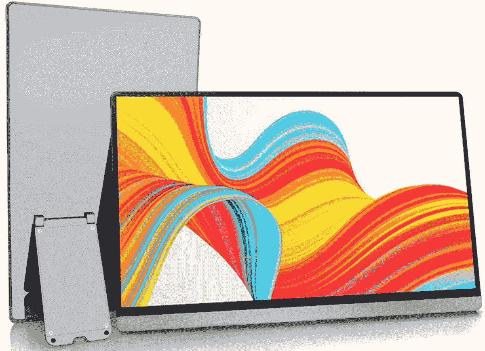
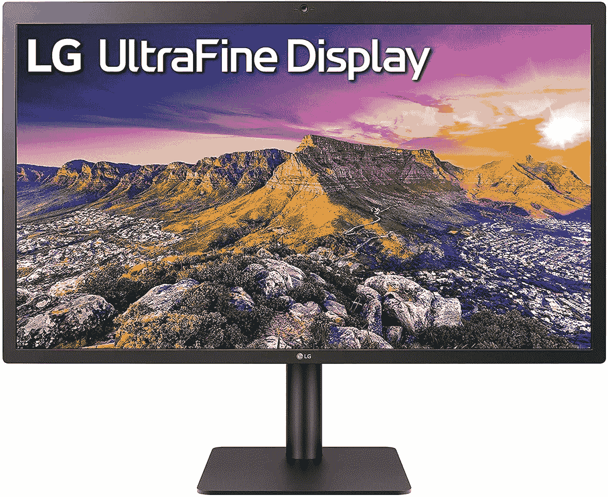

# Mac 工作室的最佳显示器

> 原文：<https://www.xda-developers.com/best-monitors-mac-studio/>

# Mac 工作室的最佳显示器

Mac Studio 是最强大的商用电脑之一。这里是这个发电站可用的最好的显示器。

苹果一直在慢慢地将其电脑处理器从英特尔转移到自己的 SoC 上。如果你买了一台 Mac 电脑，它很可能会包含一个 M1 芯片——因为现在大多数都包含该公司的芯片。开发者也在为苹果芯片优化他们的[应用，以提供更高效的软件。此外，](https://www.xda-developers.com/best-apps-apple-silicon/) [macOS Monterey](https://www.xda-developers.com/macos-monterey) 已经成为一个无可匹敌的，流畅的操作系统。这是因为库比蒂诺科技巨头同时提供硬件和操作系统。与此同时，苹果继续扩大其 Mac 产品线。Mac Studio 是在 Peek 表演活动期间发布的最新产品。考虑到它没有内置显示器，你需要自己买一个。选择是无穷无尽的，因为许多公司为所有不同的预算和需求生产屏幕。这些是配合 Mac Studio 使用的最佳显示器。

*   <picture></picture>

    宏碁 sb 220 q

    ##### 宏碁 SB220Q

    这款来自宏碁的 21 英寸全高清显示器提供了 75Hz 的更高刷新率，薄边框的无边框设计，以及多视角。

*   <picture></picture>

    Sceptre E248W-19203 r

    ##### Sceptre E248W-19203 r

    这款来自 Sceptre 的 24 英寸显示器拥有 1920 x 1080 p 全高清分辨率，并采用超薄设计。它的刷新率可以达到 75Hz。

*   <picture></picture>

    AYY 便携式显示器

    ##### AYY 便携式显示器

    这款来自 AYY 的 16.1 英寸便携式显示器非常适合那些在旅途中工作的人。它重量很轻，配有 USB Type-C 电缆用于连接。

*   <picture></picture>

    LG 27 MD5 KL-B

    ##### LG 27 MD5 KL-B

    这款来自 LG 的 5K 显示器提供了身临其境的体验，这得益于其生动而准确的色彩。它还具有雷电 3 和 USB Type-C 端口。

*   <picture></picture>

    苹果 Pro Display XDR

    ##### 苹果 Pro Display XDR

    这款来自苹果的 6K XDR display 就是为专业人士打造的它的对比度为 1，000，000:1，亮度可达 1600 尼特。

* * *

如果我必须为我的 Mac 工作室选择这些显示器中的一个，我会购买[三星 UE57 系列](https://www.amazon.com/Samsung-LU28E570DS-ZA-Led-Lit-Monitor/dp/B07FBNPTDD/?tag=xda-37uo1n9-20&ascsubtag=UUxdaUeUpU40418&asc_refurl=https%3A%2F%2Fwww.xda-developers.com%2Fbest-monitors-mac-studio%2F&asc_campaign=Short-Term)的一个。它价格实惠，由一家声誉良好的公司制造，对我的展示需求来说绰绰有余。Mac Studio 的伟大之处在于它支持多台显示器。所以你可以为你的工作空间购买不同公司的不同型号。这对那些一心多用的人来说尤其有用。通过拥有多个显示器，您可以同时查看和控制几个应用程序，而它们都是全屏的。使用一台显示器会限制你在几个应用程序之间切换。这可能是浪费时间，尤其是当你压力很大，有很多截止日期要赶的时候。通过投资一个合适的工作空间，你可以节省大量的时间和金钱。

 <picture></picture> 

Apple Mac Studio

##### 苹果 Mac 工作室

Mac Studio 由苹果 M1 Max 或全新的 M1 Ultra 芯片驱动。它只有银色可选，起价 1999 美元。

*您会为 Mac Studio 购买哪种显示器？请在下面的评论区告诉我们。*