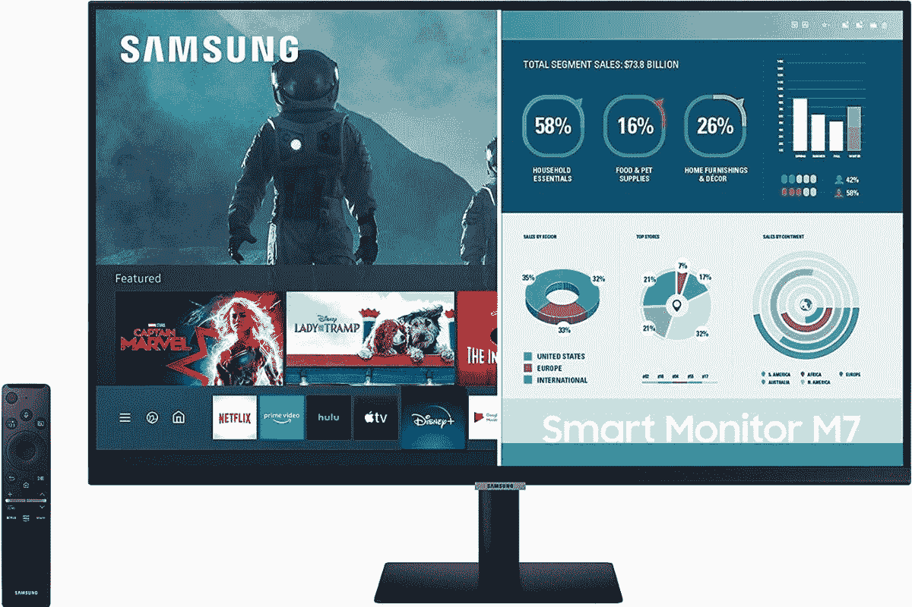
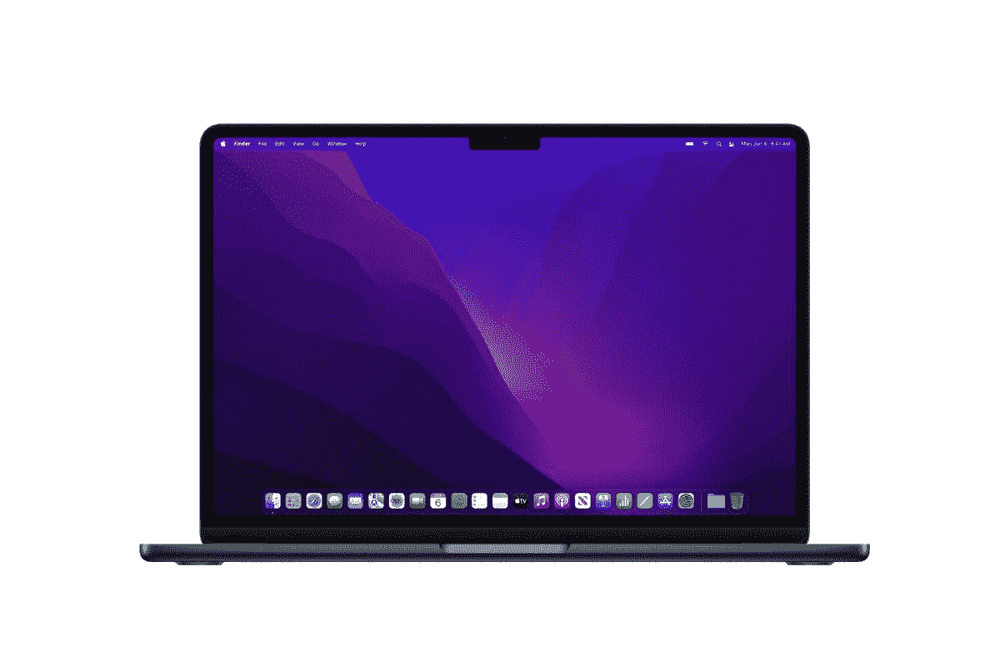

# MacBook Air 最佳显示器(2022)

> 原文：<https://www.xda-developers.com/best-monitors-macbook-air-2022/>

苹果的 [2022 MacBook Air](https://www.xda-developers.com/macbook-air-m2-2022-review/) 看起来是一款神奇的设备，拥有全新的设计、升级的 M2 处理器和其他受欢迎的改进。虽然显示屏在技术上被做得更高了，但它并没有那么大，对于多任务处理来说，它仍然有助于拥有第二块屏幕。我们将在这方面提供帮助，我们已经为 2022 年的 MacBook Air 收集了一些不同价位的最佳显示器。

现在，我们应该提到，无论分辨率如何，MacBook Air 都不允许您一次连接多个外部显示器。这是苹果 M2 处理器的一个局限，就像 M1 一样。在某些情况下，这可能会妨碍工作效率，但单个外部显示器已经很有帮助了，所以值得看看你有哪些选择。让我们开始吧。

*   <picture></picture>

    Apple Studio Display

    ##### Apple Studio Display

    Apple 的官方 Studio Display 是另一个溢价昂贵的选择，有很多优惠。这是一个 5K 面板，亮度为 600 尼特，P3 宽彩色(有多种颜色配置文件可用)，它包括 12MP 摄像头和强大的六扬声器设置。

*   <picture></picture>

    华硕 ProArt PA278CV

    ##### 华硕 ProArt PA278CV 27 英寸 WQHD 显示器

    华硕的 ProArt pa 278 cv 是你可以买到的最物有所值的显示器之一。它采用四倍高清分辨率，覆盖 100%的录制内容。709 和 sRGB，它有δE<2 的色彩精度，和 75Hz 的刷新率。此外，它还使用一根 USB-C 电缆进行连接。

*   <picture></picture>

    三星智能显示器 M7

    ##### 三星智能显示器 M7

    这款三星显示器非常独特，因为它不仅是一款用于完成工作的固体 4K 屏幕，它还有三星的智能电视 UI，这意味着即使你没有 MacBook Air，也可以使用网飞、苹果电视等应用程序

*   <picture></picture>

    Sceptre E248W-19203 r

    ##### Sceptre E248W-19203 r

    如果你想要一个真正的预算选择，这款来自 Sceptre 的型号是实心的，具有全高清分辨率和 75Hz 刷新率。它的一大优点是它还内置了扬声器，这在这个价位非常罕见。不过，你需要一个 USB-C 转 HDMI 适配器。

*   <picture></picture>

    宏碁 SB220Q

    ##### 宏碁 SB220Q

    如果你想传递内置扬声器，宏碁 sb 220 q 是一款更便宜的显示器，仍然具有全高清分辨率和 75Hz 的刷新率。它也有点小，就像前一个一样，你需要一个适配器来从 MacBook Air 输出到 HDMI。

*   <picture></picture>

    Apple Pro Display XDR

    ##### Apple Pro Display XDR

    市面上有不错的显示器，但没有多少能与 Apple Pro Display XDR 相比。这款 32 英寸的显示器分辨率高达 6K，它使用迷你 led 来提供苹果公司所说的 XDR。凭借 1600 尼特的峰值亮度、1，000，000:1 的对比度和 P3 宽色彩，这是一款令人难以置信的显示器。当然，它的价格接近 6000 美元，所以这是你所期望的。

*   <picture></picture>

    三星 S65UA

    ##### 三星 S65UA Ultra WQHD 显示器

    只能连接一个显示器会使多任务处理有点困难，但您可以使用超宽显示器来解决这个问题。这款来自三星的产品具有非常清晰的 WQHD 分辨率和 100Hz 的刷新率，另外它使用一根 USB-C 电缆连接，甚至可以同时为你的笔记本电脑充电。也是弧形的，用起来更舒服。

*   <picture></picture>

    Arzopa 便携显示器

    ##### Arzopa 便携显示器

    想要过上离家在外的双屏生活？这款 Arzopa 便携式显示器的尺寸和分辨率与 MacBook Air 非常相似(加上 1，000:1 的对比度，这对于便携式显示器来说是很少见的)，这使它成为移动办公的完美选择。它通过一根 USB-C 电缆连接，该电缆也为显示器供电，因此您可以在任何需要的地方轻松设置和使用。

如果你需要一些东西来搭配你的新 MacBook Air，这些是我们推荐的一些最好的显示器。显然，越贵的往往技术越好，但这里不同的价格范围让你选择最能满足你需求的，而不必花太多钱。就个人而言，三星智能显示器 M7 将是一个非常诱人的选择，因为它具有清晰的分辨率，并且在没有笔记本电脑连接的情况下可以做任何事情。

2022 年的 MacBook Air 有望成为迄今为止最好的 MAC 电脑之一，这也是下一代苹果芯片的首次亮相。此外，今年晚些时候，当 [macOS Ventura](https://www.xda-developers.com/macos-ventura/) 发布具有舞台管理器和连续性摄像机等功能时，它会变得更好。它计划在 7 月推出，但如果你想现在就查看并开始选择你的型号，你可以在下面查看。这一次，有四种颜色可供选择。

 <picture></picture> 

MacBook Air M2 2022

##### 苹果 MacBook Air (M1，2020 年)

2022 年的 MacBook Air 由新的苹果 M2 芯片驱动，另外它有一个新的更高的显示屏和全新的设计。