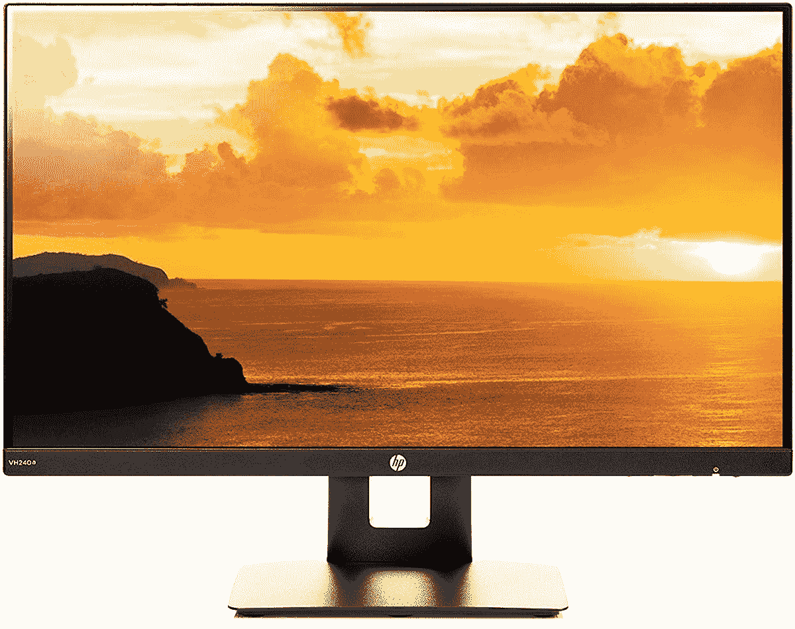
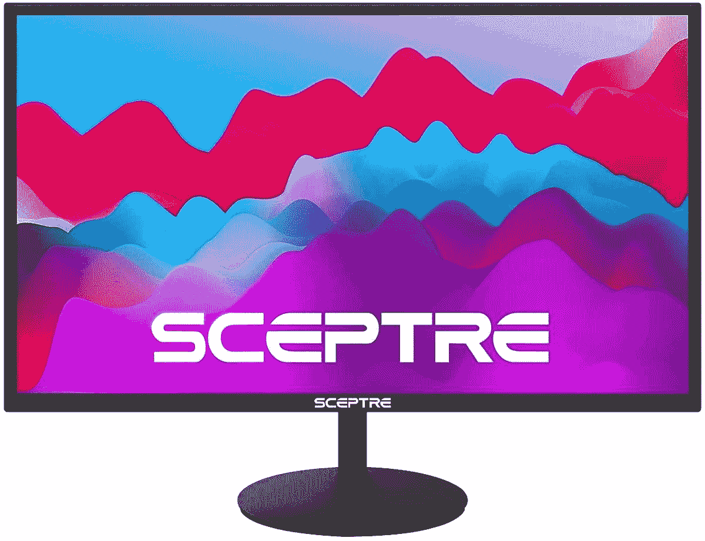
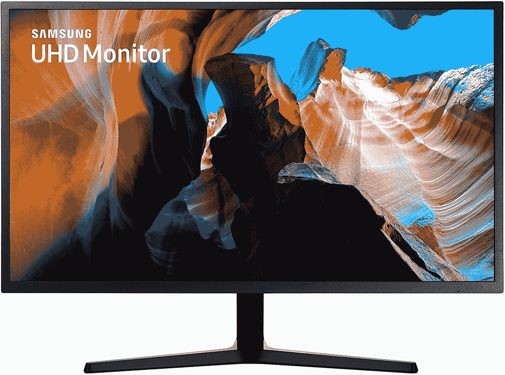

# 苹果 MacBook Pro M2 最佳显示器(2022)

> 原文：<https://www.xda-developers.com/best-monitors-macbook-pro-13-2022/>

# 苹果 MacBook Pro M2 最佳显示器(2022)

以下是你能买到的最好的显示器，供苹果 13 英寸 MacBook Pro M2 (2022)用作外接显示器。

苹果于 2022 年 6 月推出了 [13 英寸 MacBook Pro M2](https://www.xda-developers.com/apple-macbook-pro-13-inch-m2-2022-review/) 。这个受欢迎的新成员加入了伟大的 [Mac 阵容](https://www.xda-developers.com/best-macs/)重新引入了 Touch Bar。那是在该公司将其从重新设计的 [MacBook Pro (2021)](https://www.xda-developers.com/macbook-pro-2021/) 型号中移除之后——你可以以更低的价格购买作为[翻新单元](https://www.xda-developers.com/best-places-buy-refurb-macbook-pro/)。你可能知道，2022 年的 MacBook Pro 装有 M2 芯片。然而不幸的是，它只支持一个外部显示器——就像苹果在 2020 年展示的 M1 SoC 一样。因此，如果您需要不止一个外接屏幕，这款 Pro 笔记本不适合您。然而，如果你对这个限制没意见，你一定想知道该选择哪一个。毕竟品牌和型号层出不穷，挑一个真的会让人摸不着头脑。为了让你的生活更轻松，我们整理了一份清单，里面有一些很棒的选择。这些是配合 MacBook Pro M2 (2022)使用的最佳显示器。

## MacBook Pro M2 最佳显示器(2022)

*   <picture></picture>

    HP VH 240 a

    ##### HP VH 240 a

    这款显示器内置扬声器，支持纵向和横向两种方向。它的表面还有一层防眩光涂层，可以带来更加舒适的视觉体验。

*   <picture></picture>

    这款显示器还配有内置扬声器和实惠的价格标签。对于那些希望通过避免专用音响系统来节省办公桌空间的人来说，这是理想之选。

*   <picture></picture>

    LG ultra wide 34wn 80 c-B

    ##### LG 34wn 80 c-B

    这款曲面显示器支持 HDR 10 内容，具有可调高度和角度，并具有令人着迷的 3440×1440 像素分辨率。

*   <picture></picture>

    三星 lu32j 590 uqnxza

    ##### 三星 U32J590 32 英寸 4K 显示器

    这款支持多种设备，允许你同时将 MacBook Pro 和游戏主机或 PC 插入其中，这要归功于它的多个端口。

*   <picture></picture>

    苹果 Pro 显示器 XDR

    ##### 苹果 Pro 显示器 XDR

    苹果 Pro 显示器 XDR 提供了近乎疯狂的 6016×3384 像素分辨率。它的对比度是 1，000，000:1，拥有超宽视角。

* * *

显示器是进一步利用 MacBook Pro M2 (2022)的强大功能的好方法。它使多任务处理变得非常容易——感觉就像你有两台电脑，而不是只有一台。如果我个人必须选择其中一个，我可能会选择 LG 34WN80C-B。我非常喜欢它的曲线和角度/高度。您可以轻松调整它，以符合您的特定工作设置。如果你有更高的预算，你可以选择[苹果专业显示器 XDR](https://www.amazon.com/Apple-32-inch-Pro-Display-Retina/dp/B082LZTDX5?tag=xda-870ummt-20&ascsubtag=UUxdaUeUpU42381&asc_refurl=https%3A%2F%2Fwww.xda-developers.com%2Fbest-monitors-macbook-pro-13-2022%2F&asc_campaign=Affiliate) 。这是一个 32 英寸的大屏幕，亮度非常高，最高可达 1600 尼特，分辨率高达 6016 x 3384 像素。不过，它附带了*苹果税*，而且你要花上几千块才能买到它。

 <picture></picture> 

Apple MacBook Pro M2

##### 苹果 MacBook Air (2022)

2022 年的 MacBook Pro 13 英寸提供了经典的设计，重新引入了 Touch Bar，并封装了 M2 芯片。

*你会为你的苹果 MacBook Pro M2 (2022)购买哪种显示器，为什么？请在下面的评论区告诉我们。*