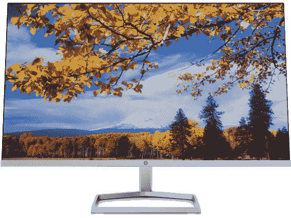

# 2023 年 Surface Laptop 4 最佳外接显示器

> 原文：<https://www.xda-developers.com/best-monitors-surface-laptop-4/>

# 2023 年 Surface Laptop 4 最佳外接显示器

寻找一款可以连接到 Surface Laptop 4 的可靠显示器，以实现最佳家庭设置？以下是我们的建议。

Surface Laptop 4 是一台很棒的机器，它可以让你在旅途中不受阻碍地工作。但是，如果你经常在固定的办公桌前使用笔记本电脑，你可以投资的最好的生产力黑客之一是第二个显示器。外接显示器将极大地增加你的屏幕空间，让生活变得更加轻松，尤其是如果你必须一直在几个应用程序或标签之间切换的话。但与此同时，请记住 Surface Laptop 4 不提供 Thunderbolt 连接功能([甚至 AMD 型号也不提供](https://www.xda-developers.com/best-amd-ryzen-laptops/))，这意味着它不能同时连接双 4K 显示器，除非你使用 Surface Dock。

但是，USB-C 端口原生支持 DisplayPort。这意味着您可以选择提供 USB-C 连接的显示器，或者多花一点钱购买一个适配器，获得一个具有 HDMI 功能的显示器。你可以点击这里查看一些[Surface Laptop 4 的最佳坞站。这也有助于完善设置和提高生产率。](https://www.xda-developers.com/best-docks-surface-laptop-4/)

*   ##### 三星智能显示器 m7b

    这款 32 英寸的 4K 三星显示器拥有许多智能功能，例如无需电脑即可访问流媒体应用程序。这意味着它非常适合在 Surface Laptop 4 的单个屏幕之外实现多任务处理。

    T13
*   ##### 宏碁 23 英寸 FHD 显示器

    这是一款非常适合 Surface Laptop 4 的预算显示器。屏幕很大，有 23 英寸，但它只有基本的 FHD 1920 x 1080 分辨率，这是低价的牺牲。

*   ##### 戴尔 U2723QE UltraSharp 4K USB-C 集线器显示器

    这款戴尔 UltraSharp 显示器具有 USB-C 连接功能，因此您不需要在 Surface Laptop 4 上使用加密狗。它还拥有清晰的 4K 分辨率和 27 英寸面板周围的超薄边框。

*   <picture></picture>

    LG 超薄 27 寸 4K 显示器

    ##### LG 超薄 27 寸 4K 显示器

    LG 的超薄 27 寸显示器是 Surface 笔记本电脑 4 的固体显示器。它具有 3840 x 2160 的分辨率，支持 HDR 400，以及可定制的游戏、内容创建等模式。

*   <picture></picture>

    外星人 34QD-有机发光二极管 aw 3423 dw

    ##### 戴尔外星人 34QD-有机发光二极管 aw 3423 dw

    Surface Laptop 4 不是一款游戏笔记本电脑，但这是一款高端 34 英寸曲面显示器，可以用来进行游戏和内容创作。它有一个 OLED 面板，可以准确地再现颜色，非常适合那些想要生动图像的人。

*   <picture></picture>

    惠普 M27f FHD 显示器(45 美元起)

    ##### 惠普 M27f 显示器

    这款 24 英寸的惠普显示器拥有时尚的支架和设计。该显示器还采用 FHD 分辨率，并具有 HDMI 连接，包装盒中包含一根电缆。

*   ##### 华硕 ProArt PA329C 32 英寸 4K 显示器

    这款来自华硕的 32 英寸 4K 显示器是那些想要最精确的色彩显示器来进行内容创作、艺术创作等的人的绝佳选择。它可以覆盖 100%的 Adobe RGB、SRGB 和光谱。

    T34
*   ##### 联想 ThinkVision M14d

    联想 ThinkVision M14d 与我们名单上的其他产品不同。如果您的桌面空间有限，这款便携式显示器非常适合。它具有 16:10 的宽高比和清晰的 2240 x 1400 分辨率。

*   ##### 戴尔 27 款视频会议显示器

    这款 27 英寸 2560 x 1440 分辨率的显示器适合那些经常进行视频会议的人。它内置扬声器和弹出式摄像头，有助于提升您的体验，超越 Surface Laptop 4 上的集成网络摄像头。

    T17

这些是我们能为 Surface Laptop 4 找到的九款最好的显示器。我们强烈建议选择色彩准确的显示器，如戴尔 U2723QE UltraSharp 4K USB-C Hub 显示器或华硕 Pro Art 显示器。如果您不喜欢色彩准确性，三星智能显示器 m7b 很好，23 英寸宏碁或惠普 M27F 等更便宜的显示器也很好。最重要的是，许多显示器都有额外的端口，因此您可以将它们连接到您拥有的其他设备。