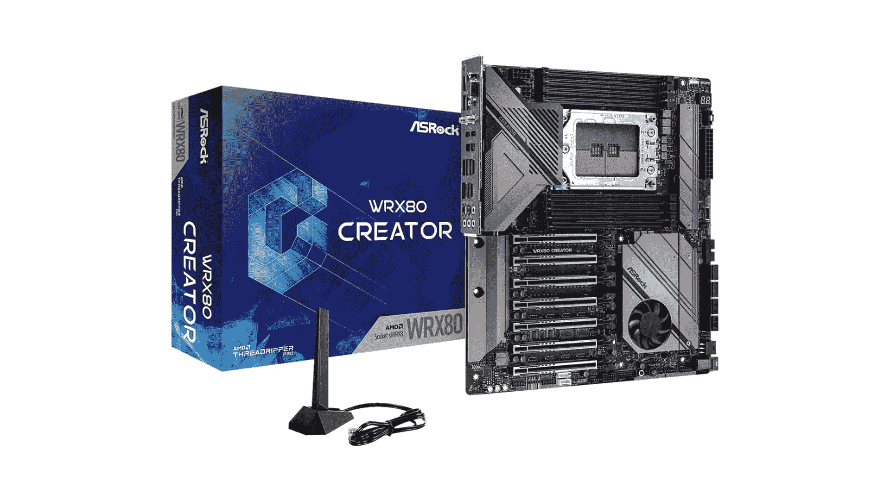

# 2023 年 AMD CPUs 最佳主板

> 原文：<https://www.xda-developers.com/best-motherboard-amd/>

AMD 已经与英特尔在最佳 CPU 之战中较量了很长一段时间，但我们认为 AMD 芯片在平台成本、一般可用性等方面仍然比新的英特尔芯片占优势。这就是为什么最好的 AMD 主板仍然是一个热门话题。AMD 主板总是有需求，但幸运的是市场上有很多 AMD 主板。我们将看看你能买到的最好的 AMD 处理器主板。

最新的锐龙 7000 CPUs 使用 AM5 插槽，而所有其他锐龙处理器都使用 AM4，因此有大量选项可供选择。X670 和 B650 是 AM5 和锐龙 7000 的首选芯片组。X570 和 B550 都是锐龙 5000 系列和更老版本的可行选择。如果你不是特别想买 AMD 主板，你也可以看看我们收集的[最好的主板](https://www.xda-developers.com/best-motherboard/)。

## 最佳 AM5 主板:华硕 ROG Strix X670E-E 游戏

| 

规格

 | 

华硕 ROG Strix X670E-E 游戏

 |
| --- | --- |
| **插座** | AM5 |
| **芯片组** | AMD X670E |
| **外形尺寸** | ATX |
| **电源** | 18+2 阶段 |
| **膨胀** | 2 个 PCIe 5.0 x16，1 个 PCIe 4.0 x16，3 个 PCIe 5.0 米 2，1 个 PCIe 4.0 米 2 |
| **USB 端口** | 12 个 USB-A 3.2 第 2 代端口，1 个 USB-C 3.2 第 2 代 2x2 端口，3 个 USB-A 2.0 端口 |
| **保修** | 3 年 |

我们最喜欢的 AMD 锐龙 7000 处理器的主板之一是华硕 ROG Strix X670E-E 游戏。它几乎拥有稳定的 PC 构建所需的一切，即使是旗舰 AMD 锐龙 9 7950X。让我们从 X670E 芯片组开始。这是 X670 的“极端”版本，保留给更多的发烧友级主板，因为它更适合超频，并拥有世界上所有的连接。

我们为 CPU 和其他附近的组件提供了 18+2 相电源传输设计，以及两个 PCIe 5.0 x16 插槽、一个 PCIe 4.0 x16 插槽、三个 PCIe 5.0 M.2 SSD 插槽和一个 PCIe 4.0 M.2 SSD 插槽。这种主板可以与最新的 GPU 和存储以及未来的许多产品一起工作。我们使用的显卡没有接近 PCIe 5.0 的极限，这使得华硕 ROG Strix X670-E 游戏成为未来的一个好选择。

对于后部 I/O 上的 USB 端口，华硕确保您有足够的选项，包括 12 个 USB-A 3.2 Gen 2 端口，一个 USB-C 3.2 Gen 2x2 端口，以及另外三个 USB 2.0 端口。这一切都与 2.5Gb 网络的快速访问您的局域网和外部世界。它只是一个更好的 X670E 主板，而没有花费大量的金钱。

##### 华硕 ROG Strix X670E-E 游戏

华硕 ROG Strix X670E-E 游戏是一款高端华硕主板，由于其大型 18+2 级 VRM，它支持 PCIe 5.0 显卡、三个 PCIe 5.0 固态硬盘和高端锐龙 7000 CPUs。

## 最佳 AM4 主板:华硕 ROG 十字准线八极端

| 

规格

 | 

华硕 ROG 十字准线八极端

 |
| --- | --- |
| **插座** | AM4 |
| --- | --- |
| **芯片组** | AMD X570 |
| --- | --- |
| **外形尺寸** | ATX |
| --- | --- |
| **动力** | 18+2 阶段 |
| --- | --- |
| **膨胀** | 2 个 PCIe 4.0 x16，2 个 PCIe 3.0 x16，1 个 PCIe 3.0 x16，1 个 PCIe 3.0 x1 |
| --- | --- |
| **USB 端口** | 4 个 USB-A 3.2 第 2 代端口，4 个 USB-A 3.2 第 1 代端口，2 个 Thunderbolt 4 端口，4 个 USB-A 3.2 第 2 代端口 |
| --- | --- |
| **保修** | 3 年 |
| --- | --- |

华硕 ROG 十字准线 VIII Extreme 是这个列表中最贵的主板之一，但我们认为它非常值得这个要价。它不仅具有匹配价格标签的外观，而且还包含大量高级功能，如最强大的 VRM 之一，支持极端超频，最新的 Realtek/Supreme FX 音频编解码器等；使其成为市场上的理想选择。它还提供多达五个 M.2 插槽，可以同时工作。

ROG 十字准线八极端是一个 E-ATX 大小的主板，带有一个 X570 芯片组和一个 AM4 插座。它还为芯片组和 VRM 配备了超大散热器。正如你对优质主板的期望，M.2 插槽还覆盖着散热器/护罩，使其成为一个良好的整体冷却环境。此外，这款主板配有两个 Thunderbolt 4 (Type-C)端口，前面板上有一个 USB 3.2 Gen 2x2 端口。您还可以在包装盒中获得许多贴心的额外功能，包括 DIMM.2 附加卡(用于安装额外的 M.2 驱动器)、音频 DAC、ROG 风扇控制器、Wi-Fi 天线等。

主板本身就像一个坦克，它看起来也很华丽。这可以说是你现在能买到的最好看的东西之一。尽管华硕是顶级主板，但我们也喜欢华硕在这款主板上使用最少的 RGB 装饰。除了右侧边缘的发光灯条，只有 ROG 标志和 ROG 文字亮起。看起来很好看，和主板的全黑 PCB 融合的很好。我们最喜欢这款主板的一点是，它配备了华硕所谓的 LiveDash 屏幕。它本质上是一个 2 英寸的有机发光二极管屏幕，默认显示关键的系统信息。您不一定需要在主板上安装显示器，但我们不介意，只要它不占用为其他组件保留的宝贵空间。

ROG 十字准线八极端主板有两个 8 针连接器来为 CPU 供电。不言而喻，你也可以在这个主板上得到一吨的风扇/泵，USB 和 RGB 头。现在很多主板上都有这些接头，所以没什么不寻常的。您还可以获得多达四个 DRAM 插槽，能够运行高达 128GB 的 DDR4 RAM，速度高达 DDR4-5400。由于并非所有的内存模块都具有相同的速度，因此您的速度肯定会有所不同。也就是说，很高兴看到对市场上一些最快的 RAM 套件的支持。

主板还配备了多达三个 PCIe 插槽。其中两个是全长加固插槽，而最后一个是底部的 x1 插槽，没有任何加固。我们还喜欢 I/O shield 预装在主板上的事实，这意味着在[构建 PC](https://www.xda-developers.com/how-to-build-a-computer-beginners/) 时少了一个需要担心的步骤。总的来说，我们认为华硕 ROG 十字准线八极端是一个了不起的主板，能够支持市场上最苛刻的 CPU。更不用说，它还支持超频，所以发烧友们会很乐意拥有这款基于 AMD 的主板。

##### 华硕 ROG 十字准线八极端

华硕 ROG 十字准线八极端是你现在可以买到的最好的优质主板之一。它有一个 X570 芯片组和一个 AM4 插槽，支持市场上最苛刻的 AMD CPUs。

## 最超值的 AM5 主板:华硕 TUF 游戏 B650-PLUS

| 

规格

 | 

华硕 TUF 游戏 B650-PLUS

 |
| --- | --- |
| **插座:** | AM5 |
| **芯片组:** | AMD B650 |
| **外形尺寸:** | ATX |
| **电压调节器:** | 12+2 阶段 |
| **PCIe x16:** | 2 个 PCIe 4.0 x16，2 个 PCIe 4.0 x1，1 个 PCIe 5.0 米 2，2 个 PCIe 4.0 米 2 |
| **USB 端口:** | 2 个 USB 3.2 第 2 代端口，4 个 USB 3.2 第 1 代端口，2 个 USB 2.0 端口 |
| **保修:** | 3 年 |

现在我们谈的是价值！使用最新的 AMD 锐龙处理器并不意味着你需要花一大笔钱，即使是在带有 AM5 插槽的主板上。华硕 TUF 游戏 B650-PLUS 震撼了 AMD B650 芯片组，与旗舰 X670 芯片组相比，AMD B650 芯片组只损失了一些功能，我们已经看到主板供应商用这个东西进行了一些严肃的魔法。

我们有一个 12+2 相供电设计，它应该允许您执行一点超频，以及三年有限保修，如果发生任何问题。全尺寸 ATX 外形允许华硕尽可能多的 PCIe 插槽，该主板有两个 PCIe 4.0 x16 插槽，随后是两个额外的 PCIe 4.0 x1 插槽。

对于存储，您将能够利用 SATA 端口阵列和两个 PCIe M.2 插槽(一个是 PCIe 5.0，另一个是 4.0)。在背面可以找到大量的 USB 端口，以及 2.5Gb 的网络，这对于进一步升级您的局域网非常有用。就设计而言，这不是最引人注目的主板，但我们开始欣赏华硕 TUF 产品更具工业气息的外观。

如果您正在为 AMD 锐龙 7000 PC 寻找一款最超值的 AM5 主板，可以考虑试试华硕 TUF 游戏 B650-PLUS。

##### 华硕 TUF 游戏 B650-Plus

华硕 TUF 游戏 B650-Plus 是一款中端主板，支持 PCIe 5.0 固态硬盘和中高端锐龙 7000 CPUs。

## 最超值的 AM4 主板:华硕 ROG Strix B550-F 游戏 Wi-Fi

| 

规格

 | 

华硕 ROG Strix B550-F 游戏 Wi-Fi

 |
| --- | --- |
| **插座** | AM4 |
| --- | --- |
| **芯片组** | AMD B550 |
| --- | --- |
| **外形尺寸** | ATX |
| --- | --- |
| **功率** | 12+2 阶段 |
| --- | --- |
| **扩张** | 1 台 PCIe 3.0 x16，3 台 PCIe 3.0 x1，1 台 PCIe 4.0 x16 |
| --- | --- |
| **USB 接口** | 4 个 USB-A 3.2 第 1 代端口，2 个 USB-C 3.2 第 1 代端口，6 个 USB 2.0 端口 |
| --- | --- |
| **保修** | 3 年 |
| --- | --- |

华硕 ROG Strix B550-F 游戏 Wi-Fi 是最好的 B550 主板之一，你可以为你的 AMD 处理器购买。它以合理的价格提供了基于 X570 芯片组的主板的大部分特性和功能。售价 210 美元的华硕 ROG Strix B550-F 游戏 Wi-Fi 是我们目前能买到的最好的 B550 主板。这种特殊的主板位于华硕主板产品堆栈的顶部。它可能不是你的 AMD CPU 的最好的主板，但我们认为它提供了你的钱的最大价值，并且是预算构建的完美选择。

华硕 ROG Strix B550-F 游戏 Wi-Fi 具有 14 相传输、2.5GB 局域网、集成 WiFi 6、两个 M.2 插槽等功能。正如你所看到的，主板有一个黑色的 PCB，并且有一个相当大的散热器覆盖着 M.2 插槽。RGB 照明的名称也很少，只有 ROG 标志被点亮。由于 B550 芯片组使用较少的电力，这种特殊的主板没有风扇。这不一定是一个明显的遗漏，因为 B550 芯片组不像 X570 芯片组那样复杂，通常能够为组件提供可靠的电源，不会出现任何问题。

I/O 屏蔽是预先安装的，这意味着将主板安装在电脑机箱内相对容易。主板 VRM 覆盖着一个散热器，它带有两个 EPS 连接器。除了主板上的一堆 RGB 和 USB 接头之外，您还可以获得大量风扇/泵接头。华硕 ROG Strix B550-F 游戏 Wi-Fi 配备四个单面锁存 DIMM 插槽，最高可容纳 128 GB DDR 4 内存。列出的 DIMM 插槽支持的内存速度最高可达 DDR 4400(OC)。这意味着主板甚至能够支持市场上一些最强大的 DDR4 套件。DDR4 3600 - 3733 是 DDR4 内存的最佳选择，为超频模块留出了更多空间。

您还可以获得两个全尺寸的 PCIe 插槽，主插槽得到了增强，可以接受 GPU。它为 GPU 提供 16 个 PCIe 4.0 通道，而第二个插槽以 PCIe 3.0 x4 速度运行。在连接方面，您总共有八个 USB 端口，包括两个 USB 3.2 Gen 2、四个 USB 3.1 Gen1 和两个 USB 2.0。其中一个 USB 2.0 端口被指定用于 BIOS 闪存功能。除了 USB 端口，您还可以获得一个英特尔 2.5 GbE LAN 端口、一个 HDMI 和 DisplayPort，以及一个由 5 插头模拟输出和 SPDIF 组成的音频堆栈。

华硕 ROG Strix B550-F 游戏 Wi-Fi 的性能也很出色。它甚至支持市场上最苛刻的 AMD CPU。也就是说，我们认为最好将这种特殊的主板与 AMD 锐龙 5 5600X CPU 配对，用于中档构建，而不是高端装备。因此，由于 AM4 插槽和 B550 芯片组，它运行任何 3000 或 5000 系列 CPU 都不会有任何问题。这种主板现在在市场上很容易买到，但一定要查看下面的链接，在网上找到最好的价格。

##### 华硕 ROG Strix B550-F 游戏 Wi-Fi

华硕 ROG Strix B550-F 游戏是市场上较新的 B550 主板之一，对于那些希望使用 5000 系列处理器之一构建强大的 AMD 架构的人来说，这是一个很好的选择。

## 最佳 AM4 主板:NZXT N7 B550

| 

规格

 | 

NZXT N7 B550

 |
| --- | --- |
| **插座** | AM4 |
| --- | --- |
| **芯片组** | AMD B550 |
| --- | --- |
| **外形尺寸** | ATX |
| --- | --- |
| **动力** | 12+2+2 阶段 |
| --- | --- |
| **膨胀** | 1 台 PCIe 4.0 x16，1 台 PCIe 3.0 x16，2 台 PCIe 3.0 x1 |
| --- | --- |
| **USB 端口** | 1 个 USB-C 3.2 第 2 代端口，3 个 USB-A 3.2 第 2 代端口，4 个 USB-A 3.2 第 1 代端口，2 个 USB-A 2.0 端口 |
| --- | --- |
| **保修** | 3 年 |
| --- | --- |

NZXT 凭借其用于英特尔构建的 N7 Z490 主板在主板领域引起了轰动，随后它迅速成为许多人的热门选择。该公司很快推出了 AMD 版本，这是我们为这个特别的系列挑选的。NZXT N7 B550 是我们现在可以买到的第二好的 B550 主板。N7 B550 配有 PCIe 4.0 支持、WiFi 6E、多达 6 个 SATA 端口和大量用于连接各种外设的 USB 端口。它也是这个列表中最好看的主板之一，当搭配 NZXT [PC 外壳](https://www.xda-developers.com/best-pc-cases/)时看起来最好看。

NZXT N7 B550 主板采用黑白配色。正如你所看到的，这两种主板都配备了相当复杂的散热器/护罩，几乎覆盖了整个主板。PCB 唯一可见的部分是 AM4 CPU 插座旁边，它最终会被 CPU 散热器覆盖。重重包围的设计并不适合每个人，但我们认为它会很好地融入任何和所有类型的 PC 构建没有任何问题。那些不喜欢主板上 RGB 灯的人会特别喜欢 N7 B550，因为它没有任何 RGB 灯。所以如果你对 RGB 照明感兴趣，你必须去别处看看。

NZXT N7 B550 配有两个 EPS 连接器和一系列用于风扇/泵、RGB 和 USB 端口的接头。您还可以获得两个 4 引脚 NZXT RGB 接头来控制兼容的 NZXT 产品。您还可以在此板上获得四个 DRAM 插槽，尽管它们都没有加固。它支持高达 128GB 的 RAM，列出的速度高达 DDR4 4666+ (OC)。我们认为 DDR4 3600 - 3733 是 AMD CPUs 的最佳选择，因此这对于大多数希望购买高端设备的用户来说已经足够了。PCIe 槽也大部分被护罩覆盖，只有槽是可见的。该板总共有四个 PCIe 插槽，其中只有顶部的插槽针对 GPU 进行了加固。您还可以获得两个 M.2 插槽，可容纳长达 80 毫米的驱动器。此外，您还可以获得六个支持 RAID0、1、5 和 10 模式的 SATA 端口。

正如该系列中的其他优质主板一样，NZXT N7 B550 也预装了 I/O 护罩。这是一个黑色的 I/O 屏蔽，带有白色的端口和按钮标记。总共有十个 USB 端口，其中四个是 USB 3.2 Gen2 端口，四个是 USB 3.2 Gen1 端口，最后两个是 USB 2.0 端口。你还可以获得一个 HDMI 端口，以及 BIOS 闪回和透明 CMOS 按钮和 Wi-Fi 天线。

N7 B550 的性能与市场上许多其他优质主板不相上下。对于那些想要隐藏 PCB 设计的干净主板的人来说，这是一个很好的选择。它特别适合涉及 NZXT PC 外壳或其他 NZXT 组件的构件。

##### NZXT N7 B550

NZXT 与 ASRock 一起为 N7 工作，对于大多数寻求构建 AMD 系统的人来说，这是一个非常棒的 B550 板。

## 最佳 AM5 迷你 ITX 主板:华硕 ROG Strix X670E-I 游戏 WIFI

| 

规格

 | 

华硕 ROG Strix X670E-I 游戏 WIFI

 |
| --- | --- |
| **插座** | AM5 |
| **芯片组** | AMD X670 |
| **外形尺寸** | 迷你 ITX |
| **动力** | 10+2 阶段 |
| **膨胀** | 1 台 PCIe 5.0 x16，1 台 PCIe 5.0 米 2，1 台 PCIe 4.0 米 2 |
| **USB 端口** | 2 个 USB-C 4.0 端口，5 个 USB-A 3.2 Gen 2 端口，3 个 USB-A 2.0 端口 |
| **保修** | 3 年 |

这款华硕 ROG Strix X670E-I 游戏 WiFi 主板是一款值得购买的产品，如果你想打造一款小型电脑的话。它非常小，只有一个 PCI 插槽。这个尺寸意味着您将失去一些功能，包括只有一个 PCI 插槽，但您可以用更小的占地面积创建一些特殊的东西。

华硕设法包括一个 10+2 阶段供电设计和旗舰 X670E 芯片组。这意味着您应该能够运行 AMD 锐龙 9 没有问题，尽管超频可能会产生一些不稳定的结果与更高层次的处理器。我们前面提到的单 PCIe 插槽是 5.0，因此也是两个可用的 PCIe M.2 插槽之一。

由于尺寸的原因，主板本身没有太多的东西，但华硕在使其美观和隐形方面做得很好，足以适合更多主题的构建。有几个用于冷却和 RGB 照明集成的接头，以及所有常见的电源连接。

华硕 ROG Strix X670E-I 游戏 WiFi 的额外好处是包含了 ROG Strix Hive。这种外部设备连接到主板，并提供额外的功能，包括一个集成的 DAC。如果您将紧凑型 PC 放在难以接触到后部 I/O 的地方，这将非常有用。

##### 华硕 ROG Strix X670E-I 游戏 WIFI

这款小巧的 ITX 华硕 ROG Strix X670E 主板拥有您需要的一切功能，可以安装在更小的机箱中。

## 最佳 AM4 迷你 ITX 主板:技嘉 X570-I Aorus Pro Wi-Fi

| 

规格

 | 

技嘉 X570-I Aorus Pro Wi-Fi

 |
| --- | --- |
| **插座** | AM4 |
| --- | --- |
| **芯片组** | AMD X570 |
| --- | --- |
| **外形尺寸** | 迷你 ITX |
| --- | --- |
| **动力** | 8 个阶段 |
| --- | --- |
| **膨胀** | 1x PCIe 4.0 x16 |
| --- | --- |
| **USB 端口** | 1 个 USB-A 3.2 第 2 代端口，4 个 USB-A 3.2 第 1 代端口，1 个 USB-C 3.2 第 2 代端口 |
| --- | --- |
| **保修** | 3 年 |
| --- | --- |

如果你想在市场上为你的 AMD 锐龙小型电脑购买一个迷你 ITX 主板，那么我们建议你看看千兆字节 X570 Aorus Pro Wi-Fi 主板。这是我们挑选的目前市场上最好的迷你 ITX AM4 主板，它提供了许多漂亮的功能，值得挥霍。市场上明显缺乏迷你 ITX 主板，因为它们不像其他 ATX 主板那样容易买到。大多数迷你 ITX 主板往往会忽略很多重要的功能，所以在购买时考虑很多事情是很重要的。

Gigabyte X570 Aorus Pro Wi-Fi 主板包括一个强大的电力传输系统，这要归功于一个 8 相数字 VRM。这种特殊主板的其他值得注意的功能包括支持 WiFi 6、7.1 声道、Realtek ALC1220-VB 高级音频编解码器等。我们认为 Gigabyte X570 Aorus Pro 是一款外观出色的主板，可以与许多设备融合。它有一个黑色的 PCB 和相当多的散热器。您还可以获得覆盖主板右边缘的条带形式的细微 RGB 照明。它不像市场上的许多其他主板那样令人讨厌。它非常适合那些喜欢 RGB 设置的人。

技嘉 X570 Aorus Pro 游戏主板还支持高达 DDR4 4400(OC)的快速 DDR4 内存。这意味着它甚至对最强大的 DDR4 RAM 套件都有好处。不过，您只有两个 DIMM 插槽，因此您可以获得高达 64GB 的最大 DDR4 内存支持。正如你所看到的，覆盖 VRM 模块的散热器具有拉丝铝表面，给它一种高级的外观和感觉。芯片组散热器也兼作第一个 M.2 插槽。它还配有一个风扇，帮助芯片组和 M.2 驱动器始终保持凉爽。你只能得到一个支持 PCIe 4.0 x 16 的全尺寸 PCIe 插槽。PCIe 和 DIMM 插槽都得到了加固，这很好。

这款主板最好的一点是预装了 I/O shield，这使得它更容易安装在 PC 机箱中。你会非常欣赏这一点，因为由于你的工作空间有限，制造一台小型电脑已经相当困难。背面有两个 HDMI 2.0 端口和一个视频输出显示端口。至于 USB 端口，您总共有六个端口，包括两个 USB 3.2 Gen 2 端口和四个 USB 3.0 端口。你还会得到一个 Q-Flash plus 按钮，以及一个 LAN 端口、一个 WiFi 6 天线和三插头音频堆栈。

这是一款高性能主板，适合处理最苛刻的构建，包括复杂的 AMD CPU。它支持锐龙 3000 和 5000 系列主流芯片，因此您有很多选择。这款主板也可以超频，不过您需要一个良好的冷却解决方案来让您的 CPU 在小型电脑机箱中获得最佳效果。

##### 技嘉 X570-I AORUS Pro WiFi

Gigabyte X570-I Aorus Pro Wi-Fi 是非常迷你的 ITX 主板之一，值得加入这个系列。除了外形之外，X570-I 还包含大量功能，即使是最苛刻的 SFF 产品也能提供可靠的性能。

## 最佳 sWRX 主板:华硕 WRX80 Creator 

| 

规格

 | 

ASRock WRX80 创建者

 |
| --- | --- |
| **插座** | sWRX |
| --- | --- |
| **芯片组** | AMD WRX80 |
| --- | --- |
| **外形尺寸** | ATX |
| --- | --- |
| **力量** | 8 个阶段 |
| --- | --- |
| **膨胀** | 7x PCIe 4.0，2x PCIe 4.0 M.2 |
| --- | --- |
| **USB 端口** | 2 个 Thunderbolt 4，4 个 USB-A 3.2 第二代，2 个 USB-A 3.2 第一代 |
| --- | --- |
| **保修** | 3 年 |
| --- | --- |

最后但并非最不重要的是，我们已经添加了 ASRock WRX80 Creator，作为我们为那些希望建立一台采用 AMD 锐龙 Threadripper 处理器的 HEDT PC 的人选择的最佳主板。ASRock WRX80 Creator 是您可以买到的最贵的主板之一，但这是因为它附带了一长串功能，这些功能在我们上面列出的任何主流主板上都不一定能找到。它以第四代速度为 PCIe 多达 64 条车道提供服务。它也是这个列表中唯一一个带有双风扇散热器的主板，覆盖了它的 8 个 105A 电压调节器相位。

ASRock WRX80 Creator 是一款 ATX 主板，带有 AMD sWRX 插槽。除了我们通常在其他主流 AMD 主板上看到的常规 50 毫米风扇之外，还有两个 40 毫米风扇来冷却 VRM。这些 VRM 风扇足以驯服即使是最强大的，完全超频的系统没有故障。固态硬盘有两个可用的 M.2 PCIe 4.0 插槽，加入了扩展卡的七个 PCIe 4.0 x16 插槽。

I/O shield 是预装的，考虑到这是一款高端优质主板，这并不奇怪。然而，你不会看到任何 RGB 灯光。

ASRock WRX80 Creator 配有 8 个 DIMM 插槽，系统内存容量令人印象深刻。不言而喻，你会得到大量的风扇/泵，RGB 灯，USB 和更多的头。超频也在卡中，因为这是一种高性能主板，旨在推动市场上最苛刻的 HEDT CPU。

##### ASRock WRX80 创建者

华硕 WRX80 是专为 AMD 锐龙 Threadripper 3000 和 5000 系列处理器设计的主板怪兽。希望构建功能强大的工作站或服务器？从这里开始构建。

## AMD 处理器的最佳主板:最终想法

AMD 主板目前最流行的有两种型号，AM4 或 AM5 插座。根据您计划使用的流程，您将需要其中的一种。你不需要花一大笔钱来享受 AMD 台式机 CPU 所提供的最好的东西，我们相信我们这里的集合提供了充足的选择，涵盖了几代人。

我们认为华硕 ROG Strix X670E-E 游戏是目前高端 PC 构建中可以买到的基于 X670 芯片组的最佳主板。华硕 TUF 游戏 B650-PLUS 对于那些希望购买实惠的 AM5 主板的人来说也是一个很好的选择。华硕 ROG 十字准线 VIII Extreme 对于那些使用较旧 AM4 处理器的人来说也是一个不错的选择。

一如既往，我们收集的 AMD CPUs 最佳主板是一个不断发展的列表，将随着时间的推移进行更新，以包括市场上较新的主板。我们也鼓励您加入我们的 [XDA 计算论坛](https://forum.xda-developers.com/c/xda-computing.12289/)来讨论您的 PC 构建，甚至可能从其他爱好者那里获得更好的建议。如果你正在从头开始建立一个新的设置，你也可以看看我们的其他集合，如[最佳显示器](https://www.xda-developers.com/best-monitors/)或甚至[最佳网络摄像头](https://www.xda-developers.com/best-webcams/)。