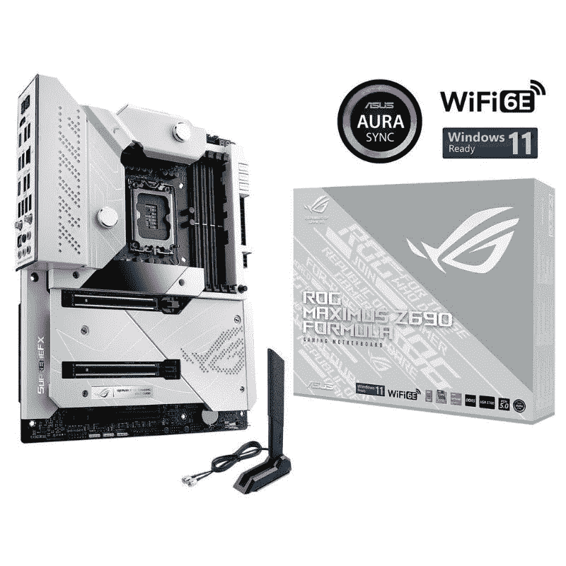

# 2023 年最佳超频主板

> 原文：<https://www.xda-developers.com/best-motherboards-overclocking/>

在选购电脑组件时，有无数种选择可以选择[最佳主板](http://www.xda-developers.com/best-motherboard/)，这取决于你选择的是 AMD 还是 Intel 处理器。在一块主板上花费 1000 美元或 100 美元是可能的，但重要的是要让你的钱在你实际使用的特性和功能上实现最大价值。

为了超频您的 CPU，同样重要的是要确保主板有强大的功率传输设置和稳定的 BIOS，以推动价值超过工厂设置的限制。专为 CPU 超频而设计的主板通常具有一些功能，例如能够散发更多热量的更先进的散热器，以及对开环水冷的直接支持。

我们将在这里收集一些最好的超频主板，考虑 AMD 和英特尔处理器。

## 最佳英特尔主板:EVGA Z790 深 K|NGP|N

如果只有一个人和一个品牌是我们推荐购买电脑组件的，那就是文斯“K|NGP|N”路西多和埃夫加。K|NGP|N 创造了一些系统超频的世界纪录，通常位于前 5 名，因此需要硬件来帮助在高负载下保持稳定性。这就是令人印象深刻的 EVGA Z790 深色 K|NGP|N 发挥作用的地方。这是一个电子 ATX 板，所以你将需要相应地规划时，选择一个 PC 的情况。

作为配有 LGA 1700 插槽的 Z790 主板，它支持第 12 代和第 13 代英特尔处理器。它与其他 Z790 主板的不同之处在于，该主板专为发烧友使用和超频而设计。以 LGA 1700 插座为例，它已经旋转了 90 度，以便于连接液氮(LN2)冷却硬件。然后是非常强大的 21 相电力传输，带有实际工作的散热器和两个风扇，以保持 VRM 温度在检查中。

最后，我们得到了由 10 层组成的印刷电路板(PCB)。这为 EVGA 提供了足够的空间来在组件之间路由信号，并强制通过更多的功率，以允许您将处理器推向极限。为了帮助保持一切正常，一个相当大的金属背板连接到 EVGA Z790 DARK K|NGP|N 的后部。这种主板的一个缺点是由于插槽旋转，需要移除两个 DIMM 插槽。即使只剩下两个 DIMM 插槽，也仍然可以安装高达 64GB 的 DDR5-8000 RAM。

为了帮助超频，EVGA 在主板上添加了电源和重置按钮，以及 LED 调试器，以便快速排除故障和更改配置。还可以进行实时电压监控。几乎这个板上的所有东西都是为发烧友设计的。然而，由于三个 M.2 SSD 插槽，两个 PCIe 5.0 x16 插槽，八个 SATA 端口，双 2.5Gb 网络和像样的音频，它对其他一切并非完全无用。

##### EVGA Z790 深色 K|NGP|N

EVGA Z790 Dark K|NGP|N 是英特尔处理器主板的庞然大物。利用 Z790 芯片组，您可以在该主板上安装第 12 代或第 13 代处理器，并大幅超频。

## 最佳水冷英特尔主板:华硕 ROG Maximus Z690 配方

ROG Maximus Z690 配方位于华硕产品堆栈的顶端，代表了该公司所能提供的最佳产品。毫无疑问，这是你现在能为第 12 代英特尔 CPU 买到的最好的华硕主板。它的价格昂贵，但它是一个配备齐全的主板，具有您期望从优质主板获得的所有功能。即使在重载下，它也能提供稳定可靠的性能。

ROG Maximus Z690 公式带有一个黑色的 PCB，大部分覆盖着散热器。主板还带有 VRM 模块的防水块。它被称为 CrossChill EK III 水块，是与 EK 合作设计的。它包括一个隐藏在模块内的镍水通道，用于在负载下冷却 MOSFETs。然而，water block 只覆盖 VRM，不覆盖 CPU。

ROG Maximus Z690 公式运动 105 安培的功率阶段，以提供 CPU 的权力。Maximus Z690 公式还支持 DDR5 内存模块，使其成为经得起未来考验的机器，可以从当前硬件中提取最大性能。华硕表示，该主板能够处理高达 DDR5-6400(OC)的内存速度，这是它所能达到的最好速度。如果您有一个好的冷却解决方案，您还可以超频内存模块。该主板还支持 PCIe 5.0，有两个 PCIe 5.0 x16 插槽，支持 x16 和 x8/x8 模式。此外，还有一个用于其他扩展卡的 PCIe 4.0 x16。

对于存储，华硕 ROG Maximus Z690 公式配备了多达五个带专用散热器的 M.2 插槽。不过，你必须使用 ROG Hyper M.2 卡才能全部使用。值得注意的是，您还可以添加多达六个 SATA 驱动器。作为优质主板，你还可以在背面获得大量端口，以及额外的接头来添加更多的外围设备。I/O 保护罩预装在盒子外面，它覆盖 12 个 USB 端口，包括两个 Thunderbolt 4 USB Type-C 端口。除了 10Gb 以太网端口之外，您还可以获得一个 HDMI 端口，用于在没有 GPU 的情况下启动。此外，还有一个 WiFi 模块和镀金音频端口。

 <picture></picture> 

ASUS ROG Maximus Z690 Formula

##### 华硕 ROG Maximus Z690 配方

华硕 ROG Maximus Z690 公式是最好的高端 Z690 主板，你可以从华硕购买。它足够强大，甚至可以处理最苛刻的 CPU。

## 最佳 AMD 主板:华硕 ROG 十字丝 X670E 至尊

如果你正在使用新的锐龙 7000 CPUs，那么你需要一个新的主板。多年来，AMD 第一次改变了它的平台，所以现在我们升级到 AM5 和一个用于最新芯片的全新插座。如果你也喜欢超频，那么 X670E 芯片组是最好的选择，华硕 ROG 十字准星至尊是最好的选择。它在任何高端游戏装备中都有很好的外观和性能，但它也是为了接受惩罚而设计的。

最重要的特性是 20+2 组合功率级，每级额定电流为 110A。VRM 架构利用成组的功率级来快速摆动电流，同时保持热性能。动态 OC 切换器和 core flex 等功能将有助于最大限度地发挥 CPU 的性能。前者允许您根据 CPU 电流或温度，将 AMD PBO 与您的手动超频结合使用。后者介绍了一种简单的方法来调整功率、温度和电流限制，以从 CPU 中获取您想要的东西。

还有一个可怕的大量散热器覆盖这个主板，这是预期的东西，你将推动其极限。然而，华硕增加了其标志性的天赋，积极的造型，RGB 甚至是 LED 矩阵，使这一款脱颖而出。I/O shield 是集成的，有比你知道该做什么更多的端口，以及 Wi-Fi 6E、10G 和英特尔 2.5G 网络。

虽然这里的重点可能是超频，但很难忽视这款主板对游戏 PC 甚至工作站的适应性。PCIe x16 插槽支持 PCIe 5.0，M.2 SSD 插槽也是如此，它支持高达 6400MT/s 的 DDR5 内存。作为 AMD 公司，没有 Thunderbolt，但背面有两个 USB 4.0 Type-C 端口，以及一个额外的 PCIe 卡，以增加更多的快速存储。连音频硬件都很优秀。很难找到这种主板没有的东西，但确实是有代价的。尽管如此，它仍然是 X670 主板早期超频最新一代锐龙 CPU 的选择。

##### 华硕 ROG 十字丝 X670E 至尊版

华硕的新锐龙 7000 CPUs 的最残忍的主板，建造是为了推动和完善开始超频。

## 最佳最新一代英特尔主板:MSI MEG Z590 Godlike

MSI MEG Z590 Godlike 是市场上可以买到的最优质的 Z590 芯片组主板之一。这是一款性能卓越的主板，拥有高质量主板所具备的所有功能。主板几乎完全被散热器覆盖。与我们之前看到的 Carbon EK X 不同，这款产品没有防水块，但它仍然能够处理高性能 CPU 的苛刻需求。VRM 散热器由一个冷却风扇、一堆散热片和一个将热量从模块中带走的热管组成。散热器盖有上帝般的品牌以及 MSI 龙标志。

底部的芯片组散热器进一步延伸，也覆盖了 M.2 插槽。板的整个底部暴露出来，只有 PCIe 槽是暴露的部分。RGB 灯的名称也很少，这使得这种主板很容易融入大多数版本。微星梅格神一样的主板还配备了背板给它额外的支持。这种特殊的主板带有英特尔 Z590 芯片组和 LGA 1200 CPU 插槽。这意味着你不能使用这种主板来建立一个新的奥尔德湖处理器的个人电脑。MSI MEG Z590 Godlike 仅兼容第 10 代和第 11 代英特尔酷睿处理器。

微星 MEG Z590 主板也支持超频，使其成为该系列的一大亮点。它可能没有高度复杂的 VRM 或带水块的 CPU 冷却，但现有的冷却解决方案已被证明足够强大，可以让您将 CPU 推到极限。微星 MEG Z590 Godlike 在 CPU 插槽旁边配有 4 个 DIMM 插槽，最高支持 128GB DDR4 内存。这里缺少 DDR5 内存支持，因为旧的芯片组不支持新的内存标准。根据 MSI 的说法，这种特殊的主板可以支持高达 5600MHz 的内存速度。

微星梅格 Z590 Godlike 还配有三个 PCIe 4.0 x16 加固插槽。值得注意的是，PCIe 5.0 支持也在这一点上消失了，但旧的 CPU 不支持它，所以它不是一个交易破坏者。对于存储，您可以在板上添加多达四个 M.2 模块。它们藏在芯片组散热器下，所以你必须在安装模块前移除它。您还可以在 RAID 0、1、5 或 10 中向主板添加更多 SATA 驱动器。

微星梅格 Z590 是一个了不起的主板整体。它仍然代表了微星在 Z590 芯片组领域的最佳表现。MSI sill 还没有为第 12 代英特尔 CPU 推出带有 Z690 芯片组的 MEG Godlike 主板，但我们希望他们正在努力。Godlike 恰好是市场上最昂贵的主板之一，所以一定要为高端游戏或内容创建装备配备高性能 CPU。

##### MSI MEG Z590 神似

MSI MEG Z590 Godlike 是市场上最优质的主板之一。还支持超频，性能可靠。

## 最佳上一代英特尔发烧友主板:ASRock Z590 OC 配方

ASRock 制造了许多高质量的主板，但 Z590 OC 配方是其最好的超频主板。毫无疑问，这是你能买到的超频第 10 代和第 11 代英特尔 CPU 的最佳主板之一。它附带了许多超频友好的功能，使您更容易推动您的 CPU 的极限。ASRock Z590 OC 公式也有一个引人注目的设计。这块主板看起来和其他华硕主板差别很大，绝对脱颖而出。OC Formula 板配有黑色 PCB 和黄色散热器。VRM 散热器盖上有 Nick Shih 的签名，他是 ASRock 合作生产该主板的知名超频者。

Z590 OC 配方采用 16 相设计，90A SPS。这是即使在重负载下也能可靠供电的原因。VRM 散热器设计复杂，配有散热片堆和热管。主板上的芯片组散热器也进一步延伸，以覆盖 M.2 固态硬盘。OC Formula 主板还附带了一些方便的功能，专门为超频而设计，例如专用的 OC 按钮。板上还有一个 OLED 面板，用于显示各种指标，如温度、电压等。

内存方面，最多可以安装 64GB DDR4-6000。如果你有足够的冷却解决方案，你也可以超频内存。华硕 Z590 OC 配方也支持 PCIe 4.0。主板配有三个 x16 插槽和两个 x1 插槽。所有三个 x16 插槽都经过加固，因此都适用于显卡。

谈到存储，您可以在板上安装多达三个 M.2 模块。这些插槽在主板上有自己的散热器，因此您不需要单独的散热器。IO shield 是预装的，它覆盖了各种端口，包括八个 USB 端口、两个以太网端口和一整套音频端口。ASRock 还为键盘和鼠标添加了传统的 PS/2 端口。

##### ASRock Z590 OC 配方

ASRock Z590 OC Formula 是一款高性能主板，旨在支持极端超频条件下的苛刻需求。

## 最佳末代 AMD 主板:华硕 ROG 十字准线八黑暗英雄

华硕 ROG 十字准线八黑暗英雄是类似的 ROG 十字准线八英雄，早些时候出来。新的黑暗英雄主板采用了令人惊叹的全黑设计。华硕还在主板上添加了一些 RGB 灯，为建筑增添了一点 RGB 色彩。除了新的全黑设计，华硕 ROG 十字准线八黑暗英雄还配备了升级的功率传输和被动冷却芯片组。黑暗英雄主板配备了强大的电力输送系统，即使在重负载下也能提供稳定的电力。VRM 散热器确保一切始终保持凉爽。

芯片组散热器进一步延伸到覆盖 M.2 插槽，使 PCIe 插槽成为主板底部唯一暴露的部分。黑暗英雄主板携带 X570 芯片组和 AM4 CPU 插槽。这意味着这是一款 AMD 主板，支持 3000 和 5000 系列芯片组，用于超频那些未锁定的锐龙 CPU。对于锐龙 7000，您必须升级到 AM5 和 X670 或 B650。

CPU 插槽右侧还有四个 DIMM 插槽，最大支持 128GB DDR4 内存。说到扩展槽，黑暗英雄主板总共提供了四个 PCIe 插槽。您将获得一个 PCIe 4.0 x16 插槽和两个 PCIe 3.0 x16 插槽。值得注意的是，你还可以在底部找到一个 PCIe 3.0 x1 插槽。您可以安装多达三个 M.2 模块，这些模块隐藏在芯片组散热器下，并有自己的散热器。此外，您还可以安装 SATA 驱动器，为您的构建添加更多存储空间。

华硕 ROG 十字准线八黑暗英雄主板带有一个预装的 IO 屏蔽，覆盖多达 12 个 USB 端口，包括一个 USB Type-C 端口。你没有 HDMI 或 DisplayPort，但华硕增加了两个以太网端口和一整套音频端口。主板也有大量的 USB 接口，风扇，水泵，RGB 灯，等等。华硕的 BIOS 对初学者和经验丰富的超频者来说也很容易使用。

##### 华硕 ROG 十字准线八黑暗英雄

华硕 ROG 十字准线八黑暗英雄是你现在可以买到的最好的 X570 主板之一。它还支持高端构建的超频。

## 2022 年最佳超频主板:最终想法

现在市面上很多各厂商的高性能主板都支持超频。但是，如果你想要超频的绝对最好的主板，你就不能打败 EVGA 金并。如果你正在建造一台带有定制冷却回路的完全水冷 PC，那么我们认为你应该考虑购买微星 MPG Z690 Carbon EK X 主板。它自带水块，可实现高效冷却和更好的超频性能。

那些倾向于基于 AMD 的构建可以看看华硕 ROG 十字准线 X670E 极端或华硕 ROG 十字准线八黑暗英雄主板。这是 AMD CPUs 的最佳游戏主板的升级版本。我们还鼓励您加入我们的 [XDA 计算论坛](https://forum.xda-developers.com/c/xda-computing.12289/)，从我们社区的专家那里获得更多产品推荐。