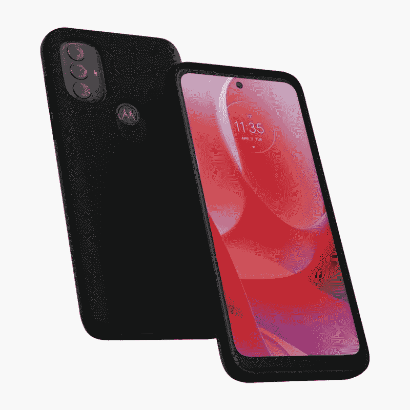

# 2023 年 Moto G Power (2022)的最佳案例

> 原文：<https://www.xda-developers.com/best-motorola-moto-g-power-2022-cases/>

# 2023 年 Moto G Power (2022)的最佳案例

有新的 Moto G Power 智能手机吗？买一个这样的盒子来保护它免受意外跌落和磨损。

Moto G Power (2022) 仍然是你在 2023 年可以买到的最好的廉价手机之一。它配备了一套体面的规格和一个相当大的 5000 毫安时电池，以提供一个不到 200 美元的可靠封装。它在大多数时候也很容易购买，这使得它成为那些在预算紧张的情况下购买可靠手机的人的一个好选择。

Moto G Power (2022)的外形像一辆坦克，但哑光质感的塑料背面并不完全符合质量要求。谢天谢地，你可以用一个保护套来保护手机。谢天谢地，市场上有很多选择。以下是你现在能买到的最好的 Moto G Power (2022)的外壳。

*   ##### Spigen Ultra Hybrid for Moto G Power

    编辑推荐

    如果你想要一个简单的半透明外壳用于 Moto G Power (2022)，sp igen 的 Ultra Hybrid 保护壳是一个可靠的选择。这种特殊的情况下配备了 TPU 保险杠和聚碳酸酯背部，给它提供了良好的保护，同时让你炫耀你的手机颜色。

    T13
*   <picture></picture>

    摩托罗拉要领保护套

    ##### 摩托罗拉要领 G 动力(2022)套

    最佳值

    摩托罗拉要领套是 Moto G 动力(2022)的默认选项之一。我们向那些寻找由 TPU 材料制成的轻薄外壳的人推荐这款产品。它也有六种不同的颜色可供选择，所以一定要选择你喜欢的那一种。

*   <picture></picture>

    OtterBox 通勤系列

    ##### OtterBox 通勤系列

    Premium Pick

    OtterBox 通勤系列 LITE 外壳是你能在市场上找到的最坚固耐用的 Moto G Power 外壳之一这是一个由两部分组成的外壳，内层柔软，外层坚硬，可以保护手机免受意外跌落和碰撞。不过它没有内置屏幕保护。

*   <picture></picture>

    sup case 独角甲虫 Pro

    ##### sup case UB Pro Moto G Power (2022)case

    赞助

    sup case 独角甲虫 Pro 是一款为 Moto G Power(2022)提供全方位保护的重型坚固外壳。UB Pro 外壳配有精确的端口开孔、可旋转的皮带夹、背面的支架，可实现免提观看体验，等等。

*   ##### Suanpot 钱夹套

    如果你想为你的 Moto G Power 智能手机买一个钱夹套，那么看看这款 Suanpot 皮革钱夹套吧。它将坚固的塑料框架与柔软的 TPU 皮革相结合，带来舒适和优质的贴合感。它可以让你存储三张卡和一些现金，它还可以为你的手机提供完整的保护。

*   ##### I-Blason Cosmo for Moto G Power

    I-Blason Cosmo 是我们最喜欢的 Moto G Power 的时尚外壳。这款保护套有三种不同的表面处理，均配有匹配的框架和内置屏幕保护器，提供全面保护。

*   ##### Caseology Parallax for Moto G Power

    Caseology Parallax 也是一款流行的时尚保护套，有许多不同的颜色可供选择。它确实很好地保护了你的手机，同时提供了独特的设计和牢固的握持。它非常适合那些想要时尚的东西，但不想添加屏幕保护装置的人。

*   <picture></picture>

    保护起来极简的钱夹套

    ##### 保护起来极简的钱夹套

    这款独特的钱夹套采用极简设计，为您的手机提供了相当大的保护它的背面也有插槽，最多可以容纳三张卡。还有一个戒指支架，可以让你把手机放在平面上。

*   ##### Fucozan 支架盒

    这款简单的 Moto G Power 支架盒非常适合那些想要将手机放在桌子上获得免提观看体验的人。后面的磁环也可以用来拿手机。

* * *

好了，这就把我们带到了这个特别系列的结尾。虽然这个系列中提到的所有选项都值得考虑，但我们要说的是，Spigen Ultra Hybrid clear 外壳和 Moto Essential 外壳是我们最喜欢的。如果你想要 360 度保护你的手机，以及内置的屏幕保护器，SUPCAE UB Pro 外壳也值得考虑。我们还添加了许多其他案例，所以请务必选择您喜欢的案例。

Moto G Power (2022)现在已经可以在线购买了。撰写本文时，这款 64GB 的手机售价为 150 美元。对于那些希望购买可靠的中端手机和持久电池的人来说，这是一个很好的交易。你可以使用下面的链接在网上找到最好的价格。或者，如果你有兴趣查看 2023 年值得考虑的其他 Moto 手机，你也可以查看我们收集的[最佳摩托罗拉手机](https://www.xda-developers.com/best-motorola-phones/)。

 <picture></picture> 

Moto G Power (2022)

##### 摩托罗拉摩托 G 动力(2022)

Moto G Power (2022)配备了 6.5 英寸 90Hz 720p 屏幕，联发科 Helio G35，5,000 mAh 大容量电池等等。