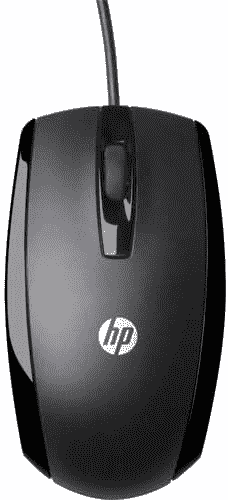
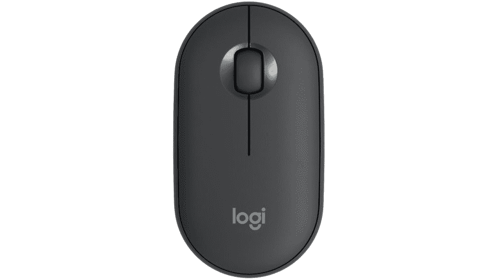
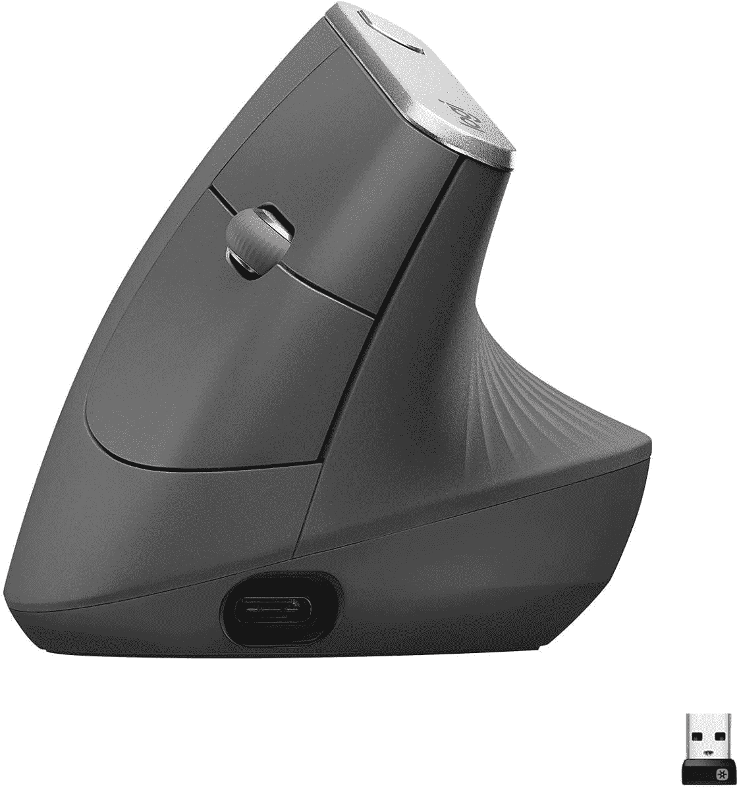

# 戴尔 XPS 13 Plus 的最佳鼠标:罗技、微软等

> 原文：<https://www.xda-developers.com/best-mouse-dell-xps-13-plus/>

# 戴尔 XPS 13 Plus 的最佳鼠标:罗技、微软等

对戴尔 XPS 13 Plus 用于鼠标的隐形触摸板不满意？如果你想要更经典的东西，这里有一些不错的选择。

[戴尔 XPS 13 Plus](https://www.xda-developers.com/dell-xps-13-plus/) 是我们很久以来见过的最具未来感的笔记本电脑之一。它采用了干净的白色或黑色设计，用数字按钮取代了功能键，并且没有触摸板——至少你看不到触摸板。它与键盘面板完美融合，看起来非常酷。但是对于我们中的一些人来说，它肯定不太理想，所以也许你需要一个合适的鼠标来搭配你的戴尔 XPS 13 Plus。

让 XPS 13 Plus 如此独特的简洁设计的缺点是，您可能需要一段时间才能弄清楚触摸板的边缘在哪里。不仅如此，你也不能点击它，所以如果你习惯于更传统的鼠标和触摸板，它就不那么直观了。如果你想找回那种体验，你可以为你的戴尔 XPS 13 Plus 购买一个外部鼠标，但你必须记住，笔记本电脑没有 USB Type-A 端口。如果您想要一个有线鼠标或使用无线转换器，您将需要某种适配器或用于戴尔 XPS 13 Plus 的[坞站。事不宜迟，让我们进入你能得到的最好的老鼠。](https://www.xda-developers.com/best-docks-dell-xps/)

*   ##### 戴尔 Premier 可充电无线鼠标

    谁比戴尔自己更适合为 XPS 13 Plus 制作鼠标？这款无线鼠标通过蓝牙或使用加密狗工作，它与 XPS 13 Plus 完美匹配，尤其是白色型号。

*   <picture></picture>

    罗技 MX Master 3S

    ##### 罗技 MX Master 3

    MS Master 3 是你能在任何地方找到的最好的鼠标之一。它具有舒适的设计，金属 MagShift 滚轮(外加用于水平滚动的第二个滚轮)，可编程按钮，以及与蓝牙或加密狗的无线连接。

*   <picture></picture>

    微软 Arc 鼠标

    ##### 微软 Arc 鼠标

    如果你想要一款和笔记本电脑一样便携的鼠标，这款就是你要的。你可以把它弄平，这样它就可以放在任何地方，也可以把它弄弯，这样用起来更舒服。它没有典型的滚轮(它使用触摸代替)，但它给你可点击的按钮。它通过蓝牙连接。

*   <picture></picture>

    HP X500

    ##### HP X500

    如果你想要一个便宜的有线选项，这可能对你有用，但记住你需要一个 USB-C 适配器来使用它，因为它使用 A 型电缆。这是一个基本的鼠标，双手灵巧的设计，应该感到舒适。

*   <picture></picture>

    雷蛇蛇怪 V3

    ##### 雷蛇蛇怪 V3

    XPS 13 Plus 并不是一款游戏笔记本电脑，但如果这不能阻止你，这是一款非常棒的有线鼠标。它有一个 26K DPI 的额外精度，10 个可编程按钮和一个超级滚动轮。另外，如果你喜欢的话，它还有 RGB 效果。

*   <picture></picture>

    罗技 Pebble M350

    ##### 罗技 Pebble M350

    这款罗技鼠标小巧又有点萌。它通过蓝牙连接，具有静音按钮和滚轮的基本功能，因此您可以在公共场合使用它而不用担心。它支持蓝牙和自定义无线连接。

*   <picture></picture>

    戴尔顶级无线键盘和鼠标 km 7321 w

    ##### 戴尔 KM7120W 组合

    如果您想要为您的办公室创建一个完整的桌面设置，这款戴尔组合是理想之选。如果你不喜欢 XPS 13 Plus 上的无空间按键，全尺寸键盘也很棒，这可能容易出现更多的打字错误。

*   <picture></picture>

    雷蛇蛇怪 X 超高速

    ##### 雷蛇蛇怪 X 超高速

    想不用电线游戏吗？Razer Basilisk X HyperSpeed 是一款无线游戏鼠标，如果您需要更低的延迟，可以通过蓝牙或定制的 HyperSpeed 加密狗进行连接。它有一个舒适的右手设计，没有 RGB。

*   <picture></picture>

    罗技 MX 垂直

    ##### 罗技 MX 垂直

    很多人不知道这一点，但垂直鼠标是你能得到的最好的姿势。这个罗技选项为您提供了长期舒适的理想设计，它具有蓝牙和无线加密狗连接选项的全部功能。

如果您想要为 Dell XPS 13 Plus 配备鼠标，这些是最佳选择。我们试图将重点放在支持蓝牙连接的鼠标上，因为您可能没有可以用来将笔记本电脑上的 USB-C 端口转换为 USB Type-A 的适配器。然而，大多数无线鼠标都为您提供了两种选择，因此您可以使用更可靠的转换器连接。如果我为自己选择一个，我会在微软 Arc 鼠标的便携性和罗技 MX Master 3 的多功能性和舒适的设计之间徘徊。然而，这里为各种用户提供了很好的选择。

虽然我们专注于戴尔 XPS 13 Plus，但这些都是适用于任何笔记本电脑的优秀鼠标-如果您对新笔记本电脑感兴趣，我们还收集了您可以购买的[最佳笔记本电脑](https://www.xda-developers.com/best-laptops/)。戴尔 XPS 13 Plus 也是该名单的有力竞争者，因为它已经看起来像是一段时间以来[最好的戴尔笔记本电脑](https://www.xda-developers.com/best-dell-laptops/)之一。下面可以买。

 <picture></picture> 

Dell XPS 13 Plus

##### 戴尔 XPS 13 Plus

Dell XPS 13 Plus 是一款功能强大的现代笔记本电脑，配有 28W 英特尔处理器和隐形触摸板。