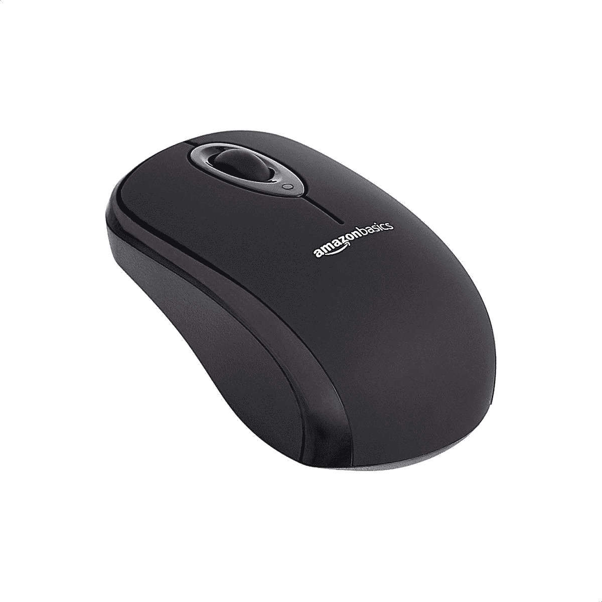
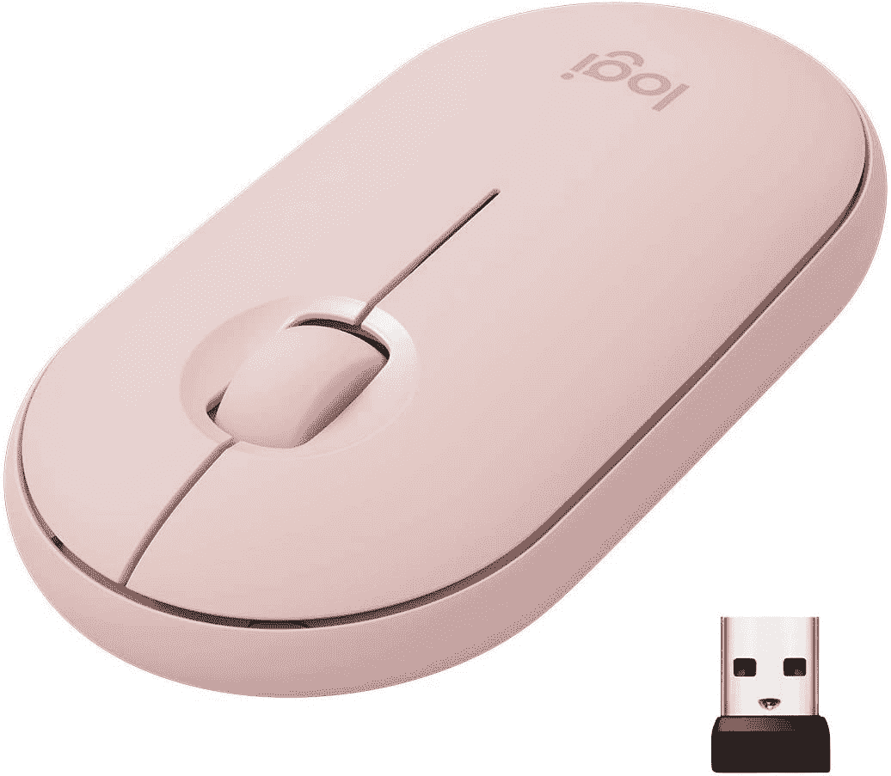
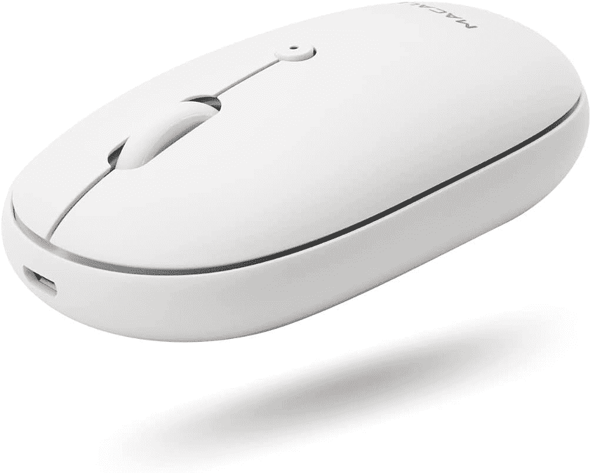
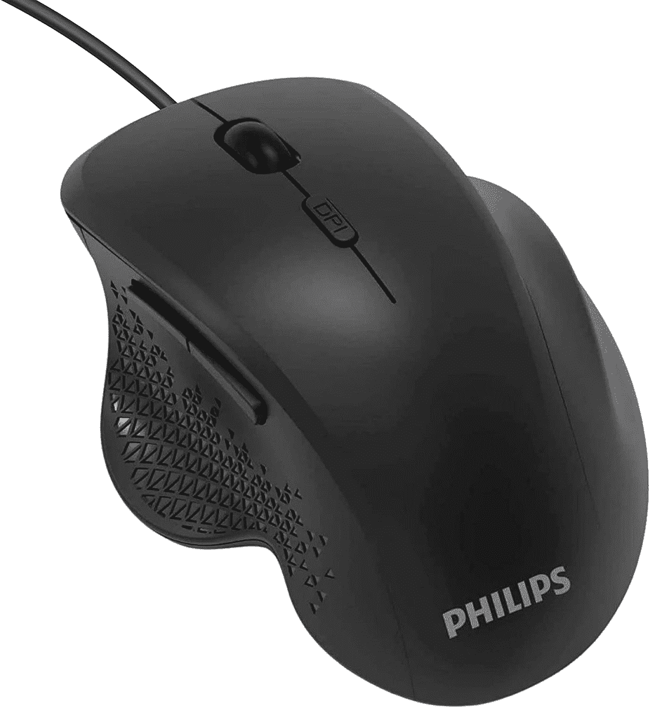

# Mac Studio 的最佳鼠标选项

> 原文：<https://www.xda-developers.com/best-mouse-mac-studio/>

# Mac Studio 的最佳鼠标选项

苹果公司终于公布了 Mac 工作室。这些是为您的全新电脑购买的最佳鼠标选项。

苹果一直在逐步从英特尔过渡到自己的芯片阵容。当你[购买一台 Mac](https://www.xda-developers.com/best-macs/) 时，你很可能会得到一台由 M 芯片之一驱动的电脑——因为 Mac 家族的大多数产品都已经转型了。随着这一系列芯片的接管，开发人员一直在为苹果芯片优化他们的[应用程序，以提供更流畅的体验。目前最强大的苹果电脑之一是](https://www.xda-developers.com/best-apps-apple-silicon/) [Mac Studio](https://www.xda-developers.com/apple-mac-studio-m1-ultra-review/) 。它将 M1 超级 SoC 打包，开箱即可运行 [macOS Monterey](https://www.xda-developers.com/macos-monterey) 。值得注意的是，它没有配备鼠标、键盘或显示器。以下是 Mac Studio 可以买到的最好的鼠标选项。

*   <picture></picture>

    亚马逊基础款鼠标

    ##### 亚马逊基础款鼠标

    如果你预算不多，可以买亚马逊的这款鼠标它是无线的，包括两节不可充电的 AA 电池，并有五种颜色可供选择。

*   <picture></picture>

    罗技 Pebble M350

    ##### 罗技 Pebble M350

    这款超薄无线鼠标由单节 AA 电池供电，在一般使用情况下应该可以使用一年以上。它有六种颜色可供选择。

*   <picture></picture>

    罗技 MX Master 3S

    ##### 罗技 MX Master 3

    这款鼠标最多可以同时连接三台电脑。它支持蓝牙和(无线)USB 类连接。

*   <picture></picture>

    Macally BTTOPBAT 鼠标

    ##### Macally 蓝牙鼠标

    这款可充电无线鼠标点击按键时不会产生任何噪音。它通过蓝牙连接到您的 Mac Studio。

*   <picture></picture>

    飞利浦有线鼠标

    ##### 飞利浦有线鼠标

    这款有线鼠标通过 USB Type-A 端口连接到你的 Mac 上它有六个可编程按钮和四个可调的 DPI 级别。

* * *

如果我个人必须为我的 Mac 工作室选择这些鼠标中的一个，我完全会选择[苹果神奇鼠标](https://www.amazon.com/Apple-Magic-Mouse-Wireless-Rechargable/dp/B09BRD98T4?tag=xda-7ubbe6k-20&ascsubtag=UUxdaUeUpU40490&asc_refurl=https%3A%2F%2Fwww.xda-developers.com%2Fbest-mouse-mac-studio%2F&asc_campaign=Affiliate)。它看起来很现代，支持触摸控制，并与 macOS 很好地集成。不过，鼠标的最大好处在于它们相对便宜。因此，你可以购买多台电脑，并根据你正在执行的任务和每种特定情况下最适合的方式来使用它们。例如，有些人在网上工作时不愿意使用游戏鼠标。连接和断开它们也几乎不需要时间或精力。

Mac Studio 在美国的起价为 1999 美元，由 M1 Max 或 M1 Ultra 芯片驱动。这是第一款采用苹果后者芯片的台式电脑。与 iMac 不同，Mac Studio 没有内置显示器、鼠标或键盘。所以它不是一台一体机(AiO)电脑，你将需要单独购买自己的配件。考虑到其无与伦比的功能，Mac Studio 的目标是专业用户，而不是普通用户。

 <picture></picture> 

Apple Mac Studio

##### 苹果 Mac 工作室

Mac Studio 由苹果 M1 Max 或 M1 Ultra 芯片驱动。它只有银色可选，起价 1999 美元。

*你会为你的 Mac 工作室购买哪一款鼠标？请在下面的评论区告诉我们。*