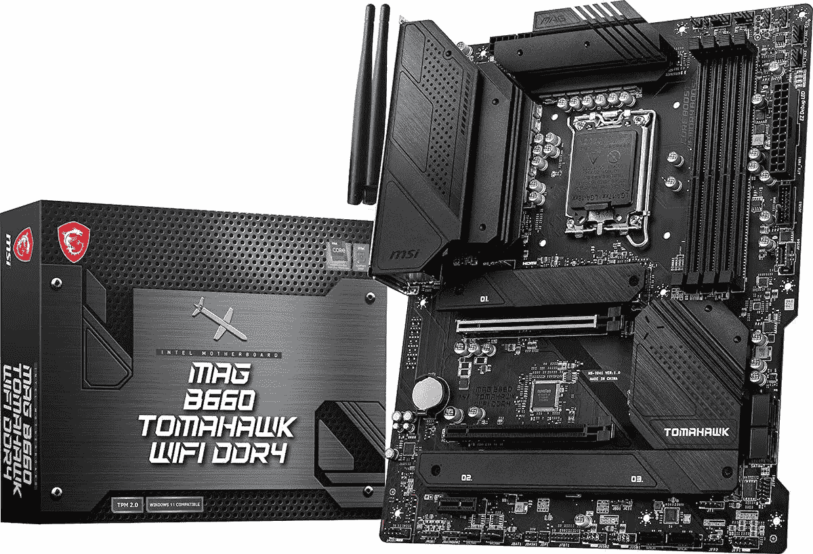
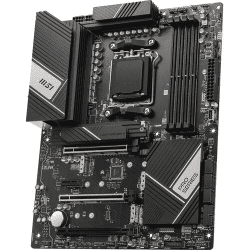

# 2023 年最佳 MSI 主板

> 原文：<https://www.xda-developers.com/best-msi-motherboards/>

微星是一个在 PC 硬件领域无需介绍的品牌。从[最佳游戏笔记本电脑](https://www.xda-developers.com/best-gaming-laptops/)到[最佳显示器](https://www.xda-developers.com/best-monitors/)，几乎没有一个类别是 MSI 没有涉足的。说到主板，微星已经在这个行业多年了，是与华硕、华硕和技嘉并列的四大主板制造商之一。自然，微星有一吨的主板可供选择。

我们正在为英特尔和 AMD 的 CPU 分享最好的 MSI 主板，所以你会在这里找到很多选择。对于 [AMD 锐龙 7000](https://www.xda-developers.com/amd-ryzen-7000) ，你需要一个 AMD 600 系列芯片组，如果你正在寻找一个新的[第 13 代英特尔](https://www.xda-developers.com/intel-13th-gen-raptor-lake/)构建，那么你可以选择一个英特尔 600 系列主板(可能需要 BIOS 更新)或一个新的 700 系列主板(与旧的 600 系列型号没有太大区别)。

## 最佳 Z790 主板:微星 MEG Z790 Ace

不是每个新一代主板都有全新的功能和性能，尤其是在插座没有被更换的情况下。Z790 芯片组就是这种情况，除了多几个 PCIe 4.0 存储通道之外，它没有提供任何新的东西。如果你真的想买 Z790 主板，不妨买微星的 MEG Z790 Ace，该公司最高端的主板之一。

Z790 Ace 是毫不掩饰的奢华。它主要是黑色，带有金色的点缀，还有一些几何设计，遍布金属拉丝散热器和 I/O 外壳；甚至 PCB 看起来真的很好，质量很高。尽管如此，Z790 Ace 通过采用极简主义设计，设法让自己看起来不那么俗气。

这款主板的功能远远超过了它的外观。凭借巨大的 24+1+2 级 VRM 和对 DDR5-7800 的支持，该主板可以为使用英特尔酷睿 i9-13900K 的超高速电脑提供基础。它还配备了五个 M.2 插槽(其中一个支持 PCIe 5.0，其余为 4.0)，支持未来的 PCIe 5.0 GPU，两个 2.5 千兆位英特尔以太网端口和两个 Thunderbolt 4 端口。还有八个 USB 3.2 端口，与其他主板相比略少，但双以太网和双 Thunderbolt 端口占用了大量空间。在单块主板上几乎不可能再要求什么了，Z790 Ace 就是这么高端。

当然，微星的 MEG Z790 Ace 价格不菲:700 美元。这使得这款主板成为你能买到的最贵的主板之一，但你肯定能从中获得很多功能。价格在 400 美元到 500 美元之间的更便宜的主板不会配备这种 VRM、五个 M.2 插槽或双以太网。很多高端的英特尔主板甚至根本没有迅雷 4。

##### 微星 MEG Z790 Ace

MSI MEG Z790 Ace 是用于第 12 代 Alder Lake 和第 13 代 Raptor Lake CPUs 的高端 LGA 1700 主板。它有一个 24+1+2 级 VRM，五个固态硬盘 M.2 插槽，两个 Thunderbolt 4 端口，两个以太网端口，并支持 PCIe 5.0 存储和图形。

## 最佳 Z690 主板:微星 MPG Z690 碳

微星 MPG Z690 碳是你能买到的最好的 Z690 板之一。它的黑色 PCB 大多覆盖着散热器和护罩，以隐藏所有组件。VRM 散热器盖标有 MSI Dragon 徽标，该徽标通过 RGB LEDs 灯亮起。主板底部也有碳标记。但除了这些明显的品牌，微星已经设法保持主板相当小。VRM 散热器上的后面板盖也具有碳纤维纹理。

微星 MPG Z690 碳纤维主板具有强大的电力传输系统，直接 18+1+1 相电源。您可以使用双 8 针 EPS 连接器来提供 CPU 能力。整个系统相当可靠，热输出通过复杂的散热器保持良好。厚镀 MOS 散热器有一个热管来传递热量。它也有 MOSFET 热垫，以建立与散热器和模块本身的适当接触。你还会看到 VRM 散热器向底部延伸，覆盖芯片组和 M.2 模块。

MSI MPG Z690 Carbon 有四个 DIMM 插槽，支持高达 128GB 的 DDR5 内存。该主板还配有三个全尺寸 x16 PCIe 插槽。它支持 PCIe 5.0。对于存储，您可以获得多达 5 个 M.2 插槽和 6 个 SATA 连接器，支持 RAID 0、1、5 和 10。背面的 IO 护板预装在盒子外面，覆盖各种端口，包括 10 个 USB 端口、2.5Gb LAN 端口、音频插孔堆栈等。

##### 微星 MPG Z690 碳 WiFi

微星 MPG Z690 Carbon 是英特尔第 12 代和第 13 代 CPU 的高端主板。它有 18+1+1 电源级，5 个 NVMe 固态硬盘的 M.2 插槽，并支持 PCIe 5.0 图形。

## 最佳 B660 主板:微星 MAG B660 战斧

 <picture></picture> 

MSI MAG B660 Tomahawk WiFi DDR4

如果您在市场上为您的新预算英特尔构建购买一个可靠的 B660 主板，那么我们建议检查微星 MAG B660 战斧主板。尽管是一个相对实惠的 LGA1700 主板，MAG Tomahawk 主板提供了许多出色的功能。

微星 MAG B660 战斧是一个外观相当简单的主板，黑色 PCB。PCB 的很大一部分覆盖着散热片，这对散热来说是件好事。它也很微妙，任何地方都找不到 RGB。MSI MAG B660 Tomahawk 具有强大的电力传输系统，足以处理一些高性能的第 12 代 CPU。主板还装有一个坚固的 VRM 散热器来控制温度。

微星 MAG Tomahawk B660 主板配有一个 LGA1700 CPU 插槽和四个 DIMM 插槽。最好的事情之一是它在 DDR4 和较新的 DDR5 中都可用。也就是说，你必须根据你计划使用的模块来选择一个，因为你不能在一个特定的板上同时使用两个模块。该主板的 DDR5 版本支持高达 6200MHz (OC+)的内存速度，而 DDR4 版本支持 4800MHz+的内存速度。在任一版本上都可以安装高达 128GB 的内存。

它还配有两个全尺寸 PCIe x16 插槽，最高支持 PCIe 4.0。GPU 的主要 PCIe 插槽也得到加强，以确保它可以轻松容纳更大更重的 GPU。至于存储，您可以获得三个 M.2 插槽和六个 SATA 连接器，支持 RAID 0、1、5 和 10。

 <picture></picture> 

MSI MAG B660 Tomahawk WiFi DDR4

##### 微星 MAG B660 战斧

微星 MAG B660 战斧 WiFi 是那些希望使用 Alder Lake 芯片构建中档 PC 的人的可靠选择。

## 最佳 X670 主板:微星专业 X670-P Wi-Fi

 <picture></picture> 

MSI Pro X670-P Wi-Fi

如果你正在建立一个 AMD 锐龙 7000 驱动的个人电脑，那么你将需要一个 AM5 主板。这些最初很难得到，但幸运的是，微星在 Pro X670-P Wi-Fi 的情况下。这不是为严重的超频设计的，相反，它只是一个很好的多面手，以有吸引力的价格包装功能和性能。

组成这块主板的是八层全黑 PCB，14+2+1 电源布局。有一些相当大，但不是压倒性的散热器涵盖了基本要素，其中包括 VRM，MOSFETS 和 X670 芯片组。在 PCIe 5.0 SSD 插槽上还有一个额外的散热器，该板为空气冷却、AIO 或定制环路而设置。其他主要产品包括四个 DDR5 DIMM 插槽，可容纳高达 128GB 的内存，三个 PCIe 4.0 x16 插槽，其中两个经过加固，以及一个 PCIe 3.0 x1 插槽，用于较小的扩展卡。

您也不会缺少连接选项。内部端口和后盖 USB 3.2 第 1 代、第 2 代和第 2 代 2x2 Type-A 和 Type-C 端口。存储由 6 个 SATA 连接和 4 个 M.2 插槽提供，顾名思义，它具有无线网络。具体来说，Wi-Fi 6E 加入了蓝牙 5.2 和 2.5Gb 以太网。即使是音频硬件也非常坚固，这款主板内置了高清 ALC4080 音频处理器。

它不是最闪亮或最具特色的，但它是一个伟大的主板，任何人谁只是想把一个良好的质量和 AMD 的建设。

 <picture></picture> 

MSI Pro X670-P Wi-Fi

##### 微星专业版 X670-P 无线网络

一个很好的多面手为任何人建立一个新的 AMD 公司锐龙 7000 电脑由微星。

## 最佳 B650 主板:微星专业 B650-P

微星的 Tomahawk 品牌是该公司最受欢迎的中端主板，虽然 B650 Tomahawk 看起来很棒，但对于真正的中端产品来说太贵了。然而，微星有另一种更便宜的 B650 主板，它检查了足够的功能，同时价格相对实惠:Pro B650-P。这款主板的价格为 200 美元，比微星的其他主板更实惠，拥有你想要的中端电脑的所有必需品，但可以走得更远。

从视觉上看，Pro B650-P 非常简单。它几乎是纯黑色的，带有少量的银色口音，在 PCB 的下半部分有一个贴花，所有的黑色散热器都是纯黑色，没有刷光。你可能会觉得 B650-P 很无聊，但如果你是那种不喜欢 RGB 或主板上任何超级有趣的东西的人，这使这款主板成为一个很好的选择。

Pro B650-P 的重要之处在于，它拥有一台出色的中端 PC 的所有要素，并有升级空间。它有两个 8 针 CPU 电源连接器和一个 12+2+1 相 VRM，这大约是锐龙 9 7950X 之类的东西所需的最低要求。此外，该板支持 DDR5-6400 和两个 PCIe 4.0 NVMe 固态硬盘，这是体面的，但不是特别惊人。后方 I/O 是相当不错的，虽然；你得到 2.5 千兆位 Realtek 以太网和 8 个 USB 3.2 端口。

我们会对 200 美元的主板有更高的期望，但 AM5 主板通常都很贵，Pro B650-P 检查了足够多的盒子，被认为是足够的。更高端的 B650 战斧有两个以上的功率级和一个额外的 M.2 插槽，用于 PCIe 4.0 固态硬盘，但这通常不值得多花 60 美元。也许如果你知道你想在未来升级到锐龙 9 CPU，战斧是有意义的，但除此之外，Pro B650-P 看起来更好。

##### 微星专业版 B650-P

MSI Pro B650-P 是一款中档 AM5 主板，配有 12+2+1 级 VRM、两个兼容 PCIe 4.0 的 M.2 插槽，并支持 DDR5-6400 内存。

## 第 10 代和第 11 代英特尔最佳 Z590 主板:MSI MPG Z590 游戏碳

英特尔的 500 系列现在正式成为最后一代，但这并不意味着你不能使用 Z590 主板构建一台好的 PC。它们比以往任何时候都更便宜，价格比当前一代的许多中端主板都低，如果绝对最佳的性能对您来说不重要，它们仍然可以提供您可能想要的许多功能。微星的 MPG Z590 游戏碳是一个伟大的选择，如果你追求大量的快速 I/O 和一般优质。

MPG Z590 Gaming Carbon 的目标是经典的游戏外观:大量的深色(尤其是黑色)，大量的 RGB 和大量的边缘。虽然这种审美并不适合每个人，但 Z590 游戏碳看起来仍然足够优质，即使你不是陈词滥调的游戏设计的忠实粉丝。最糟糕的情况是，你只需将 RGB 设置为你喜欢的颜色，或者用一个内置开关完全关闭它，以适应你的口味。

如今，你不会从第 10 代或第 11 代 CPU 中获得顶级性能，但 Z590 Gaming Carbon 将允许你超频 K 级 CPU，这要归功于它的大型 16+1+1 级 VRM。但这款主板的主要亮点是 I/O。在主板上，有三个 M.2 插槽(其中一个支持 PCIe 4.0)、Wi-Fi 6E 和蓝牙。后部 I/O 包括一个 2.5 千兆位英特尔以太网端口、四个 USB 2.0 端口、五个 USB 3.2 端口和一个 USB 3.2 2X2 端口，这意味着 20 Gbps 的带宽。

MPG Z590 Gaming Carbon 售价 180 美元，填补了需要大量低价 I/O 且不太关心性能或升级的建筑商的空白。对于游戏，第 10 代和第 11 代 CPU 已经足够好了，但对于受益于更高内核数的任务，这些 CPU 甚至会落后于上一代锐龙芯片。如果你关心多核性能，你可能想试试微星的 X570 或 B550 主板。

##### 微星 MPG Z590 游戏碳

MSI MPG Z590 Gaming Carbon 是一款高端 Z590 主板，适用于上一代第 10 代和第 11 代英特尔 CPU。它拥有大型 16+1+1 级 VRM，并支持 PCIe 4.0 固态硬盘。

## 最佳 X570 主板:微星 MAG X570S 战斧 Max

X570 芯片组现在很旧，随着 AM5 主板的出现而被取代，但这也意味着你可以以几十甚至几百美元的价格买到上一代的高端主板。如果你正在购买 X570 主板，这可能是因为你想要物有所值，并且不太在乎原始性能，而微星的 MAG X570S Tomahawk Max 由于其 230 美元左右的低价格，是这种 PC 版本的一个非常好的选择。

战斧 Max 在视觉上非常简单。PCB 主要是带有条纹图案的灰色和黑色，而散热器和 I/O 外壳主要是带有一些黑色和白色点缀的灰色。这里和那里有一些品牌，但不是超级侵入。芯片组散热器下有一些 RGB 照明，但这是战斧 Max 获得的最多颜色。如果你喜欢一个更简单，更黑暗的托盘，那么这个主板是给你的。

在功能层面上，Tomahawk Max 不是最好的 X570 板，但它足够令人印象深刻。它有一个 12+2 级 VRM，对于当前一代的 CPU 来说相对较小，但对于锐龙 9 5950X 来说完全足够了。它还支持 DDR4-5100，但速度较慢的内存套件也可以。你可能会对战斧 Max 的连接性感到失望。它只有两个 M.2 端口(不过谢天谢地，这两个端口都支持 PCIe 4.0)，六个 USB 3.2 端口和两个 USB 2.0 端口，总共八个端口。2.5 千兆以太网很好，但它来自 Realtek，而不是英特尔，后者通常是更好的品牌。

如果你不介意将自己锁定在一个未来永远不会获得新硬件的平台上，MAG X570S 战斧 Max 可能是一个不错的选择。它相对便宜，并具有你在中高端主板上期望的功能，但如果你担心连接性，你可能想花更多的钱购买微星的 MPG X570S Carbon Max，它有更多的 USB 端口和两个 M.2 插槽。

##### 微星 MAG X570S 战斧 Max

微星 MAG X570S 战斧 Max 是一款高端 X570 主板，适用于上一代锐龙 5000 CPUs。它有一个 12+2 阶段 VRM，并支持 PCIe 4.0 固态硬盘和 GPU。

## 最佳 B550 主板:微星 MAG B550 战斧

通常 AMD 需要一段时间来更换其中端芯片组，但是 B650 很快就出现了，并且在理论上已经取代了 B550。然而，在实践中，锐龙 7000 CPUs 仍然相当昂贵，B650 主板也是如此。如果你想最大限度地发挥 AM4 的性价比，甚至超过 MSI 的 X570 主板，MAG B550 战斧是你的最佳选择之一，因为它的价格标签为 170 美元。

像 X570 版本的战斧一样，B550 型号保持了相当简单的外观(尽管感觉比 X570 更前卫)，主要是黑色的 PCB、散热器和带有一些灰色点缀的 I/O 外壳。芯片组散热器下有一些 RGB，但除此之外，这是一个非常单调的主板。

B550 战斧实际上是微星更高端的 X570 战斧 Max 的精简版。它对 DDR4-5100 和两个 M.2 PCIe 插槽有相同的支持，但这两个插槽中只有一个是 PCIe 4.0。在 10+2+1 模式下，VRM 的级数也更少，这可能会使运行高端锐龙 9 5950X 有点挑战性。后面的 I/O 相当糟糕，令人困惑；出于某种原因，你有两个以太网端口，一个 2.5 千兆，另一个 1 千兆(这是一种无用的)，只有四个 USB 3.2 端口加上两个 USB 2.0 端口，总共六个。这不是很好，但它是可行的。

B550 战斧是那种你可以得到的主板，如果你真的只是想要尽可能高的性价比。你不能从 AM4 获得太多的马力，因为它不再有新的 CPU，它的连接性也很普通，但这对于游戏和基本的生产力来说是很好的。如果有几个 USB 接口就好了，不过也不错。

##### 微星 MAG B550 战斧

微星 MAG B550 战斧是一款中档 AM4 主板，适用于上一代锐龙 5000 CPUs。它有一个 10+2+1 级 VRM，支持 PCIe 4.0 图形，和两个 M.2 插槽。

## 最佳迷你 ITX 主板:微星 MPG B650I Edge

迷你 ITX 是一个非常小众的外形，但即使如此，像微星这样的公司每一代都会推出一两个特别设计的主板，而且微星的 MPG B650I Edge 主板也有很多值得喜欢的地方。240 美元，对于一个带有中端芯片组的主板来说有点贵，但迷你 ITX 总是更贵，所以实际上它并不贵，可以构成一个相对便宜的小型个人电脑的基础。

通常很难在迷你 ITX 板上做太多装饰，因为它太小了，但微星在 B650I Edge 上做得相当好。PCB 是纯黑色的，但与银色 I/O 外壳和 M.2 散热器形成了很好的对比，这两者都有一些不错的设计。对于一款中端主板来说，它看起来非常昂贵，尤其是这种小型主板。

迷你 ITX 主板总是缺乏技术，但不是在真正重要的方面。例如，B650I Edge 的 8+2+1 级 VRM 与全尺寸主板相比较小，但你将在这样的主板上运行 65 瓦的锐龙 7000 芯片，如[锐龙 9 7900](https://www.xda-developers.com/amd-ryzen-9-7900-review/) ，这对于较小的 VRM 来说非常好。它还支持 DDR5-6600，即使对于一个高端的 AM5 板来说，这也是非常好的。还有两个 M.2 插槽，这大约是正常迷你 ITX 主板的最大值，但都不支持 PCIe 5.0，这令人失望，但不是一件大事。后置 I/O 没问题；有六个 USB 3.2 端口和一个 2.5 千兆位 Realtek 以太网端口。

到目前为止，这是微星唯一的 AM5 迷你 ITX 主板，所以它是默认的赢家，但 MPG B650I Edge 本身仍然很好。与其他供应商的高端型号相比，它缺少一些功能，但如果您更注重性能和价值而不是连接性，Edge 是一个不错的选择。

##### 微星 MPG B650I Edge

微星 MPG B650I Edge 是微星的迷你 ITX 主板，具有相对较大的 8+2+1 级 VRM、2.5 千兆以太网和 PCIe 4.0 SSD 支持。

## 购买最佳 MSI 主板:最终想法

微星有许多不同价格范围的主板真的很好的选择。MEG Z790 Ace 对于任何构建高端第 13 代系统的人来说都是一个很好的选择，但如果你想要更实惠的东西，总有第 12 代和第 13 代 CPU 的 MPG Z690 Carbon 和锐龙 7000 芯片的 Pro X670-P。自 2017 年以来推出的几乎每款芯片组都有一个战斧板，对于那些希望获得最佳性价比的人来说，它们都是很好的选择。

如果您想探索其他选择，也可以查看我们收集的[最佳主板](https://www.xda-developers.com/best-motherboard/)。或者，我们也建议查看我们的[最佳 LGA 1700 主板](https://www.xda-developers.com/best-lga-1700-motherboard/)和[最佳 AM5 主板](https://www.xda-developers.com/best-am5-motherboards/)系列，查看所有适合英特尔电脑或 AMD 电脑的主板。与往常一样，您也可以加入我们的 [XDA 计算论坛](https://forum.xda-developers.com/c/xda-computing.12289/)，讨论并从我们的专家社区获得更多产品推荐。