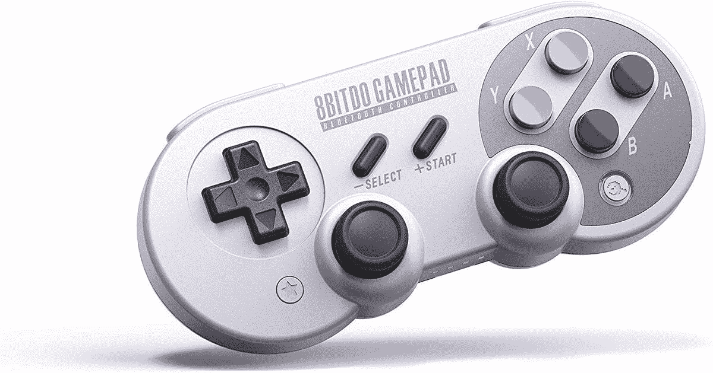
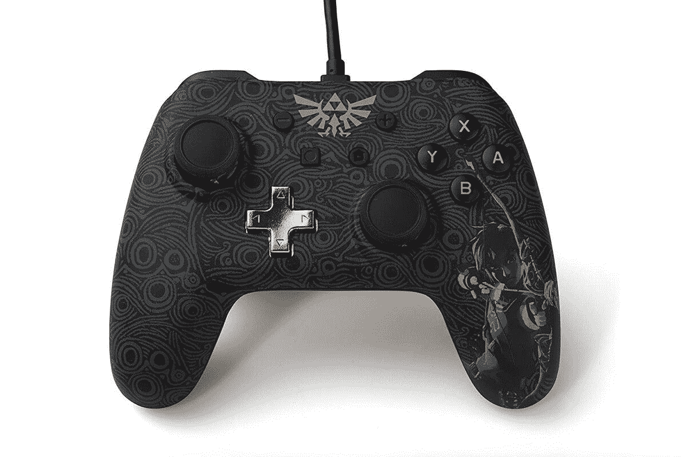
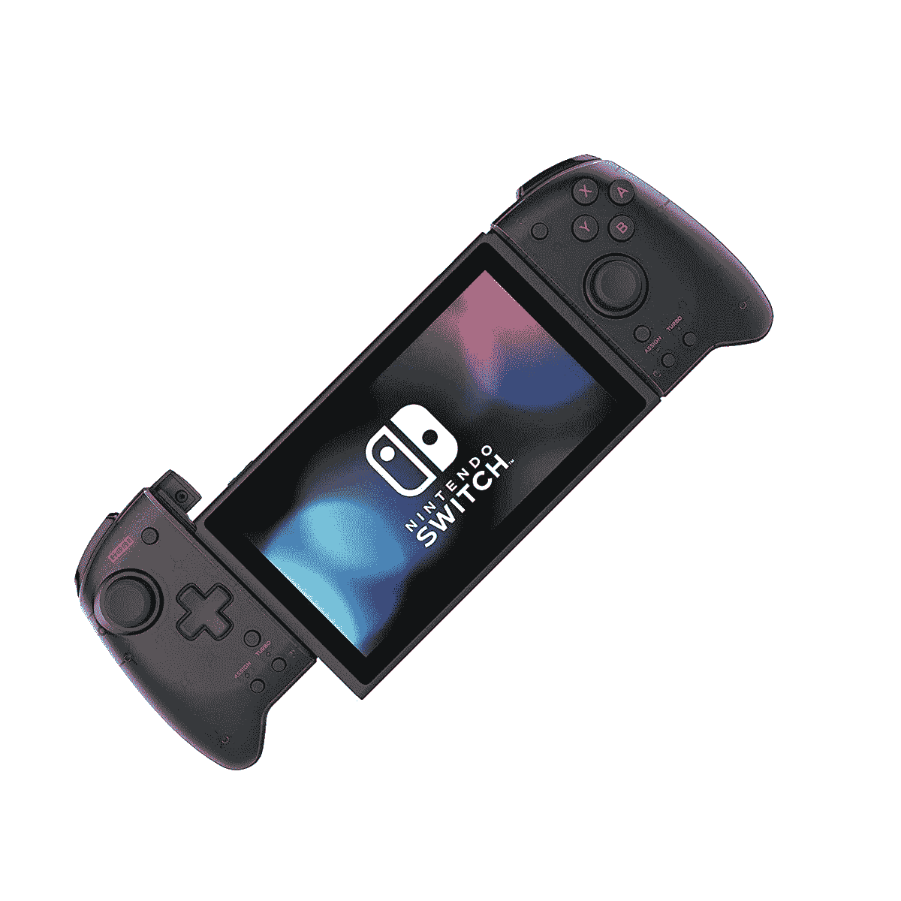
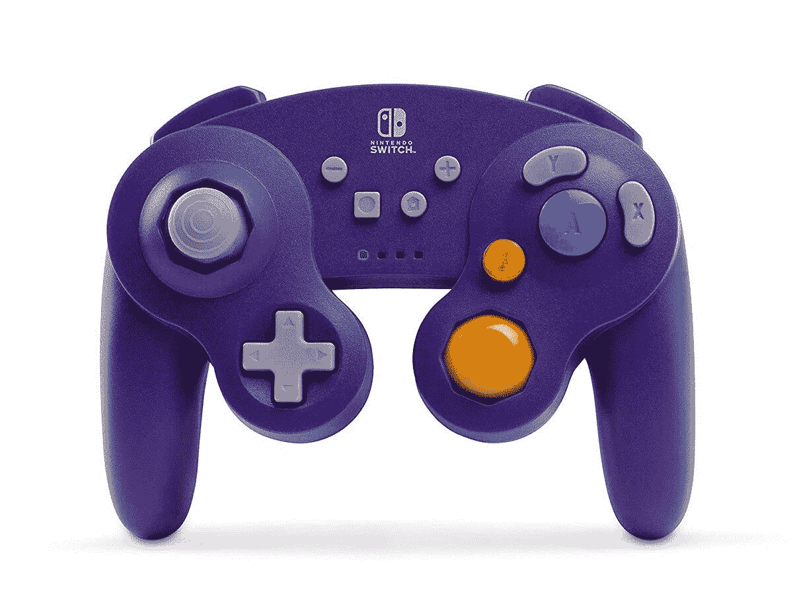
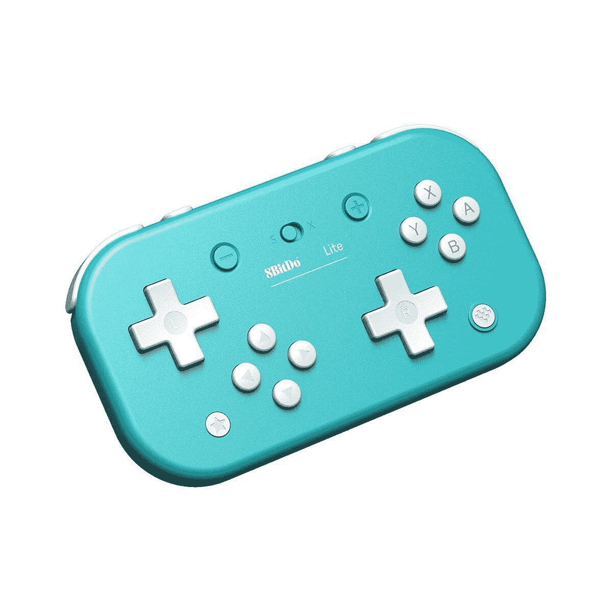

# 2023 年最佳任天堂 Switch 控制器

> 原文：<https://www.xda-developers.com/best-nintendo-switch-controllers/>

任天堂 Switch 是一个伟大的，多功能的控制台。无论是在电视上播放还是在旅途中播放，任天堂的最新游戏机的繁荣不是靠规格和 4K 技术，而是靠功能和第一方任天堂的善良。这几乎就像一个可靠的便携式游戏机的复兴。这几乎是游戏机和便携式游戏世界中最好的，所以除了[多一点存储空间](https://www.xda-developers.com/best-nintendo-switch-microsd/)，你还能要求什么呢？

嗯，你可以要求更好的控制器！[任天堂 Switch Pro 控制器](https://www.amazon.com/Nintendo-Switch-Pro-Controller/dp/B01NAWKYZ0?tag=xda-3g2f7e2-20&ascsubtag=UUxdaUeUpU1741&asc_refurl=https%3A%2F%2Fwww.xda-developers.com%2Fbest-nintendo-switch-controllers%2F&asc_campaign=Short-Term)和 [Joy-Cons](https://www.amazon.com/Nintendo-Joy-L-R-Gray-switch/dp/B01N6QKT7H?tag=xda-3g2f7e2-20&ascsubtag=UUxdaUeUpU1741&asc_refurl=https%3A%2F%2Fwww.xda-developers.com%2Fbest-nintendo-switch-controllers%2F&asc_campaign=Short-Term) 非常昂贵，特别是 Joy-Cons，众所周知它们的模拟操纵杆会出现漂移问题。这不是最好的体验。相反，你可以挑选一些更便宜的第三方控制器，并且可以说有更好的时间。

许多游戏玩家可能会对不使用官方控制器的想法犹豫不决，包括我自己在内，但任天堂已经正式授权其中一些公司代表他们制作控制器，其余的则得到了大量积极评价的支持。不要担心，拿起一个最好的任天堂 Switch 控制器！

**浏览本指南:**

## 最佳任天堂 Switch 控制器:PowerA 增强型无线控制器

如果你想要绝对最好的任天堂 Switch 控制器，你不能击败 [PowerA 的增强型无线控制器](https://www.amazon.com/PowerA-Enhanced-Wireless-Controller-Nintendo-Switch/dp/B07GXK8DJX?tag=xda-3g2f7e2-20&ascsubtag=UUxdaUeUpU1741&asc_refurl=https%3A%2F%2Fwww.xda-developers.com%2Fbest-nintendo-switch-controllers%2F&asc_campaign=Short-Term)。PowerA 是任天堂正式授权为 Switch 制造控制器的两家公司之一，他们创造了接近传统游戏机体验的控制器，而不像官方 Pro 控制器那样花费 70 美元。

这些控制器的建议零售价为 50 美元，但它们经常打折。在撰写本文时，几乎所有这款控制器的 28 种不同列表都有某种程度的折扣(如果有货的话)，平均而言，你可能会为这款控制器支付近 35 美元或 40 美元。还有一堆不同的颜色和设计选择，太！口袋妖怪控制器，马里奥控制器，《我的世界》控制器...这里肯定有适合每个人的东西！

关于这款控制器，你唯一需要知道的是，你需要两节 AA 电池才能使用它(这与 Xbox One 控制器没有太大区别)。当你可以很容易地储备充电电池时，这远不是一件坏事！

 <picture></picture> 

PowerA Enhanced Wireless Controller

##### PowerA 增强型无线控制器

当你能以更低的价格买到最好的任天堂 Switch 控制器时，为什么还要花更多的钱呢？PowerA 的无线控制器几乎可以做专业控制器能做的任何事情，而且价格只有一半。如果你不需要读取 Amiibos 的控制器，那么这个控制器是一个可靠的购买。

## 最佳复古风格控制器:8Bitdo SN30 Pro 控制器

如果您注册了[任天堂 Switch 在线](https://www.amazon.com/Nintendo-Switch-Online-Family-Membership/dp/B07KY69YFM?tag=xda-3g2f7e2-20&ascsubtag=UUxdaUeUpU1741&asc_refurl=https%3A%2F%2Fwww.xda-developers.com%2Fbest-nintendo-switch-controllers%2F&asc_campaign=Short-Term)订阅，您将获得 NES 和 SNES 游戏，这是订阅的好处之一。你可能会很快意识到，虽然用模拟棒玩这些旧游戏并不是最好的。你会想要一个模仿老派体验的控制器，而 [8Bitdo SN30 Pro 控制器](https://www.amazon.com/8Bitdo-SF30-Controller-Windows-macOS-Android/dp/B0748S1VDC?tag=xda-3g2f7e2-20&ascsubtag=UUxdaUeUpU1741&asc_refurl=https%3A%2F%2Fwww.xda-developers.com%2Fbest-nintendo-switch-controllers%2F&asc_campaign=Short-Term)就是这样一个。

SN30 复制了经典 SNES 控制器的外观和感觉，包括在前端和中央放置了一个真正的 D-pad，因此可以轻松播放复古游戏。感觉也很棒，因为每当我想在游戏中使用 D-Pad 时，这是我最喜欢的控制器。与任天堂官方限量版的 SNES 控制器不同，SN30 Pro 还配有两个模拟手柄。基本上，你可以用这个控制器玩任何游戏，而不仅仅是游戏机上的 NES 和 SNES 阵容。

如果你喜欢在智能设备上玩复古游戏，你甚至可以用苹果或安卓设备设置 SN30 Pro 控制器。谁不喜欢购买额外的功能呢？

 <picture></picture> 

8Bitdo SN30 Pro Controller

##### 8BitDo SN30 Pro

想要功能齐全的复古感？看看 8Bitdo 的 SN30 Pro 控制器就知道了。有了一个老式的 D-pad 和两个模拟棒，你可以用这个控制器在 Switch 上轻松地玩任何游戏。

## 最佳任天堂 Switch 有线控制器:PowerA 有线控制器

我住过的地方，蓝牙连接莫名其妙地不能正常工作。我说的是“我的键盘和鼠标离适配器只有一英尺远，但输入仍然下降”的水平。所以我能理解有线控制器的魅力。有线控制器总体来说也更耐用，所以如果家里有小孩不小心摆弄他们的电子产品，有线控制器是个不错的选择。

PowerA 为您提供了任天堂 Switch 的[有线控制器解决方案。这个控制器和他们的无线控制器非常相似，但是....嗯，它有电线！此外，这也是市场上较便宜的控制器之一，售价仅为 25 美元。如果这个控制器出了问题，换一个也不嫌贵！电线有 10 英尺长，所以如果你想坐在离电视远一点的地方，应该不会有问题。](https://www.amazon.com/PowerA-Nintendo-Switch-Wired-Controller-Breath/dp/B075FBPT3W?tag=xda-3g2f7e2-20&ascsubtag=UUxdaUeUpU1741&asc_refurl=https%3A%2F%2Fwww.xda-developers.com%2Fbest-nintendo-switch-controllers%2F&asc_campaign=Short-Term)

如果你需要有线的东西，不想玩游戏时 USB 线被挤出来，这是最好的任天堂 Switch 控制器。

 <picture></picture> 

PowerA Wired Controller

##### PowerA 有线控制器

需要有线控制器？PowerA 的有线控制器只有 25 美元，拥有他们无线控制器的所有功能，还有一根 10 英尺长的电缆。你不可能比那更好了！

## 最佳 Joy-Con 替代品:Hori Split Pad Pro

我并不是讨厌游戏机。只是他们有很多问题，尤其是在价格上。在这一点上，模拟操纵杆的问题已经有了自己的名字(Joy-Con drift)，虽然任天堂免费修复了漂移的 Joy-Con，但对于你花 80 美元购买的东西来说，这真的不应该是一个问题。最重要的是，即使是新模型 Joy-Cons 似乎也受到漂移的影响，即使是在假定的更好的构建质量下。当你可以用 [Hori 的 Split Pad Pro](https://www.amazon.com/Nintendo-Switch-Split-Ergonomic-Controller-Handheld/dp/B08FJ7XY3B?tag=xda-3g2f7e2-20&ascsubtag=UUxdaUeUpU1741&asc_refurl=https%3A%2F%2Fwww.xda-developers.com%2Fbest-nintendo-switch-controllers%2F&asc_campaign=Short-Term) 代替时，为什么还要麻烦呢？

Hori Split Pad Pro 有几种不同的款式，售价 50 美元，比 Joy-Cons 更大，更笨重，总体上更可靠。在屋外携带开关会不会有点困难？当然，但如果你像我一样，喜欢在看电视时在沙发上玩开关，这些控制器实际上是一种必需品。更厚的手柄意味着你的手会更舒适，亚马逊上的许多评论都对可定制的按钮赞不绝口。

不过，关于 Split Pad Pro 有一点需要注意。它们的控制器中没有电池，所以你不能像在游戏机上那样分开使用。这也意味着它们由任天堂 Switch 本身供电，如果你在路上，它会消耗一点电池。总的来说，这是在手持模式下玩开关的最好的任天堂 Switch 控制器。

 <picture></picture> 

Hori Nintendo Switch Split Pad Pro

##### 霍里任天堂 Switch 分离垫专业版

停止玩小游戏，并获得更强大的 Hori 分裂垫亲。售价 50 美元，比一对 Joy-Cons 便宜 30 美元，而且握感更强，也更舒适。他们可能不会隆隆作响，但你会避免手抽筋！

## 最佳 GameCube 风格控制器:PowerA 无线 GameCube 风格控制器

人们喜欢 GameCube 控制器。我不太清楚为什么，但它们很独特，也很舒适。当然，GameCube 控制器通常存在与现代游戏机不兼容的问题。即使你可以为开关获得 [GameCube 适配器，控制器也是老化的技术，迟早会坏掉。](https://www.amazon.com/Nintendo-GameCube-Controller-Adapter-without-English/dp/B07HC15QNZ?tag=xda-3g2f7e2-20&ascsubtag=UUxdaUeUpU1741&asc_refurl=https%3A%2F%2Fwww.xda-developers.com%2Fbest-nintendo-switch-controllers%2F&asc_campaign=Short-Term)

进入 [PowerA 无线 GameCube 风格控制器](https://www.amazon.com/PowerA-Wireless-Controller-Nintendo-Switch-GameCube/dp/B07GXLBCC3?tag=xda-3g2f7e2-20&ascsubtag=UUxdaUeUpU1741&asc_refurl=https%3A%2F%2Fwww.xda-developers.com%2Fbest-nintendo-switch-controllers%2F&asc_campaign=Short-Term)。这个控制器复制了经典 GameCube 控制器的外观和感觉，一直到标志性的紫色。不仅如此，这个控制器拥有你在开关上实际玩游戏所需的所有按钮，比如 Home 和截图按钮。它也是无线的，这使得控制器比标准的 GameCube 控制器更容易使用。如果你爱[超级粉碎兄弟终极](https://www.amazon.com/Super-Smash-Bros-Ultimate-Nintendo-Switch/dp/B01N5OKGLH?tag=xda-3g2f7e2-20&ascsubtag=UUxdaUeUpU1741&asc_refurl=https%3A%2F%2Fwww.xda-developers.com%2Fbest-nintendo-switch-controllers%2F&asc_campaign=Short-Term)，这可能是最好的任天堂 Switch 控制器玩战斗机。

它是几十年前 GameCube 控制器的 100%复制品吗？不，但这是下一个最好的事情。见鬼，这可能是更好的控制器。

 <picture></picture> 

PowerA Wireless GameCube Style Controller

##### PowerA 无线 GameCube 风格控制器

渴望 GameCube 风格，但想要一个实际上易于使用开关的控制器？PowerA 的无线 GameCube 控制器是一个抢手货。获得 GC 外形，配备玩任何游戏所需的所有按钮，包括 Smash Bros。

## 最佳兼容 Amiibo 的任天堂 Switch 控制器:任天堂 Switch 专业控制器

如果你想在你的任天堂 Switch 上轻松使用 Amiibos，那么你必须配备一个任天堂控制器。PowerA 和 Hori 可能得到了任天堂的官方许可，可以创建一些很棒的控制器，但他们仍然无法获得用于将小雕像连接到游戏本身的技术。也就是说，你只剩下两个选择——娱乐游戏或专业控制器。这一类别的最佳任天堂 Switch 控制器是用于 [Pro 控制器](https://www.amazon.com/Nintendo-Switch-Pro-Controller/dp/B01NAWKYZ0?tag=xda-3g2f7e2-20&ascsubtag=UUxdaUeUpU1741&asc_refurl=https%3A%2F%2Fwww.xda-developers.com%2Fbest-nintendo-switch-controllers%2F&asc_campaign=Short-Term)。

但是，不要认为它仅仅通过淘汰过程就赢了。任天堂的官方控制器本身就很棒。Pro 控制器非常坚固，拿在手中感觉很棒，这是对轻薄的 Joy-Cons 的一大进步。它们还提供了令人惊讶的长电池寿命(至少感觉比我的 PS4 控制器长得多)，并且很容易用 USB-C 电缆充电，这是大多数竞争对手的主机提供商所不提供的。这将是最好的任天堂 Switch 控制器一般来说，如果不是一件事....它的价格。70 美元高于这一代游戏机控制器的平均价格，很难否认 PowerA 的可比体验要低得多。

但是，如果你购买 Amiibos 不仅仅是为了装饰，你必须选择 Pro 控制器。

 <picture></picture> 

Nintendo Switch Pro Controller

##### 任天堂 Switch 专业控制器

有时候，你就是没法和官货争。任天堂的 Pro 控制器非常适合在对接模式下玩，设计舒适，电池续航时间长。70 美元的建议零售价使其成为我们名单上价格最高的项目，但作为少数几个提供 Amiibo 功能的控制器类型之一，这款控制器是最好的。

## 最佳小型任天堂 Switch 控制器:8Bitdo Lite 蓝牙游戏手柄

如果你有一个任天堂 Switch 建兴，你已经决定放弃在对接模式下播放的能力，以增加便携性。但有时，你会想坐下来玩游戏，手里拿着一个实际的控制器，而不是整个系统。这个列表中的大多数控制器都又大又笨重，因为它们不适合便携体验。谢天谢地，8bitdo 有一系列更小的控制器，更容易与你的 Switch Lite 打包在一起，其中最好的任天堂 Switch 控制器是 [8Bitdo Lite 蓝牙游戏手柄](https://www.amazon.com/8Bitdo-Bluetooth-Gamepad-Nintendo-Windows-Turquoise/dp/B07Y6N384Y?tag=xda-3g2f7e2-20&ascsubtag=UUxdaUeUpU1741&asc_refurl=https%3A%2F%2Fwww.xda-developers.com%2Fbest-nintendo-switch-controllers%2F&asc_campaign=Short-Term)。

Lite Gamepad 有蓝绿色和黄色两种颜色可供选择，以匹配这些彩色开关灯，它很小，便于与您的游戏主机打包在一起。然而，它也不算太小，就像 T4 的 8 bitdo Zero 2 T5，我认为它是专为蚂蚁制造的。它的厚度和 Joy-Con 差不多，但更大，拥有玩任何游戏所需的所有按钮和触发器。这里没有奇怪的半快乐控制计划！最后，Lite 游戏手柄使用两个完整的 D-pad，而不是模拟手柄，所以如果放在包里推来推去，它不太可能坏掉。

最后，这款游戏手柄仅售 25 美元，并定期上市销售。8bitdo 可能没有得到任天堂的官方许可，但他们是一个高质量的品牌，特别是在复古游戏玩家中。

 <picture></picture> 

8Bitdo Lite Bluetooth Gamepad

##### 8Bitdo Lite 蓝牙游戏手柄

获得 8bitdo Lite 蓝牙游戏手柄，并拥有一个可以随身携带的控制器。凭借其小巧的外形和优于模拟棒的 D-pad 选择，它很容易与您的 Switch 或 Switch Lite 打包在一起。只要 25 美元，你不会错的！

## 最佳任天堂 Switch 格斗棍:Hori Switch 迷你格斗棍

如果你是一个格斗游戏迷，你知道格斗棍往往比典型的控制器更好。考虑到你需要做的所有手指体操来完成高难度的组合，如果你使用所有的手指，而不是仅仅用拇指(偶尔用食指)，这将变得更容易控制。如果你在 Switch 上拿起像[真人快打 11](https://www.amazon.com/Mortal-KOMBAT-11-Aftermath-Kollection-Nintendo/dp/B088616YBL?tag=xda-3g2f7e2-20&ascsubtag=UUxdaUeUpU1741&asc_refurl=https%3A%2F%2Fwww.xda-developers.com%2Fbest-nintendo-switch-controllers%2F&asc_campaign=Short-Term) 和[龙珠格斗家](https://www.amazon.com/Dragon-Ball-FighterZ-Nintendo-Switch/dp/B07F2ZX3DN?tag=xda-3g2f7e2-20&ascsubtag=UUxdaUeUpU1741&asc_refurl=https%3A%2F%2Fwww.xda-developers.com%2Fbest-nintendo-switch-controllers%2F&asc_campaign=Short-Term)这样的标题，那么你会想要拿起 [Hori Switch 格斗棍迷你](https://www.amazon.com/Switch-Fighting-Stick-Officially-Licensed-Nintendo/dp/B01AJSAAV6?tag=xda-3g2f7e2-20&ascsubtag=UUxdaUeUpU1741&asc_refurl=https%3A%2F%2Fwww.xda-developers.com%2Fbest-nintendo-switch-controllers%2F&asc_campaign=Short-Term)。

格斗游戏迷说这是很好的初学者格斗棍。大多数格斗棍会更大更贵，所以如果你还不确定你是否喜欢格斗棍，用更低的价格买一个更小的格斗棍是很好的选择。它拥有开关控制器所需的一切，并通过更大的圆形按钮展开面部和触发按钮，使其更容易实现这些多按钮组合。

超级粉碎兄弟迷们要小心了！操纵杆自动使用 D-Pad 输入，而不是模拟杆输入(大概是为了更准确的命令)，没有办法改变它。对于 Super Smash Bros. Ultimate 来说，这意味着你被困在嘲讽中，无法动弹！所以总之你不能用格斗棍 Mini 配那个游戏。但老实说，如果你喜欢 Smash Bros .，你可能会选择 GameCube 风格的控制器。

 <picture></picture> 

Hori Switch Fighting Stick Mini

##### Hori 开关战斗棒迷你

使用 Hori Switch 格斗棍 Mini 充分利用您的格斗游戏。只有 50 美元，由任天堂官方授权，这是一个伟大的初学者的战斗棒，让你舒适地轻松完成复杂的组合。请注意，但是，它不兼容超级粉碎兄弟！

* * *

对于我自己来说，我会选择 PowerA Enhanced Wireless，因为它让我享受更传统的游戏体验，平衡手柄、重量和美观。8bitdo 控制器很好，有点复古，而 Hori Split Pad Pro 是 JoyCons 本身的一个很好的替代品。虽然我承认，Switch Pro 控制器在较高的预算下看起来也很有吸引力。这些选择中的大多数对于他们的预期目的来说都是很好的。所以认清你的需求，选择一个最适合你的！