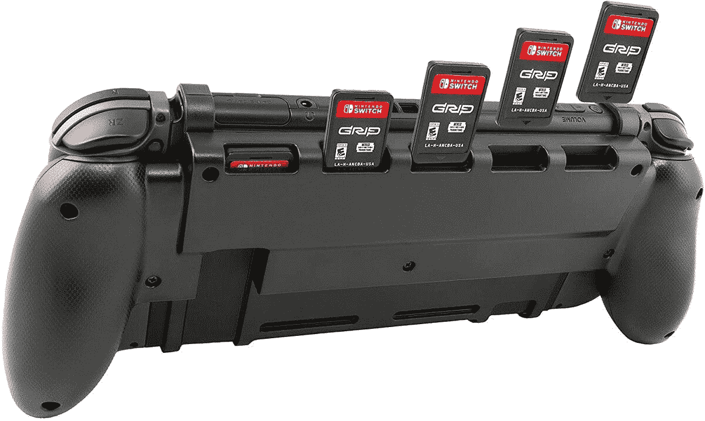
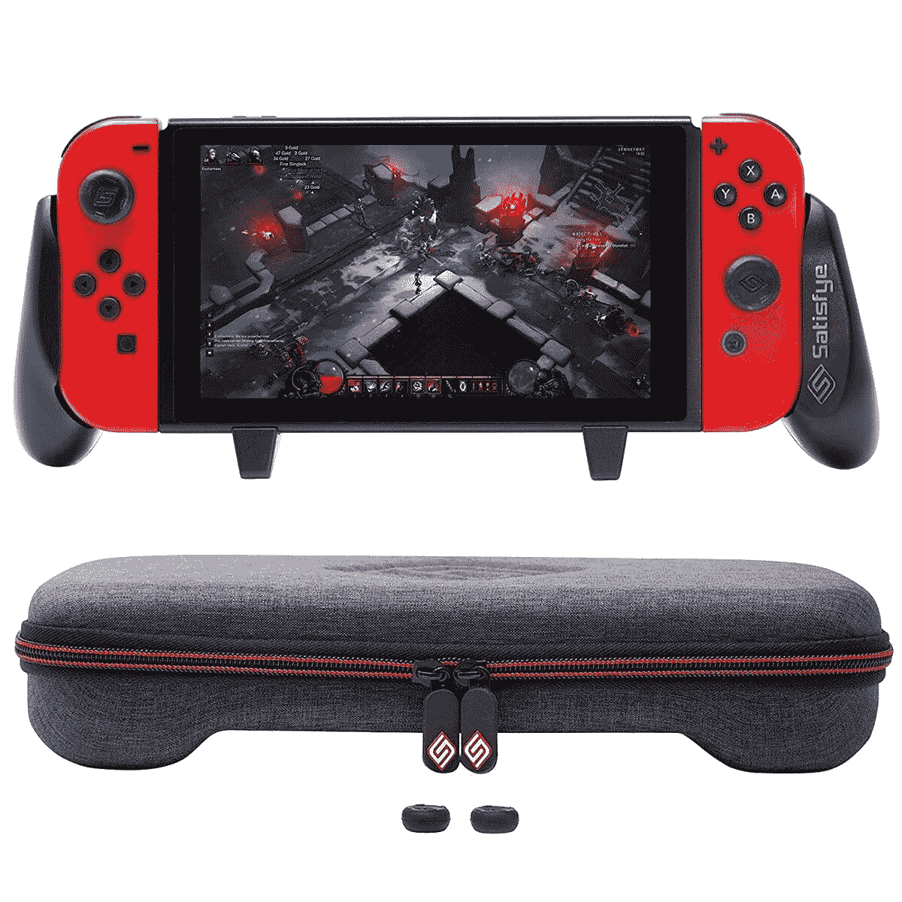
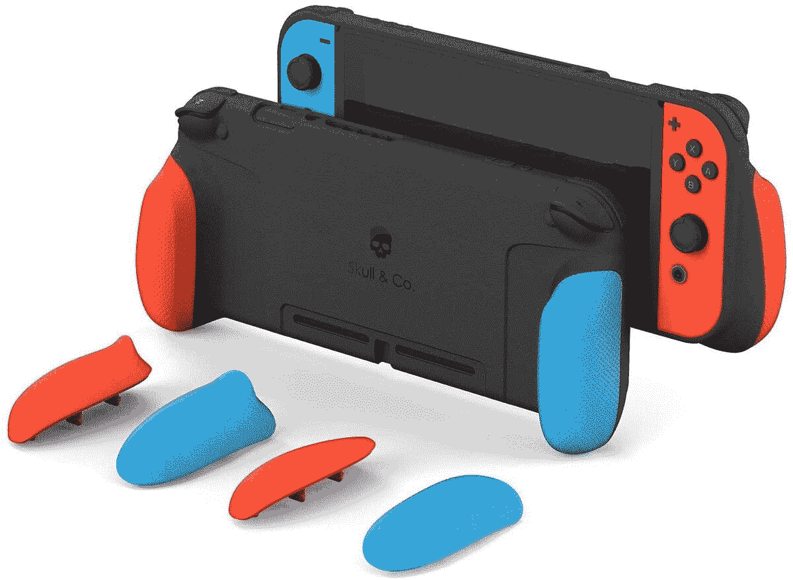
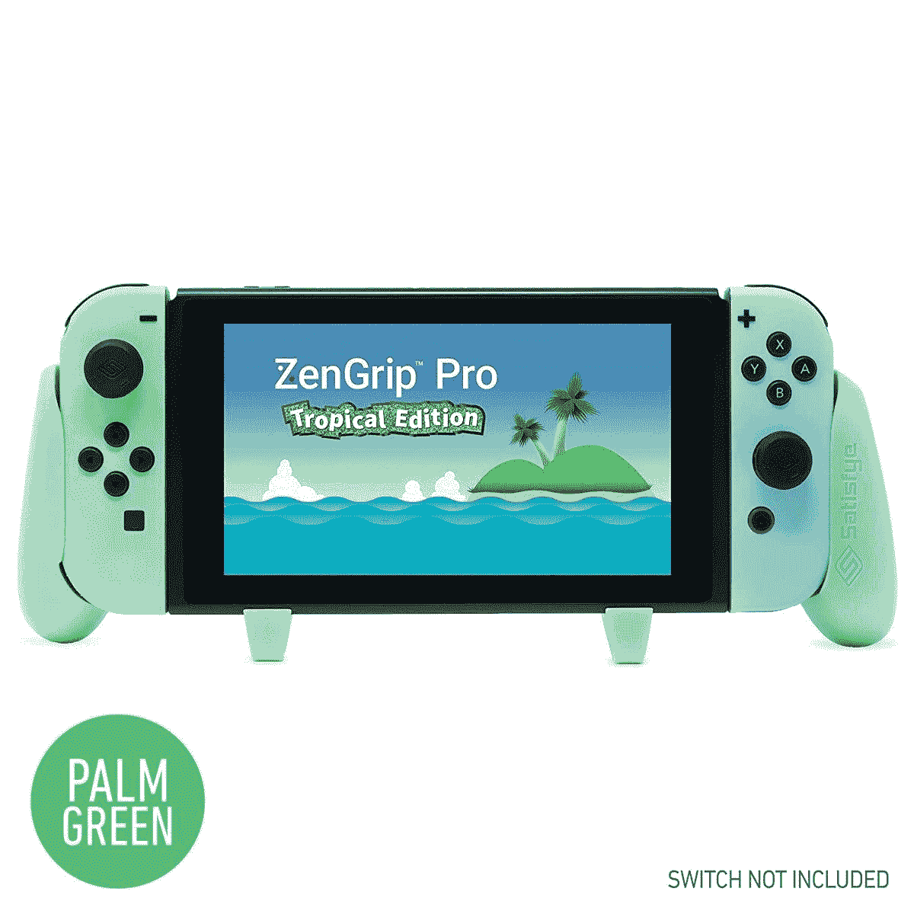
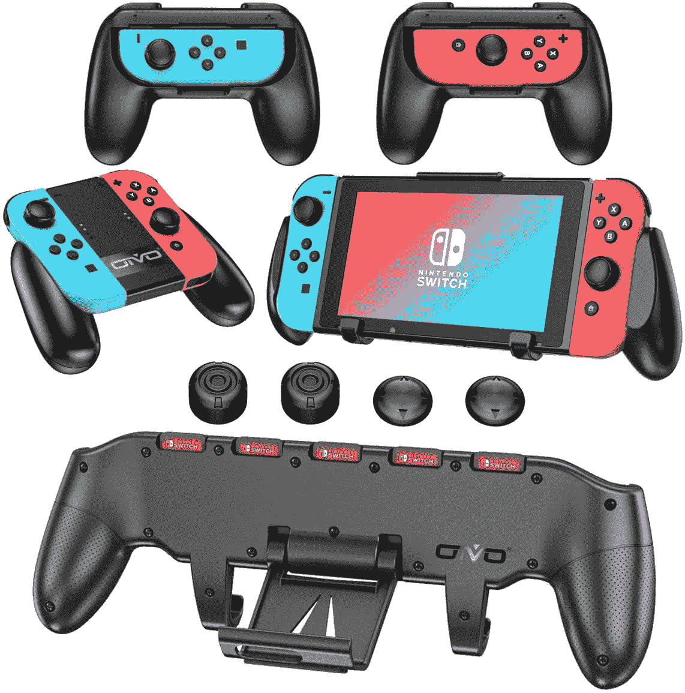
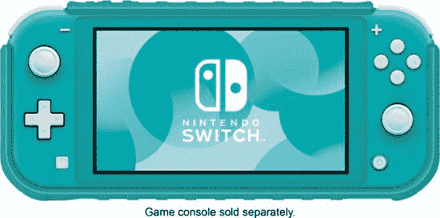
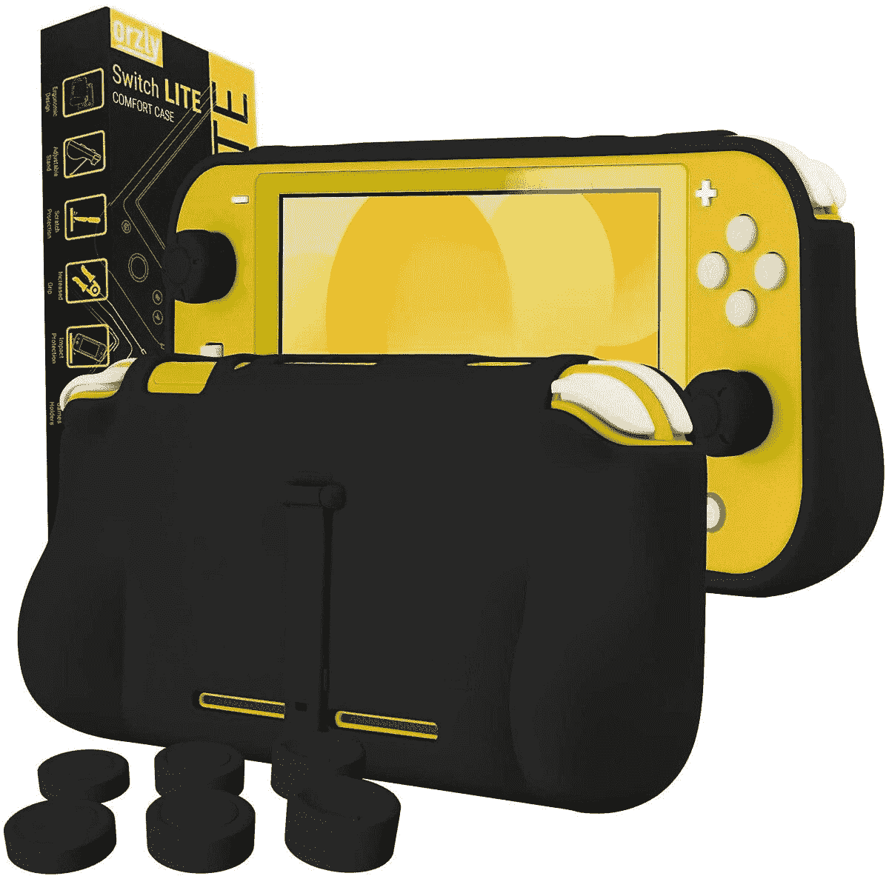
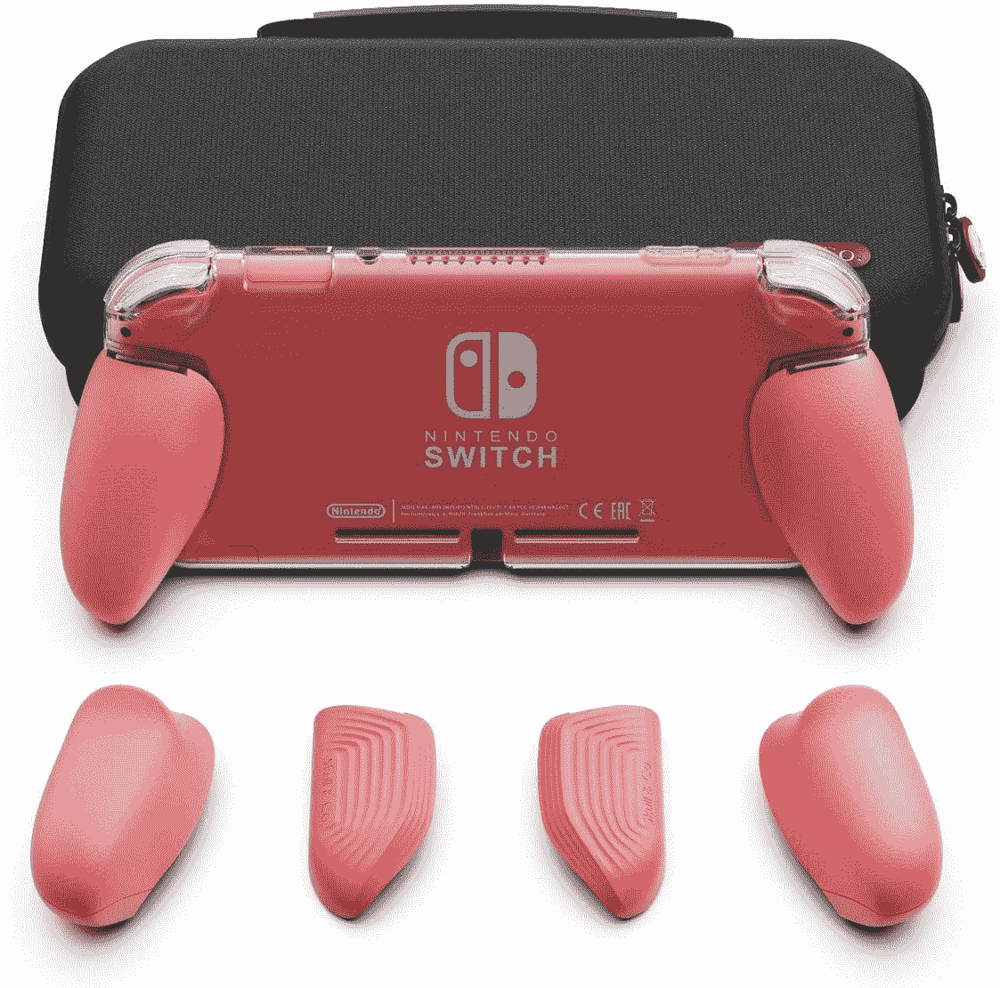

# 2023 年任天堂 Switch 和任天堂 Switch Lite 的最佳舒适握把

> 原文：<https://www.xda-developers.com/best-nintendo-switch-grip/>

任天堂 Switch 和 Switch Lite 可以说是目前市场上最好的两款掌上游戏机。当然，当你在家或在电视机前时，你也可以选择对接它们并玩，但当你外出或旅行时，或者你只想在沙发上懒洋洋地享受一些游戏时，手持模式非常方便。如果在手持模式下玩游戏有一个问题的话，那就是它不太容易抓住开关，尤其是如果你正在进行一场激烈的游戏。它们经常会让你感到不舒服，妨碍你的游戏体验。一些任天堂 Switch 控制器的替代品可以帮助解决这个问题，但是它们通常很贵。谢天谢地，这个令人痛苦的问题还有另一个解决方案——任天堂 Switch 握把！

Switch 或 Switch Lite 的舒适握柄可以增大系统的体积，使长时间握持更加舒适。我们收集了最好的任天堂 Switch 握把，以及最好的任天堂 Switch Lite 握把，如下。如果您想更进一步，保护您的任天堂 Switch 和 Switch Lite 免受刮擦和意外跌落的影响，我们甚至有一个针对 Switch 和 Switch Lite 的[最佳保护套列表。](https://www.xda-developers.com/best-nintendo-switch-protective-case/)

## 任天堂 Switch 舒适握把

如果你有原来的任天堂 Switch，你可能会想要一个舒适的手柄，让你也可以利用开关的停靠模式，或者至少有一些其他功能，使它可以再次穿上和脱下。这里有六种握把可供选择。

 <picture></picture> 

Mumba Dockable Case for Nintendo Switch

##### 蒙巴码头任天堂 Switch 案

如果您正在寻找一款能与 Switch dock 完美搭配的机箱，Mumba dockable 机箱是您的最佳选择。这款保护套有五种不同的颜色可供选择，既能让你拿着它的时候显得很大，又能滑入坞站。你甚至可以去掉你的快乐缺点！

 <picture></picture> 

YoK Black Ergo Grip for Nintendo Switch

##### YoK Black Ergo 任天堂 Switch 握把

当你能得到一个能做更多事情的把手的时候，为什么只是得到一个把手呢？YoK 的开关手柄允许您在其中存储五个开关盒。轻松打包您的最爱，让它们触手可及。当然，你还可以获得额外的握感。

 <picture></picture> 

Satisfye ZenGrip Pro Slim Bundle

##### Satisfye ZenGrip Pro Slim

开关手柄的一个小问题是，它们并不适合你能买到的开关盒。通过获得满意的 grip 和 case 包来解决这个问题。这款保护套可以让你在保护屏幕的同时存储十个额外的 Switch 游戏。

 <picture></picture> 

Skull & Co. GripCase

##### 斯库尔公司的公文包

谁不喜欢搭配的美感呢？Skull & Co 的 Switch grip 产品允许您定制后手柄，以匹配您的 Switch Joy-Cons。这样既能拿着舒服又不破坏审美，多利落啊！

 <picture></picture> 

Satisfye ZenGrip Pro Tropical

##### Satisfye ZenGrip Pro 热带

有特别版的任天堂 Switch 吗？找个特别的握把来搭配！ZenGrip Pro 热带版拥有与特别版 Switch 的淡蓝色和绿色 Joy-Cons 相匹配的调色板。

 <picture></picture> 

OIVO 3 in 1 Grips Bundle

##### OIVO 3 合 1 手柄套装

为什么不仅仅是获得开关手柄本身呢？获得控制台，娱乐游戏，甚至模拟棒的手柄！拿起这包东西后，你肯定就可以走了。

## 任天堂 Switch Lite 舒适握把

如果你选择了更实惠的 Switch Lite，由于尺寸不同，你不能使用 Switch grips。不过，别担心。这里有一些 Switch Lite 舒适手柄，它们是小型游戏机独有的，可以让你在更长的时间内享受游戏乐趣。

 <picture></picture> 

Hori Hybrid System Armor

##### 霍里混合系统装甲

当您还可以保护您的 Switch Lite 免受跌落时，为什么只抓持呢？Hori 混合系统装甲有蓝绿色和黄色两种颜色，两种颜色都有。所以花一个的价钱，你可以完成两个任务。

 <picture></picture> 

Orzly Ergonomic Grip Case

##### Orzly 人体工程学手柄任天堂 Switch 盒

Orzly 的握套对于 Switch Lite 来说是个笨重的保护套？这款保护套有十种款式可供选择，可以防震，让您的 Switch Lite 更加舒适，并配有模拟手柄。

 <picture></picture> 

Skull & Co. GripCase

##### 斯库尔公司的公文包

谁不喜欢搭配的美感呢？Skull & Co 的 Switch grip 产品允许您定制后手柄，以匹配 Switch Lite 的控制台颜色。你还会得到一个箱子来放你的开关。

* * *

你可以选择，但是什么是最好的握杆方式呢？对于普通的 Switch 来说， [Mumba 的可停靠 Switch case](https://www.amazon.com/Dockable-Case-Nintendo-Switch-Joy/dp/B07TDLRFKK?tag=xda-27qfd2b-20&ascsubtag=UUxdaUeUpU2775&asc_refurl=https%3A%2F%2Fwww.xda-developers.com%2Fbest-nintendo-switch-grip%2F&asc_campaign=Short-Term) 绝对是最佳选择。当将开关放入坞站时，开关手柄外壳不起作用是没有多大意义的。没有人真的想再一次把手柄打开和关闭，这会破坏你的整体体验。如果你有一个开关 Lite，那么 [Hori Grip Case](https://shop-links.co/1723958422457557173?u1=70f2229c-eaf6-45d9-b73d-79a5d30a1452) 是最好的选择，尤其是在那个价位。这是一个相对较小的手柄套，但它甚至可以为您容纳额外的游戏，这是一个额外的奖励。