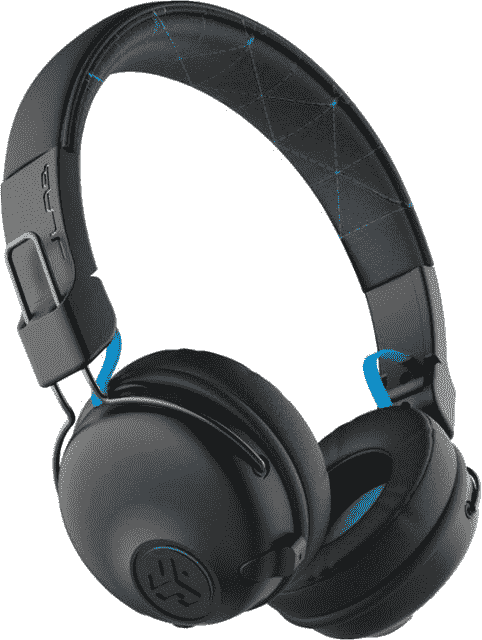
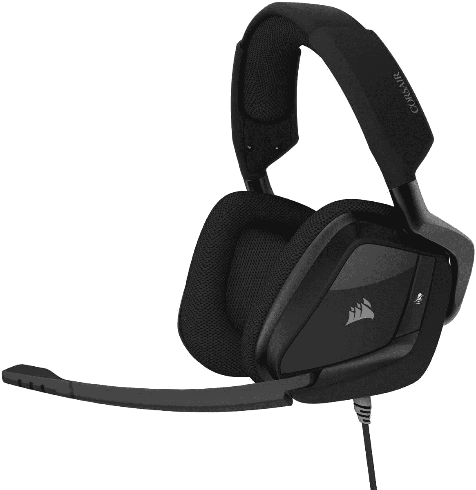
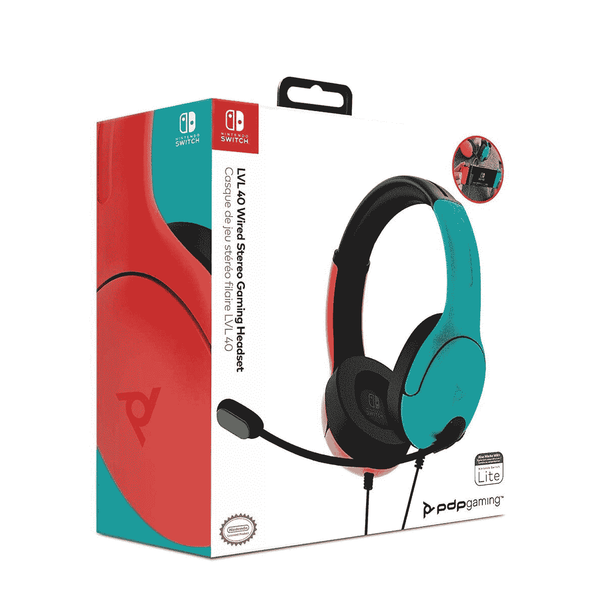
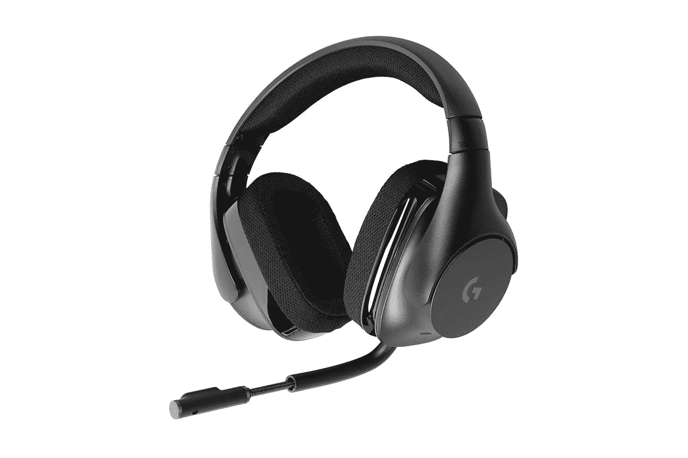
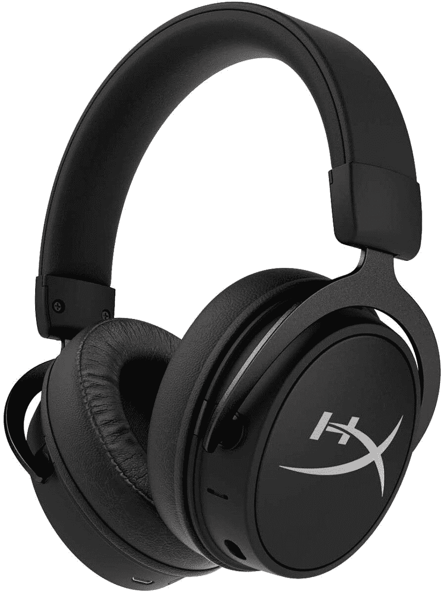

# 2023 年最佳任天堂 Switch 耳机

> 原文：<https://www.xda-developers.com/best-nintendo-switch-headsets/>

你确定你有你需要的所有任天堂 Switch 配件吗？从实际需要的 [microSD 卡](https://www.xda-developers.com/best-nintendo-switch-microsd/)到各种[开关控制器](https://www.xda-developers.com/best-nintendo-switch-controllers/)，有各种各样的东西可以让你的游戏体验最佳，更不用说你想玩的实际游戏了！一个你可能没有考虑过的配件是耳机——如果你打算玩在线游戏，你将需要一个！

一款好的耳机可以带来翻天覆地的变化，并带来卓越的游戏体验。不过，你不能随便买一个旧耳机——这款耳机没有内置蓝牙功能，所以你需要确保买到的是正确的那款。别担心，我们已经收集了以下最好的任天堂 Switch 耳机。

**浏览这篇文章:**

## 最佳任天堂 Switch 耳机:JLab Audio Play 游戏无线耳机

与大多数游戏机不同，你将在许多不同的情况下使用你的开关。你可以在对接模式下在大屏幕上玩游戏，在沙发上玩游戏，甚至在手持模式下出去玩游戏。最好的任天堂 Switch 耳机不一定是外观最好的，也不一定是麦克风灵敏度最高的——它将是功能最丰富的耳机。任天堂 Switch 是一个多功能的控制台，除非你想买一堆耳机，否则你会想要一个在任何场景下都能工作的耳机....且耳机是 JLab 音频播放器游戏耳机。

这款耳机既可以有线使用，也可以无线使用。你将获得一根辅助电缆和一根 USB 电缆，因此无论你是在对接模式还是手持模式下，都可以将其插入。此外，耳机很薄，并配有一个便携包，如果您想在旅途中随身携带耳机，这是两个至关重要的因素。最后，您可以通过蓝牙使用 JLab 音频播放耳机。不过它没有加密狗，所以你需要为任天堂 Switch 买一个特殊的[蓝牙适配器。](https://www.amazon.com/HomeSpot-Bluetooth-Transmitter-Compatible-Headphones/dp/B07L9SL7ZT?tag=xda-2sd5to1-20&ascsubtag=UUxdaUeUpU5855&asc_refurl=https%3A%2F%2Fwww.xda-developers.com%2Fbest-nintendo-switch-headsets%2F&asc_campaign=Short-Term)

老实说，即使需要购买开关加密狗，JLab 音频耳机也符合最佳任天堂 Switch 耳机的所有要求。它可以随时随地使用，并且有很高的价格。

 <picture></picture> 

JLab Audio Play Gaming Wireless Headset

##### JLab Play 游戏无线耳机

这款黑蓝色耳机是您交换机的完美补充！通过有线或无线方式使用它，并使用随附的便携包随身携带。

## 最佳对接模式切换耳机:海盗船 Void RGB 精英游戏耳机

如果您在连接交换机时使用耳机，您需要通过 USB 电缆将其插入。此外，可以推测，如果你在对接模式下使用你的开关，你是插在电视上的。所以你会想要一个任天堂 Switch 耳机，它有很长的电线，并且仍然是一个高质量的产品。最适合这项工作的耳机是海盗船空精英。

这款耳机提供 7.1 环绕声，一套定制的音频驱动程序，以及漂亮但不过分的 RGB。因为它是有线的，你也不需要担心你的音频或语音连接会掉线。没有什么比试图与你在堡垒之夜的团队沟通时蓝牙连接出现问题更糟糕的了。虽然 USB 线很长，但你可以随时抓住一根 [USB 延长线](https://www.amazon.com/Extension-AINOPE-Material-Transfer-Compatible/dp/B07ZV6FHWF?tag=xda-2sd5to1-20&ascsubtag=UUxdaUeUpU5855&asc_refurl=https%3A%2F%2Fwww.xda-developers.com%2Fbest-nintendo-switch-headsets%2F&asc_campaign=Short-Term)来获得更长的长度。

 <picture></picture> 

Corsair Void RGB Elite USB Premium Gaming Headset

##### 海盗船 Void RGB 精英 USB 高级游戏耳机

海盗船总是有优质的耳机，那些在家里玩他们的开关可以享受海盗船 Void RGB 精英。这款耳机提供优质的声音和一些漂亮的灯光。

## 最佳手持模式开关耳机:PDP LVL40 有线立体声游戏耳机

如果你有一个任天堂 Switch 建兴或发挥你的开关在手持模式的大部分时间，你需要一个耳机插入开关的辅助端口。如果是这样的话，官方授权的档位是不会错的。任天堂不生产 PDP LVL40 游戏耳机，但像各种任天堂配件一样，制造商得到任天堂的许可，专门制造任天堂 Switch 耳机。

红色和蓝色耳机与交换机的标志性颜色相匹配，并插入您的 Aux 端口，因此您只能在交换机处于手持模式时使用它....当然，除非你买一个 [PDP 开关控制器](https://www.amazon.com/Nintendo-Switch-Faceoff-Deluxe-Audio-Controller/dp/B07RV6XS6L?tag=xda-2sd5to1-20&ascsubtag=UUxdaUeUpU5855&asc_refurl=https%3A%2F%2Fwww.xda-developers.com%2Fbest-nintendo-switch-headsets%2F&asc_campaign=Short-Term)来插它。除此之外，它还配备了现代耳机的所有功能，可以通过翻转麦克风和左耳杯上的音量旋钮来静音。它也是一款超薄耳机，无论您去哪里，都可以轻松打包并随身携带。

 <picture></picture> 

PDP LVL40 Wired Stereo Gaming Headset

##### PDP LVL40 有线立体声游戏耳机

官方许可的装备永远不会出错。PDP 开关游戏耳机为开关的手持模式提供了您需要的一切，并且配色方案将与您的霓虹灯开关相匹配。

## 最佳任天堂 Switch 蓝牙耳机:罗技 G533 无线游戏耳机

任天堂 Switch 没有内置蓝牙，所以要使用无线耳机，你需要两样东西中的一个——要么是可以插入 Switch dock 的 USB 加密狗，要么是在玩手持游戏时可以插入 Switch 充电端口的特殊蓝牙适配器。不幸的是，大多数开关耳机和特殊的蓝牙加密狗组合似乎相当劣质。此外，在手持模式下，当你可能离电视稍远一点时，电线通常更容易处理。因此，在本节中，我们将重点放在带有 USB 加密狗的耳机上。

因此，事实证明，任何通过 USB 插入的 PC 耳机也可以与开关一起使用，因此您不会受到选择的限制。但是对于最好的使用蓝牙的任天堂 Switch 耳机，你需要选择罗技 G533 游戏耳机。无线耳机电池续航时间长，音频范围大，麦克风可以很好地捕捉您的声音，而不会捕捉到您周围的所有其他声音。耳机也是简单的黑色，避开了大多数游戏耳机的明亮和花哨的颜色。

总而言之，这是一款坚固的耳机，PC 和 Switch 之间的多功能性只是一个额外的好处。不过，G533 相当笨重，因此它不是移动游戏的最佳选择。

 <picture></picture> 

Logitech G533 Wireless Gaming Headset

##### 罗技 G533 游戏耳机

如果您想要一款既能在 PC 上使用，又能通过无线接口连接的耳机，那么 G533 再合适不过了。

## Switch 最佳混合耳机/头戴式耳机:HyperX Cloud MIX

有时你不需要耳机的所有功能，只是想听游戏音乐，没有任何麻烦。麻烦在于麦克风，或多或少，尤其是在单人游戏上。当你不用它们的时候，这些东西会严重妨碍你。那么，为什么不买一个能让你摘下耳机的耳机呢？

HyperX Cloud MIX 不是严格意义上的任天堂 Switch 耳机——但话说回来，我们选择的大多数耳机都不是！这款耳机是有线的，但是非常舒适。如果你不介意电线，你会很高兴。这款耳机有双室驱动器来提供优质的声音，HyperX 是一个以质量著称的品牌。你也可以把麦克风拆下来，这样如果你想要一副耳机，你只需要把麦克风摘下来。如果你在多人游戏中需要它，只要把麦克风放回去，你就可以开始游戏了。

 <picture></picture> 

HyperX Cloud MIX Wired Gaming Headset

##### HyperX 云混合

使用 HyperX Cloud MIX 获得美妙的声音和可拆卸的麦克风。使用它与您的开关和您的手机！

* * *

最适合你的任天堂 Switch 耳机很大程度上取决于你如何使用你的开关。JLab 的耳机是迄今为止最通用的，就其与 Switch 本身的配合而言，但如果你主要只玩一种方式，其他耳机包括 Corsair 和 Logitech 的耳机会更好。选择最适合您的耳机！