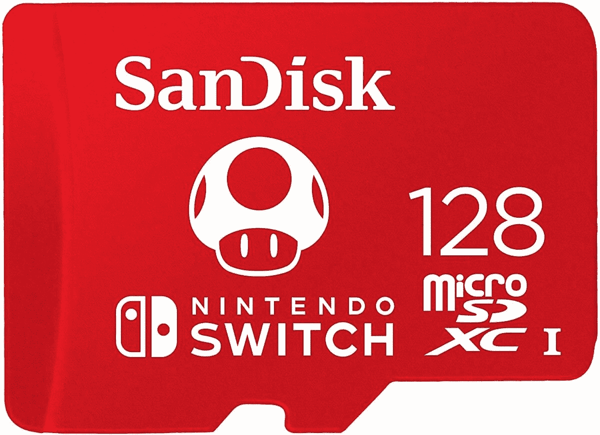
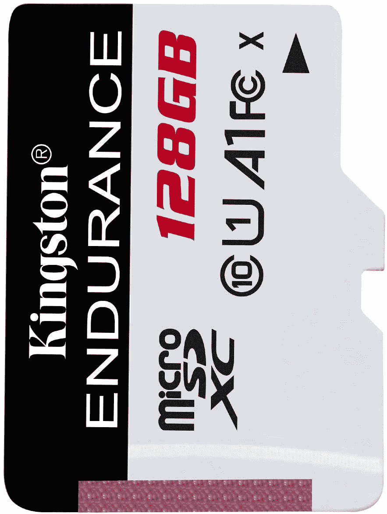

# 任天堂 Switch 最佳 MicroSD:哪种任天堂 Switch 存储卡最好？

> 原文：<https://www.xda-developers.com/best-nintendo-switch-microsd/>

# 2020 年任天堂 Switch 最佳 MicroSD 卡:Sandisk、Samsung 等等！

不确定为您的交换机选择哪种 microSD？我们已经收集了最好的任天堂 Switch microSD 卡在这里，所以跳吧！

让我们面对现实吧——32GB 的存储空间根本不够你的[任天堂 Switch](https://www.xda-developers.com/nintendo-switch-vs-lite/) 上的空间。它可能足以存储一些截图和一两个较小的游戏，但如果你想以数字方式购买游戏，扩展可用内存是必要的。令人欣慰的是，你可以拿起一个 microSD 弹出到你的新主机上，下载你想要的所有游戏。当然，这就提出了一个新的问题:你应该购买哪种 microSD 卡？并非所有的 microSDs 都是平等创建的。我们已经收集了最好的任天堂 Switch micro SD，所以你可以跳过研究，选择下面的一个，并准备好游戏！

 <picture></picture> 

Sandisk MicroSD for Nintendo Switch

##### 任天堂 Sandisk MicroSD

如果你担心兼容性，你可以一直用任天堂 Switch 公司自己授权的 microSD！这款 SanDisk microSD 上面有任天堂的标志，但除此之外与他们的 Ultra line 没有什么不同！

 <picture></picture> 

Amazon Data Storage Sale

##### SanDisk 超微卡

如果您没有太多开销，SanDisk Ultra 系列是您的交换机的理想选择。这些 microSDs 既可靠又实惠，128GB carb 仅售 19 美元。如果不去那些历史记录不太可靠的品牌，你真的无法打破这个价格。

 <picture></picture> 

Samsung Evo Select MicroSD

##### 三星 EVO Select microSD

三星 EVO Select 卡专为大文件和游戏而设计，因此您知道您将获得与此卡兼容的产品。凭借 10 年保修和防水防温保证，您可以高枕无忧，因为您知道这款存储卡不会脱落。

 <picture></picture> 

SanDisk Extreme 1TB MicroSD

##### SanDisk Extreme microSD 卡

如果你打算买一大堆任天堂 Switch 游戏，并打算全部数字化，你需要一个更大的 microSD。SanDisk Extreme 1TB microSD 是一个抢手货——考虑到 Switch 游戏的大小，你很难填满它。也不要被建议零售价吓跑，因为这种卡经常会得到很大的折扣。

 <picture></picture> 

Lexar High Performance MicroSD

##### Lexar 高性能 microSD

Lexar 的高性能 microSD 提供 UHS-I 技术和 100mb/s 的读取速度，这意味着游戏加载速度更快。虽然我还不能亲自测试这些差异，但如果这是你最看重的东西，你会愿意为这张卡支付额外费用。

 <picture></picture> 

Kingston High Endurance MicroSD

##### Kingston 高耐久性 MicroSD

爱金斯顿？你可以拿起金士顿高续航 microSD 换你的 Switch！与任何金士顿产品一样，这些都是廉价而可靠的卡，被证明是可靠的，尽管它们的容量只有 128GB。

不确定选择哪一款任天堂 Switch microSD？我在我的交换机中使用了 SanDisk Ultra，它工作得非常好。我发现 [128GB](https://www.amazon.com/SanDisk-128GB-microSDXC-Memory-Adapter/dp/B073JYC4XM?tag=xda-2aenisd-20&ascsubtag=UUxdaUeUpU30318&asc_refurl=https%3A%2F%2Fwww.xda-developers.com%2Fbest-nintendo-switch-microsd%2F&asc_campaign=Short-Term) 型号对我来说很好用，但我也会在玩完游戏后存档，并不时整理我的截图文件夹。如果你想保留下载的所有内容，同时还想购买实体游戏， [256GB](https://www.amazon.com/SanDisk-128GB-microSDXC-Memory-Adapter/dp/B0758NHWS8?tag=xda-2aenisd-20&ascsubtag=UUxdaUeUpU30318&asc_refurl=https%3A%2F%2Fwww.xda-developers.com%2Fbest-nintendo-switch-microsd%2F&asc_campaign=Short-Term) 将是一个不错的存储空间。老实说，我所有的 microSDs、Switch 或其他产品都使用 SanDisk，我从未失望过。但是总有一点点可能性，你的卡最终可能会损坏，这是这些卡的本质，所以确保你找到适合你的需求和预算的卡。

如果你是一个买了很多 Switch 游戏的人，并且只买数字游戏，你会想买 SanDisk Extreme 1TB 卡。贵吗？是的，但是它的读取速度很快，而且绝对可以在你的交换机上存储你想要的任何东西。也不要让建议零售价把你吓跑，因为这些 microSDs 经常打折:我经常看到 200 美元(或更多)的这种卡！)关了。