# 2023 年任天堂 Switch 和任天堂 Switch Lite 的最佳保护套

> 原文：<https://www.xda-developers.com/best-nintendo-switch-protective-case/>

更有可能的是，你的昂贵的智能手机上有某种情况。你为什么不呢？智能手机是一件昂贵的物品，你想保护它不被毁掉。那么，你不应该把同样的逻辑延伸到你的任天堂 Switch 吗？我认为交换机甚至比智能手机还要脆弱。所以，你一定会想要一个任天堂 Switch 保护套！

这些与[开关旅行套](https://www.xda-developers.com/best-nintendo-switch-travel-case/)不同，因为保护套实际上在开关本身上，很像智能手机套。我们已经收集了最好的任天堂 Switch 保护套，以及任天堂 Switch 建兴保护套，所以你可以选择一个最好的给你！一个好的保护套可以确保你的开关是安全的，即使你在输掉一场比赛后把它掉在地上或扔到房间的另一边。

## 任天堂 Switch 保护套

原来的任天堂 Switch 比 Lite 大，你能买到的箱子也需要考虑到可拆卸的欢乐缺点。更不用说对接控制台了！不过要小心，因为并非所有这些情况都与我们最喜欢的[任天堂 Switch 控制器](https://www.xda-developers.com/best-nintendo-switch-controllers/)，Hori Split Pad Pro 兼容。

 <picture>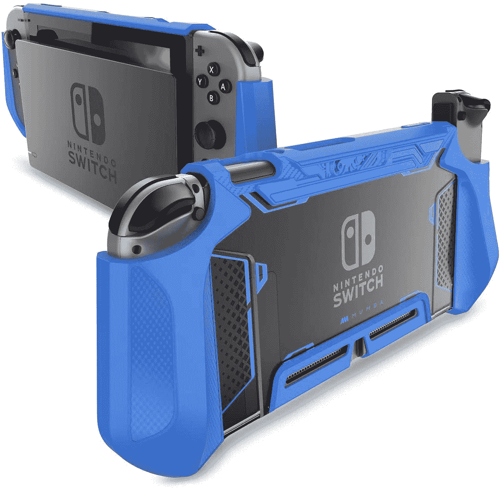</picture> 

Mumba Dockable Case for Nintendo Switch

##### 蒙巴码头任天堂 Switch 案

如果你想要一个伟大的全能外壳，你会想要 Mumba 的可对接开关保护壳。该案件是可停靠的，允许您采取的 Joy-Cons 关闭开关，并给你额外的抓地力时，发挥便携式。

 <picture>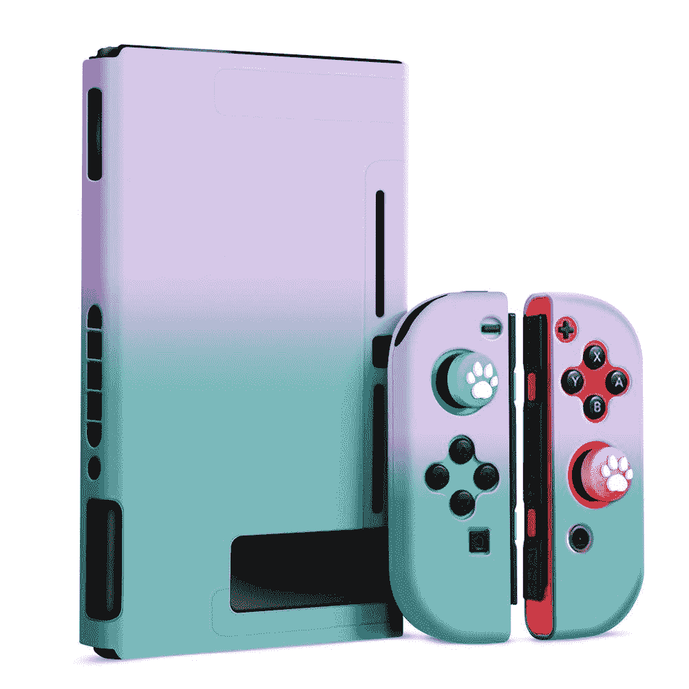</picture> 

OMKUY Switch Protective Cover Case

##### 奥姆库伊·任天堂 Switch 案

如果你想买一个任天堂 Switch 保护套，为什么不选一个能让你的主机看起来漂亮的呢？OMKUY 的硬开关和 Joy-Con 外壳有一个很好的渐变设计，这将使您的控制台脱颖而出。

 <picture>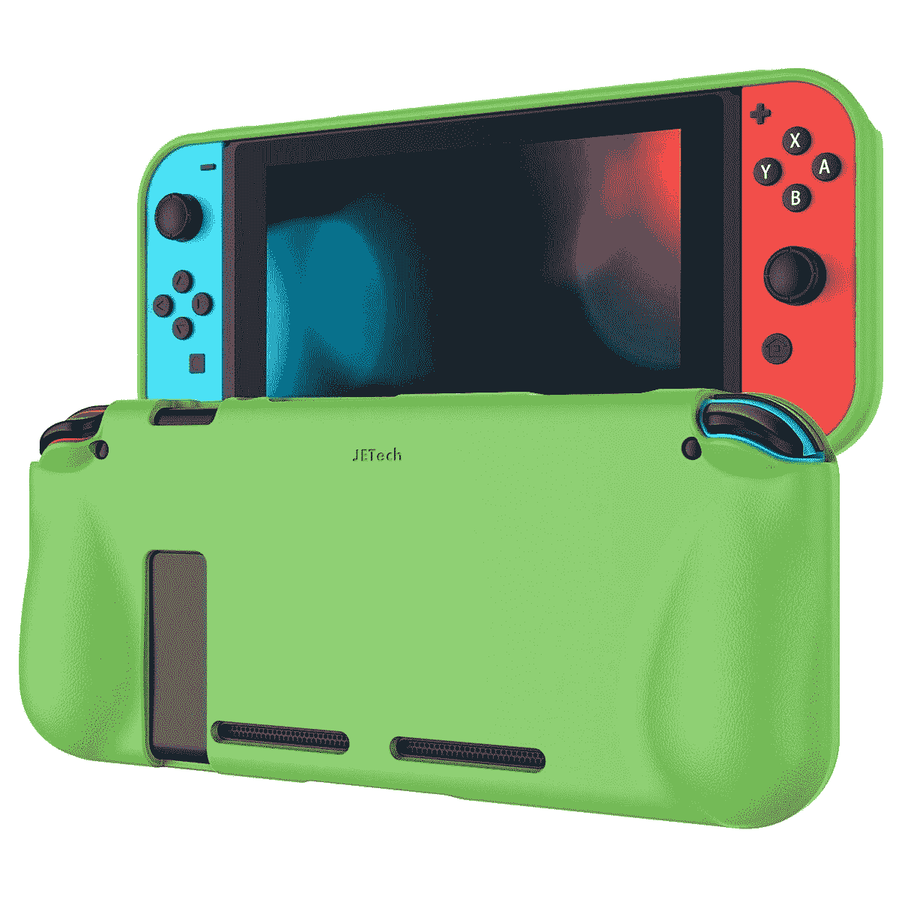</picture> 

JETech Protective Case for Nintendo Switch

##### 任天堂 JETech 保护壳

JETech 的开关盒实际上覆盖了 Joy-Cons 的各个角落，为众所周知的脆弱控制器提供了额外的保护。您还可以将它们滑入和滑出！

 <picture>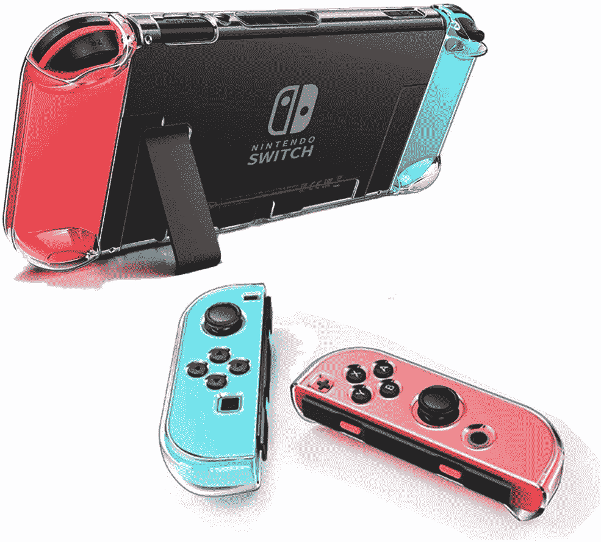</picture> 

VANJUNN 3 in 1 Protective Case Cover

##### 万朱恩三合一任天堂 Switch 案例

万朱恩·任天堂 Switch 保护套贴在开关的正面和背面，还有两个玩具。这个保护控制台和屏幕免受划痕和刻痕！

 <picture>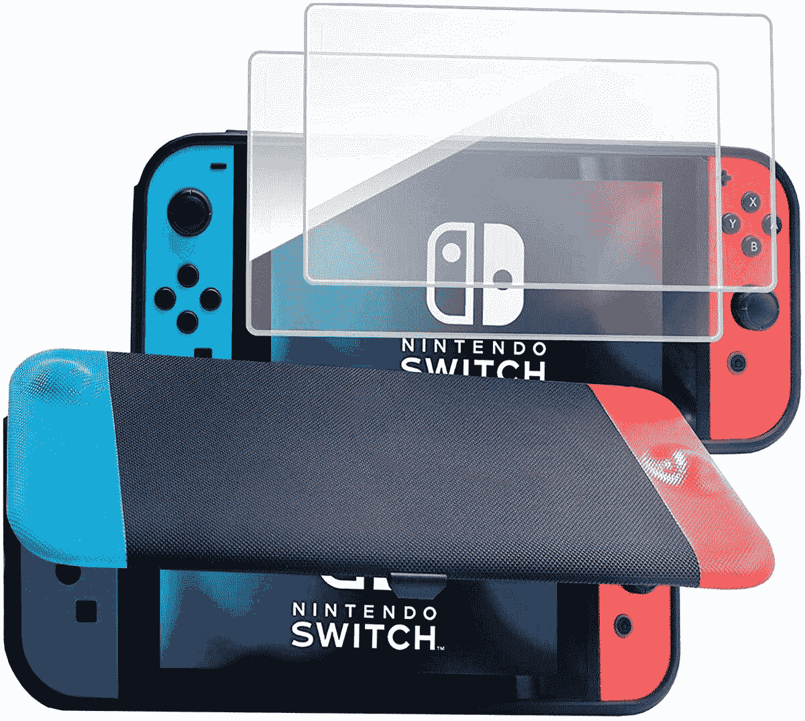</picture> 

ProCase Nintendo Switch Flip Cover

##### ProCase 任天堂 Switch 翻盖

一次购买保护套和旅行箱怎么样？任天堂 Switch 的 ProCase 有一个可拆卸的前盖，因此您可以在玩游戏时将其取下，放回原处以保护屏幕，并将其放入包中！

 <picture>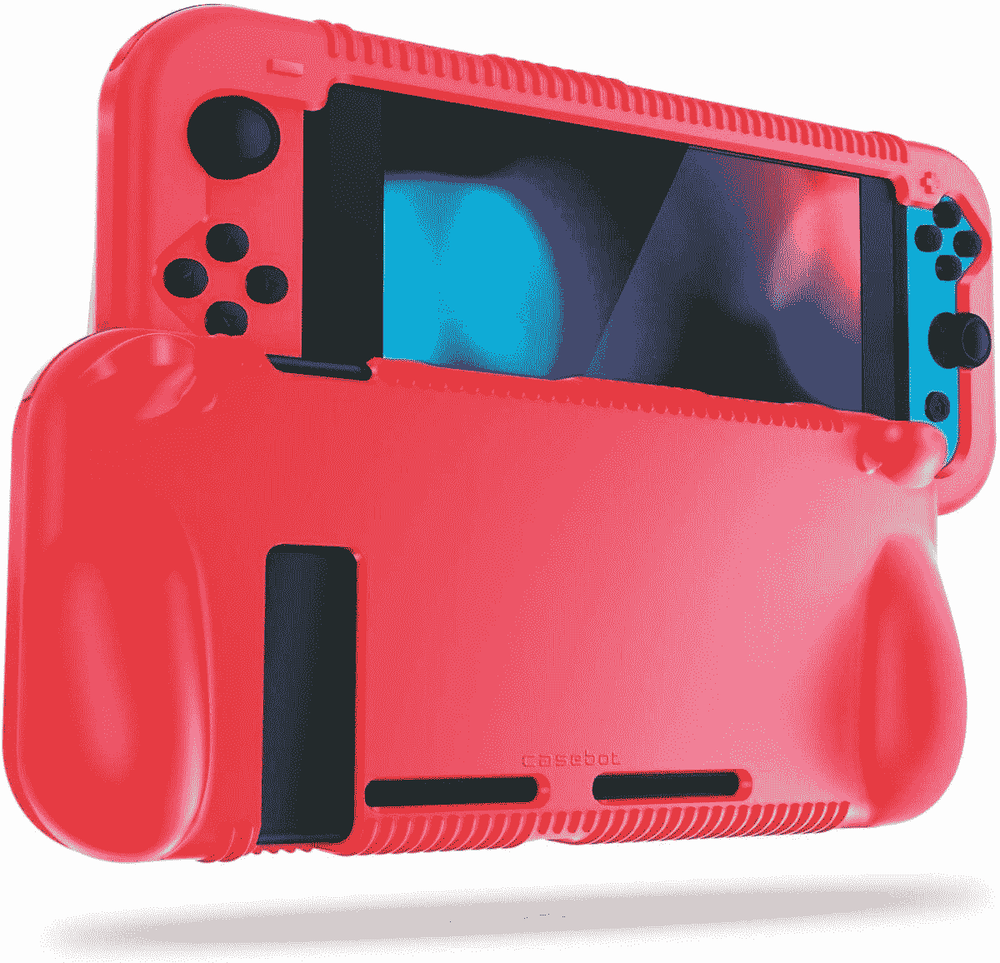</picture> 

FINTIE Silicone Case for Nintendo Switch

##### 芬蒂硅胶任天堂 Switch 盒

不担心把你的快乐骗局从你的开关里拿出来？FINTIE 的硅胶保护套完全包住了你的开关。它防滑，握感极佳，也不会损害功能性保护。

## Switch Lite 保护套

由于任天堂 Switch Lite 纯粹是一款没有可拆卸 Joy-Cons 的便携式设备，因此找到合适的保护壳就不那么令人生畏了。

 <picture>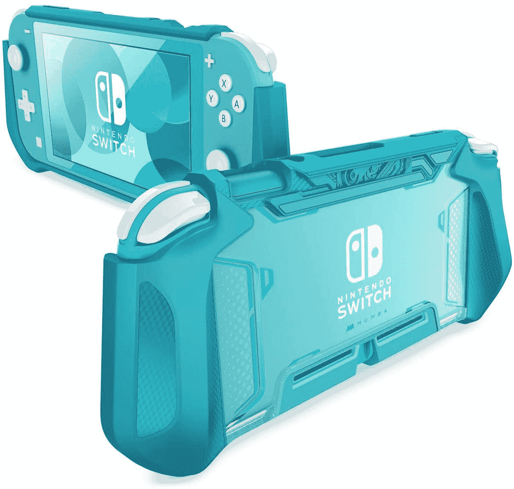</picture> 

Mumba Switch Lite Case

##### 蒙巴任天堂 Switch Lite 表壳

Switch Lite 是一个非常薄的控制台，对于那些手比较大的人来说，他们会很快抽筋。Mumba 的任天堂 Switch Lite 保护套为您提供额外的抓握和保护。

 <picture>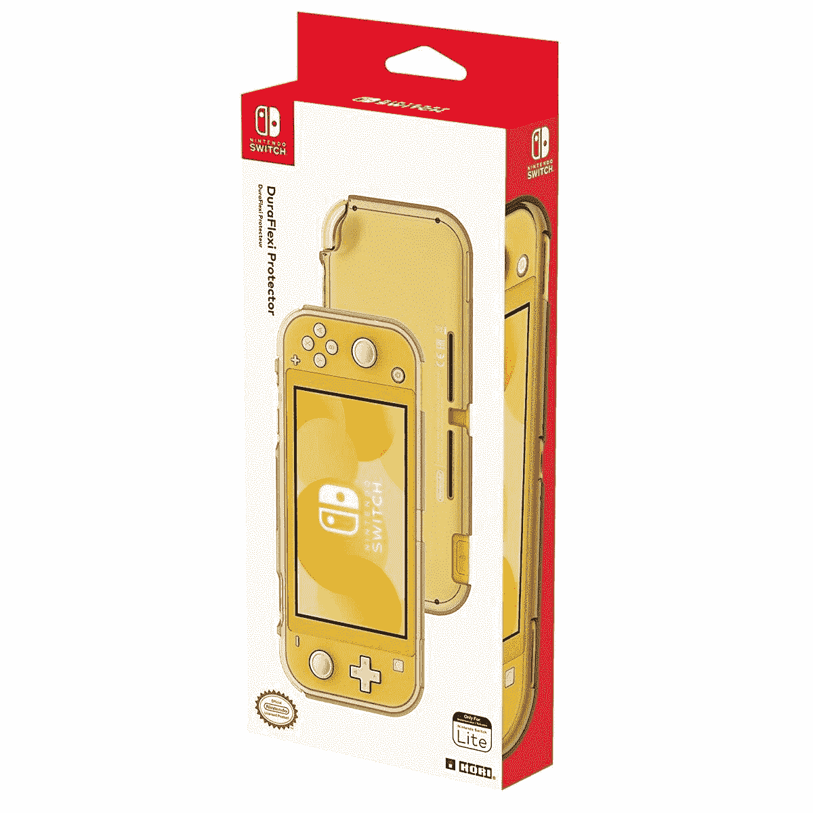</picture> 

Nintendo Switch Lite DuraFlexi Protector

##### 任天堂 Switch Lite DuraFlexi 屏幕保护器

官方案件绝对不会出错！堀的 DuraFlexi 任天堂 Switch 建兴保护壳提供了透明，柔软的保护，肯定会适合，因为任天堂自己批准了它

 <picture>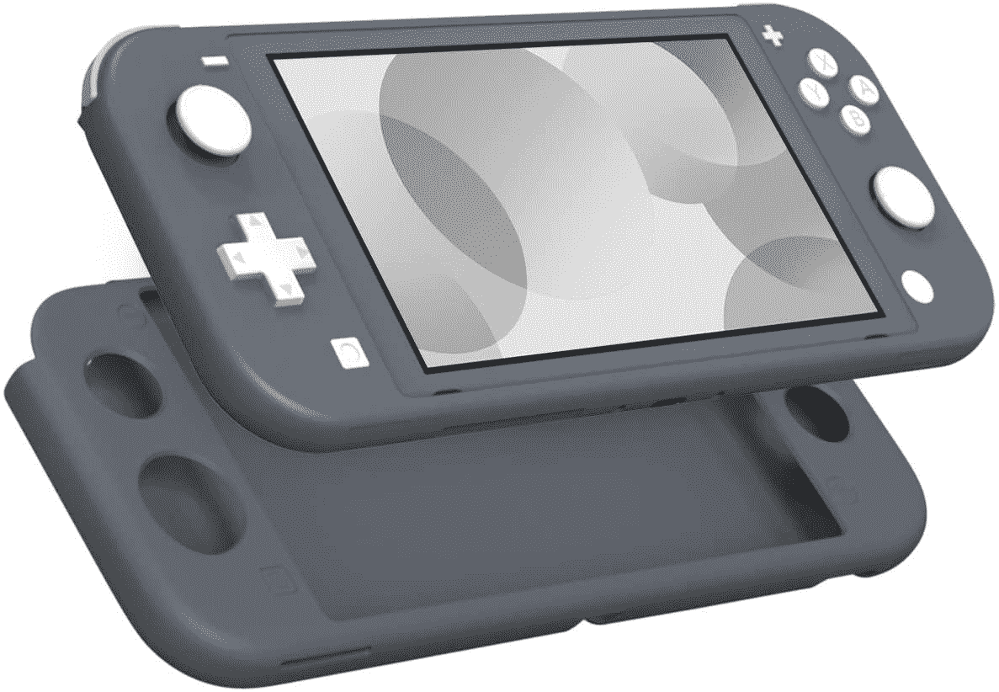</picture> 

MoKo Case for Nintendo Switch Lite

##### 莫科任天堂 Switch Lite 案件

如果你只是想要一些苗条和简单的东西，那么 MoKo 的情况不会错！这是一个简单的硅胶外壳，可搭配您的 Switch Lite，保护您的系统免受刮擦和划痕。

 <picture>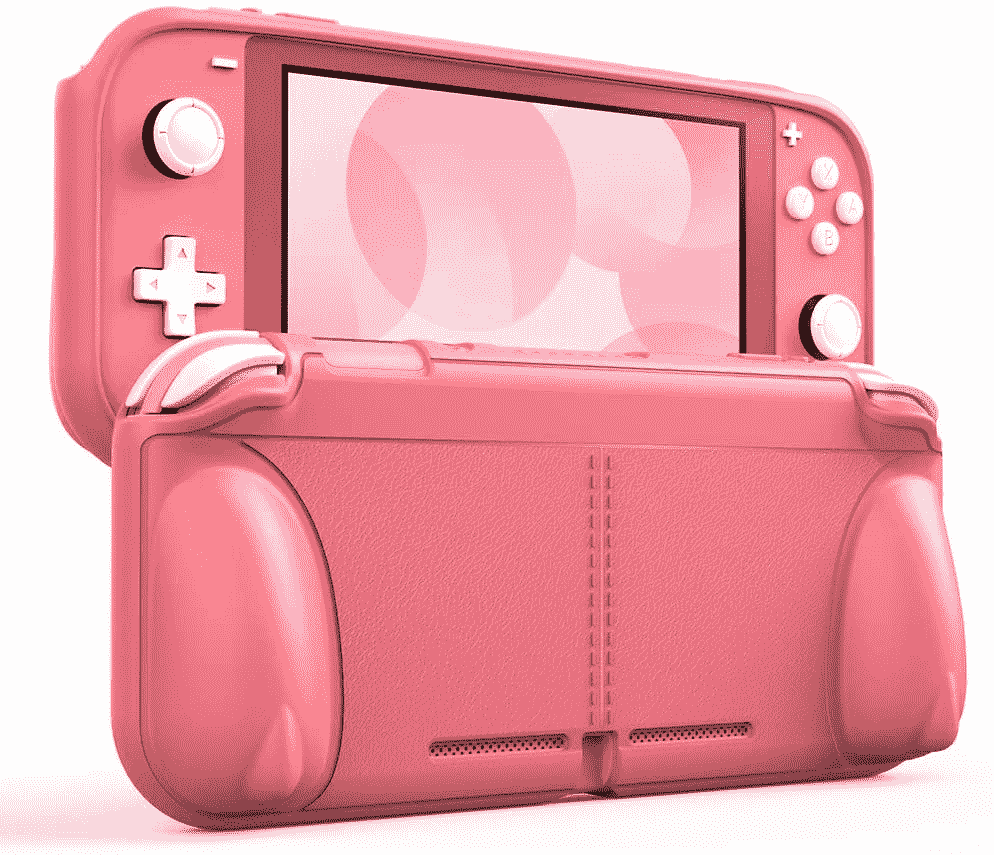</picture> 

Ziidii Protective Case for Nintendo Switch Lite

##### Ziidii 任天堂 Switch Lite 保护套

Ziidii 的 Switch Lite 保护套很特别，因为后手柄可以兼作支架！Switch Lite 没有像原来的 Switch 那样的支架，所以这种情况下 Switch Lite 具有相同的功能。

 <picture>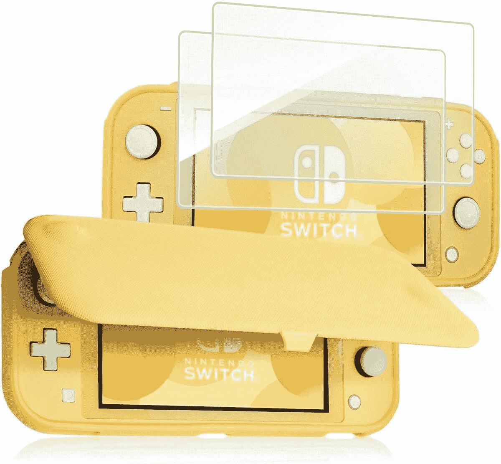</picture> 

ProCase Nintendo Switch Lite Flip Cover

##### ProCase 任天堂 Switch Lite 翻盖

一次购买保护套和旅行箱怎么样？任天堂 Switch 的 ProCase 有一个可拆卸的前盖，因此您可以在玩游戏时将其取下，放回原处以保护屏幕，并将其放入包中！

 <picture>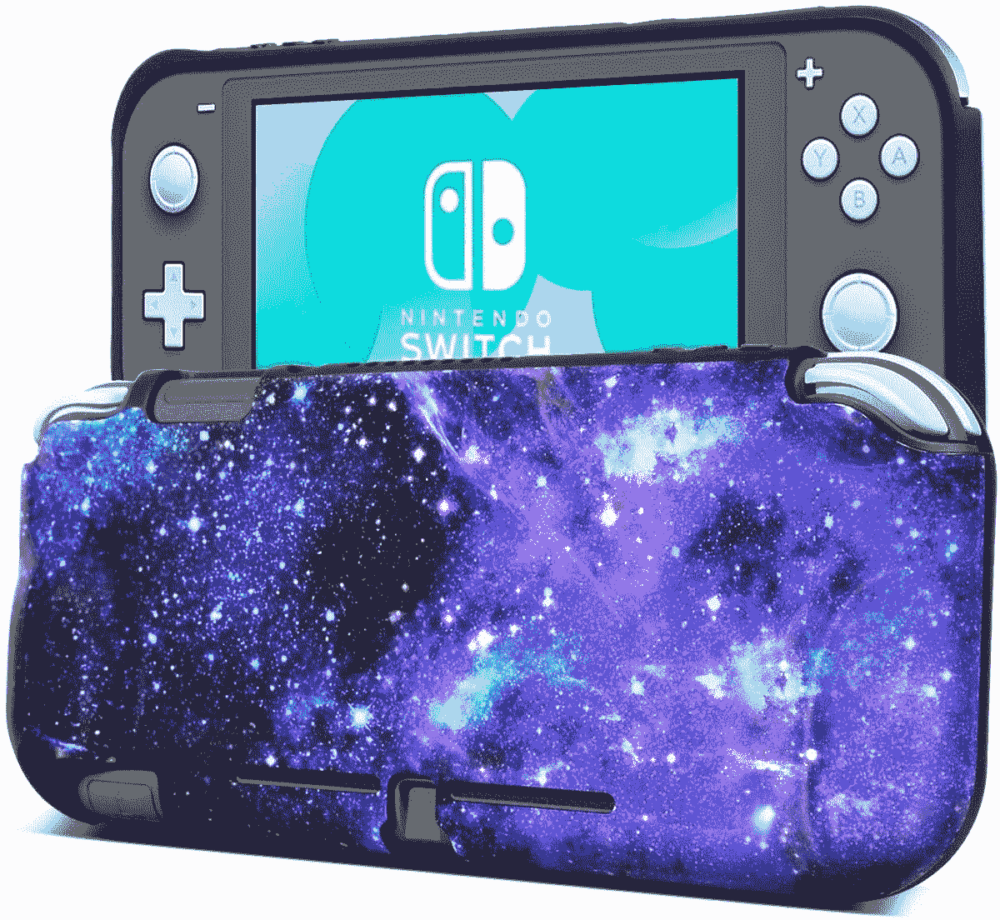</picture> 

BENTOBEN Protective Case

##### 本托本·任天堂 Switch 案

谁不喜欢独特的表壳设计呢？BENTOBEN 的 Switch Lite 外壳有一个特殊的空间主题背景，看起来很棒。像这次综述中的其他案例一样，它也可以防止震动和跌落！

* * *

那么，你应该获得哪一个任天堂 Switch 保护案例？对于普通的 Switch，我推荐自己使用 [JETech 案例](https://www.amazon.com/JETech-Protective-Nintendo-Shock-Absorption-Anti-Scratch/dp/B077FV2S2F?tag=xda-4v2le1i-20&ascsubtag=UUxdaUeUpU6033&asc_refurl=https%3A%2F%2Fwww.xda-developers.com%2Fbest-nintendo-switch-protective-case%2F&asc_campaign=Short-Term)，因为它提供了全方位的保护，同时还能让你根据需要移除 Joy-Cons。不过，明显的“T2”VANJUNN 案例“T3”紧随其后。这真的很简单，但却非常有效！至于 Switch Lite，我喜欢[procaste 翻盖](https://www.amazon.com/ProCase-Protectors-Protective-Magnetically-Detachable/dp/B088ZWSN12?tag=xda-4v2le1i-20&ascsubtag=UUxdaUeUpU6033&asc_refurl=https%3A%2F%2Fwww.xda-developers.com%2Fbest-nintendo-switch-protective-case%2F&asc_campaign=Short-Term)，因为它让我的 Switch Lite 在旅途中非常轻松。你无法击败的东西，工作既是一个保护案件和旅游案件！

您的 Switch 使用哪种情况？请在评论中告诉我们！