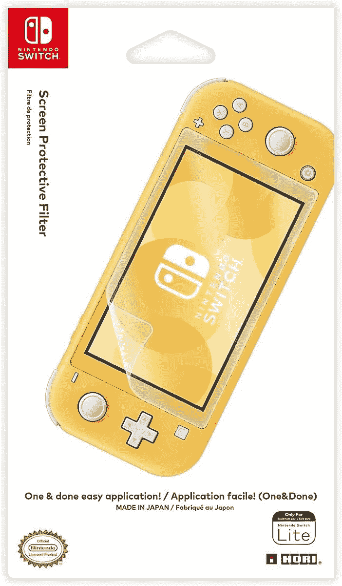
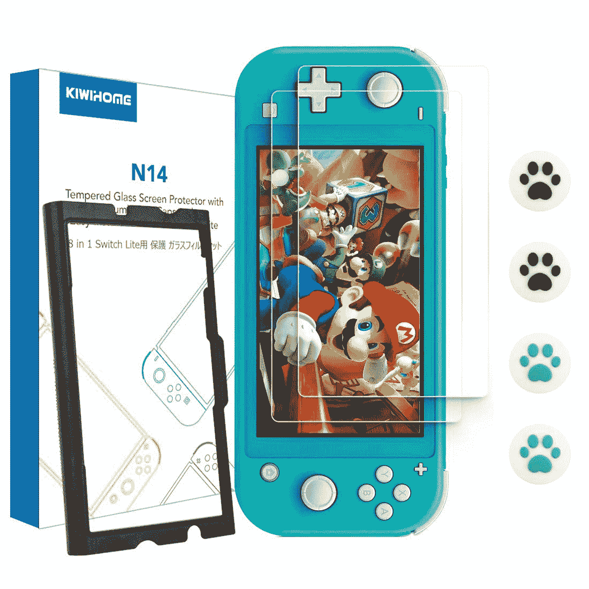
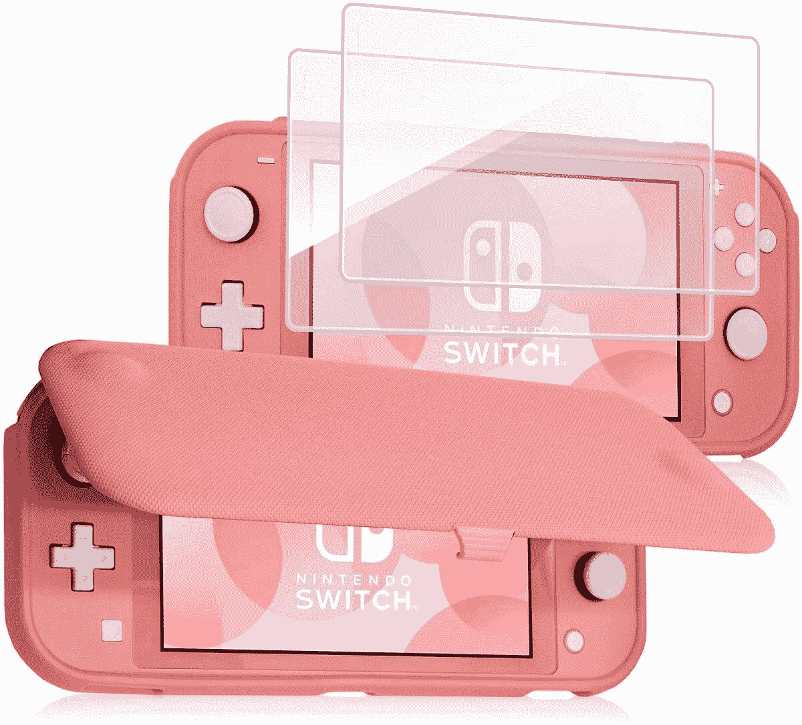
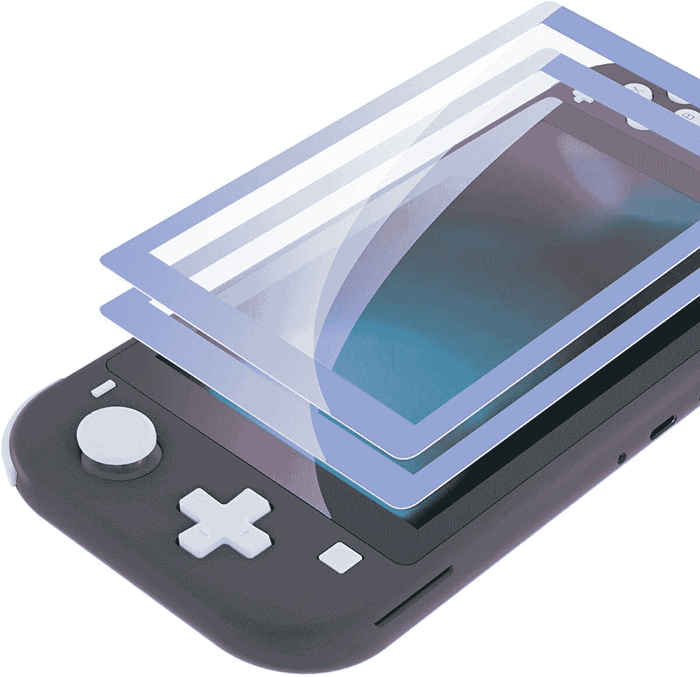
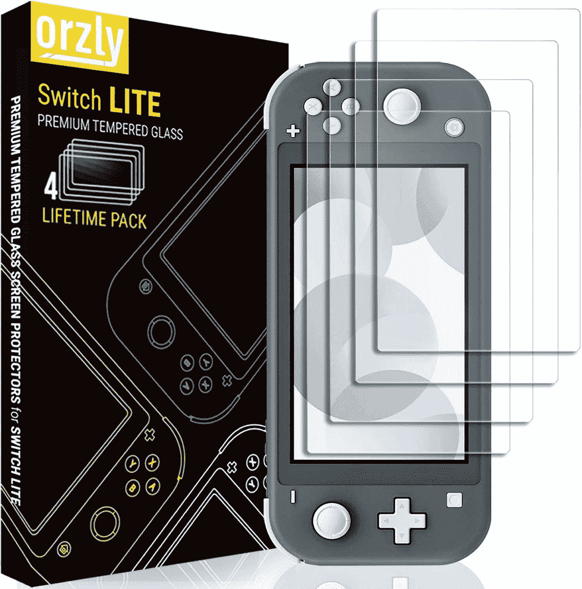

# 2023 年任天堂 Switch 和 Switch Lite 的最佳屏幕保护器

> 原文：<https://www.xda-developers.com/best-nintendo-switch-screen-protectors/>

当你花了几百美元买了一件新的科技产品时，你可能会想保护你的购买免受刮擦和撞击。这个[任天堂 Switch](https://www.xda-developers.com/nintendo-switch-vs-lite/) 也不例外！由于任天堂已经放弃了任天堂 DS 系列的翻盖设计，如果你随身携带，开关很容易划伤屏幕。实际上，它们甚至可以在刚刚坐在被告席上时被划伤！它不是最好的。

屏幕保护器是保护交换机屏幕的一种简单且廉价的方法。看看下面我们挑选的最好的任天堂 Switch 屏幕保护器吧！除了屏幕保护器，如果你正在为你的任天堂 Switch 和 Switch Lite 寻找其他配件，我们已经为游戏机编辑了一个[最佳案例](https://www.xda-developers.com/best-nintendo-switch-protective-case/)和[最佳手柄](https://www.xda-developers.com/best-nintendo-switch-grip/)的列表。

在我们开始之前，有一些重要的事情要注意:你需要根据你是有任天堂 Switch 还是任天堂 Switch Lite 来购买正确的屏幕保护装置。这两种开关型号有**不同的屏幕尺寸**，因此保护器彼此不兼容。

## 任天堂 Switch 屏幕保护器

如果你有一台原装的任天堂 Switch，你会知道在进出 dock 时，屏幕很容易被划伤或磨损。这些任天堂 Switch 屏幕保护器有助于防止损坏您的控制台。

 <picture></picture> 

Hori Nintendo Switch Protective Filter

##### 霍里任天堂 Switch 保护过滤器

说到屏幕保护器，你不能在质量上打折扣。一个坏的屏幕保护实际上可能会损坏你的屏幕！跳过官方授权的 Hori 任天堂 Switch 屏幕保护器的挫折，专门设计来适应开关的屏幕，并得到任天堂质量印章的支持。

 <picture></picture> 

Spigen Tempered Glass Nintendo Switch Screen Protector

##### 斯必根钢化玻璃任天堂 Switch 屏幕保护器

如果你对 Hori 品牌的产品不满意，Spigen 屏幕保护套绝对不会错！Spigen 是手机壳和屏幕保护器的知名品牌，他们通过易于使用的钢化屏幕保护器为任天堂 Switch 带来了同样的品质。看看吧！

 <picture></picture> 

BRHE Dockable Switch Protective Case Cover for Nintendo Switch

##### BRHE 可对接的任天堂 Switch 案例

当然，你可以只得到一套屏幕保护器，或者你可以一次保护你的整个开关！该套装配有一个优质的屏幕保护器，以及开关和 Joy-Cons 本身的东西盖，以及模拟棒的手柄盖。这是所有的码头友好，太！

 <picture></picture> 

eXtremeRate Border Screen Protector

##### 极限边框任天堂 Switch 屏幕保护器

如果你想给你的开关增加一点色彩，你可以选择这些特殊的屏幕保护器！这会用一些看起来有点不同的东西覆盖正常的黑色边框，而不会像外壳或皮肤一样让你不知所措。

 <picture></picture> 

amFilm Tempered Glass

##### amFilm 钢化玻璃任天堂 Switch 屏幕保护器

你可以用很便宜的价格买到两套钢化玻璃屏幕保护器，所以如果你最终损坏了一套，你还有一套备用的。考虑到它是玻璃而不是塑料，所以它很耐刮擦，玩的时候摸起来更光滑。

 <picture></picture> 

HD Tempered glass protector

##### 天天向上钢化玻璃任天堂 Switch 屏幕保护器

虽然前一个选项以一个的价格为您提供了两个屏幕保护，但这一个几乎以同样的价格为您提供了三个。这是一个玻璃屏幕保护器，所以它的外观和手感都更好，而且不像塑料那样容易划伤。另外盒子里还有 3 美元。

## 任天堂 Switch Lite 屏幕保护器

便携式设备很容易被挤在包里，这意味着屏幕可能会因为接触到一些按键或尖角而被划伤。这些任天堂 Switch 建兴屏幕保护器将确保保持您的屏幕在原始状态。

 <picture></picture> 

Hori Nintendo Switch Lite Protective Filter

##### 霍里任天堂 Switch Lite 保护过滤器

任天堂官方保护

 <picture></picture> 

Kiwihome Screen Protector Bundle

##### Kiwihome Nintento 开关屏幕保护器

Kiwihome 的任天堂 Switch Lite 屏幕保护器套装既有屏幕保护器，也有模拟手柄。这种屏幕保护装置也很容易安装，提供有用的指导，以确保保护装置放置正确。看看吧！

 <picture></picture> 

ProCase Nintendo Switch Lite and Flip Case Bundle

##### ProCase 任天堂 Switch Lite 翻盖

怀念翻盖式任天堂 DS 的保护？嗯，这个屏幕保护和案件组合将是你最好的选择。只需 20 美元，即可获得两个屏幕保护器和一个与您的 Switch Lite 颜色相匹配的薄翻盖外壳！

 <picture></picture> 

eXtremeRate Border Screen Protector

##### 极限边框任天堂 Switch 屏幕保护器

如果你想给你的开关增加一点色彩，你可以选择这些特殊的屏幕保护器！这会用一些看起来有点不同的东西覆盖正常的黑色边框，而不会像外壳或皮肤一样让你不知所措。

 <picture></picture> 

amFilm Tempered Glass

##### amFilm 钢化玻璃任天堂 Switch 屏幕保护器

你可以用很便宜的价格买到两套钢化玻璃屏幕保护器，所以如果你最终损坏了一套，你还有一套备用的。考虑到它是玻璃而不是塑料，所以它很耐刮擦，玩的时候摸起来更光滑。

 <picture></picture> 

Orzly Screen Protector

##### 奥兹利·任天堂 Switch 屏幕保护器

Orzly 是配件市场的知名品牌，所以你可以放心，你会得到高质量的屏幕保护。您可以以实惠的价格获得四个无气泡安装的钢化玻璃屏幕保护器。强烈推荐。

你应该选择哪一款任天堂 Switch 屏幕保护？当然这要看你是原装 Switch 还是 Switch Lite，不过 Hori 官方的屏幕保护套不管是原装 Switch 还是 Switch Lite，你真的都不会错。你可以绝对肯定这些屏幕保护器将适合屏幕，因为它有任天堂的质量印章。任天堂不会随便给任何人！该开关还具有触摸控制，Hori 的屏幕保护器保证与触摸屏配合使用。

从那里开始，你不会错的。他们生产高质量的手机壳和屏幕保护套，任天堂 Switch 肯定也是如此。Spigen 任天堂 Switch 屏幕保护器只是比官方的 Hori 稍微贵一点，但 Spigen 在生产钢化玻璃屏幕保护器方面有丰富的经验，所以你知道你得到的是高质量的产品。