# 2023 年任天堂 Switch 和 Switch Lite 的最佳旅行案例

> 原文：<https://www.xda-developers.com/best-nintendo-switch-travel-case/>

# 2023 年任天堂 Switch 和 Switch Lite 的最佳旅行案例

随身携带您的开关？我们已经研究了最好的任天堂 Switch 旅行案例，所以你可以很容易地找到你需要的东西。

任何掌上游戏机都有一个问题——你应该为它买一个外壳吗？答案几乎总是肯定的。不管你打算如何处理这件事，万一发生不幸，一个箱子总是有帮助的。幸运的是，市场上有很多任天堂 Switch 和 Switch Lite 旅行箱。为了让你更容易挑选，我们挑选了一些你现在可以买到的最好的 Switch 和 Switch Lite 旅行箱。

与许多开关配件一样，你想要什么取决于你有一个任天堂 Switch 还是任天堂 Switch 建兴。虽然 Switch Lite 在技术上可以安装在 Switch 旅行箱中，但它不会是一个很好的安装方式，您的设备可能会在箱子中发出嘎嘎声，甚至会损坏。所以最好找个合适的案子。

寻找其他开关配件？我们还有对[控制器](https://www.xda-developers.com/best-nintendo-switch-controllers/)、[舒适手柄](https://www.xda-developers.com/best-nintendo-switch-grip/)和[屏幕保护器的围捕。](https://www.xda-developers.com/best-nintendo-switch-screen-protectors/)如果您想要额外的保护，我们还有一系列 [best 任天堂 Switch 和 Switch Lite 保护套](https://www.xda-developers.com/best-nintendo-switch-protective-case/)。

## 任天堂 Switch 旅行案例

任天堂 Switch 旅游案例的种类比你想象的要多。说到保护您的交换机，这完全取决于您的需求。

 <picture>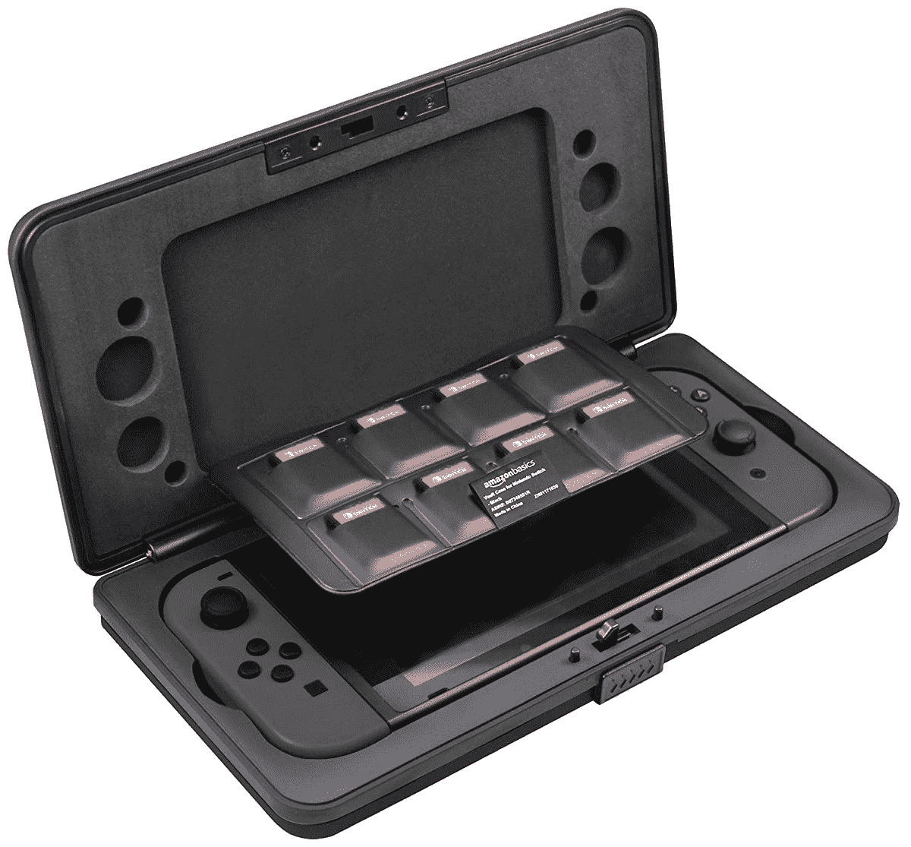</picture> 

AmazonBasics Vault Case

##### 亚马逊基础任天堂 Switch 保险库案例

如果你想为你的任天堂 Switch 提供顶级的保护，这个亚马逊基础案例可以帮助你。它可以存储一个开关控制台和八个游戏卡。此外，它采用双层材料制成，具有额外的强度。表壳有两种颜色可供选择。

 <picture>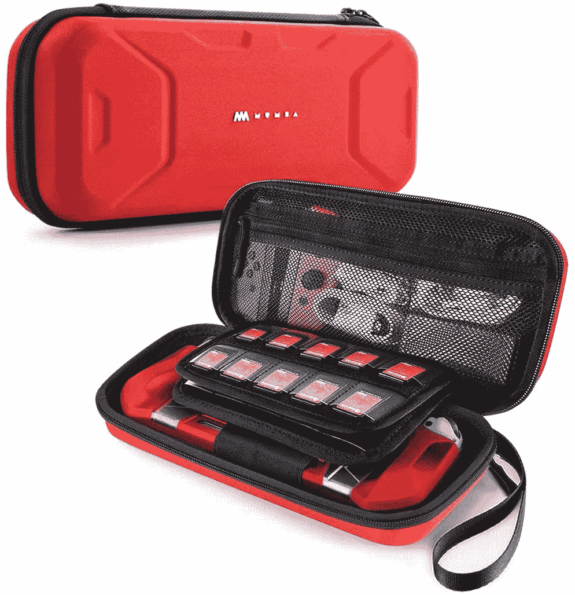</picture> 

Mumba Switch Carrying Case

##### 蒙巴·任天堂 Switch 案

如果你需要一个经得起任何考验的箱子，Mumba 的任天堂 Switch 旅行箱可以满足你的要求。这是一个可以减震的大箱子。

 <picture></picture> 

PowerA Protection Case

##### PowerA 任天堂 Swtich 保护套

如果你厌倦了所有无聊的开关保护套，PowerA 保护套有 13 种设计和颜色可供选择。你可以选择任何东西，从皮卡丘主题的箱子到动物穿越主题的箱子。此外，由于捆绑了泡沫切口，它可以与 Switch 和 Switch Lite 一起使用。

 <picture></picture> 

Orzly Carry Case

##### 任天堂 Switch 的奥兹利案例

如果你正在寻找一个特殊颜色的开关盒，Orzly 可能会有。该品牌出售九种颜色组合的开关盒。该保护套还包括大量空间来存放您的开关及其配件。此外，它还配有 EVA 制成的重型外壳，以保护控制台。

 <picture>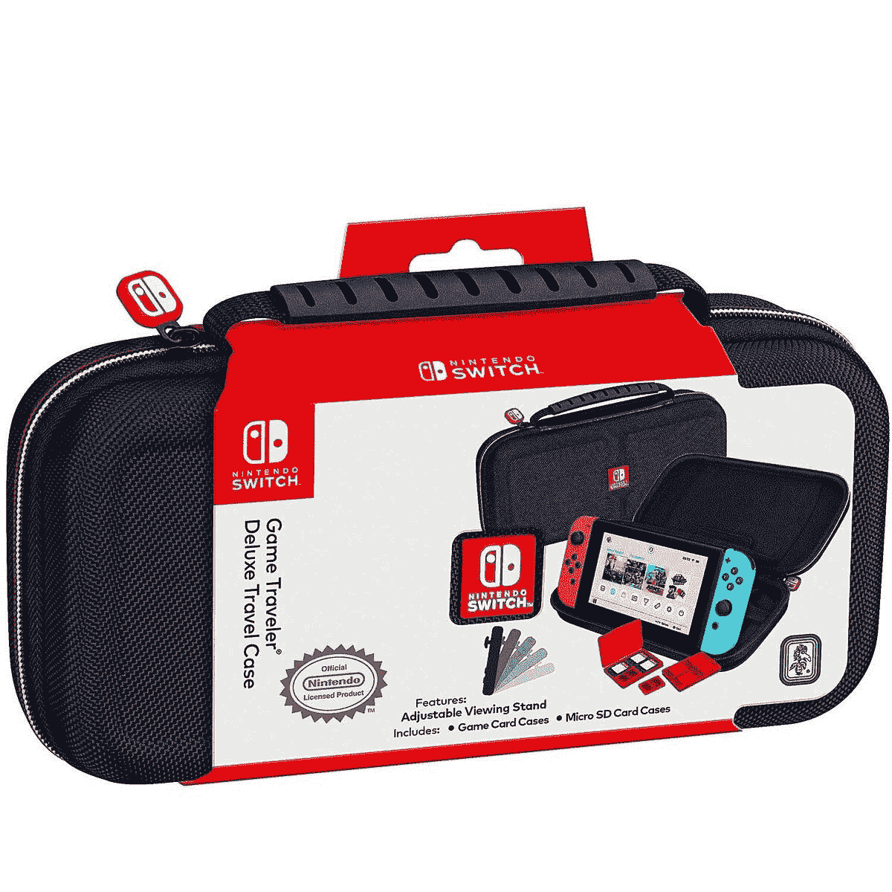</picture> 

Official Nintendo Switch Carrying Case

##### 三星 Galaxy Note 10 S 笔

如果你想确保你受到保护，你不能击败官方开关携带情况。这有空间放置开关和八个游戏，并且有一个可调节的观看台。

 <picture></picture> 

Amazon Basics Carrying Case

##### 亚马逊基础便携包

喜欢软皮保护套吗？然后用亚马逊基础案例。它有空间容纳十个游戏、开关和额外的附件。

 <picture>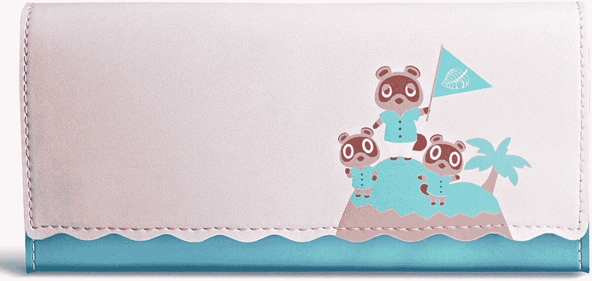</picture> 

Funlab Slim Carrying Case

##### Funlab 超薄便携包

如果你的包里没有太多空间，那就选一个时尚的 Funlab 包吧。它只能容纳五个额外的游戏，但它会保证你的开关安全。

 <picture>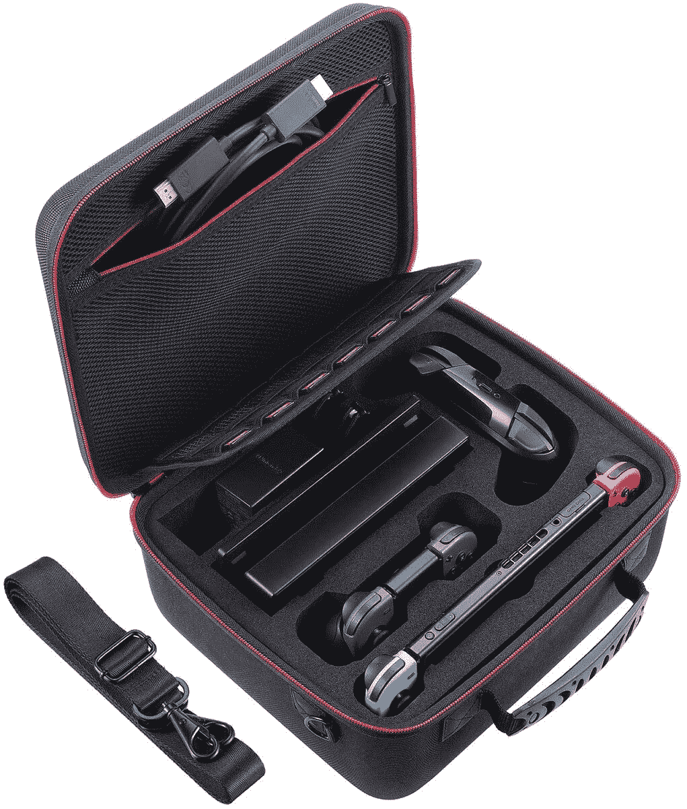</picture> 

Zadii Hard Carrying Case

##### Zadii 硬便携包

有了这个大旅行箱，您不仅可以运输您的交换机，还可以运输坞站、额外的控制器等等。甚至可以举办 21 场！

 <picture>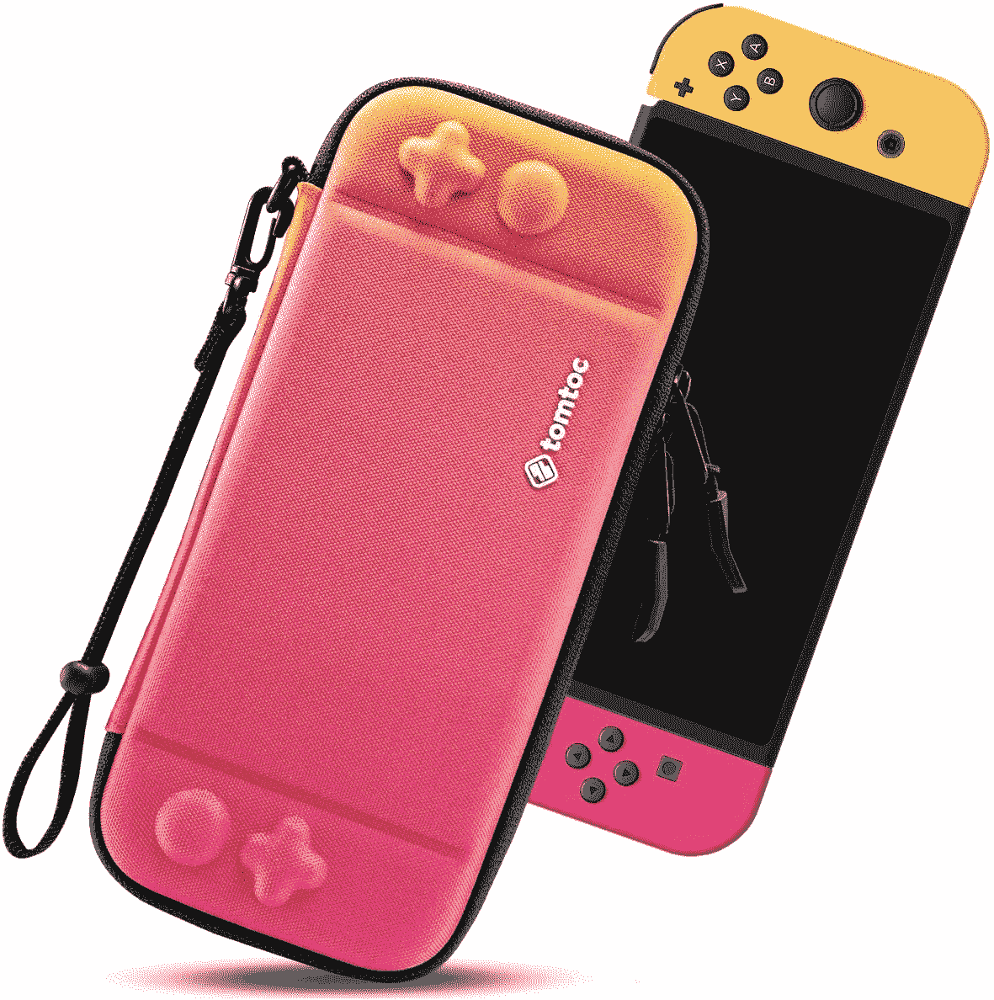</picture> 

Tomtoc Carrying Case

##### Tomtoc 360 保护型笔记本电脑单肩包

Tomtoc 是另一个可靠的硬案例选项。它可以容纳八个游戏，有各种有趣的颜色。

## 任天堂 Switch Lite 旅行箱

考虑到 Switch Lite 是一款只能随身携带的设备，一个旅行箱对它来说非常重要。有各种各样的案例可以满足你的需求。

 <picture></picture> 

HeysTop Carrying Case

##### 海斯多手提箱

HeysTop 的任天堂 Switch Lite 便携包有很大的空间来存放游戏卡、电源适配器和一对小耳机。该公司还捆绑了一个透明的硬盒，屏幕保护器，六个拇指握帽和一张卡片。此外，它由软硬聚碳酸酯制成，可提供必要的保护。

 <picture></picture> 

Tscope Carrying Case

##### t 望远镜携带箱

任天堂 Switch Lite 的 Tscope 便携包因其花卉图案而看起来很可爱。在空间方面，有八个游戏卡的插槽和一个存储配件的网袋。此外，Switch Lite 隔间包括弹性带，用于固定控制台。它使用 PU 皮革和 EVA 制成，您可以获得与外壳捆绑在一起的屏幕保护。

 <picture></picture> 

Orzly Carry Case

##### 任天堂 Switch 的奥兹利案例

和 Switch 一样，Orzly 也为 Switch Lite 提供了一个外壳。由 EVA 制成，有 11 种颜色组合。此外，机箱中还有足够的空间来存放您的主机、墙上适配器、游戏卡等。这款包体积小巧，因此可以轻松放入背包或杂物箱中。

 <picture></picture> 

PowerA Protection Case Kit

##### PowerA 任天堂开关保护盒套件

PowerA 生产官方许可的任天堂 Switch 齿轮，所以你知道如果你接这个案子，你会得到质量。它还配有屏幕保护器和清洁布。

 <picture>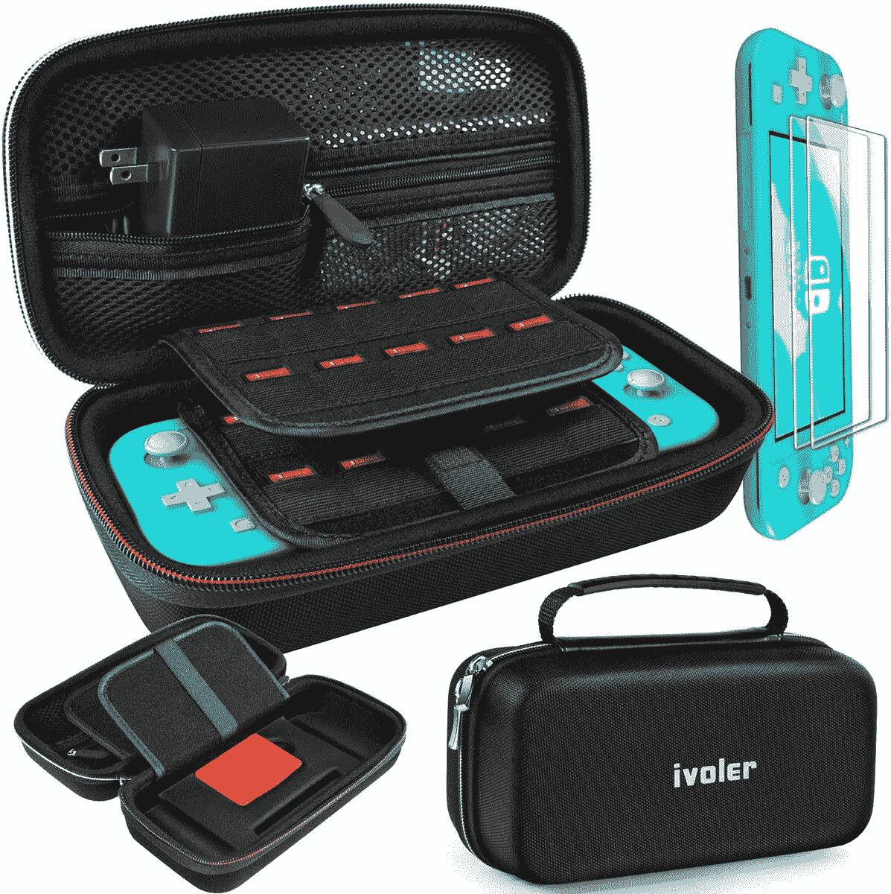</picture> 

iVoler Hard Shell Travel Case

##### iVoler 硬壳旅行箱

如果你需要保存很多东西，iVolar 的硬壳箱将是你的选择。在这个大箱子里，你可以装 20 个游戏，以及一堆配件。

 <picture>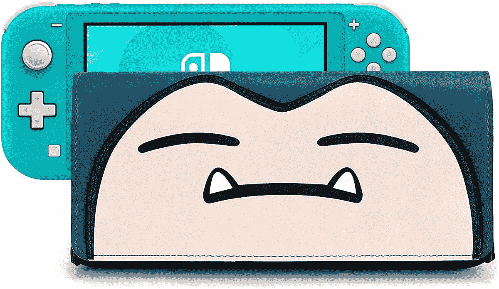</picture> 

Funlab Switch Lite Case

##### Funlab Switch Lite 外壳

像普通的 Switch 一样，Funlab 很薄，可以容纳五个游戏，很容易装进包里。你能抗拒可爱的卡比兽案件吗？

 <picture>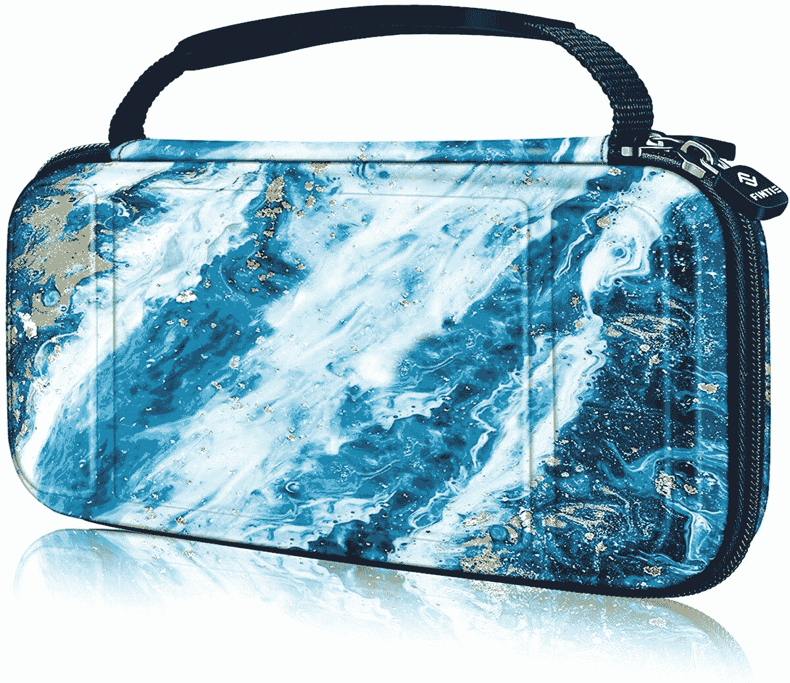</picture> 

Fintie Carry Case

##### 芬蒂·任天堂 Switch 手提箱

如果您的 Switch Lite 需要最好的保护，这款 Fintie 保护套配有防震保护和一系列不同的款式。这种情况下可以容纳 15 个案件，以及 2 个微型硬盘。

 <picture>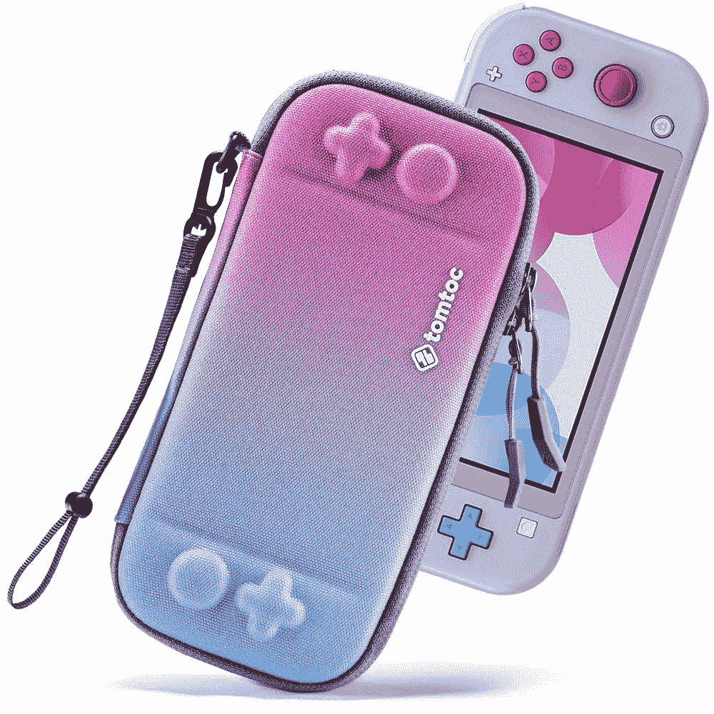</picture> 

Tomtoc Switch Lite Carrying Case

##### Tomtoc 开关轻型便携包

Tomtoc 是另一个可靠的硬案例选项。它可以容纳八个游戏，有各种有趣的颜色。

 <picture>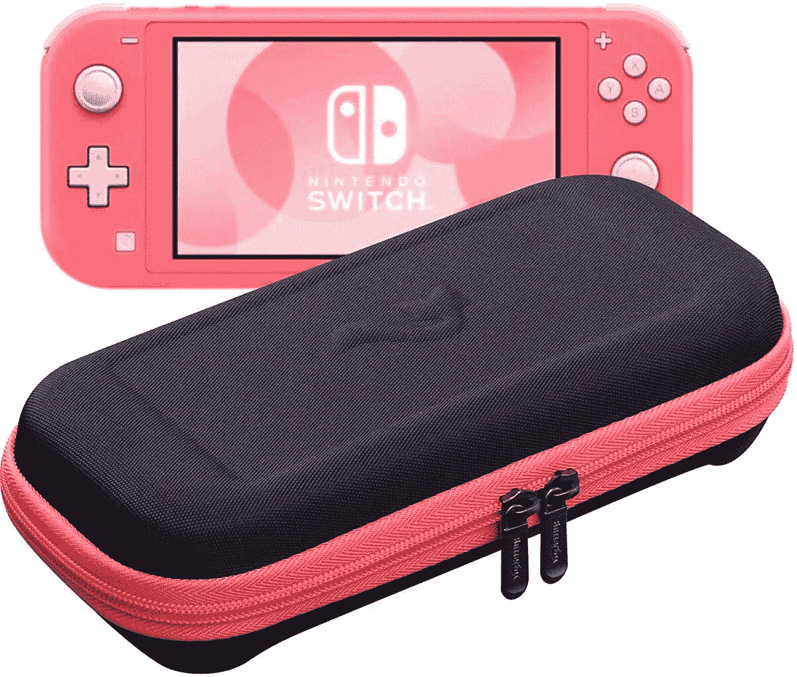</picture> 

Tomtoc Switch Lite Carrying Case

##### Tomtoc 开关轻型便携包

你想让你的 Switch Lite 旅行箱多一点色彩吗？ButterFox 的箱子是半硬壳的大箱子，大部分是黑色的，最多可以装 20 个游戏。

如你所见，有很多选项可供选择。最后，这真的取决于您想要的保护级别。虽然 [Amazon Basics Vault](https://www.amazon.com/AmazonBasics-Vault-Case-Nintendo-Switch-Black/dp/B07348551R/?tag=xda-773vvkn-20&ascsubtag=UUxdaUeUpU5892&asc_refurl=https%3A%2F%2Fwww.xda-developers.com%2Fbest-nintendo-switch-travel-case%2F&asc_campaign=Short-Term) 将为您的交换机提供重型保护，但它也相对笨重。而 PowerA 保护套提供了很多设计和颜色选择，但并不太重。同样，对于 Switch Lite，您可以从 Orzly、HeysTop 和 TomToc 获得很多选择。

您计划为您的 Switch 或 Switch Lite 购买哪种机箱？请在评论区告诉我们。