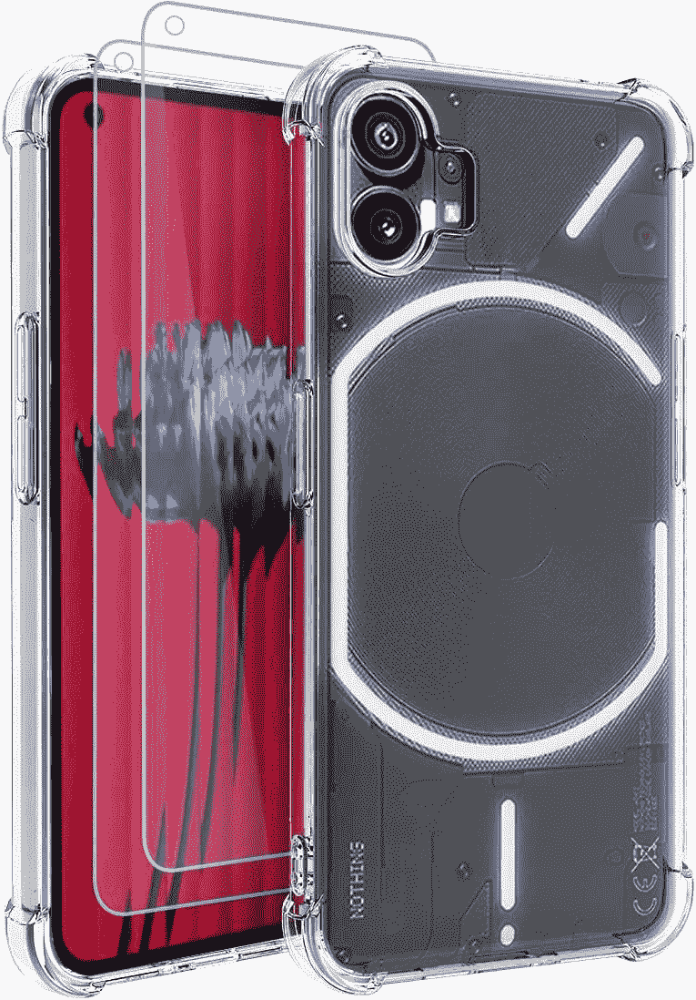
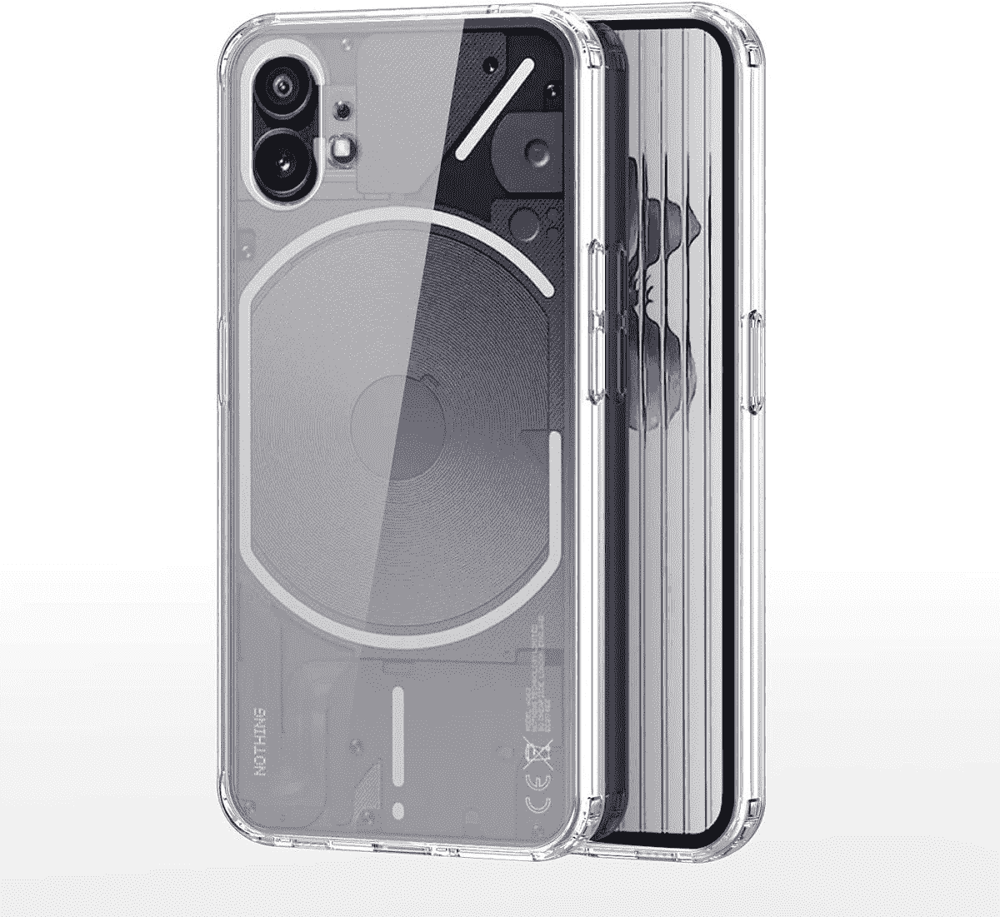
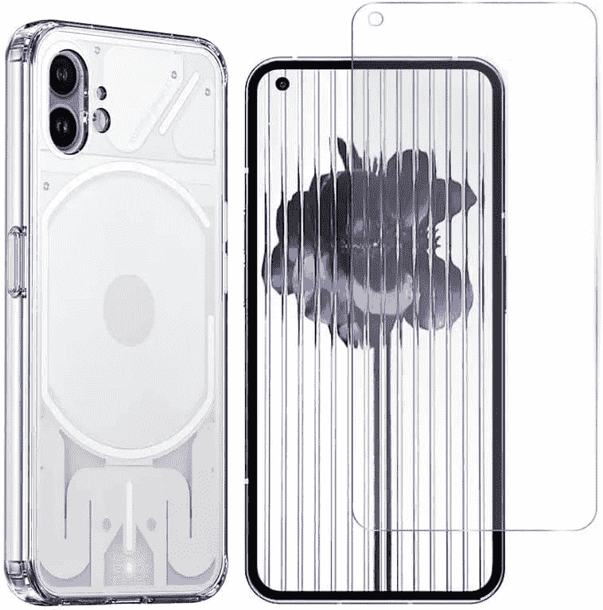
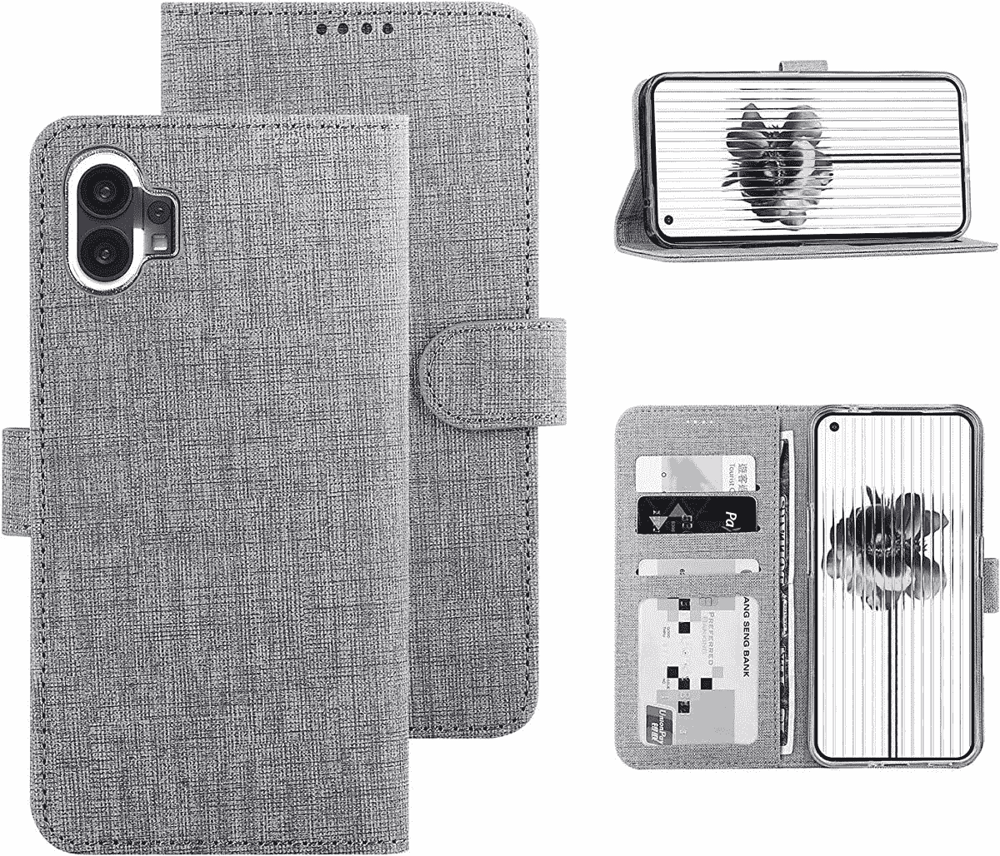
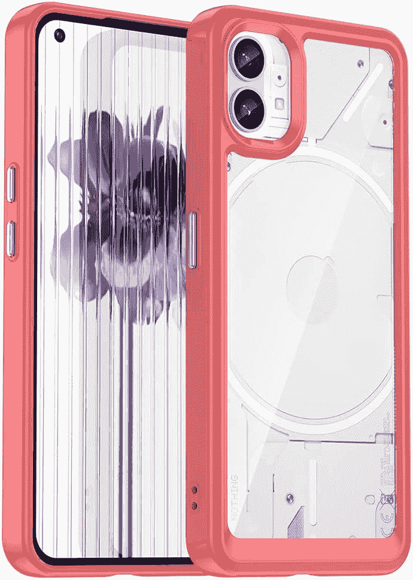
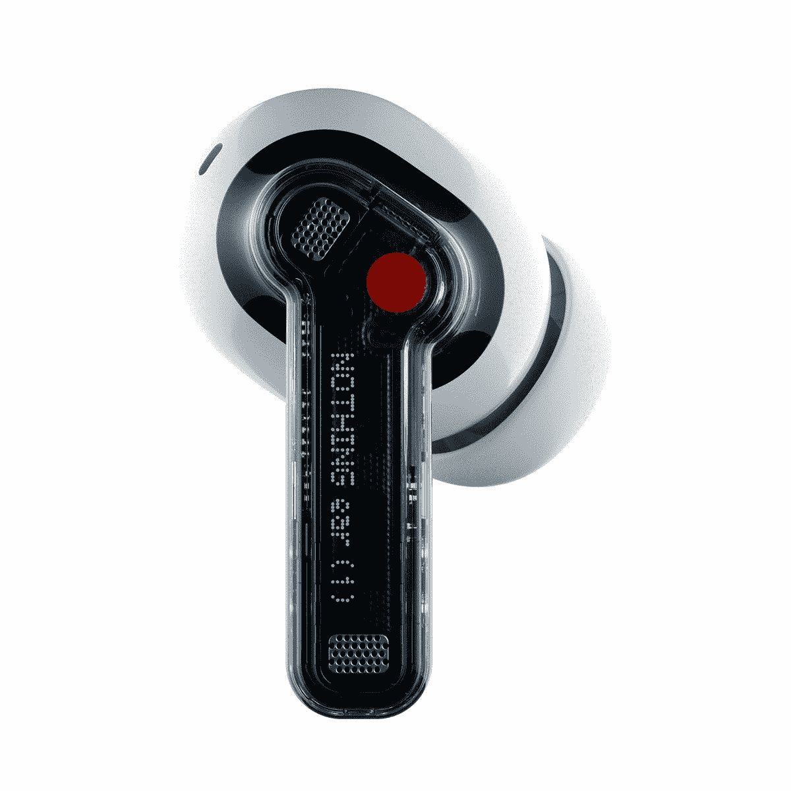
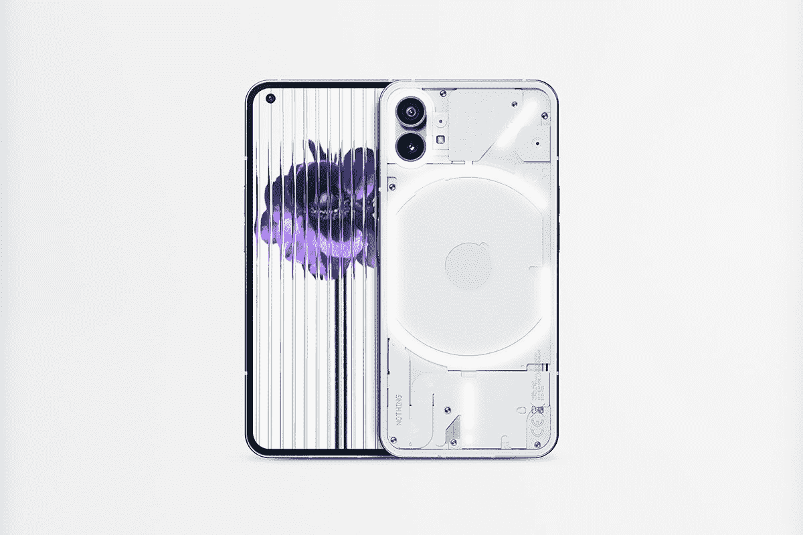

# 一无所有手机的最佳配件 1

> 原文：<https://www.xda-developers.com/best-nothing-phone-1-chargers/>

Carl Pei 的新公司推出的第一款智能手机“Nothing Phone 1 ”采用了新颖的设计，与目前的中档智能手机有所不同。虽然不像裴希望你想象的那样具有开创性，但这是一家全新智能手机公司值得关注的首次尝试。

凭借半透明的设计，Nothing Phone 1 可以让你看到它的一些内部部件，包括无线充电线圈和螺丝。然而，这种透明设计也使手机更容易出现划痕、指纹和污迹。这就是为什么你应该把你崭新的一无所有的手机一拿到手就放进保护套里。

下面，我们总结了在英国销售的 Nothing Phone 1 的最佳案例。此外，我们还为您整理了可以与全新手机搭配的最佳充电器、线缆和耳塞。

## 最佳无电话 1 箱

为一无所有的手机 1 挑选外壳时，必须确保外壳不会遮挡透明背面或 LED 条。值得庆幸的是，有许多混合和硅胶外壳具有半透明的背面，让你可以炫耀手机的自然美。

*   <picture></picture>

    Osophter

    ##### Osophter 字形无手机 1 外壳

    另一个明显的情况是透明的背部和 LED 灯带并不碍事。表壳由减震 TPU 制成，边角处有额外的缓冲，可提供更好的跌落保护。

*   <picture></picture>

    DU DUICS

    ##### DU DUICS Clear Nothing Phone 1 case

    clear case 因随着时间的推移而变黄而臭名昭著，但来自 DUX DUCIS 的这款 Clear case 采用了一种抗黄涂层，使其保持晶莹剔透。该案件使用了减震 TPU 框架和硬电脑背。

*   <picture></picture>

    SPGKA

    ##### SPGKA clear Nothing Phone 1 Case

    一款纤薄透明的廉价保护套，可防止日常划痕和指纹，同时让您享受 Nothing Phone 1 的真正魅力

*   <picture></picture>

    RWMM

    ##### RWMM Hybrid Nothing Phone 1 case

    这款纤薄的外壳由 RWMM 特色的 TPU 和聚碳酸酯混合构造而成，用于改善防震和跌落保护。凸起的嘴唇可以保护相机和屏幕，而防滑涂层可以提供更好的抓握力。你还可以得到一个免费的塑料屏幕保护。

*   <picture></picture>

    Draamvol

    ##### Draamvole 皮革翻盖无外壳手机 1 外壳

    这是一款非常有趣的翻盖外壳，采用不透明的前盖和透明的后盖，让您可以看到无外壳手机的透明设计和灯光。表壳由优质合成革和防震硅胶材料制成。

*   <picture></picture>

    fol uu 钱包保护套

    ##### fol uu 钱包无手机 1 保护套

    无手机 1 的透明背面和 LED 灯在这种情况下是看不到的，但是你可以在保护显示屏的同时存放你的信用卡和现金。这个箱子由柔软的合成帆布制成，有蓝色、黑色和灰色。

*   <picture></picture>

    sea hai

    ##### sea hai TPU bumpton Nothing Phone 1 Case

    一款混合透明保护套，采用防刮 PC 背面和柔软的 TPU 保险杠，保护您的设备免受碰撞、跌落、指纹和表面划痕的影响。它有红色、蓝色和黑色三种颜色可供选择。

## 一无所有手机的最佳无线充电器 1

Nothing Phone 1 支持 Qi 无线充电，虽然这不是给手机充电的最快方式，但它超级方便。这些 Qi 认证的无线充电垫提供了快速的无线充电体验，并且具有良好的散热性能。市面上有很多[优秀的无线充电器](https://www.xda-developers.com/best-qi-wireless-charger/)，但这些是最适合 Nothing Phone 1 的。

*   <picture></picture>

    Anker

    ##### Anker 15W 无线充电器

    这款来自 Anker 的充电板提供了最大 15W 的功率输出，可以无线充电您家中的 Nothing Phone 1 和其他兼容设备。充电器采用铝制底座，便于散热，并配有防滑硅胶垫，可在充电过程中确保设备安全就位。

*   ##### 三星无线充电器单个

    这款来自三星的无线充电板可提供 15W 的功率，实现快速无线充电体验。它有一个内置的冷却风扇，以防止过多的热量积累，使充电器能够长期保持其峰值充电速度。

*   <picture></picture>

    Amazon basics 无线充电座

    ##### Amazon basics 无线充电座

    Amazon basics 无线充电座是目前市面上最便宜的无线充电器之一，支持高达 10W 的 Qi 充电。不幸的是，你没有获得充电器捆绑的交流适配器，所以你必须使用 18W 的适配器才能获得最佳效果。此外，充电器中还有两个充电线圈。

## 一无所有手机的最佳线缆 1

如今，USB-C 电缆在各种设备中变得非常普遍，但并不是所有设备都一样。[最好的 USB-C 电缆](https://www.xda-developers.com/best-usb-cables/)比许多手机自带的普通电缆更耐用，传输速度更快，这就是为什么我们想为您的一无所有的手机 1 指出一些很棒的电缆。

*   <picture></picture>

    A nope

    ##### A nope USB-充电器

    A nope USB-A 转 USB-C 线采用 L 形设计，方便在充电的同时使用手机玩游戏和看视频。该电缆长 6.6 英尺，支持快速充电和数据传输速度。

*   ##### JSAUX USB-C 转 USB-A

    JSAUX 的这款编织 USB-A 转 USB-C 线采用军用级材料制成，并采用了应力消除设计。它可以提供高达 3.1A 的功率。

## 一无所有的手机 1 最佳 TWS 耳塞

如果你想为你的一无所有的手机 1 挑选一副[最好的无线耳塞](https://www.xda-developers.com/best-wireless-earbuds/)，我们建议你看看这些选项。它们都很时尚，提供出色的音频质量，并具有主动噪音消除功能。

*   <picture></picture>

    无物耳 1

    ##### 无物耳 1

    无物耳 1 无线耳塞以其半透明的设计在其他真正的无线耳塞中脱颖而出。这些耳塞听起来性价比不错，而且它们还提供有效的 ANC、长电池寿命等功能。

*   三星 Galaxy Buds 2 提供卓越的声音、有效的 ANC 和清晰的通话。它们重量轻，舒适贴合，可连续播放长达 5 小时。

*   <picture></picture>

    Oppo Enco X2

    ##### Oppo Enco X2

    Oppo Enco X2 是最好的中音真正无线耳塞之一。它们为高音配备了 11 毫米动态驱动器，为低音配备了 6 毫米平面振膜单元，以实现完美平衡的声音。ANC 也很棒，加上充电外壳，它们的续航时间可达 40 小时。

    T32

这些是无手机 1 的外壳、充电器、电缆和 TWS。即使你不喜欢它的透明设计和发光二极管，Nothing Phone 1 也有很多功能，包括对称边框的漂亮 AMOLED 显示屏，高通骁龙 778G Plus 芯片组，高达 12GB 的内存，双 50MP 摄像头，以及支持 33W 快速充电的 4,500mAh 电池。

 <picture></picture> 

Nothing Phone 1

无手机 1 融合了独特的透明设计和强大的硬件。