# XDA 奖-2021 年最佳技术

> 原文：<https://www.xda-developers.com/best-of-2021/>

每年，我们都会在消费技术领域看到令人难以置信的创新，包括但不限于智能手机、平板电脑、智能手表、笔记本电脑和个人电脑等。2021 年是令人兴奋的一年，许多公司都尽了最大努力，取得了成功，作为消费者，我们不可能要求更好的结果。我们在 XDA 不仅使用和回顾了很多这样的产品，而且还进行了个人购买和广泛的推荐，因为这些技术体验对我们产生了巨大的影响。是时候回顾一下这些产品了，我们将向您展示 2021 年最佳技术。

**浏览这篇文章:**

移动的

计算

* * *

## 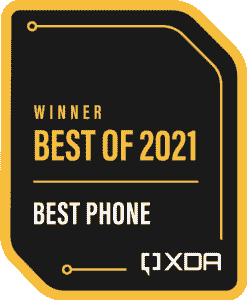

## 年度最佳智能手机:三星 Galaxy Z Fold 3

这是最难选择的类别之一，因为“伟大的智能手机”的定义仍然足够广泛，可以满足一百种甚至更多的需求。无论哪一年，最好的智能手机都应该是那些给人印象最深刻的规格，同时又处于智能手机创新巅峰的手机。竞争对手可以接近，但最好的智能手机包含了与市场上任何其他产品不同的终极体验。一部被普遍接受的手机，它不仅能惊人地工作，而且每一步都能让用户“惊叹”。连续一年，三星凭借其可折叠手机摘得桂冠，因为[三星 Galaxy Z Fold 3](https://www.xda-developers.com/samsung-galaxy-z-fold-3-review/) 是我们 2021 年最佳智能手机。

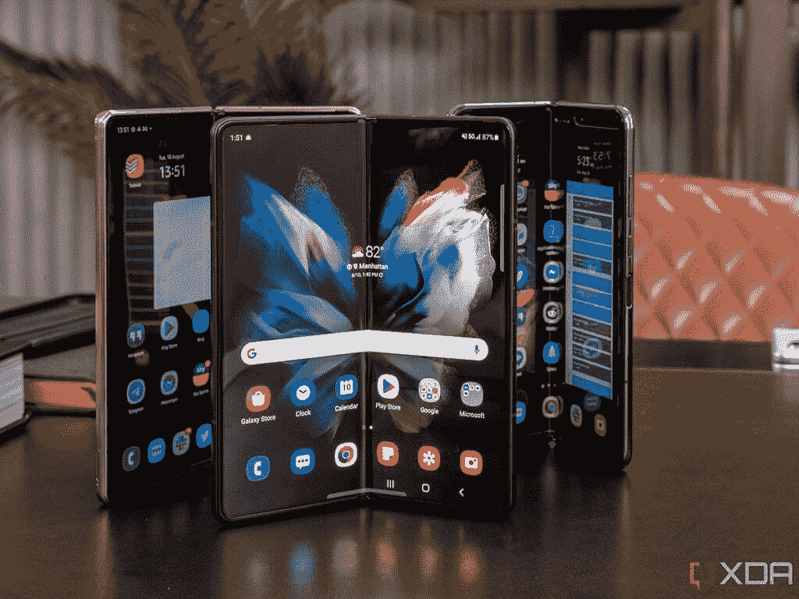

三星 Galaxy Z Fold 3 继承了其前身的精华，并进一步完善。虽然我们认为 Galaxy Galaxy Z Fold 2 去年做得很好，但三星设法用一款在充满增量升级的一年中改进最多的产品给我们留下了深刻印象。Galaxy Z Fold 3 采用了传统的玻璃平板旗舰产品，并将其制作成了如何实现可折叠的教科书:更强的框架和屏幕材料，IPX8 防水，S Pen 支持等等。无论你在哪个国家购买，硬件都是全球顶级的。这款手机在内部显示屏上没有凹槽，因为三星在手机上还包括了一个屏幕下摄像头，尽管我们同意在这方面有很大的改进空间。然后是三星专门为 Z Fold 3 添加的一个 UI 中的[软件功能，这些功能将可折叠体验提升到了任何玻璃板智能手机都无法企及的临界点。相机的设置对于手机目标用户来说也是有竞争力的。虽然价格不是每个人都能消化的，但许多人都会同意，如果今年有一款手机能够证明其 4 位数美元的价格，那就是这款手机。](https://www.xda-developers.com/samsung-galaxy-z-fold-3-one-ui-feature-highlights/)

 <picture>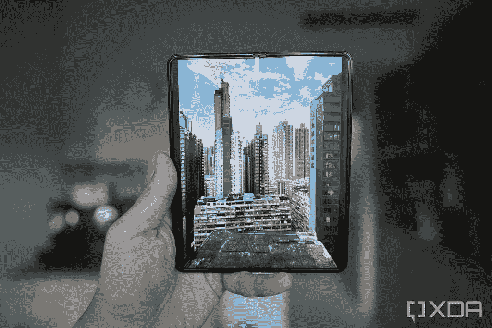</picture> 

Galaxy Z Fold 3

作为一个完整的技术包，Galaxy Z Fold 3 是许多可随身携带的创新。如果你可以在口袋里放一部手机，让人们为之倾倒，同时还能完成工作，三星 Galaxy Z Fold 3 应该是你的首选。

### 三星 Galaxy Z Fold 3

三星 Galaxy Z Fold 3 是有史以来最精致的可折叠智能手机，也是我们评选的 2021 年最佳智能手机。以合理的价格，您可以获得今年最好的智能手机体验之一，并配有主动手写笔支持和创新的软件功能来完成该套餐。

**Affiliate Links**

Samsung

[View at Samsung](https://shop-links.co/link/?exclusive=1&publisher_slug=xda&article_name=XDA+Awards+--+The+Best+Tech+of+2021&article_url=https%3A%2F%2Fwww.xda-developers.com%2Fbest-of-2021%2F&u1=UUxdaUeUpU6275&url=https%3A%2F%2Fwww.samsung.com%2Fus%2Fsmartphones%2Fgalaxy-z-fold3-5g%2Fbuy%2F)

### 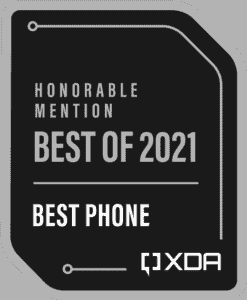

### 年度最佳智能手机荣誉奖:苹果 iPhone 13 Pro，一加 9 Pro

这一部分的亚军是两款同样提供出色体验的智能手机——智能手机带有恰到好处的额外功能，可以提供近乎完美的体验。他们不一定在自己的工作中处于领先地位，但他们处理工作的精细程度在其他智能手机中很难找到。它们也随处可得，易于推荐，让它们成为你不会出错的智能手机。2021 年，苹果 iPhone 13 Pro 和一加 9 Pro 获得了荣誉奖。

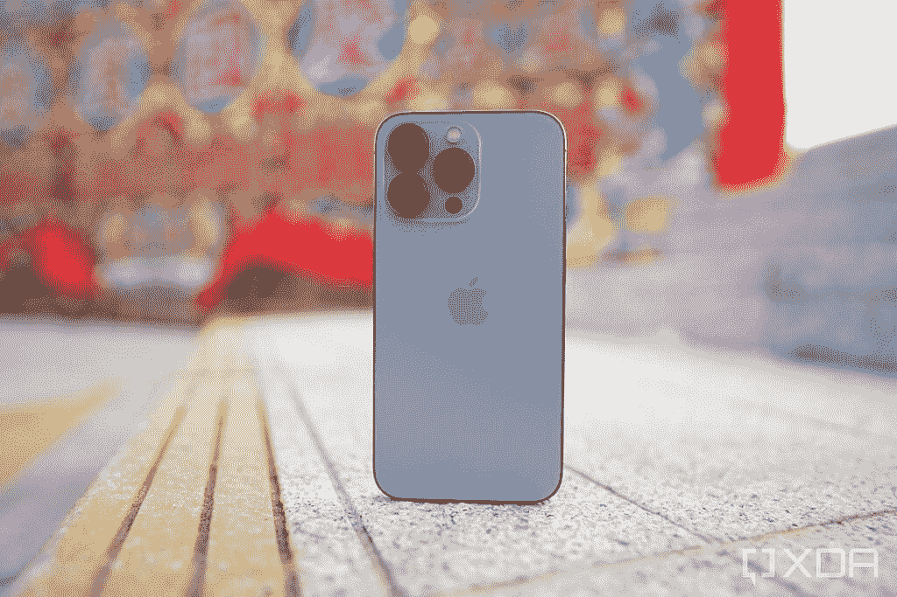

[苹果 iPhone 13 Pro 是你今年应该购买](https://www.xda-developers.com/apple-iphone-13-pro-review/)的 iPhone。它拥有你期望从顶级旗舰中获得的所有智能，它还拥有最好的相机系统之一，尤其是如果你喜欢视频而不是照片的话。苹果智能手机上的应用支持生态系统也非常出色，实际上每一个应用在 iOS 上的运行都比在 Android 上要好。无论您是将手机用作工具还是作为一种权力声明，iPhone 13 Pro 都可以轻松实现这两个目的。

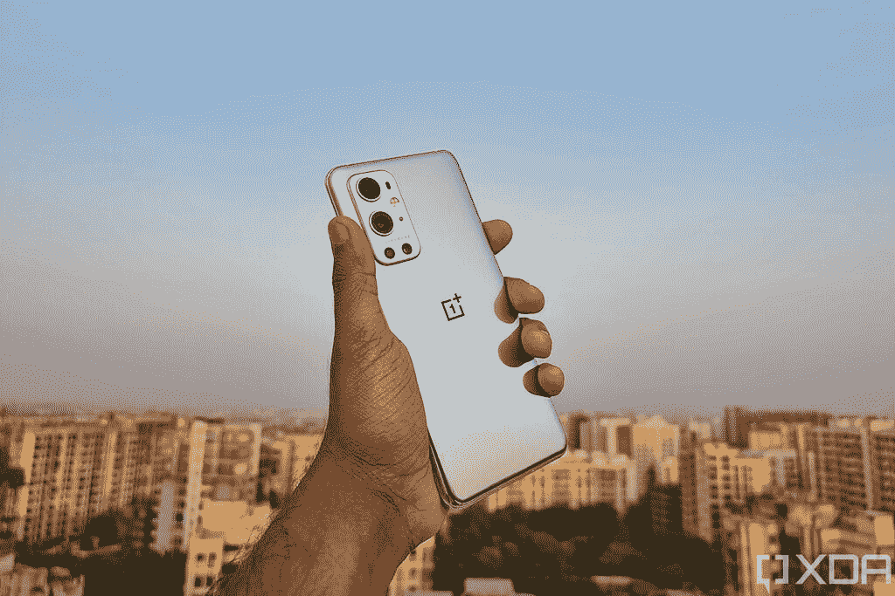

同样，[一加 9 Pro 是一款广受好评的智能手机的最佳全面推荐产品之一。虽然今年“旗舰”的定义可能已经被 Ultras 扩展，但一加 9 Pro 戴上了实用性的帽子，提供了难以争辩的多样化功能集。它拥有 Android 智能手机上最好的性能之一，最好的显示屏之一，以及许多其他功能，这些功能结合在一起提供了出色的整体体验。虽然竞争对手可以在一两个类别中超越手机，但手机的整体体验不仅仅是各个部分的总和。这是一加制造的最好的智能手机，仍然很容易推荐。其他竞争对手要么不是在世界范围内广泛存在，要么存在地区差异，这使得它们并不理想。有了一加 9 专业版，你可以肯定你会得到一个伟大的智能手机。](https://www.xda-developers.com/oneplus-9-pro-review/)

### 苹果 iPhone 13 Pro

苹果 iPhone 13 Pro 是今年要购买的 iPhone，这要归功于 120Hz 的显示屏、更小的凹槽、A15 芯片和更好的摄像头。

**Affiliate Links**

Amazon

[View at Amazon](https://www.amazon.com//dp/B09G9TX631/?tag=xda-5ajdjjr-20&ascsubtag=UUxdaUeUpU6275&asc_refurl=https%3A%2F%2Fwww.xda-developers.com%2Fbest-of-2021%2F&asc_campaign=Short-Term)

### 一加 9 专业版

一加 9 Pro 代表了 2021 年市场上最好的 Android 体验之一，具有出色的性能、出色的显示、出色的摄像头等等。

**Affiliate Links**

OnePlus

[View at Oneplus](https://onepluscom.pxf.io/c/2233363/916678/12532?subId1=UUxdaUeUpU6275&subId2=exda&u=https%3A%2F%2Fwww.oneplus.com%2Foneplus-9-pro)

* * *

### 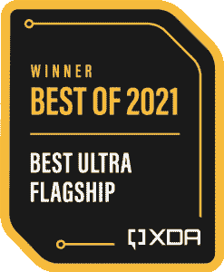

## 年度最佳旗舰产品:三星 Galaxy S21 Ultra

随着最近极端主义者的崛起，“旗舰”的定义已经扩大，从实用到过度。2021 旗舰产品继续推动用户可能需要的智能手机的边界，更重要的是，不要停下来问他们是否真的需要它。2021 年的“超”旗舰价格昂贵，伴随着这一价格标签，性能强劲，毫无歉意地着陆，不回避溢价状态和“过度杀伤”一词。今年的竞争非常激烈，但最终，三星 Galaxy S21 Ultra 赢得了 2021 年的年度最佳旗舰。

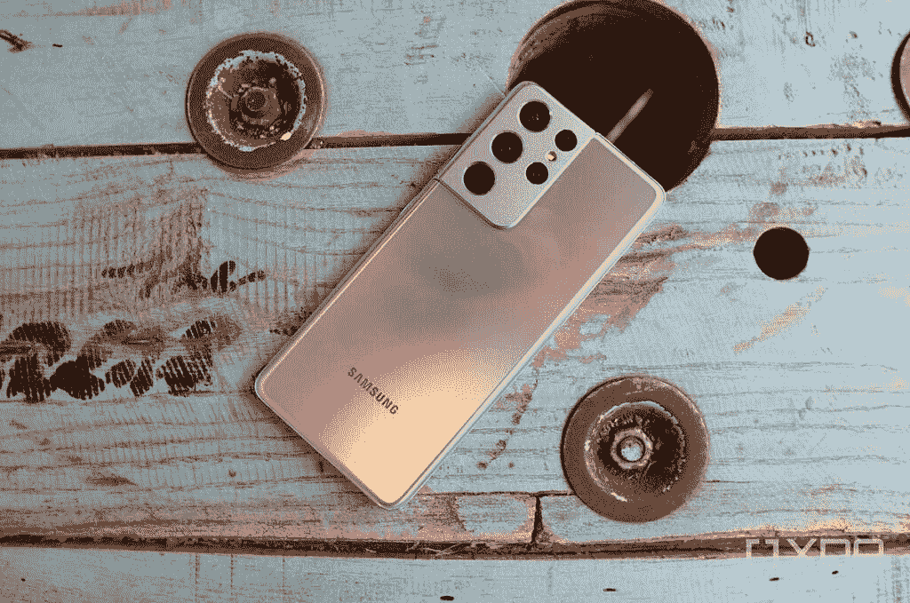

三星 Galaxy S21 Ultra 是 2021 年的顶级旗舰，我们有很多理由这么说。首先，你得到了一个华丽的显示器，仍然是我们今年看到的最好的显示器之一，以及无可挑剔的相机性能，仍然是多功能性的基准之一。这是一款来自三星的坚固智能手机，由于增加了 S Pen 支持，它今年接管了 Galaxy Note 的职责。三星还对软件更新做出了很高的承诺，到目前为止，该公司已经交付了——除了定期的每月安全更新，Galaxy S21 Ultra 还成为谷歌 Pixels 以外第一款接收官方 Android 12 更新的智能手机。唯一的缺陷是，你不能在每个地区都买到高通骁龙 888 SoC，这意味着如果你买了 Exynos 2100 变种，游戏性能就会下降。但除此之外，这是 2021 年最好的旗舰。

### 三星 Galaxy S21 Ultra

三星 Galaxy S21 Ultra 是 2021 年的终极旗舰产品，集旗舰 SoC、高级构建、出色的显示屏和令人惊叹的相机设置于一身，以及高级旗舰产品预期的所有额外功能。

**Affiliate Links**

Samsung

[View at Samsung](https://shop-links.co/link/?exclusive=1&publisher_slug=xda&article_name=XDA+Awards+--+The+Best+Tech+of+2021&article_url=https%3A%2F%2Fwww.xda-developers.com%2Fbest-of-2021%2F&u1=UUxdaUeUpU6275&url=https%3A%2F%2Fwww.samsung.com%2Fus%2Fsmartphones%2Fgalaxy-s21-5g%2Fbuy%2Fgalaxy-s21-ultra-5g-128gb-unlocked-sm-g998uzkaxaa%2F)

### 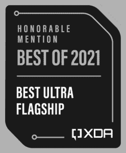

### 年度最佳旗舰荣誉奖:小米 Mi 11 Ultra

[小米 Mi 11 Ultra](https://www.xda-developers.com/xiaomi-mi-11-ultra-review/) 是“优点之后是什么”这个问题的答案，而小米抓住了机会，绝对带跑。小米 Mi 11 Ultra 是一款大材小用的旗舰产品，价格也非常合理，符合小米的性价比原则。可以说，Mi 11 Ultra 甚至比 Galaxy S21 Ultra 更好，但它非常有限的可用性和糟糕的软件支持使它跌至第二位。否则，你会看到同样令人印象深刻的显示屏、陶瓷背面、令人印象深刻的具有疯狂变焦功能的相机系统、快速有线和无线充电以及背面的实际显示屏等功能。小米 11 Ultra 确实应该得到更好的位置，我们希望小米明年对它的过度旗舰产品更有信心。

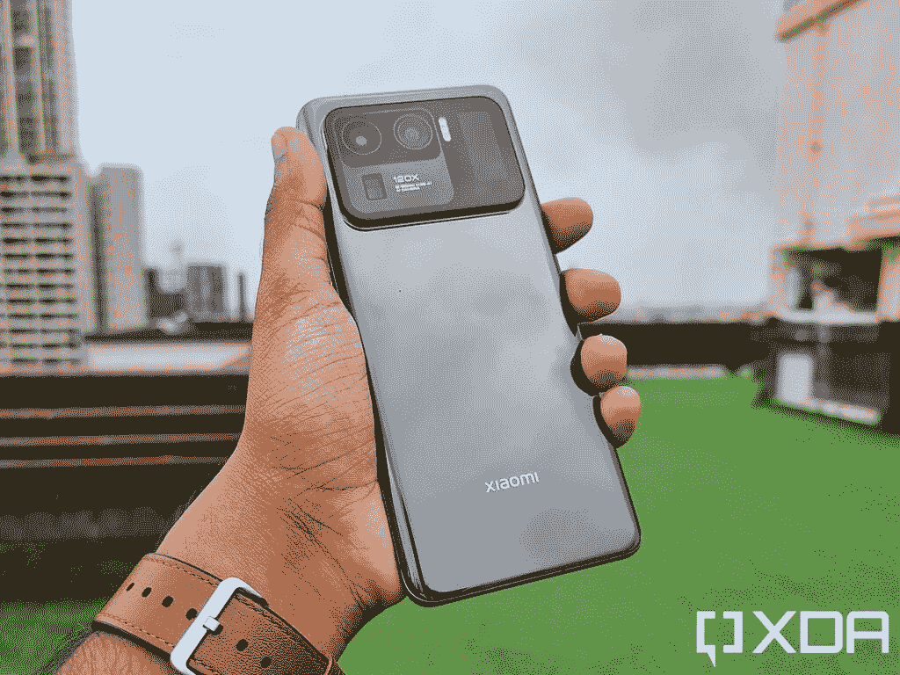

### 小米 Mi 11 Ultra

小米 Mi 11 Ultra 是该公司迄今为止智能手机中最好的硬件的顶峰，尽管 MIUI、安全更新和实际可用性是症结所在。

**Affiliate Links**

aliexpress

[View at Aliexpress](https://www.aliexpress.com/item/1005003160495293.html)

* * *

### 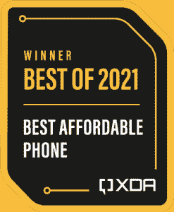

## 年度最佳平价智能手机:谷歌 Pixel 6

智能手机价格的上涨和旗舰产品中 Ultras 的出现也扭曲了“负担得起”的定义。一部负担得起的智能手机对不同的人来说意味着不同的价格区间。但我们相信每个人都会同意的事实是，[谷歌 Pixel 6](https://www.xda-developers.com/google-pixel-6/) 是 2021 年最实惠的智能手机，它仍然基于实用的价格点，不会在你的口袋里烧一个洞来买你不会真正使用的功能。

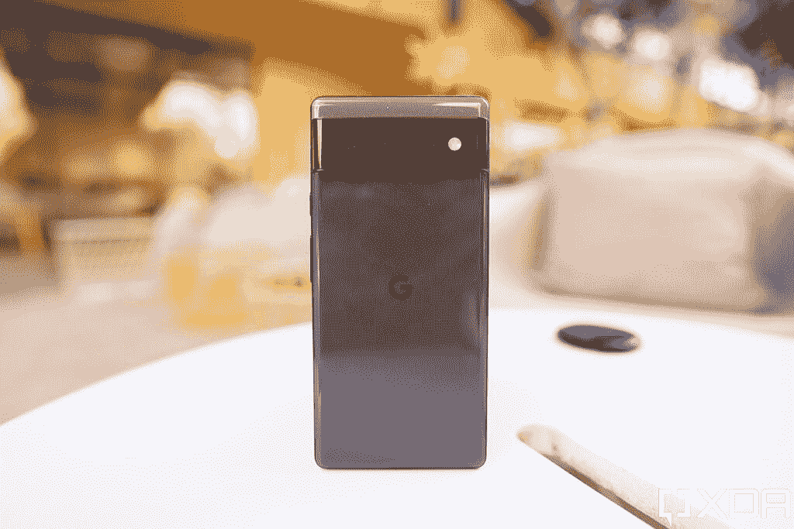

谷歌 Pixel 6 采用了许多使谷歌 Pixel 6 Pro 成为一款出色智能手机的功能，并使其能够为更广泛的受众所使用。虽然一些规格可能不是绝对的顶级产品，但谷歌已经成功实现了与其更昂贵的旗舰产品在智能手机和相机上的同等功能，这是优秀智能手机体验的两个更具定义性的特征。因此，如果你想体验周围最好的相机系统之一，并想使用周围最好的 Android 体验之一，谷歌 Pixel 6 仍然是你应该考虑拿起的最好的实惠智能手机。虽然可用性仍然是一个弱点，但我们希望这款手机能在几个月后扩展到更多地区。

### 谷歌像素 6

Pixel 6 配备了谷歌新的张量芯片、现代设计和旗舰相机。体验的总和绝对超过其各个部分，这是我们对 2021 年最佳平价智能手机的选择。

**Affiliate Links**

Amazon

[View at Amazon](https://www.amazon.com/Google-Pixel-6-5G-Android-Phone/dp/B09HJY4G4Z?tag=xda-5ajdjjr-20&ascsubtag=UUxdaUeUpU6275&asc_refurl=https%3A%2F%2Fwww.xda-developers.com%2Fbest-of-2021%2F&asc_campaign=Short-Term)

### 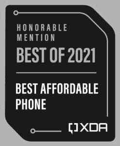

### 年度最佳平价智能手机荣誉奖:小米 11X、一加诺德 2

小米 11X 是今年低调发布的产品之一，与更强大的小米 11X Pro 相比黯然失色。虽然 Pro 本身就很棒，但 Mi 11X 被评为今年发布的最实惠的智能手机之一。高通骁龙 870 仍然是旗舰级 SoC 的一个非常实用的选择，与 Pro 上的 108MP 相比，改用 48MP 摄像头设置是另一个实用的决定，可以实现更好的性价比。

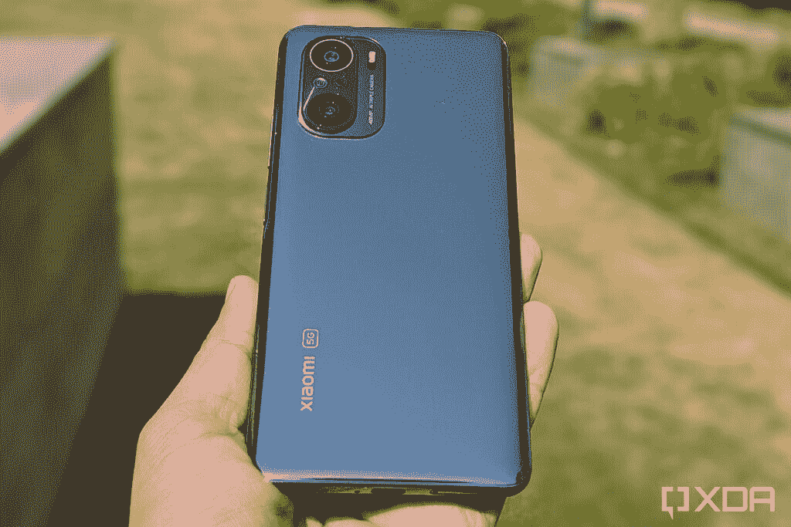

一加诺德 2 也是今年价格适中的智能手机的绝佳选择。如果一加 Nord 2 在美国等主要市场更广泛地销售，它很有可能会超越 Pixel 6 成为第一名。Nord 2 内部的联发科 Dimensity 1200 SoC 是一款出色的芯片，性能很好，甚至游戏也很好。由于一加的 OxygenOS，其余的体验也非常干净。一加确实需要解决一些安全问题，但除此之外，一加诺德 2 是 2021 年的一个可靠、实用和负担得起的选择。

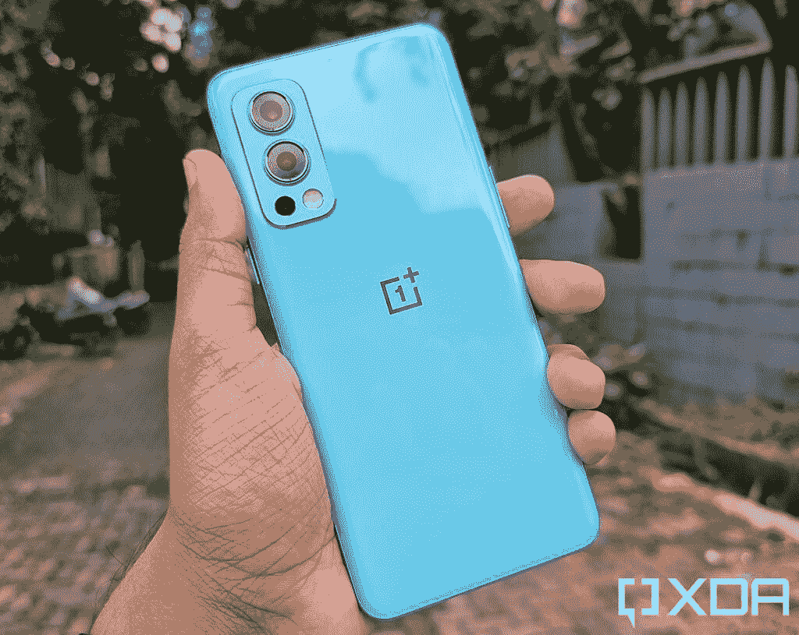

### 小米 Mi 11X

小米 Mi 11X 是一款非常实惠的旗舰产品，配有骁龙 870 SoC、48MP 三摄像头和无广告 MIUI 体验。

**Affiliate Links**

Amazon.in

[View at Amazon.in](https://www.amazon.in/dp/B085J1QWFV?tag=xdaportalin-21)

### 一加诺德 2

一加诺德 2 是一个伟大的溢价中端设备，由于有能力的尺寸 1200 SoC，和一个伟大的整体封装。

**Affiliate Links**

OnePlus

[View at Oneplus](https://onepluscom.pxf.io/c/2233363/916678/12532?subId1=UUxdaUeUpU6275&subId2=exda&u=https%3A%2F%2Fwww.oneplus.com%2Fuk%2Foneplus-nord-2-5g)

* * *

### 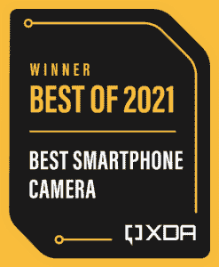

## 年度最佳智能手机相机:Vivo X70 Pro Plus

选出 2021 年最佳智能手机相机的获胜者是一项极限运动，因为决赛选手彼此接近，在比赛结束时不把他们都称为获胜者是不公平的。但是需要一个胜利者，并且应当宣布一个胜利者。如果你一直在关注我们的[相机报道](https://www.xda-developers.com/tag/camera-shootout/)，你一定已经知道 2021 年最好的智能手机相机将是 Vivo X70 Pro Plus。

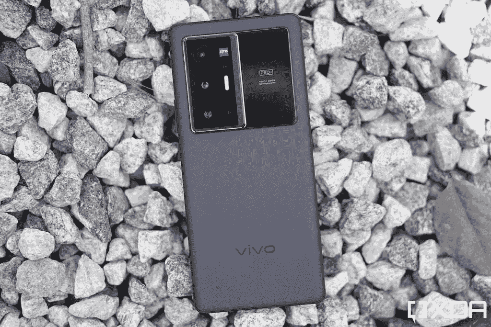

我们今年对 Vivo X70 Pro Plus 相机进行了广泛的测试，并直接将其与大多数竞争设备进行了对比。在每次比较中，Vivo 都是整体赢家。Vivo 不仅设法在这款旗舰产品上提供了多功能的相机设置，还提供了今年最一致的相机体验之一，提高了所有希望赢得这一桂冠的智能手机的标准。50MP 三星 GN1 主摄像头非常出色，可以在弱光下产生无噪声、清晰和充满活力的图像，而无需像竞争对手那样频繁地求助于夜间模式。谷歌 Pixel 6 Pro 上也有同样的 50MP 传感器，但 Vivo X70 Pro Plus 有更快的光圈和专用的 V1 ISP 芯片，有助于产生令人惊叹的 HDR。48MP 超宽相机配有 Gimbal technoloy，12MP 长焦相机可处理 2 倍光学变焦，而 8MP 潜望镜可处理 5 倍光学变焦。数百个相机样本之后，我们有信心说 Vivo X70 Pro Plus 是 2021 年最好的智能手机相机。

### Vivo X70 Pro Plus

Vivo X70 Pro Plus 结合了多功能性和一致性，无论是简单的还是具有挑战性的拍摄，都成为我们今年最佳拍照智能手机的选择。

**Affiliate Links**

Flipkart

[View at Flipkart](https://www.flipkart.com/vivo-x70-pro-enigma-black-256-gb/p/itm838af278332f6)

### 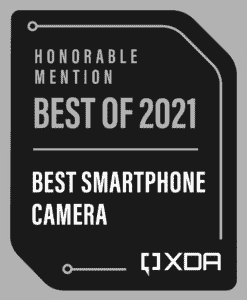

### 年度最佳智能手机相机荣誉奖:谷歌 Pixel 6 Pro、苹果 iPhone 13 Pro、三星 Galaxy S21 Ultra

正如我们提到的，今年是最接近冠军的一年。赢家拿走了蛋糕，但前四名之间的差距非常小，只有一些怪癖出现在他们的杆位上。如果你有谷歌 Pixel 6 Pro、苹果 iPhone 13 Pro 或三星 Galaxy S21 Ultra，请放心，你仍然拥有今年智能手机上最好的相机设置之一。

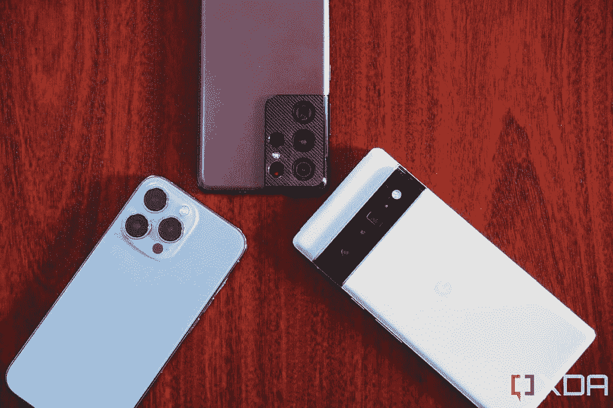

这几款手机都有自己的亮点。[谷歌 Pixel 6 Pro 代表了最佳的日间傻瓜相机体验](https://www.xda-developers.com/google-pixel-6-pro-camera-review/)和最能被描述为乐趣的相机体验。[苹果 iPhone 13 Pro 和 iPhone 13 Pro Max 提供了最好的视频拍摄体验](https://www.xda-developers.com/apple-iphone-13-pro-review/)，拍照体验也相当棒。三星 Galaxy S21 Ultra 在多功能性和一致性方面与 Vivo 不相上下,但在夜间拍摄和超宽功能方面稍有不足。在这四个选项中，你可以选择任何人，仍然可以获得一个非常自信的智能手机摄像头，能够处理你可以扔给它的所有东西——我们只需要像素窥视和挑剔我们的方式来选择一个获胜者。

### 谷歌 Pixel 6 Pro

谷歌 Pixel 6 Pro 终于看到了相机硬件的升级，使它成为一个自信和有趣的使用谷歌智能拍摄智能手机相机。

**Affiliate Links**

Amazon

[View at Amazon](https://www.amazon.com/Google-Pixel-Pro-Smartphone-Telephoto/dp/B09HZ939TR?tag=xda-5ajdjjr-20&ascsubtag=UUxdaUeUpU6275&asc_refurl=https%3A%2F%2Fwww.xda-developers.com%2Fbest-of-2021%2F&asc_campaign=Short-Term)

### 苹果 iPhone 13 Pro

苹果 iPhone 13 Pro 是今年你能买到的最好的相机之一，尤其是如果你的重点是社交媒体平台的视频录制。

**Affiliate Links**

Amazon

[View at Amazon](https://www.amazon.com//dp/B09G9TX631/?tag=xda-5ajdjjr-20&ascsubtag=UUxdaUeUpU6275&asc_refurl=https%3A%2F%2Fwww.xda-developers.com%2Fbest-of-2021%2F&asc_campaign=Short-Term)

### 三星 Galaxy S21 Ultra

三星 Galaxy S21 Ultra 配备了功能最丰富的相机系统之一，让您可以全方位拍摄。

**Affiliate Links**

Samsung

[View at Samsung](https://shop-links.co/link/?exclusive=1&publisher_slug=xda&article_name=XDA+Awards+--+The+Best+Tech+of+2021&article_url=https%3A%2F%2Fwww.xda-developers.com%2Fbest-of-2021%2F&u1=UUxdaUeUpU6275&url=https%3A%2F%2Fwww.samsung.com%2Fus%2Fsmartphones%2Fgalaxy-s21-5g%2Fbuy%2Fgalaxy-s21-ultra-5g-128gb-unlocked-sm-g998uzkaxaa%2F)

* * *

### 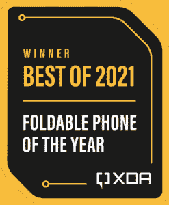

## 年度最佳可折叠智能手机:三星 Galaxy Z Flip 3

可折叠智能手机在 2021 年度过了美好的一年，得益于一些伟大的发布。最突出的例子来自三星，但也有其他例子从一开始就为三星设定了期望标准。这无疑是智能手机市场中创新最多的领域。2021 年最佳可折叠智能手机奖颁给了三星 Galaxy Z Flip 3。

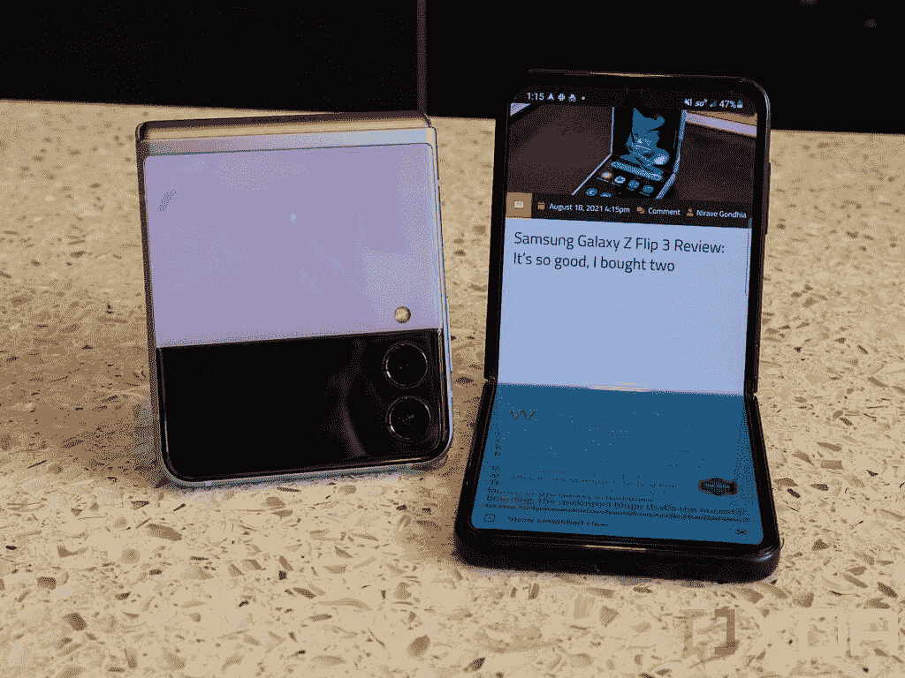

但是等等，你说三星 Galaxy Z Fold 3 不是年度手机吗？的确如此，但今年最好的可折叠手机仍然是 Galaxy Z Flip 3。这并不是因为 Galaxy Z Fold 3 不够好(我们实际上授予了它年度最佳智能手机)，而是因为 [Galaxy Z Flip 3 成功地让我们看到了未来](https://www.xda-developers.com/samsung-galaxy-z-flip-3-review/)，在那里可折叠产品与玻璃板旗舰产品在相同的价位共存。999 美元的发布价格是真正的交易，降低了体验可折叠是什么和可折叠能做什么的门槛。尽管平板电脑风格的可折叠产品可以带来很多好处，但它们仍然是发烧友的产品，除非它们变得足够便宜，足以让普通消费者购买和享受，Galaxy Z Flip 3 是朝着正确方向迈出的一步。像 Galaxy Z Flip 3 这样可折叠的糖果棒及其 999 美元的价格标签所带来的巨大吸引力简直不容忽视。这款手机有它的缺点，比如电池续航时间一般，价格仍然很高，但我们相信这两个方面将在下一代产品中继续得到改善。因此，Galaxy Z Flip 3 是 2021 年我们最好的可折叠智能手机。

### 三星 Galaxy Z Flip 3

Galaxy Z Flip 3 是三星最新的可折叠翻盖手机，提供更大的外部显示屏、高刷新率的内部显示屏和顶级的硬件。实用的价格标签是它成为年度最佳可折叠产品的原因。

**Affiliate Links**

Samsung

[View at Samsung](https://shop-links.co/link/?exclusive=1&publisher_slug=xda&article_name=XDA+Awards+--+The+Best+Tech+of+2021&article_url=https%3A%2F%2Fwww.xda-developers.com%2Fbest-of-2021%2F&u1=UUxdaUeUpU6275&url=https%3A%2F%2Fwww.samsung.com%2Fus%2Fsmartphones%2Fgalaxy-z-flip3-5g%2Fbuy%2F)

### 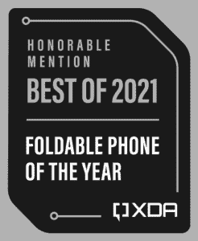

### 年度最佳可折叠智能手机荣誉奖:Galaxy Z Fold 3、华为 Mate X2、小米 Mix Fold

2021 年出现了许多优秀的可折叠产品，它们都以自己的方式提高了标准。三星 Galaxy Z Fold 3 显然获得了荣誉奖，因为它是一款整体上非常棒的智能手机，也是今年最容易推荐的手机之一，尽管这款手机实际上只能打一半的电话。

 <picture></picture> 

The three foldables phones from Xiaomi, Samsung and Huawei

华为 Mate X2 也做了出色的工作，配备了一个合适的旗舰相机系统和一个铰链，可以让手机完全折叠起来，没有任何明显的缝隙。[小米 Mix Fold 上榜](https://www.xda-developers.com/xiaomi-mi-mix-fold-hands-on/)的原因与 Galaxy Z Flip 3 相同——它在中国的售价较低，约为 1500 美元，这使得它在寻求为可折叠产品带来主流吸引力方面非常重要。该设备还拥有世界上第一个“液体镜头”，允许一个相机传感器兼作 3 倍长焦和微距传感器。华为 Mate X2 和小米 Mix Fold 仍然仅限于中国市场，我们希望华为和小米未来的可折叠产品能够在全球范围内发布。

* * *

### 

## 年度最佳游戏手机:华硕 ROG 手机 5 旗舰版

这是今年非常小众的一个类别，因为许多智能手机足以胜任休闲游戏。因此，如果你正在专门寻找一款游戏手机，你会认为自己是一个更铁杆的游戏玩家，或者你是一个简单地喜欢过度杀戮的人。无论如何，一致赢得 2021 年最佳游戏手机的手机是华硕 ROG 手机 5 旗舰版。

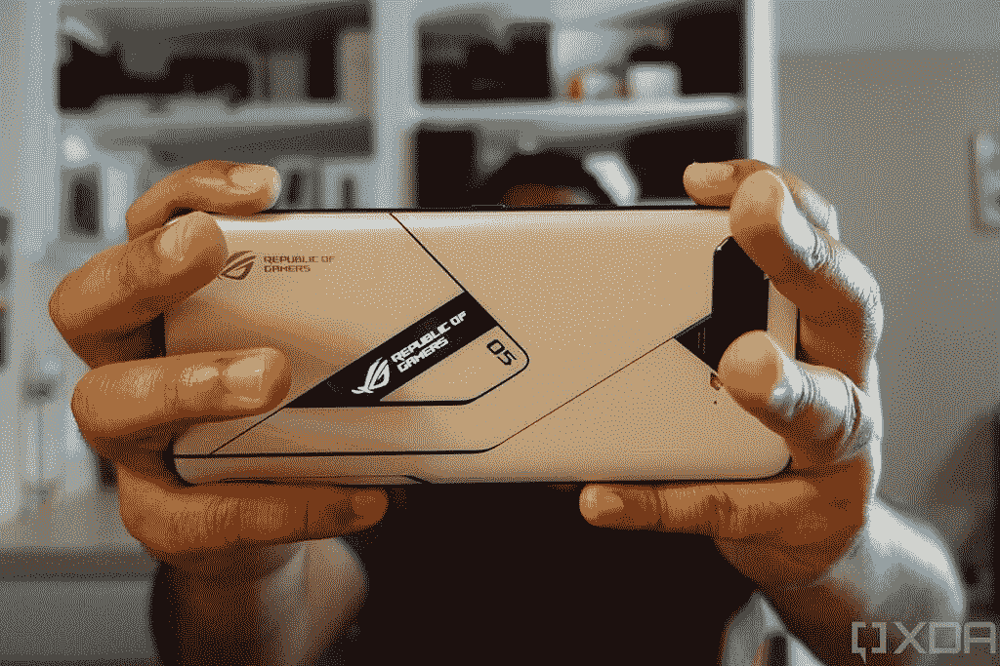

华硕 ROG Phone 5 Ultimate 真正是终极游戏智能手机，它毫不留情。这款手机是一款超旗舰手机，但它更注重原始性能。例如，你得到了顶级的高通骁龙 888 SoC，再加上惊人的 18GB 内存和 512GB 存储空间。虽然 AMOLED 显示屏“仅仅”是 FHD+，但它仍然以疯狂的 144Hz 刷新。规格表继续变得更加疯狂，配备了支持 65W 快速充电的 6000 mAh 电池。你需要 USB C 端口，这款手机上有两个——一个 USB 3.1 端口在侧面，一个 USB 2 端口。在底部；你仍然保留了 3.5 毫米耳机插孔，但现在有了四个 DAC 以及前置立体声扬声器设置。额外的功能还在继续，你在侧框上有用于 AirTrigger 的超声波传感器(可以检测点击和滑动)，你在背面还有两个触摸传感器，你甚至可以检测抓握压力——所有这些都可以映射到游戏中的不同动作。因为它是一款游戏手机，所以你也可以获得与这种氛围相称的美学——而且你还可以在背面获得一个 PMOLED 单色显示屏，因为为什么不呢。软件定制和附件生态系统应该有助于增强您的游戏体验。要回答的最后一个问题是，所有这些特性是否都能转化为现实生活中的游戏性能，谢天谢地，答案仍然是肯定的。这是今年金钱可以买到的最好的游戏手机，假设华硕为你准备了库存。

### 华硕 ROG 手机 5

华硕 ROG 手机 5 是终极游戏智能手机。它有大量的游戏功能、附件和顶级性能，可以处理您扔给它的任何游戏。

**Affiliate Links**

ASUS

[View at Rog.asus](https://rog.asus.com/us/phones/rog-phone-5-ultimate-model/)

* * *

### 

## 年度最佳可持续手机:Fairphone 4

在未来几年，可持续发展必将成为一个更加重要的话题。许多智能手机原始设备制造商一直在采取小步骤来展示他们对环境和人类生活的承诺。虽然我们赞赏这些小举措，但其中一些措施也带有商业利润动机的味道。我们还需要更实质性的步骤，让手机更容易维修，让它们更耐用，是可以采取的更具体的步骤之一。为此，Fairphone 4 赢得了年度最佳可持续手机奖。

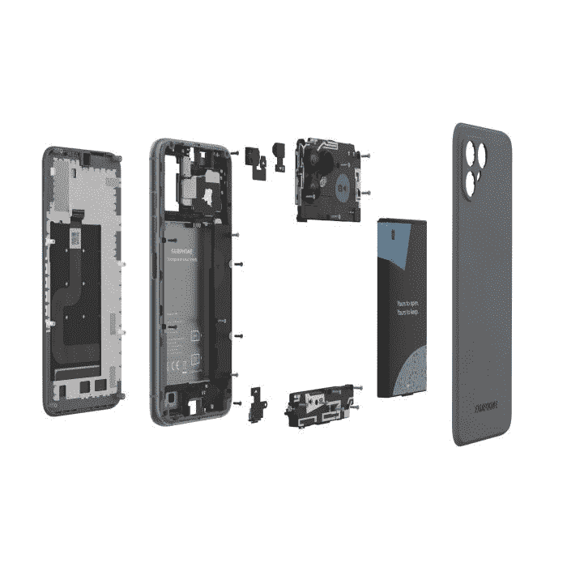

Fairphone 4 是一款特殊的智能手机，如果你只是阅读规格表，你不会立即发现它。但是仔细观察，你会发现这款手机很容易修理，因此对环境的影响更小。这款手机的设计具有很高的可修复性，该公司出售几个关键的备件，鼓励用户购买这些替换部件，并自己轻松更换损坏/有缺陷的组件。这与智能手机行业目前的趋势相去甚远，玻璃和胶水被慷慨地用于给我们提供一种智能手机的鸡尾酒，即使是合格的技术人员也很难修复。除了可修复性，这款手机还试图在可行的情况下使用可持续材料。并且该公司还承诺在 2025 年底之前提供两大 Android 更新和软件支持。

### 公平电话 4

Fairphone 4 是一款可持续发展的智能手机，用户可以自己修理手机，从而延长手机的使用寿命。

**Affiliate Links**

fairphone

[View at Fairphone](https://shop.fairphone.com/en/buy-fairphone-4)

* * *

### 

## 年度手机制造商:三星

三星又一年蝉联最佳手机制造商的桂冠。这家韩国科技巨头多年来一直是销量最大的智能手机制造商，今年，他们也在塑造 Android 格局方面发挥了巨大作用。

从像 Galaxy S21 Ultra 这样的超高端旗舰产品推动了我们对玻璃平板智能手机的期望，到发布两款表现出色的可折叠产品 Galaxy Z Fold 3 和 Galaxy Z Flip 3，甚至通过对可折叠体验的贡献塑造了 Android 的结构[到我们现在期待以可折叠为中心的 Android 12L 更新](https://www.xda-developers.com/android-12-1-hands-on/#:~:text=Interestingly%2C%20the%20code,betting%20big%20on.)的点[，甚至在](https://www.xda-developers.com/android-12l-new-features-ui-changes/)[为佩戴 OS 赋予了新鲜的生命](https://www.xda-developers.com/google-samsung-efforts-wear-os-paying-off/) -三星度过了非常多事的一年。最重要的是，三星信守承诺，一直在为其产品线提供安全更新。即使是平台更新，事实上，三星 Galaxy S21 系列是谷歌 Pixel 之外第一批获得官方 Android 12 更新的智能手机。三星也是为数不多的继续参与平板电脑市场的 Android OEMs 厂商之一，并不回避与苹果的 iPads 竞争。

总而言之，在广阔的移动市场上，三星已经证明了自己是一股不可忽视的力量。2010 年时代的三星时代已经一去不复返了，它的 TouchWiz 皮肤比官方发布的 Android 版本落后四个版本，在更多的手机上运行，你无法跟踪。2021 年的三星一直是精干、敏锐和专注的，同时保留着对未来的愿景。这就是为什么三星是我们 2021 年的手机制造商。

### 

### 年度手机制造商荣誉奖:小米

小米今年获得了荣誉奖，这要归功于其智能手机为全球数百万用户提供的便捷性。该公司本身是市场领导者，继续以其物有所值的智能手机向其他所有人提供激烈的竞争，这是很难忽视的。

 <picture>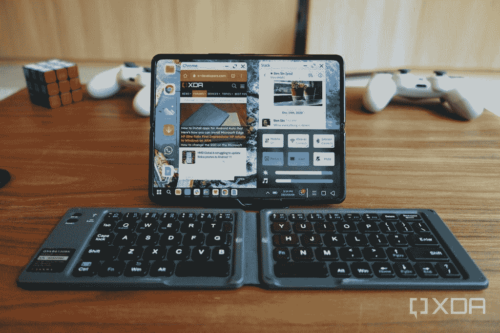</picture> 

The Mix Fold running PC mode, with a Bluetooth keyboard.

这种价值取向也不妨碍创新，几款小米智能手机迫使我们重新思考我们的期望，重新定义我们的定义。小米在智能手机之外还有一个广泛的产品生态系统，与其他公司不同的是，该公司没有试图用围墙花园的方式疏远用户。我们只是希望小米重新考虑它的一些品牌/更名决定，并努力改善手机安全更新的交付。

* * *

### 

## 年度移动创新:谷歌 Pixel 6 系列的语音听写

谷歌 Pixel 6 系列的一大亮点是谷歌张量 SoC，它为谷歌智能手机上的机器学习能力带来了巨大的改进。由于 Tensor 和最新的设备语音模型，将语音转换为文本现在比以往任何时候都更智能。我们完全同意，这就是为什么语音听写是我们年度移动创新的选择。

智能手机上的语音输入无论如何都不是一个新功能，在 Android 非常早期的时候就已经有了一些格式。谷歌 Pixel 6 系列的新之处在于，该功能处于有史以来最可靠和最准确的执行状态。语音打字现在可以从智能手机上的联系人那里输入正确的姓名拼写，它会自动添加发音，并根据上下文理解更正和命令。说“发送”本身不会键入单词“发送”，而是实际发送邮件。如果它确实出错了，当你提供更多的上下文时，它[第二次就把它弄对了。](https://twitter.com/bencsin/status/1465583817679245319)

这项功能有可能改变我们使用屏幕键盘的方式，改变我们与智能手机的交互方式，进而改变智能手机的本质。是的，语音命令已经存在了一段时间，但谷歌 Pixel 6 上的语音听写功能是在不同的信心水平上运行的。我们迫不及待地想知道谷歌在 Pixel 智能手机上的语音功能下一步会走向何方。

### 

### 年度移动创新荣誉奖:三星 Galaxy Z 系列的防水性能

防水无论如何都不是一个新功能，但带有几个内部移动部件的可折叠手机的防水功能绝对是一个新功能。三星 Galaxy Z Fold 3 和 Galaxy Z Flip 3 是首批具有 IPX8 等级的主流可折叠产品，这意味着这两款可折叠产品可以承受 1.5 米的淡水浸泡 30 分钟。这对可折叠手机来说是一个巨大的成就，它让它们更接近更广泛的主流吸引力，因为它有助于摆脱可折叠手机很脆弱的观念。这些设备仍然容易受到灰尘的影响，所以你不能真的把它们带到海滩上。但是，如果你遇到了意想不到的雨，至少要知道你昂贵的可折叠手机会完好无损地走开。

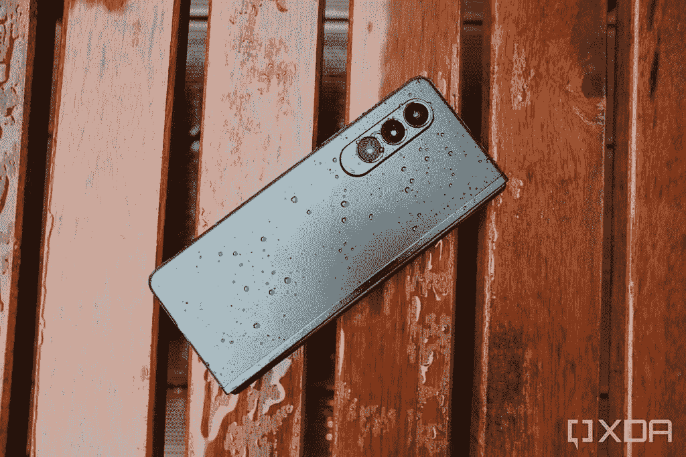

* * *

### 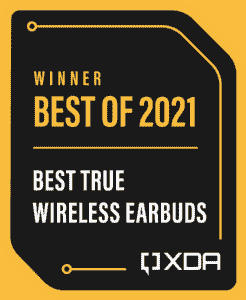

## 年度最佳 TWS:三星 Galaxy Buds 2

由于智能手机市场上一些有问题的决策，TWS 作为一个市场近年来出现了爆炸式增长。市场上有太多的无线耳机，它确实很快就变得令人困惑。但如果你必须从今年发布的最佳选项中选择，三星 Galaxy Buds 2 脱颖而出，成为 2021 年最佳 TWS。

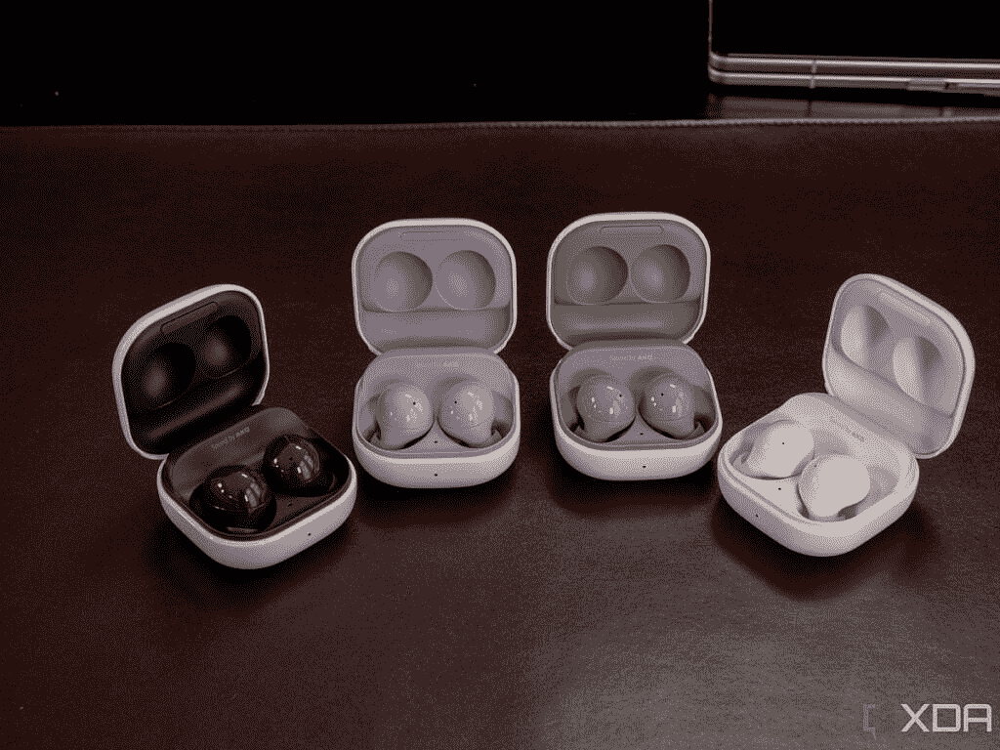

虽然三星 Galaxy Buds Pro 仍然是三星 TWS 产品线中的*高级*产品，但[三星 Galaxy Buds 2](https://www.xda-developers.com/samsung-galaxy-buds-2/) 是更实用、更容易推荐的产品。他们有一个小而谨慎的设计，有助于他们的无负担体验，更多的用户可能会发现比他们在 Buds Pro 上更适合。声音性能也将受到广大观众的赞赏，麦克风性能也仍然非常适合通话和会议。额外的，你在这些上也得到相当好的 ANC。IPX2 等级不是市场上最好的，但这是你能找到的唯一缺点，尤其是考虑到它们的声誉、价格标签和设备兼容性。

### 三星 Galaxy 芽 2

由于其性价比和功能集，三星 Galaxy Buds 2 是我们今年最佳 TWS 的选择。您可以以相当实惠的价格获得出色的音质、出色的麦克风性能、谨慎的设计和 ANC。

**Affiliate Links**

Samsung

[View at Samsung](https://shop-links.co/link/?exclusive=1&publisher_slug=xda&article_name=XDA+Awards+--+The+Best+Tech+of+2021&article_url=https%3A%2F%2Fwww.xda-developers.com%2Fbest-of-2021%2F&u1=UUxdaUeUpU6275&url=https%3A%2F%2Fwww.samsung.com%2Fus%2Fmobile%2Faudio%2Fheadphones%2Fgalaxy-buds2-olive-sm-r177nzgaxar%2F)

### 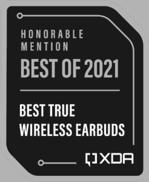

### 年度最佳 TWS 奖荣誉奖:一加巴德亲，没有耳朵 1

有很多耳机值得一提，但我们还是要坚持使用这两款。一加蕾兹 Pro 其实是一加推出的一款质量相当令人惊讶的产品，之所以令人惊讶，是因为听起来它的价格相当不错，而且没有明显的注意事项。还有一些小问题，比如无法更改耳机的音量以及软件环境有些混乱。除此之外，他们有一个令人耳目一新的设计，伟大的 ANC，伟大的麦克风性能，伟大的电池寿命，等等。

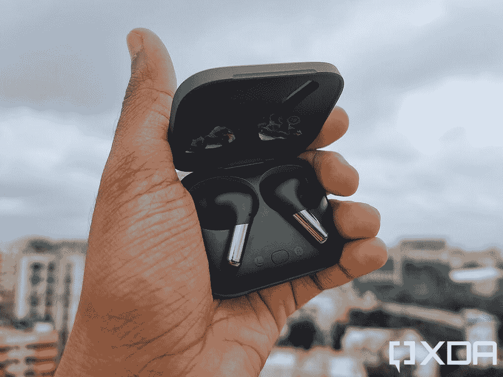

[Nothing Ear 1](https://www.xda-developers.com/nothing-ear-1-review/) 凭借其独特的半透明设计和出色的首款产品执行能力，赢得了科技界的荣誉奖。他们是非常舒适的穿着，由于他们的轻量级，他们也听起来体面的 ANC。它们的价格也很有竞争力，这有助于为新公司的第一版产品提供令人信服的论据。还有卡尔·佩的魔力，它成功地给这家新公司带来了很多好感，让它在这个残酷的市场上比其他公司给新公司带来了更多的优势。

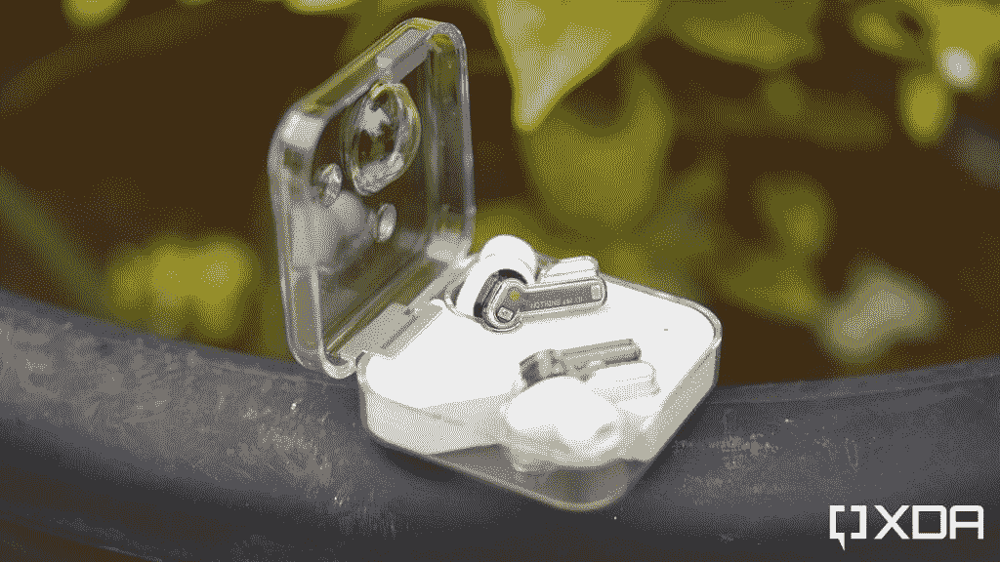

### 一加·巴德亲

一加芽亲是一个伟大的一对 TWS 耳机，提供坚实的功能集和性能在一个体面的价格。

**Affiliate Links**

OnePlus

[View at Oneplus](https://onepluscom.pxf.io/c/2233363/916678/12532?subId1=UUxdaUeUpU6275&subId2=exda&u=https%3A%2F%2Fwww.oneplus.com%2Fus%2Fproduct%2Foneplus-buds-pro&ourl=https%3A%2F%2Fwww.oneplus.com%2Fproduct%2Foneplus-buds-pro)

### 没什么 Ear 1

Nothing Ear 1 具有独特的设计、ANC 和良好的性能。它们是 TWS 一家新公司的优质产品。

**Affiliate Links**

nothing.tech

[View at Nothing.tech](https://www.anrdoezrs.net/links/100122946/type/dlg/sid/UUxdaUeUpU6275/https://nothing.tech/products/ear-1)

* * *

### 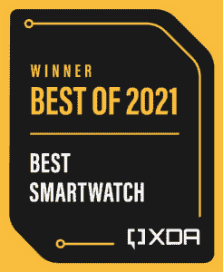

## 年度最佳智能手表:Apple Watch 系列 7

选择智能手表是一个与你选择的操作系统密不可分的决定，因为这些仍然被视为次要设备。但如果你必须选择“最好的智能手表”，这样的决定将需要忽略生态系统锁定的基本现实，并考虑手中产品的纯粹价值，或者更确切地说是你手腕上的产品。有了这样一个难题，决定是一致的。Apple Watch Series 7 是 2021 年最好的智能手表。

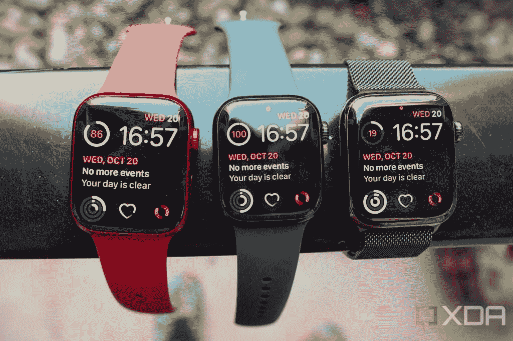

今年，得益于三星拯救 Wear OS，Android 终于有了更好的智能手表。但更新仍然需要一点时间来推出三星的马厩以外，让我们没有太多的最新更新选项。虽然三星 Galaxy Watch 4 系列很棒，但它将 Tizen OS 这一更好的选择换成了 Wear OS，这有点令人费解。这就给苹果留下了大放异彩的空间，它确实大放异彩。 [Apple Watch Series 7](https://www.xda-developers.com/apple-watch-series-7-review/) 与产品的泄露不符，但实际推出的产品仍然令人信服。与 Series 6 相比，大多数升级都是渐进式的，但苹果已经确定了一款优秀智能手表的基础和超越基础的东西。不仅硬件很棒，苹果还凭借其体验的力量吸引并留住了用户，尤其是那些围绕健康和健身追踪的[和苹果健身增强版](https://www.xda-developers.com/apple-watch-series-7-fitness/)。是的，Apple Watch 7 无法与 Android 兼容，这是一个很大的缺陷。但如果你可以先选择你的智能手表，然后再选择智能手机，你肯定会选择 Apple Watch 7 而不是其他智能手表。

### 苹果手表系列 7

Apple Watch Series 7 是 2021 年最好的智能手表，因为它不仅配备了出色的硬件，还通过 Apple Fitness Plus 带来了出色的健康和健身跟踪体验。

**Affiliate Links**

adorama

[View at Adorama](https://adorama.rfvk.net/c/2233363/51926/1036?subId1=UUxdaUeUpU6275&subId2=exda&u=https%3A%2F%2Fwww.adorama.com%2Facmkn83lla.html)

### 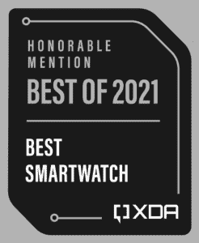

### 年度最佳智能手表荣誉奖:三星 Galaxy Watch 4 Classic、Amazfit GTR 3 Pro、华为 Watch Fit 优雅

如果你受限于口袋里的 Android 智能手机，你确实需要看看 Apple Watch 7 之外的其他选择。在这种情况下，你可以考虑三星 Galaxy Watch 4 Classic、Amazfitn GTR 3 Pro 或华为 Watch Fit 优雅，因为它们是我们荣誉奖的一部分。

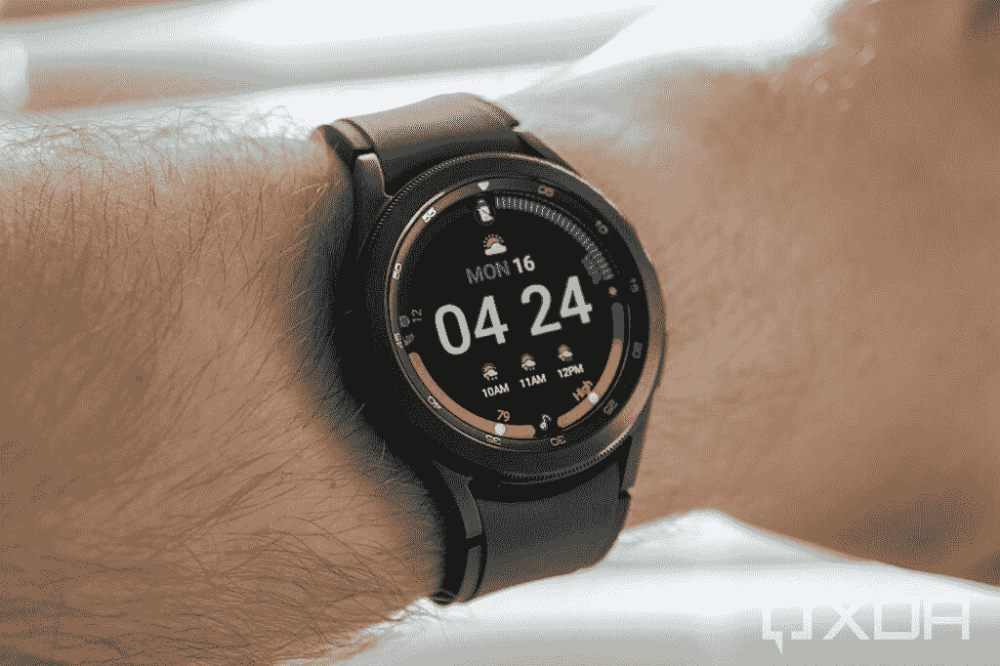

三星 Galaxy Watch 4 Classic 是迄今为止最好的 Wear OS 智能手表，但这并不是一个很高的标准。从技术上来说，这款手表确实运行谷歌的软件，但三星在这款手表上拥有更大的自由度。你可以把它想象成一款配有谷歌 Play 商店的 Tizen 手表，因为这可以更好地解释手表上没有谷歌助手的原因。如果你想要一款与 Android 兼容的智能手表，这几乎是你的首选之一。作为奖励，你可以得到心爱的旋转表圈。

[Amazfit GTR 3 Pro 是一款出色的健身追踪器智能手表](https://www.xda-developers.com/amazfit-gtr-3-pro-review/)。它失去了头把交椅，因为它故意缺少一个应用商店，因为它扭曲了智能手表中“智能”的定义。你必须在专有的 Zepp 操作系统上使用预装的应用程序，但作为补偿，你会得到一个低得多的价格标签和一个可以持续一周的电池。还有其他健身追踪器-tunred-智能手表可以以更低的价格提供类似的功能，但 Amazfit GTR 3 Pro 以其简洁低调的外观和完成工作的能力胜出。

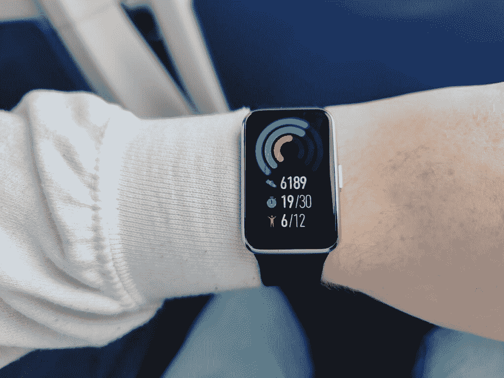

如果你不需要你的健身带智能手表是圆形的， [Huawei Watch Fit Elegant](https://www.xda-developers.com/huawei-watch-fit-elegant-review/) 是你应该考虑的一个选项。像所有其他提到的智能手表一样，这款手表也配备了专有的操作系统，华为称之为 Lite OS。这款手表的优势在于其独特的外观、优质的执行功能以及健康和健身跟踪功能。然而，手表 Fit Elegant 仅限于全球几个地区，这影响了购买决定。

### 三星 Galaxy Watch 4 经典版

Galaxy Watch 4 Classic 是三星的顶级智能手表，将 Wear OS 与可靠的硬件结合在一起。

**Affiliate Links**

Samsung

[View at Samsung](https://shop-links.co/link/?exclusive=1&publisher_slug=xda&article_name=XDA+Awards+--+The+Best+Tech+of+2021&article_url=https%3A%2F%2Fwww.xda-developers.com%2Fbest-of-2021%2F&u1=UUxdaUeUpU6275&url=https%3A%2F%2Fwww.samsung.com%2Fus%2Fwatches%2Fgalaxy-watch4%2Fbuy%2F%3Flink%3Dgalaxy-watch4-classic)

### 亚马逊飞度 GTR 3 专业版

Amazfit GTR 3 Pro 是一款试图实现所有功能的智能手表，当涉及到基本功能时，它肯定会实现一些特殊的功能。

**Affiliate Links**

Amazon

[View at Amazon](https://www.amazon.com/Amazfit-Android-Bluetooth-Tracking-Waterproof/dp/B09H5VPVKS/?tag=xda-5ajdjjr-20&ascsubtag=UUxdaUeUpU6275&asc_refurl=https%3A%2F%2Fwww.xda-developers.com%2Fbest-of-2021%2F&asc_campaign=Short-Term)

### 华为手表 Fit 优雅

华为 Watch Fit Elegant 是华为推出的一款时尚高端智能手表，功能齐全。

**Affiliate Links**

Amazon

[View at Amazon](https://www.amazon.co.uk/HUAWEI-WATCH-FIT-Elegant-Built/dp/B08X13W88K/)

* * *

### 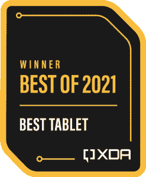

## 年度最佳平板电脑:苹果 iPad Mini 6

平板电脑的市场一直在萎缩，尤其是在可折叠平板电脑获得更广泛的主流接受之后。Android 平板电脑是一个更小的市场，不幸的是，我们最喜欢的操作系统并没有很好地适应大屏幕设备。就像智能手表领域一样，苹果最终主导了消费平板电脑市场，以至于普通用户可以互换使用“平板电脑”和“iPad”这两个词。因此，年度最佳平板电脑实际上来自苹果并不令人惊讶，尽管你可能会觉得它是 iPad Mini 6 令人惊讶。

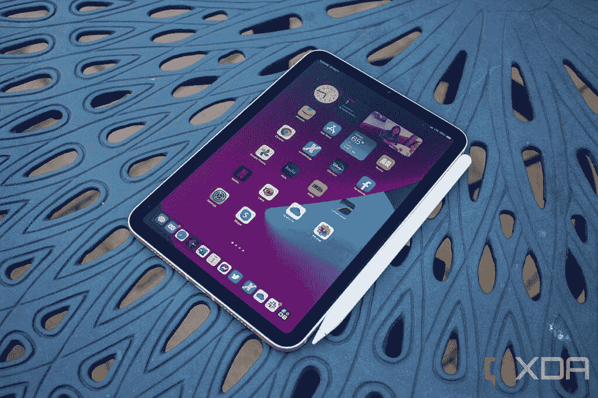

[苹果 iPad Mini 第六代重新想象了一个紧凑的中档平板电脑可以做什么](https://www.xda-developers.com/apple-ipad-mini-6-review/)和看起来像什么，只要你忽略显示器上滚动的果冻。这是一个极简的玻璃板，通过你的指尖控制，它拥有很大的能量。由于 A15 仿生芯片和 iPadOS 15，这款平板电脑利用了苹果移动领域最新最大的进步。这是驱动 iPhone 13 Pro Max 的同一芯片——这可不是开玩笑的。这种干净的画布带有 Apple Pencil 第二代支持，允许您随时随地涂鸦和记笔记。由于 iPadOS，您可以将蓝牙鼠标和键盘连接到它，使您可以将它变成一个具有原生光标支持的轻型笔记本电脑替代品。iPad Mini 6 的起价仅为 499 美元，这是价格、便携性和功率之间的完美平衡。这款设备面向那些想要一款小巧但功能强大的设备，以便在旅途中执行更密集和要求更高的任务的人。考虑到价格，今年发布的 Android 平板电脑在软件功能、适当的应用支持和硬件规格方面都无法与之匹敌。因此，我们将它评为年度最佳平板电脑。

### 苹果 iPad Mini (2021 年)

iPad Mini 6 是有史以来最好的小型平板电脑，也是苹果有史以来最好的 iPad。它结合了较大的 iPad Pro 的最佳性能，以及 iPad 系列中其他产品所没有的便携外形。

**Affiliate Links**

Amazon

[View at Amazon](https://www.amazon.com/2021-Apple-iPad-Wi-Fi-256GB/dp/B09G9DQDDQ/?tag=xda-5ajdjjr-20&ascsubtag=UUxdaUeUpU6275&asc_refurl=https%3A%2F%2Fwww.xda-developers.com%2Fbest-of-2021%2F&asc_campaign=Short-Term)

### 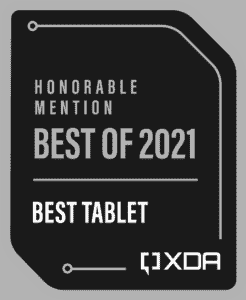

### 年度最佳平板电脑荣誉奖:M1 苹果 iPad Pro

今年早些时候，苹果公司发布了一项令我们震惊的消息——M1 芯片将加入 iPad Pro 系列产品。为一些最新、最强大的苹果电脑提供动力的是一款小巧便携的设备，许多专业人士在日常工作中使用它。它的起价为 799 美元，这使得它比苹果笔记本电脑更实惠。最新的 Pro iPad 附带一个 12.9 英寸的液体视网膜 XDR 显示屏，支持 ProMotion 和真音技术。这使得它的展示成为该领域的开创性展示。这款支持 5G 的 iPad 配有带激光雷达扫描仪的宽屏和超宽屏后置摄像头系统。前凹口装有一个经过调整的原深感摄像头，允许用户在肖像和风景两个方向使用 Face ID。这是一部伟大的杰作，值得一提。这仍然是一个值得一提的荣誉，因为大多数用户只是不需要在他们的平板电脑这么多的权力-但它是在那里，他们可以利用它。

### 苹果 iPad Pro 12.9 英寸(2021)

这个 12.9 英寸的 iPad Pro 的屏幕必须被看到才能被相信。加上 M1 芯片，这对于一台 iPad 来说太强大了。

**Affiliate Links**

Best Buy

[View at Bestbuy](https://shop-links.co/link/?exclusive=1&publisher_slug=xda&article_name=XDA+Awards+--+The+Best+Tech+of+2021&article_url=https%3A%2F%2Fwww.xda-developers.com%2Fbest-of-2021%2F&u1=UUxdaUeUpU6275&url=https%3A%2F%2Fwww.bestbuy.com%2Fsite%2Fapple-12-9-inch-ipad-pro-latest-model-with-wi-fi-128gb-silver%2F4264601.p%3FskuId%3D4264601)

* * *

### 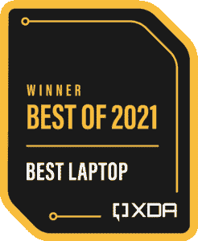

## 年度最佳笔记本电脑:苹果 MacBook Pro 14

为 2021 年的最佳笔记本电脑选择一个获胜者比我们想象的要容易。底线是，有了苹果的 M1 Pro 和 M1 Max 处理器，它用新的 MacBook Pro 改变了游戏。如果您离开家时带着一台如此强大的笔记本电脑，您也应该需要一个充电器。这里不是这样的。

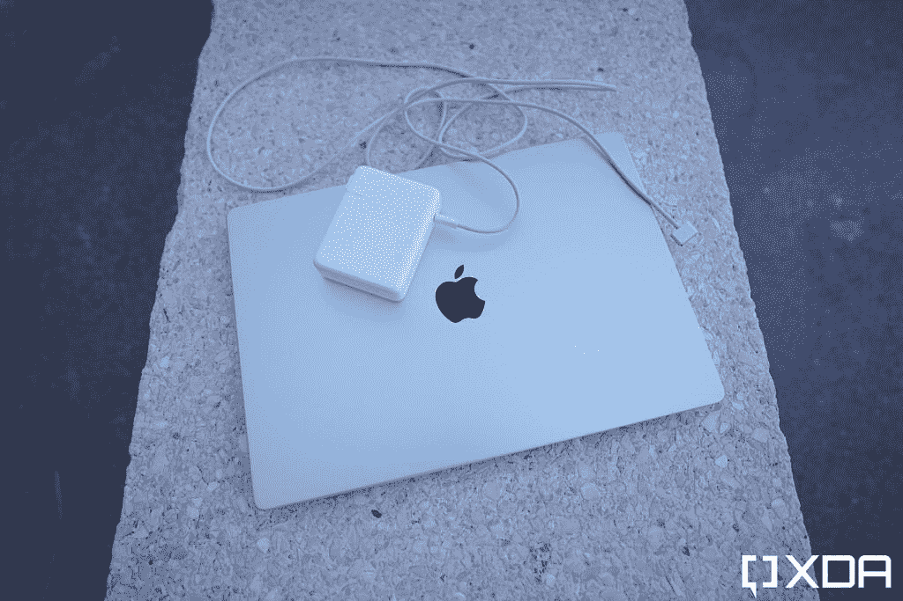

虽然苹果的 MacBook Pro 有 14 英寸和 16 英寸两种尺寸，但我们选择了 14 英寸的型号，因为它轻了一磅，而且坦率地说，它更能改变游戏规则。传统上，苹果较小的 MacBook Pro(过去是 13 英寸)使用英特尔 U 系列处理器，而较大的型号需要用于真正强大的部件，如 45W CPU 和专用显卡。既然苹果已经转向自己的定制 ARM 处理器，它可以在两种型号中使用相同的芯片组，所以你真正需要选择的是你想要的尺寸。

如果仅仅是性能和电池寿命，这可能不足以称之为今年最好的笔记本电脑。它还拥有最好的显示器之一，使用迷你 LED 实现 1，000，000:1 的对比度，并提供高达 120Hz 的自适应刷新率。它有一个凹口，虽然 macOS 菜单栏适应它。更重要的是，这个凹槽装有一个经过大幅改进的 FHD 网络摄像头，这是在家工作时的必备之物。

M1 Pro 和 M1 Max 通过允许您分别连接两个和四个外部显示器，解决了其前身 M1 的缺点。苹果甚至增加了第三个 Thunderbolt 4 端口，所以如果你在一个端口上有双显示器，在另一个端口上有充电器，你仍然可以插入一些外部存储。苹果还带回了一个全尺寸 SD 卡插槽和一个 HDMI 端口。

### 苹果 MacBook Pro 14 (2021)

新款 MacBook Pro 14 配备了 M1 Pro 或 M1 Max 芯片、MagSafe 和 120Hz 迷你 LED 显示屏

**Affiliate Links**

Amazon

[View at Amazon](https://www.amazon.com/Apple-MacBook-14-inch-8%E2%80%91core-14%E2%80%91core/dp/B09JQL8KP9/?tag=xda-5ajdjjr-20&ascsubtag=UUxdaUeUpU6275&asc_refurl=https%3A%2F%2Fwww.xda-developers.com%2Fbest-of-2021%2F&asc_campaign=Short-Term)

### 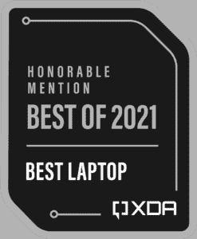

### 年度最佳笔记本电脑荣誉奖:微软 Surface Laptop Studio

微软的 [Surface Laptop Studio](https://www.xda-developers.com/surface-laptop-studio-review/) 是 Surface Book 系列的继任者，如果苹果今年没有做这么多改变游戏，这将很容易成为第一。它有一个新的外形，解决了 Surface Book 的问题，允许微软使用更强大的内部功能，35W 处理器和专用显卡速度很快。

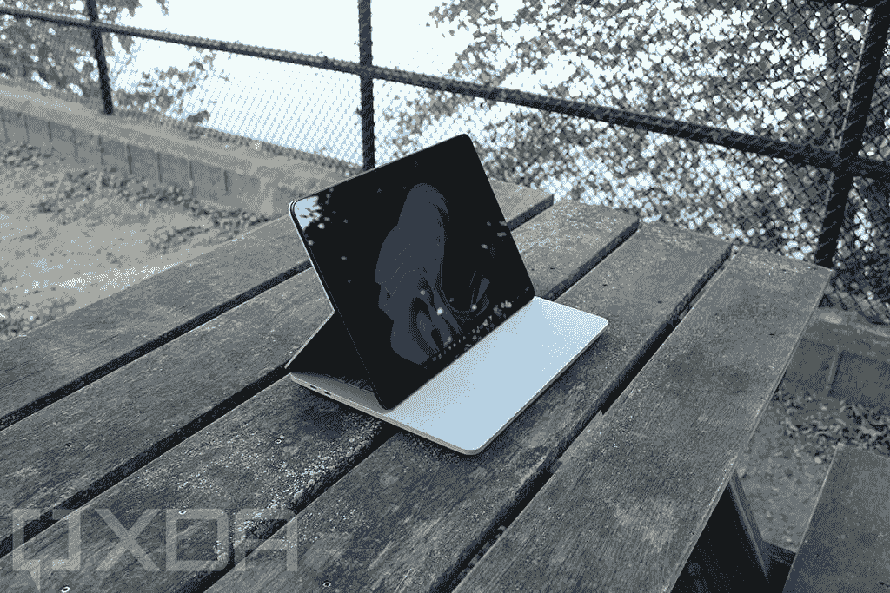

您可以将显示器折叠成不同的形状，新屏幕的刷新率为 120Hz，可播放超流畅的动画。有了新的超薄笔 2，实际上有触觉反馈，所以感觉就像你在一张实际的纸上写字。拥有世界上最好的键盘之一，所有这些都包含在一个具有卓越构建质量的包中。你会发现一个带有触觉反馈的全新触摸板，它是市场上最好的触摸板之一。

如果你想从 Windows 中获得最好的东西，Surface Laptop Studio 是你能做到的最好的东西。随着今年 Windows 11 的推出，这是一款英雄设备，Panos Panay 和 Surface 团队没有让微软的新敞篷车失望。

### 微软 Surface Laptop Studio

Surface Laptop Studio 配备了全新的设计、更强大的内部功能等等。

**Affiliate Links**

Amazon

[View at Amazon](https://www.amazon.com/Microsoft-2736x1824-Touchscreen-i5-8250U-Fingerprint/dp/B07XF55D7Z?tag=xda-5ajdjjr-20&ascsubtag=UUxdaUeUpU6275&asc_refurl=https%3A%2F%2Fwww.xda-developers.com%2Fbest-of-2021%2F&asc_campaign=Short-Term)

Store

[View at Store](https://shop-links.co/1759961509791610347?u1=de27ff8f-2c51-4d2e-be28-80c17b84ff46)

* * *

### 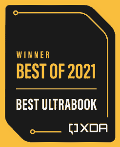

## 年度最佳超极本:戴尔 XPS 13 9310

英特尔现在已经快一年半没有宣布新一轮的 15W 处理器了，所以 2021 年超极本和变形本的产量实际上有点渺茫。然而，戴尔实际上发布了 XPS 13 9310 笔记本电脑的一些新配置，包括一些更新的 U 系列芯片。

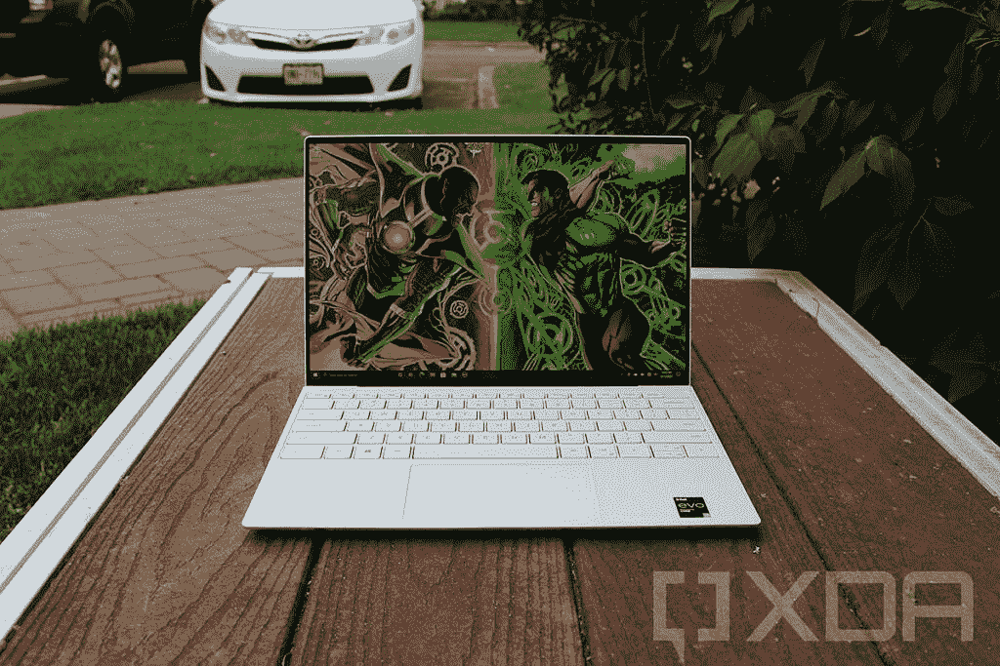

年复一年，Dell XPS 13 是市场上最好的笔记本电脑之一。它配有超薄边框和 InfinityEdge 显示屏，并且该屏幕还拥有我们在笔记本电脑上见过的最宽的色域之一。如果我们有一个最佳显示器奖，戴尔 XPS 将轻而易举地赢得 13、15 和 17 英寸类别。相反，我们只是称之为最好的超极本。

戴尔凭借整个 XPS 系列而闻名，因为它是一款 X-2 外形的 X 尺寸笔记本电脑。对于 XPS 13，它应该是一台 11 英寸大小的 13 英寸笔记本电脑；当然，现在许多高端笔记本电脑都有更小的边框，这可能更适用于你可能要更换的 11 英寸笔记本电脑。但它的占地面积很小，非触摸型号的重量为 2.64 磅，可以肯定地说它是超便携的。小尺寸并没有阻止戴尔将其小型化网络摄像头安装在顶部挡板中，这在前几代产品中是一个问题。它甚至有一个红外摄像头用于面部识别。对于端口，您会发现双 Thunderbolt 4 端口，允许您连接外部 GPU、双显示器等设备，或者只是一个让您插入一系列外围设备的坞站。

它也很时尚，有两种颜色可供选择。你可以选择铂金色搭配黑色内饰，或者冰霜色搭配北极白色玻璃纤维编织内饰。后者如上图所示。

### 戴尔 XPS 13

戴尔的 XPS 13 是该系列的旗舰产品，超薄边框和小尺寸是其标志性特征。

**Affiliate Links**

Amazon

[View at Amazon](https://www.amazon.com/Dell-XPS-13-9310-Multi-Touch/dp/B08VBH4WBT/?tag=xda-5ajdjjr-20&ascsubtag=UUxdaUeUpU6275&asc_refurl=https%3A%2F%2Fwww.xda-developers.com%2Fbest-of-2021%2F&asc_campaign=Short-Term)

### 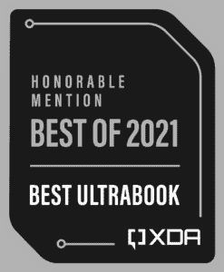

### 年度最佳超极本荣誉奖:微软 Surface Laptop 4

只要没有 Thunderbolt，微软的 Surface 笔记本电脑就永远不会占据头把交椅，但它仍然是最好的笔记本电脑之一。它有 13.5 英寸和 15 英寸两种尺寸，都有 AMD 锐龙 4000 或英特尔第 11 代处理器可供选择。

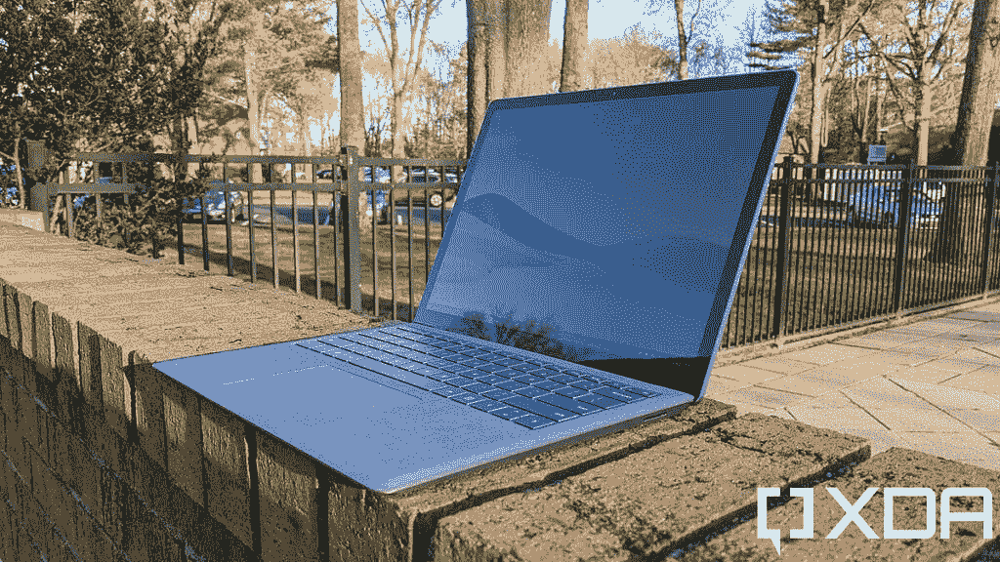

这两种尺寸都提供有趣的东西，包括 3:2 显示器、红外相机等。在 Surface Laptop 4 13.5 上，你可以通过 Alcantara 键盘面板获得它。对于今年的型号，它放弃了钴蓝色，转而采用全新的冰蓝色。当然，如果铝更符合你的速度，也有非阿尔坎塔拉选项。

15 英寸版本的独特之处在于，它仍然是一款超极本。很多较大的笔记本电脑倾向于配备更强大的 CPU 和专用显卡，但 Surface Laptop 4 15 仍然相对轻薄。此外，它拥有 3:2 的比例，这在那个尺寸中是罕见的，使更大的显示器感觉非常宽敞。

### 微软 Surface Laptop 4

微软最新的 Surface 笔记本电脑并没有进行彻底的重新设计，但 CPU 的更新和新的颜色将一款出色的笔记本电脑推得更远

**Affiliate Links**

Best Buy

[View at Bestbuy](https://shop-links.co/link/?exclusive=1&publisher_slug=xda&article_name=XDA+Awards+--+The+Best+Tech+of+2021&article_url=https%3A%2F%2Fwww.xda-developers.com%2Fbest-of-2021%2F&u1=UUxdaUeUpU6275&url=https%3A%2F%2Fwww.bestbuy.com%2Fsite%2Fmicrosoft-surface-laptop-4-13-5-touch-screen-amd-ryzen-5-surface-edition-8gb-memory-256gb-ssd-latest-model-platinum%2F6455189.p%3FskuId%3D6455189)

* * *

### 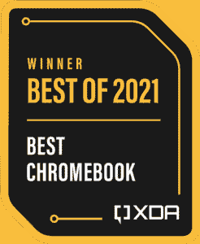

## 年度最佳 Chromebook:华硕 Chromebook CX9

如果你想要 Chrome OS 提供的最好的东西，请将你的注意力转向[华硕 Chromebook CX9](https://www.xda-developers.com/asus-chromebook-cx9-review/) 。它几乎是尽善尽美了，提供了通常只为 Windows PC 保留的高级规格。

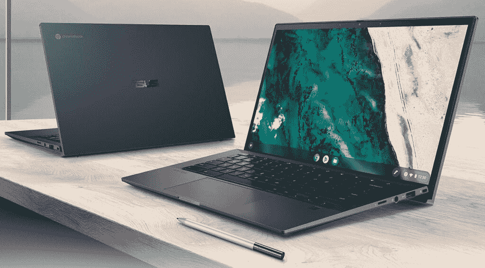

首先，它包括英特尔的第 11 代处理器，你实际上可以通过适当的酷睿 i7-1165G7 获得它。这意味着您将获得 96 个执行单元的英特尔 Iris Xe 显卡。这东西用 Chrome OS 飞，续航方面，华硕承诺最长 14 小时。

但除了像 USB 3.2 Gen 2 这样的现代端口，它还有两个 Thunderbolt 4。这是你在 Chromebooks 上根本找不到的东西，主要是因为市场上有这么多由 AMD、联发科或高通制造的处理器，而且其中有这么多是由廉价笔记本电脑组成的。有了 Thunderbolt 4，你可以在一个端口上插入两个 4K 显示器，将你的 Chromebook 变成一个真正的工作站。你可以得到的其他高端规格是 16GB LPDDR4x 内存，512GB M.2 NVMe PCEe 3.0 固态硬盘，以及 14 英寸 FHD 16:9 触摸屏，带笔支持，实际上边框非常窄。

这款高端 Chromebook 还具有一些有趣的功能，例如内置在触摸板中的 LED 数字键盘。没错；如果你想的话，它会用数字点亮，这实际上非常有用。

### 华硕 Chromebook CX9

华硕 Chromebook CX9 配备了高端规格，如英特尔第 11 代处理器、Thunderbolt 4 等。

**Affiliate Links**

ASUS

[View at Asus](https://www.asus.com/us/Laptops/For-Work/Chromebook/ASUS-Chromebook-CX9-CX9400-11th-Gen-Intel/)

### 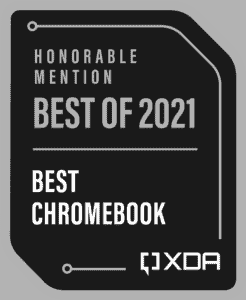

### 年度最佳 Chromebook 荣誉奖:联想 IdeaPad Chromebook Duet 5

去年，联想推出了联发科驱动的 Chromebook Duet，今年又推出了更大的 IdeaPad Chromebook Duet 5 。它配备了高通骁龙 7c Gen 2 处理器，因此速度更快，并配有 13.3 英寸的 FHD 有机发光二极管显示屏。

但它也是一款带笔支架、可连接键盘和可连接支架的平板电脑。这实际上让有机发光二极管的展示更加令人印象深刻，因为有机发光二极管平板电脑实在是太棒了。当然，最关键的是价值。这是一款很棒的设备，盒子里有键盘和支架，所以不像微软的 Surface Pro，你不必购买配件就可以开始使用。这支笔是可选的。

总而言之，联想 IdeaPad Chromebook Duet 5 虽然说起来有点拗口，但却是一款非常棒的 Chromebook。如果不是华硕 Chromebook CX9 把其他的都打得落花流水，联想就拿奖了。

### 联想 Chromebook Duet 5

联想 Chromebook Duet 5 是 2020 年 Chromebook Duet 的更大、更高端版本。你得到一个明亮的有机发光二极管显示器，可拆卸键盘，和 USI 笔支持。售价 429 美元的所有这些功能使其在 Chrome 平板电脑领域具有坚实的价值。

**Affiliate Links**

Amazon

[View at Amazon](https://www.amazon.com/Lenovo-Chromebook-Snapdragon-Qualcomm-82QS0000US/dp/B09LP61KDP/?tag=xda-5ajdjjr-20&ascsubtag=UUxdaUeUpU6275&asc_refurl=https%3A%2F%2Fwww.xda-developers.com%2Fbest-of-2021%2F&asc_campaign=Short-Term)

* * *

### 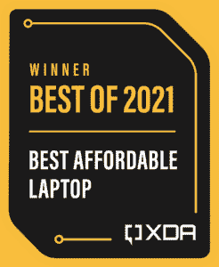

## 年度最佳经济笔记本电脑:HP Pavilion Aero 13

当我想到 HP Pavilion 笔记本电脑时，我会想到出于需要而不是选择购买的东西。它以适中的价格提供了很多价值，但也做出了一些重大的妥协。然后，[惠普 Pavilion Aero 13](https://www.xda-developers.com/hp-pavilion-aero-13-review/) 吹走了我的期望。

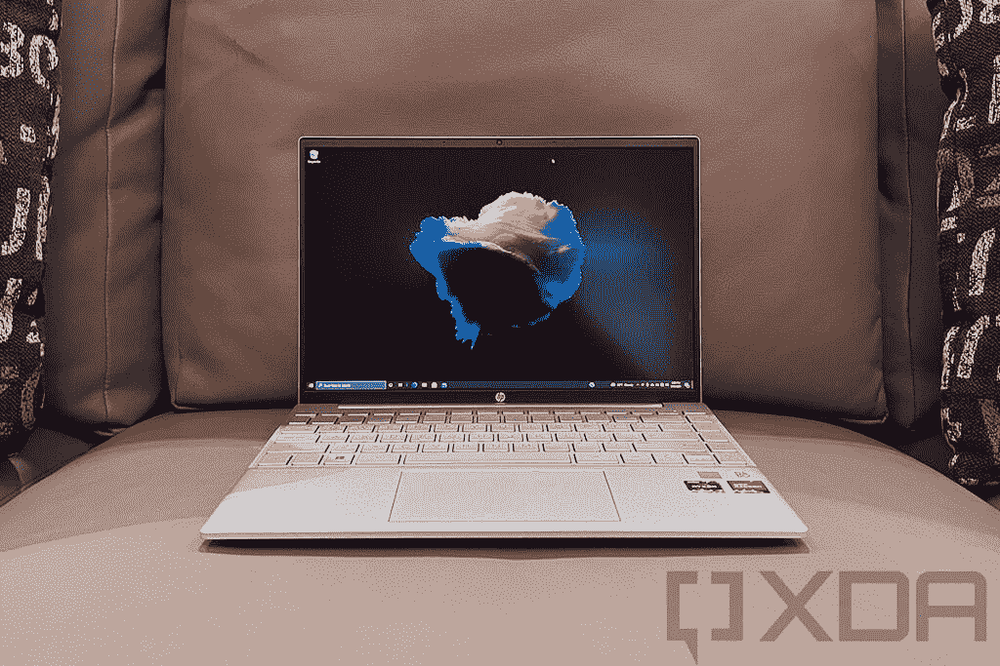

首先，它的重量不到一公斤，这意味着它非常容易放进你的包里就可以走了。你最终会检查你的包以确保它在那里，因为它太轻了。

但最酷的是，它真的没有做出任何相当大的妥协。它配备了一个 AMD 锐龙 7 5800U 处理器，所以它在性能方面有很大的影响。除此之外，它还有高达 16GB 的内存和 512GB 的 PCIe NVMe M.2 固态硬盘。13.3 英寸的 FHD 显示屏也令人印象深刻。惠普甚至加入了指纹传感器，这是 Pavilion 笔记本电脑上通常可选的东西。惠普 Pavilion Aero 的神奇之处在于，如果你不知道更多，你可能会认为它是一款高端笔记本电脑。凭借其窄边框、金属色、镁合金设计，以及不到 2.2 磅的重量，而没有做出任何有意义的妥协，你永远不会猜到这款产品的价格不到 1000 美元，即使它已经上市。

先说清楚。这不是唯一一台重量不到 2.2 磅的笔记本电脑，绝对不是。但惠普没有做出妥协，选择了动力不足的处理器，或使用非常小的电池。如上所述，考虑到你得到的东西，它真的很便宜。

### 惠普展馆 Aero 13

Pavilion Aero 的重量仅为 2.2 磅，但它仍然是一款功能强大、品质卓越的笔记本电脑。它拥有最新的 AMD 锐龙处理器，高 16:10 全高清+显示屏，镁合金外壳使其格外轻便。另外，它有四种颜色可供选择。

**Affiliate Links**

HP

[View at Hp](https://www.hp.com/us-en/shop/pdp/hp-pavilion-aero-13z-be000-laptop-pc-2r1x0av-1)

* * *

### 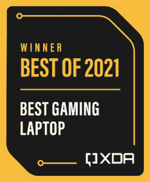

## 年度最佳游戏笔记本电脑:Razer Blade 15 Advanced

早在 5 月份宣布的 Razer Blade 15 Advanced 是世界上最薄的笔记本电脑，拥有 NVIDIA 的 RTX 显卡，厚度约为三分之二英寸。通常情况下，你会期望在 GPU 或 CPU 的功能上有所妥协，但这款笔记本电脑完全投入，这就是为什么它是今年的最佳游戏笔记本电脑。

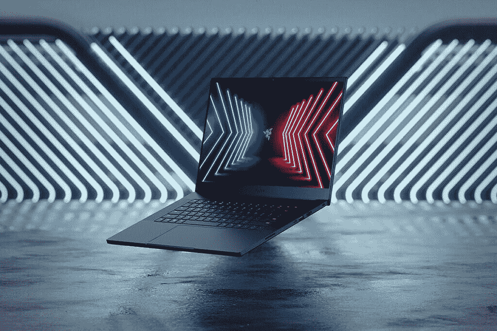

它配备了英特尔酷睿 i7-11800H CPU，尽管实际上还有一个酷睿 i9-11900H 的选项，对于图形，你可以高达 NVIDIA GeForce RTX 3080。如果你想全力以赴，你可以获得 32GB 的内存和 1TB 的固态硬盘。的确，这是一款令人印象深刻的游戏笔记本电脑。15.6 英寸显示屏也超越了预期。从历史上看，如果你想要高刷新率，你必须牺牲分辨率，获得 1080p 的显示器。Razer Blade 15 Advanced 的屏幕具有 QHD 分辨率，并且具有高达 240Hz 的刷新率。即使只是基本型号也配备了酷睿 i7、带 8GB GDDR6 的 NVIDIA GeForce RTX 3060、16GB RAM 和 512GB SSD，因此您不必倾家荡产也能获得出色的体验。那个型号实际上比指定的那种还要薄一点。当然，它拥有 Razer 简洁的设计语言，带色度的逐键 RGB 照明，以及你期望从一台优质 Razer 笔记本电脑中获得的一切。

### Razer Blade 15 高级版

Razer Blade 15 Advanced 是世界上最薄的 RTX 游戏笔记本电脑。

**Affiliate Links**

Amazon

[View at Amazon](https://www.amazon.com/Razer-Blade-Advanced-Gaming-Laptop/dp/B09HJHYHYB/?tag=xda-5ajdjjr-20&ascsubtag=UUxdaUeUpU6275&asc_refurl=https%3A%2F%2Fwww.xda-developers.com%2Fbest-of-2021%2F&asc_campaign=Short-Term)

### 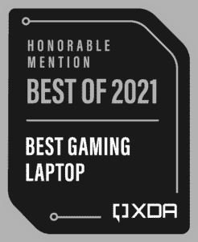

### 年度最佳游戏笔记本电脑荣誉奖:联想 Legion Slim 7

你可能会注意到这里有一个主题。感觉每年，公司都想方设法将更强大的组件装入更薄更轻的封装中。联想军团超薄 7 的[是另一个例子。](https://www.xda-developers.com/lenovo-legion-slim-7-review/)

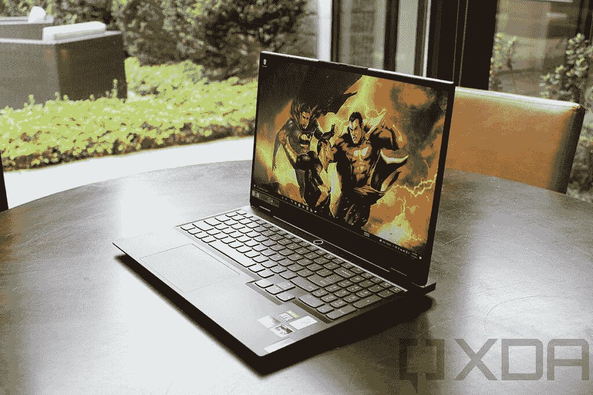

这种产品很有冲击力。它拥有 AMD 的 45W 锐龙 7 5800H 处理器和 NVIDIA GeForce RTX 30 系列显卡。但它的重量只有 4.19 磅，比普通的游戏笔记本电脑更便于携带。它还有一个微妙的设计，使它更像是一个工作和娱乐的产品。你可以在白天用它来提高工作效率、进行创造性的工作等等，然后你可以把它带回家玩一些硬核游戏。当然，它还拥有你所期望的其他功能，比如高刷新率显示屏、USB Type-A 和 USB Type-C 端口、SD 读卡器等等。

### 联想军团 Slim 7

联想 Legion Slim 7 的重量刚刚超过 4 磅，但它配备了 AMD 锐龙 45W 处理器和 RTX 3060 显卡，功能非常强大。

**Affiliate Links**

Best Buy

[View at Bestbuy](https://shop-links.co/link/?exclusive=1&publisher_slug=xda&article_name=XDA+Awards+--+The+Best+Tech+of+2021&article_url=https%3A%2F%2Fwww.xda-developers.com%2Fbest-of-2021%2F&u1=UUxdaUeUpU6275&url=https%3A%2F%2Fwww.bestbuy.com%2Fsite%2Flenovo-legion-slim-7-15-gaming-laptop-amd-ryzen-7-5800h-16gb-memory-nvidia-geforce-rtx-3060-max-q-512gb-ssd-shadow-black%2F6470819.p%3FskuId%3D6470819)

* * *

### 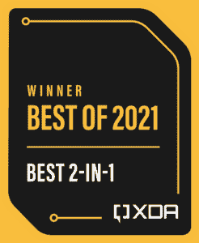

## 年度最佳二合一设备:微软 Surface Laptop Studio

我个人最喜欢的年度笔记本电脑，[微软的 Surface Laptop Studio](https://www.xda-developers.com/surface-laptop-studio-review/) 是从 Surface Book 的前身完全重新设计的，它有很多设计缺陷。对于可拆卸的显示器，所有的部件都必须在屏幕上，这就产生了散热问题，更不用说它超级头重脚轻的事实了。事实上，我记得去参加活动，打字时用手掌按住它。

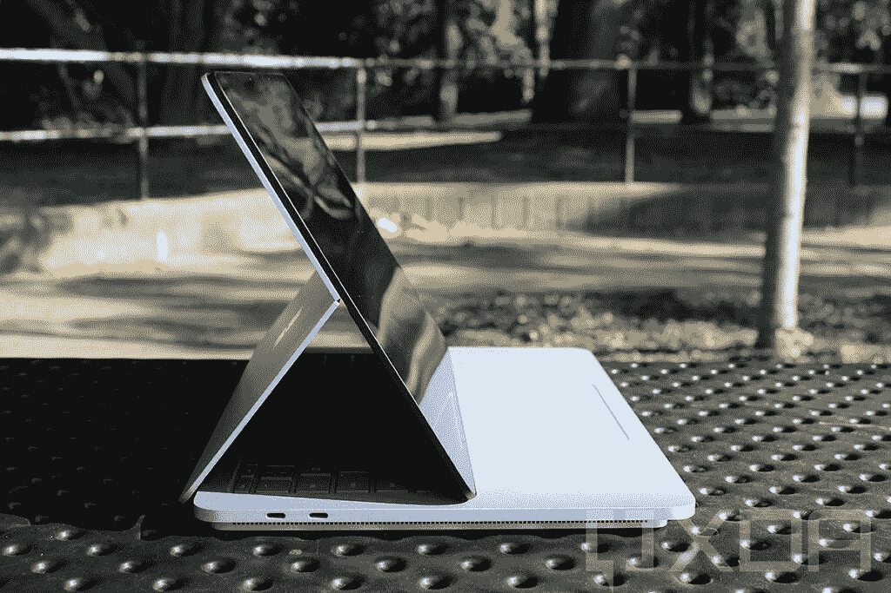

有了 Surface Laptop Studio，屏幕再也不可拆卸了。马上，这解决了很多问题。有了底座中的 CPU，微软可以使用合适的 35W CPU，而不是薄平板中的 15W 芯片。这给设备的使用带来了巨大的变化。这还不是全部。和同时公布的 Surface Pro 8 一样，拥有 120Hz 的屏幕。事实上，这是我们开始从 [Windows 11](https://www.xda-developers.com/windows-11/) 硬件上看到的东西，这很棒。历史上，高刷新率是为游戏玩家保留的，但正如我们从移动市场看到的那样，它改善了每个人的体验。

不过，我们不要忘记在显示屏上书写，因为对开风格的屏幕可以折叠成平板电脑。有了新的 Slim Pen 2，由于触觉反馈，你实际上感觉像是在一张纸上写字，尽管你需要使用支持的应用程序。这支笔通过磁力附着在设备底部的架子上，所以它不再粘在旁边而脱离。它也是这样充电的。Surface Laptop Studio 还拥有最好的键盘之一，并且首次在 Surface 中配备了由微软定制设计的触觉触摸板。的确，这是真正的 Windows 11 英雄设备。

### 微软 Surface Laptop Studio

Surface Laptop Studio 配备了全新的设计、更强大的内部功能等等。

**Affiliate Links**

Amazon

[View at Amazon](https://www.amazon.com/Microsoft-2736x1824-Touchscreen-i5-8250U-Fingerprint/dp/B07XF55D7Z?tag=xda-5ajdjjr-20&ascsubtag=UUxdaUeUpU6275&asc_refurl=https%3A%2F%2Fwww.xda-developers.com%2Fbest-of-2021%2F&asc_campaign=Short-Term)

Store

[View at Store](https://shop-links.co/1759961509791610347?u1=de27ff8f-2c51-4d2e-be28-80c17b84ff46)

### 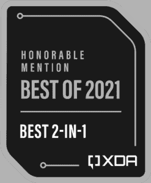

### 年度最佳二合一设备荣誉奖:戴尔 XPS 13 二合一 9310

听着，如果您购买了名为“戴尔 XPS”的产品，您将获得最好的产品之一。事情就是这样。给我留下深刻印象的一点是显示质量，在我们的测试中，这种一致性比我们遇到的任何其他东西都要好。

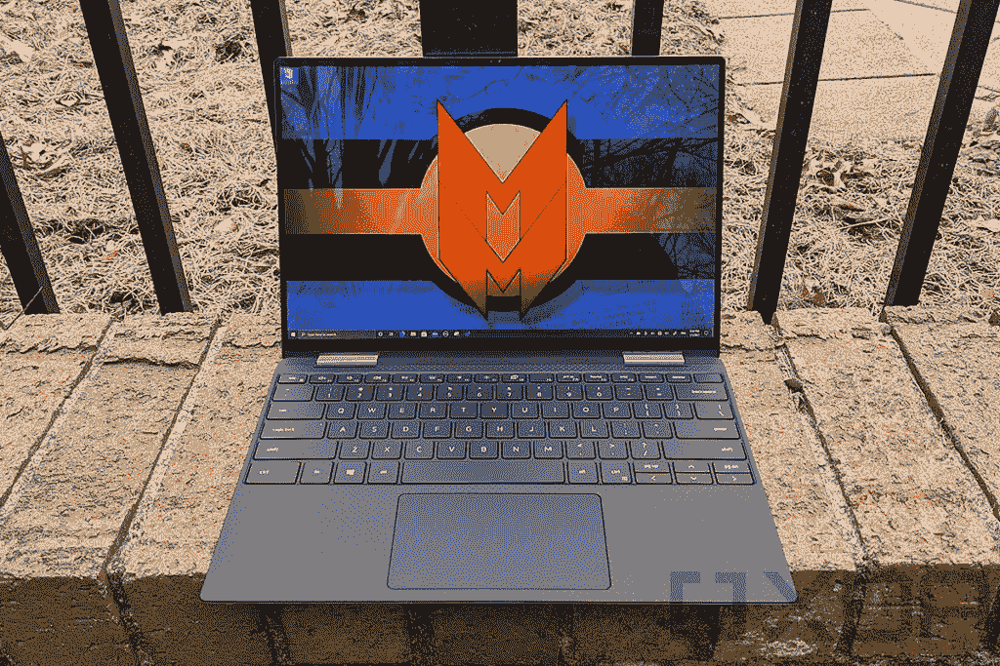

与 XPS 13 9310 一样，这款产品今年只更新了一些新的 CPU SKUs，但你无法改变成功的秘诀。是 360 度敞篷，但在性能上不做妥协。为了适应更纤薄的外形，它配备了更新的 MagLev Gen 2 键盘，更浅，但弥补了电阻深度的不足，带来了舒适的体验。它有几种颜色，如黑色碳纤维内饰的铂金色，或白色编织玻璃纤维内饰的磨砂色。正如戴尔喜欢指出的那样，它有四面窄边框，使它成为一台 13 英寸的笔记本电脑，可以容纳 11 英寸的笔记本电脑。

### 戴尔 XPS 13 二合一 9310

Dell XPS 13 2 合 1 配备 MagLev 第 2 代键盘、第 11 代处理器、窄边框显示屏等。

**Affiliate Links**

Amazon

[View at Amazon](https://www.amazon.com/Dell-Convertible-Touchscreen-i7-1165G7-Graphics/dp/B08LKTW8WP/?tag=xda-5ajdjjr-20&ascsubtag=UUxdaUeUpU6275&asc_refurl=https%3A%2F%2Fwww.xda-developers.com%2Fbest-of-2021%2F&asc_campaign=Short-Term)

* * *

### 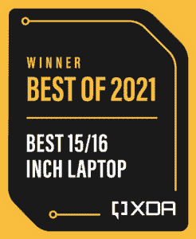

## 年度最佳 15/16 英寸笔记本电脑:惠普 Spectre x360 16

[惠普的 Spectre x360](https://www.xda-developers.com/hp-spectre-x360/) 系列可能是市场上最性感的敞篷车阵容。很难否认这一点。不幸的是，他们中的许多人被取消资格仅仅是因为他们今年没有刷新。不过，该公司确实推出了全新的 Spectre x360 16。

历史上，我们有过 HP Spectre x360 13 和 15，它们都有 16:9 的显示屏，15 英寸的型号有更结实的内部结构。去年，该公司增加了 Spectre x360 14，它拥有 13.5 英寸的 3:2 显示屏。现在，随着 16 的推出，它拥有了 16 英寸的 16:10 显示屏，比通常的 16:9 屏幕更高，作为平板电脑使用更加自然。

有趣的是，惠普为它提供了更多的超极本外形。它使用 35W 英特尔处理器和集成的 Iris Xe 显卡，基本上使它成为一台强大的生产力机器。似乎更大的 Spectre x360 包装 45W CPU 和专用显卡的时代已经结束了。不过，别忘了相机。惠普在这款设备中放置了一个 5MP 传感器，这是 Spectre 系列的第一个传感器，也是在家工作时代的必需品。它可以为您的视频通话捕捉 FHD 视频，但它也有足够的分辨率，视野可以随您移动。惠普称这一特性为 Autoframe。自然，它采用了我们习惯于从惠普旗舰敞篷车中看到的相同的宝石切割设计。它有夜幕黑和夜莺蓝之类的颜色，这是一种取代海神蓝的新颜色。

### 惠普 Spectre x360 16

惠普的 Spectre x360 16 配备了更大的 16:10 显示屏、英特尔 35W 处理器、500 万像素网络摄像头等。

**Affiliate Links**

HP

[View at Hp](https://www.hp.com/us-en/shop/mdp/hp-spectre-x360-16-3074457345617622169--1)

### 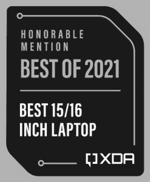

### 年度最佳 15/16 英寸笔记本电脑荣誉奖:Dell XPS 15 9510

再一次，戴尔的 XPS 阵容不得不提。我们今年获得了新的 XPS 15，它采用了英特尔的第 11 代处理器。还有一个新的配色，就是霜白色的编织玻璃纤维键盘甲板。新的颜色绝对令人惊叹，很高兴看到更多的颜色出现在更大的型号上。

另一件新鲜事是 4K·有机发光二极管展示的选择。虽然我们以前在 XPS 15 上见过有机发光二极管屏幕，但去年戴尔改用 16:10 的宽高比时，该选项被取消了。我们应该感到惊讶的是，现在面板可用了，配置也可用了。显然，有机发光二极管显示器意味着你得到真正的黑色，更鲜艳的颜色，等等。

同样值得注意的是，XPS 17 9710 于今年问世，以防您正在寻找比 XPS 15 更强大的产品。有了 RTX 3060 显卡，它更结实更大，尽管它缺少像玻璃纤维编织内饰的霜色，或者 4K 有机发光二极管选项。事实上，17 英寸的 4K 有机发光二极管笔记本电脑现在根本不存在，因为显示器供应商仍然没有为它生产面板。

### 戴尔 XPS 15

凭借英特尔酷睿 i7 处理器、16GB 内存和 NVIDIA GeForce RTX 3050 Ti 显卡，该版本的 Dell XPS 15 可以为游戏和其他要求苛刻的任务提供出色的性能。这也是一种价格合理的配置，比直接从戴尔购买便宜。

**Affiliate Links**

Best Buy

[View at Bestbuy](https://shop-links.co/link/?exclusive=1&publisher_slug=xda&article_name=XDA+Awards+--+The+Best+Tech+of+2021&article_url=https%3A%2F%2Fwww.xda-developers.com%2Fbest-of-2021%2F&u1=UUxdaUeUpU6275&url=https%3A%2F%2Fwww.bestbuy.com%2Fsite%2Fdell-xps-15-15-6-fhd-laptop-intel-core-i7-11800h-16gb-memory-nvidia-geforce-rtx-3050-ti-graphics-512gb-ssd-platinum-silver%2F6468145.p%3FskuId%3D6468145)

* * *

### 

## 年度最佳商务笔记本电脑:联想 ThinkPad X1 Titanium Yoga

联想的 ThinkPad X1 Titanium Yoga 不仅是年度最佳商务笔记本电脑；这可能是今年最具创新性的笔记本电脑。乍一看，它似乎是一台采用 3:2 显示屏的 ThinkPad X1 Yoga，但实际上远不止如此。这款笔记本电脑实际上被设计成了一款出色的平板电脑。

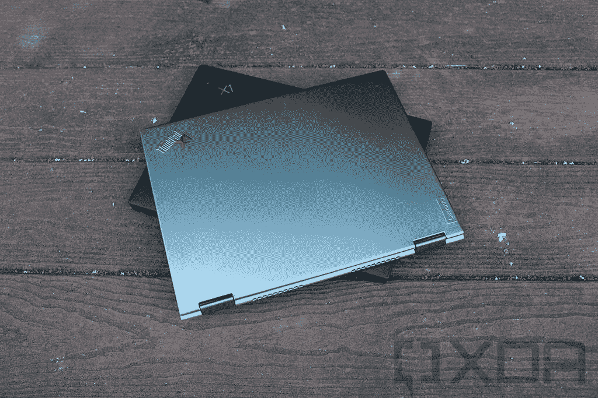

大多数 360 度敞篷车被设计成在 99%的时间里用作笔记本电脑，因为大多数人都是这样使用它们的。正因为如此，平板电脑的体验不是很舒服，这也是 Titanium 想要解决的问题。

首先，它的重量只有两磅半多一点，所以非常容易携带。事实上，就敞篷车而言，这是超便携的，更不用说你可以通过 5G 获得它，所以无论你在哪里都可以连接。重量并不是唯一不同的地方。它也更平，所以当你向后折叠显示屏时，它可以平放，作为平板电脑握着更舒适。为了实现这一目标，联想必须进行一些关键的创新，尤其是因为它不想破坏电池寿命。首先，键盘较浅，深度为 1.35 毫米。但这并不像是一种妥协，因为其他一些 ThinkPads 上的 1.5 毫米按键实际上感觉有点太深了。对键盘着迷的 ThinkPad 团队也确保了力曲线的匹配，这意味着按 1.35 毫米的键和按 1.5 毫米的键需要相同的力。它还有一个触觉触摸板，这是我们开始在 Windows 世界中看到更多的东西。当然，这允许设备更薄。它还使用英特尔的第 11 代 UP4 处理器，这是 Y 系列的继任者。最大的区别是，UP4 实际上非常好，所以联想 ThinkPad X1 Titanium Yoga 的任何创新都不像是一种妥协。

### 联想 ThinkPad X1 钛金瑜伽

联想的 titanium convertible 专为平板电脑用户打造，还包装了英特尔 Tiger Lake 处理器和 Iris Xe 显卡、Thunderbolt 4 等。

**Affiliate Links**

Amazon

[View at Amazon](https://www.amazon.com/Lenovo-ThinkPad-Titanium-i7-1160G7-Fingerprint/dp/B0973CK2PF/?tag=xda-5ajdjjr-20&ascsubtag=UUxdaUeUpU6275&asc_refurl=https%3A%2F%2Fwww.xda-developers.com%2Fbest-of-2021%2F&asc_campaign=Short-Term)

### 

### 年度最佳商务笔记本电脑荣誉奖:惠普精英蜻蜓 Max

[谈到 2021 年最佳商务笔记本电脑，惠普精英蜻蜓·马克斯](https://www.xda-developers.com/hp-elite-dragonfly-max-review/)一定会成为话题。也是一辆重约 2.5 磅的敞篷车，它由镁合金制成，并有美丽的闪亮黑色。

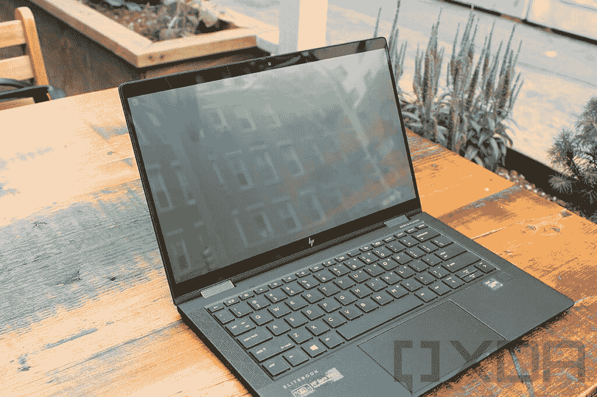

仍然配备 13.3 英寸 16:9 显示屏，其中一种配置具有惠普的 Sure View Reflect privacy 显示屏。这意味着当你打开它时，人们将无法越过你的肩膀看到你的屏幕上有什么。它还配备了一系列协作功能，最重要的是一个 500 万像素的网络摄像头，可以录制 1080p 视频。在当今这个在家办公的时代，笔记本电脑上一个坚固的网络摄像头至关重要。

它不仅重量轻、功能强大，而且是一款出色的笔记本电脑。它的键盘是所有笔记本电脑中最好的，它有很多安全功能，等等。你可以让它配备 5G 连接，所以你不必担心公共 Wi-Fi，或者如果太贵，也有 4G 选项。

### 惠普精英蜻蜓 Max

惠普的精英版蜻蜓 Max 有闪亮的黑色，并在精英版蜻蜓的基础上增加了一些很酷的协作功能。

**Affiliate Links**

HP

[View at Hp](https://www.hp.com/us-en/shop/pdp/hp-elite-dragonfly-max-notebook-pc-customizable-2l4h0av-mb)

* * *

### 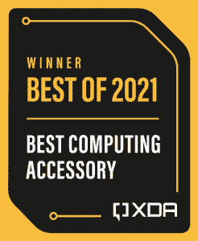

## 年度计算配件:微软 Surface Adaptive Kit

今年，微软推出了 Surface Adaptive Kit。该公司已经表明，它关心可访问性有一段时间了。此前，它推出了 Xbox Adaptive Controller，以方便残疾人玩 Xbox 游戏。现在，这款产品应该会让使用 Surface PCs 变得更加容易。

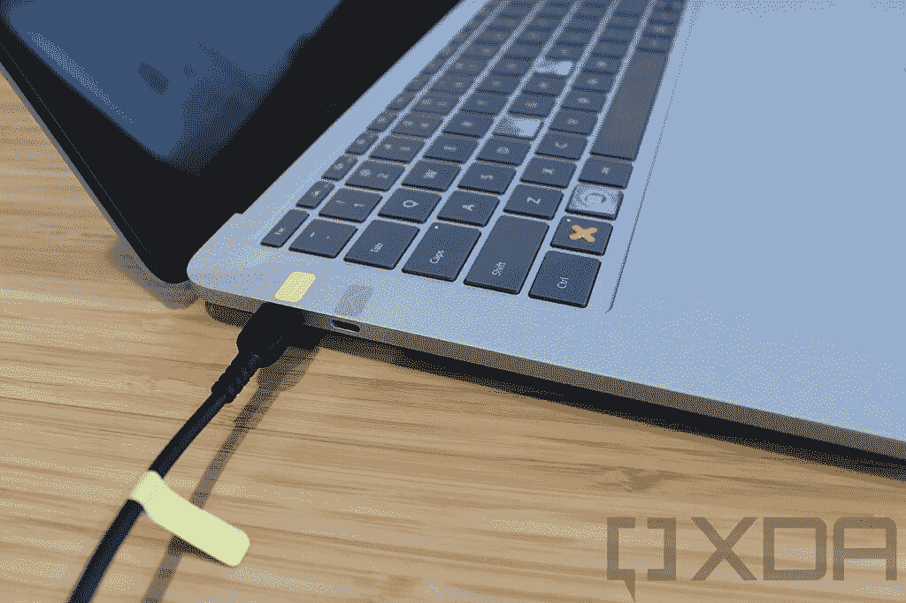

Surface Adaptive Kit 附带一系列标签、选项卡、指示器等。例如，Surface Pro 平板电脑的支架上有一个拉环，可以让它更容易打开。

但是也有各种各样的标签。有一系列凸起标签，应该很容易感觉到钥匙在哪里。还有端口指示器，帮助你找出哪个端口在哪里。

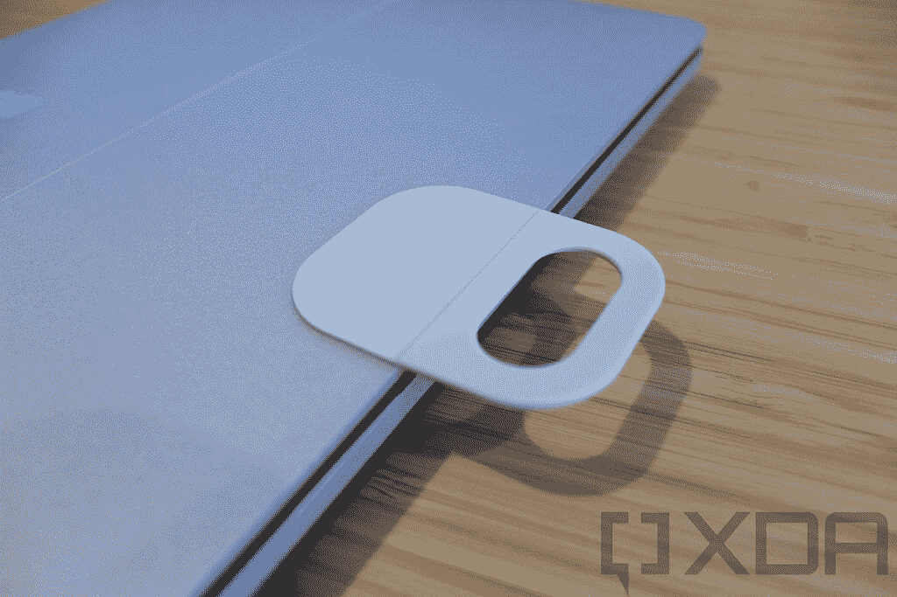

所有这些仅售 14.99 美元。微软经常说，它的使命是让客户获得更多，它还喜欢补充说，这意味着所有客户的*。雷德蒙公司希望创造一个世界，让有额外需求的人不必站起来寻求帮助。他们需要的工具已经很容易获得，同时不会影响其他人的体验。*

 *一套简单的标签、贴纸等等，对于制造适合每个人的产品来说是一条漫长的道路，而且它真的很便宜。这就是为什么 Surface Adaptive Kit 是年度最佳计算配件。

### 微软 Surface 适配套件

微软的 Surface Adaptive Kit 包括标签、贴纸等，有助于识别按键、端口等，使 Surface 设备更易于使用。

**Affiliate Links**

Microsoft

[View at Microsoft](https://www.microsoft.com/en-us/d/surface-adaptive-kit/8rdmhd3kfc3r)

### 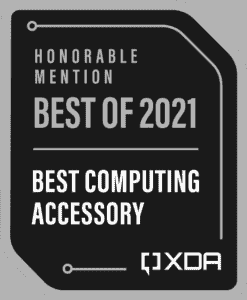

### 年度计算配件荣誉奖:微软超薄笔 2

虽然微软早在 2012 年就推出了第一支使用 Wacom 技术的 Surface Pen，但从那以后，它一直在创新笔技术。它采用了 N-Trig 技术，增加了压力敏感度，增加了倾斜支持等等。Surface Pro X 配备了一支细长的笔，可以存放在键盘中，并在键盘中无线充电。有了今年的 Surface Laptop Studio 和 Surface Pro 8，可以搭配 Slim Pen 2。

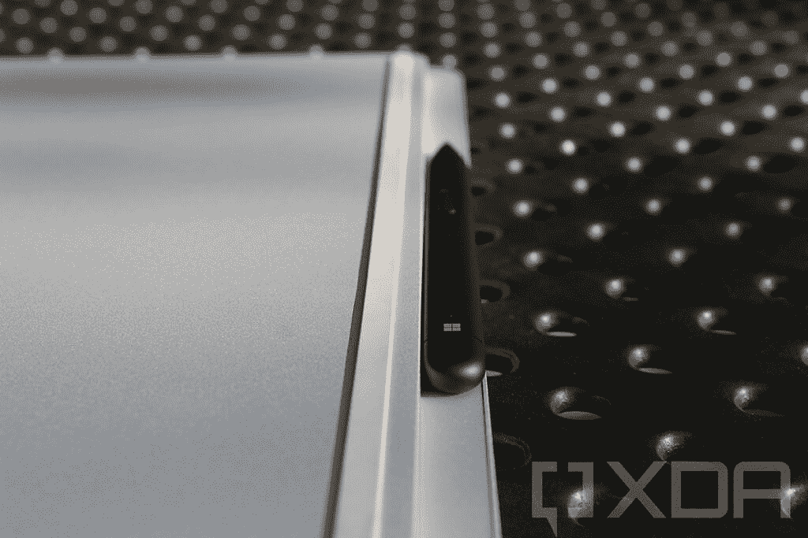

Slim Pen 2 真正酷的地方是它有触觉反馈，感觉就像你在一张纸上写字一样。当我今年看到微软的新系列 Surface 产品时，纤薄的 Pen 2 对我来说是最大的惊喜。这真是不可思议，让在屏幕上书写感觉更加自然。

唯一的问题是，你必须使用支持的应用程序才能工作；否则，感觉就像你在一块玻璃上写字。遗憾的是，这个应用列表仍然很短。

### 微软超薄笔 2

微软的 Slim Pen 2 在对接时可以无线充电，并且有触觉反馈。

**Affiliate Links**

Microsoft

[View at Microsoft](https://www.microsoft.com/en-us/d/surface-slim-pen-2/8tb9xw8rwc14)

* * *

### 

## 年度电脑制造商:苹果

很难选出年度最佳计算机制造商。有太多令人惊奇的东西了。但最终(或一年)还是得是苹果。Cupertino 公司现在拥有整个堆栈，这使得它可以做以前不可能做的事情。

新款 MacBook Pro 就是一个例子。如上所述，如果你带着能编辑视频的笔记本电脑出门，你必须带上充电器。它不仅仅是一个普通的充电器。这些功能强大的机器需要更多的电力，因此充电器往往更重，携带起来也不舒服。新款 MacBook Pro 电脑解决了这个问题。它们不仅有动力，还有电池寿命。这在以前是不可能的。如果仅仅是一个系列的笔记本电脑，这可能不足以称苹果为年度最佳电脑制造商。但是除了 M1 Pro 和 M1 Max 处理器，我们还有常规的老 M1。

苹果的新款 MacBook Air、13 英寸 MacBook Pro 和 Mac Mini 都在去年发货，但今年，该公司将相同的处理器用于其新的 iPad Pro 系列和新的 24 英寸 iMac。没错；你可以在 11 英寸的平板电脑上获得与 24 英寸的一体机完全相同的处理器，没有人说 24 英寸的 iMac 动力不足。

除了以上述方式改变游戏之外，苹果还因为改变了格局而获得加分。在 ARM 处理器上进行计算现在是合法的，我们看到了其他公司在 Windows 方面的所有新事物。高通收购 Nuvia 是为了与苹果定制的 ARM 处理器竞争，而英特尔正在制造更节能的混合芯片。竞争是好事，这在整个个人电脑行业都有体现。

### 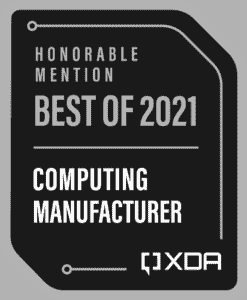

### 年度计算机制造商荣誉奖:微软

微软今年全力以赴，毫无疑问；原因是因为现在很多人在家工作。随着 Surface 系列的两次重大重新设计和一个全新的操作系统，它真的做到了它能做到的一切。请记住，所有这些都是人们在家工作时完成的。

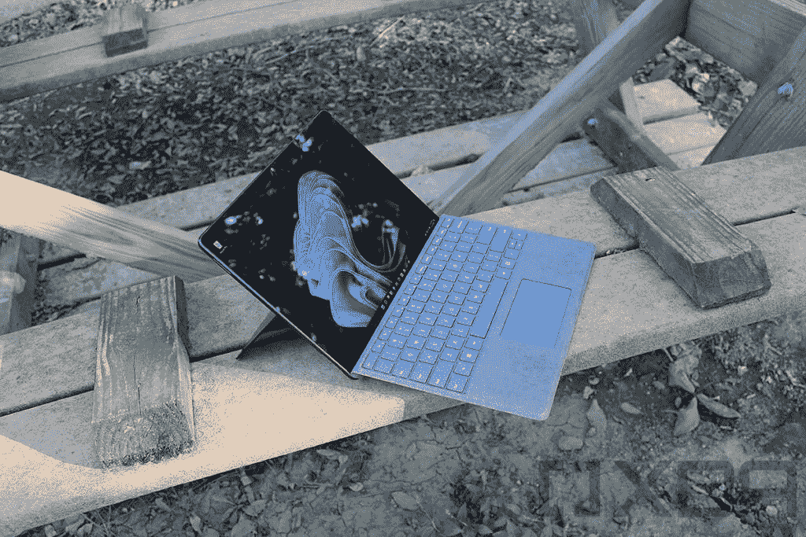

我们已经谈论了很多关于 Surface Laptop Studio 的事情，它无疑是今年最好的笔记本电脑之一。但我们也有 Surface Pro 8，这是自 2014 年 Surface Pro 8 以来首次正式重新设计的产品。它有更薄的边框、铝制机箱、120Hz 显示屏等等。

我们今年也有了 Windows 11。请记住，就在不久前，Windows 10 将永远得到服务，但今年有一个机会。Windows 11 提供了重新设计的开始菜单、小工具、团队集成，甚至获得了 Android 应用程序支持。

当然，微软推出了 Surface Adaptive Kit 和 Slim Pen 2。这两个被列在最佳计算配件部分的东西，为个人电脑领域提供了重大而有意义的创新。

* * *

* * *

这些是我们 2021 年的最佳选择。你同意他们所有人的观点吗？今年你最喜欢的选择是什么？请在下面的评论中告诉我们！*