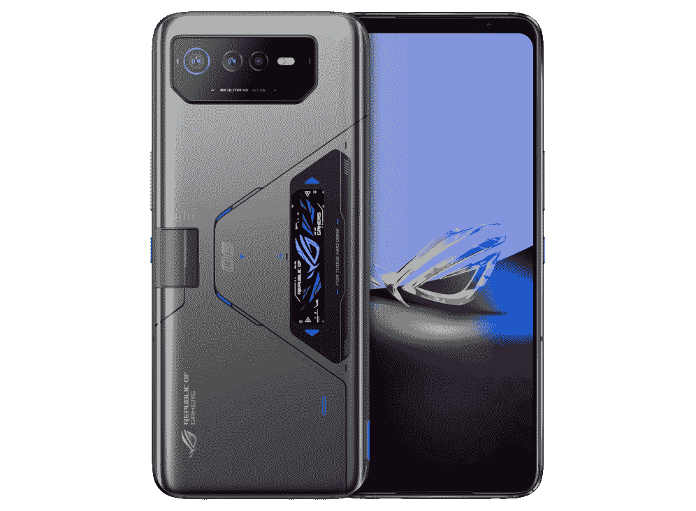
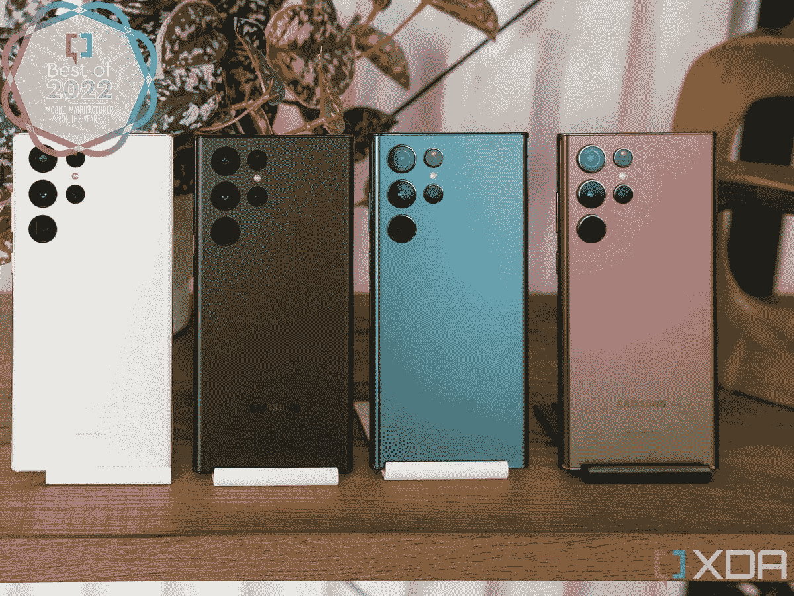

# 2022 年 XDA 最受欢迎的智能手机和配件

> 原文：<https://www.xda-developers.com/best-of-2022-mobile/>

就智能手机而言，今年是强劲的一年。因此，随着 2022 年接近尾声，2023 年即将到来，我们选出了今年发布的[最佳智能手机](https://www.xda-developers.com/best-phones/)和配件。从三星 Galaxy S22 Ultra 等出色的旗舰设备到完全疯狂的小米 12S Ultra，我们在这里拥有一切。我们在 XDA 几乎回顾了今年发布的所有智能手机，所以我们花了一些时间进行思考，并要求我们所有的作家选择他们最喜欢的 2022 年智能手机。

## 最佳智能手机:三星 Galaxy S22 Ultra(骁龙)

我们将以[三星 Galaxy S22 Ultra](http://www.xda-developers.com/samsung-galaxy-s22-ultra-review/) 作为年度智能手机的选择...只要是骁龙版的。我们的 Exynos 部门遇到了许多问题，这些问题至今仍困扰着我们，很难给*那款*手机颁发年度手机奖。然而，三星 Galaxy S22 Ultra 及其骁龙 8 Gen 1 没有任何相同的问题。

三星 Galaxy S22 Ultra 配备了一个非常出色的相机系统，具有令人难以置信的 108MP 传感器，以及 3 倍和 10 倍变焦长焦相机。你还可以获得顶级的显示屏，甚至可以记笔记的 S 笔，这不仅是年度最佳智能手机，也是年度最佳商务智能手机。只要你有一个解锁的变种，你也可以很快得到更新。

总的来说，很难找到三星 Galaxy S22 Ultra 的缺点，所以很容易将它命名为我们的首选。

最佳综合

三星 Galaxy S22 Ultra 是 2022 年市场上最完整的安卓智能手机之一，提供了最好的屏幕，最多功能的相机系统，安卓中最好的 SoC，以及手写笔。

### 亚军:谷歌 Pixel 7 Pro

谷歌 Pixel 7 Pro 是今年发布的另一款最好的智能手机之一，其吸引力的一部分在于其简单性。它可能没有三星 Galaxy S22 Ultra 的所有功能，但它也不需要。它确实拥有干净、可靠的软件、独特的设计和令人难以置信的摄像头。谷歌今年大幅提升了 Pixel 7 Pro 的游戏，几乎在每个方面都做到了。

谷歌的软件是最好的软件之一，这要归功于该公司内置的功能。生活质量功能，如 Now Playing，它可以识别你周围的音乐，以及语音听写是我们最喜欢的两个功能，但这里有适合每个人的东西。你还会比其他人更早获得软件更新，所以如果这是你的特权，那么它甚至是比 Galaxy S22 Ultra 更好的选择。

 <picture></picture> 

Google Pixel 7 Pro

Pixel 7 Pro 是谷歌有史以来最好的手机，拥有精致、优质的设计和谷歌第二代硅芯片，以及一如既往的出色摄像头。

## 最佳平价智能手机:Poco F4

小米的 [Poco F4](https://www.xda-developers.com/poco-f4-review/) 是一款 400 美元的手机，配有骁龙 870 SoC、受大猩猩玻璃 5 保护的 120Hz 有机发光二极管显示屏、出色的触觉、出色的立体声扬声器和固体摄像系统。除了缺乏专用变焦镜头和塑料背面，普通消费者很难看出这是一部“实惠的手机”唯一的缺点是这款手机不在美国销售，所以美国消费者无法轻松获得这款超值之王。

 <picture></picture> 

Poco F4

##### 波科 F4

最佳价值

Poco F4 是一款价格适中的中档手机，配有大屏幕、功能强大的处理器，以及展会的明星，一款配有 1 英寸传感器的出色相机。

### 亚军:无手机 1

[Nothing Phone 1](https://www.xda-developers.com/nothing-phone-1-review/) 在发布前受到了大量的炒作，最终,*只是*一款坚固的中档 Android 手机，背部设计华丽。如果这听起来是消极的，那就不应该是消极的。这款手机起价 470 美元，配有骁龙 778G SoC、120Hz 有机发光二极管显示屏和简洁的软件。相机性能时好时坏，没有变焦镜头，但软件更新在最近几个月有所改善。

这款手机是行业的游戏规则改变者吗？不，但在低于 500 美元的价格范围内，它真的是一款好手机吗？是的。然而，它获得了亚军，因为 Poco F4 有更好的触觉，略好的相机性能，而且有点便宜。

 <picture></picture> 

Nothing Phone 1

Nothing Phone 1 融合了独特的透明设计和强大的硬件。它可能不符合发布前的宣传，但它仍然是一款价格合理的坚固手机。

## 最佳智能手机相机:小米 12S Ultra

在过去的五年中，人们已经对相机软件的重要性做了很多讨论，尽管软件图像处理对于 2022 年的手机相机来说确实是至关重要的，但硬件仍然非常重要。而眼下，绝对最好的相机硬件可以说属于[小米 12S Ultra](https://www.xda-developers.com/xiaomi-12s-ultra-review/) 。

12S Ultra 是第一款采用索尼“1 英寸”IMX989 传感器的手机，与夏普几个月后的实施不同，小米根本没有裁剪其传感器。诚然，1 英寸的传感器实际上没有 1 英寸宽，但无论如何，关键是小米的主摄像头传感器与其他智能手机的传感器相比是巨大的，这导致了难以置信的，接近 DSLR 水平的照片质量，因为它可以捕捉更多的光线信息。12S Ultra 的其他镜头没有那么史诗，但它们仍然是优质的硬件。

当然，如果小米的软件映像很糟糕，这些都无关紧要，谢天谢地，事实并非如此。虽然没有谷歌的软件那么聪明，但小米的计算摄影能力足以抵挡 Pixel 7 Pro 和 Vivo X80 Pro，Pixel 7 Pro 的软件更好，但硬件较差，Vivo X80 Pro 也结合了优秀的硬件和软件。这真是千钧一发，但小米 12S Ultra 是今年最好的拍照手机。

 <picture></picture> 

Xiaomi 12S Ultra

##### 小米 12S Ultra

最佳相机

小米的 12S Ultra 拥有一个巨大的 1 英寸传感器，采用徕卡光学技术——它不负众望。另外，它有很棒的软件。

### 亚军:Vivo X80 Pro

对于亚军的位置，我们在谷歌 Pixel 7 Pro 和 [Vivo X80 Pro](https://www.xda-developers.com/vivo-x80-pro-review/) 之间进行了辩论。两款手机的主摄像头都使用了几乎相同的传感器(X80 Pro 使用了 Pixel 7 Pro 使用的 GN1 的更新版本)，并具有类似的潜望镜和超宽摄像头硬件。虽然谷歌的计算摄影是同类中最好的，但 Vivo 也不逊色，它采用定制的 V1+成像芯片，比我们测试过的任何手机都更好地处理 HDR(是的，甚至是 Pixel)。再加上蔡司在每个镜头上的 T-Coating(这显著减少了镜头眩光)，一个额外的变焦镜头(由微万向节系统支持的镜头)，Vivo 的 X80 Pro 刚刚击败 Pixel 7 Pro 成为今年第二好的相机。

 <picture></picture> 

Vivo X80 Pro

##### Vivo X80 Pro

Vivo X80 Pro 是一款非常精致的全方位智能手机，其相机可以拍摄出比市场上任何其他相机都更好的 HDR 照片。

## 最佳可折叠:三星 Galaxy Z Fold 4

你可能会想，选择 [Galaxy Z Fold 4](https://www.xda-developers.com/samsung-galaxy-z-fold-4-review/) 作为“最佳可折叠手机”似乎是一个显而易见的决定。对于许多地区来说，三星的可折叠手机是唯一的游戏。然而，我们 XDA 可以获得仅在中国发行的可折叠产品，这些产品在某些方面都做得更好。例如，小米的 Mix Fold 2 明显更薄，而 Oppo Find N 的屏幕几乎没有褶皱，外形更舒适。

但三星的 Fold 4 仍然胜出，因为它拥有上述所有手机中最完美的软件。这部分是因为 Fold 4 运行针对谷歌应用程序优化的软件，而仅在中国发布的软件则没有，但三星仍然建立了一个强大而直观的多任务系统。例如，尽管 Oppo Find N 在硬件方面很棒，但它受到应用程序缩放问题的困扰，无法在水平分屏视图中运行 YouTube。像这样的小事情，加上防水评级和全球官方可用性的保证，使 Fold 4 仍然是大多数人的最佳可折叠产品。

最佳可折叠

Galaxy Z Fold 4 带回了 Fold 3 的所有优点，外加一个更好的相机系统，一个稍宽的外部屏幕和更智能的软件。

### 亚军:Oppo Find N

Oppo Find N 是独一无二的，因为 Oppo 是一个新玩家，Find N 是该公司的首次公开尝试。尽管如此，Find N 是一款不可思议的智能手机，它成功地确定了可折叠手机应该是什么样子。这是一部很好的智能手机，用在*将军*身上，即使折叠起来，它的外壳显示屏也完全可用。展开后，你会有更多的屏幕空间，而且该软件是围绕其可折叠功能而构建的。

这款手机本身也很紧凑，并不比普通智能手机厚多少。它有着出色的外形，在可折叠手机摄影能力经常后退一步的世界里，Find N 保留了与 Oppo Find X3 Pro 相同的主要传感器。这是可折叠智能手机的第一次绝佳尝试。

 <picture></picture> 

OPPO Find N

##### Oppo Find N

OPPO Find N 是一款不太大也不太小的可折叠手机，它的屏幕几乎没有褶皱。

## 最佳游戏智能手机:华硕 ROG 手机 6 Pro

如果你喜欢在智能手机上玩游戏，那么[华硕 ROG 手机 6 Pro](https://www.xda-developers.com/asus-rog-phone-6-pro-review/) 应该是你的首选。它在很多方面都很完美。它速度很快，电池续航时间很长，并且有各种各样的外设可供选择。性能首屈一指，甚至还有耳机插孔。

当然，如果你喜欢使用智能手机做与智能手机相关的事情，那么华硕 ROG 手机 6 Pro 也可以很好地完成所有这些事情。相机甚至没有那么糟糕，尽管它显然是整个包装中最薄弱的部分。不过，如果你想要最好的游戏手机(当然也是最好的手机之一)，那么这款神奇的设备绝对不会出错。

##### 华硕 ROG 手机 6 Pro

最佳游戏手机

顾名思义，华硕 ROG 手机 6 旗舰版是一款终极游戏手机，内存高达 18GB，采用骁龙 8+ Gen 1 处理平台，165Hz 显示屏。它还具有独特的以游戏为中心的功能，如散热系统，可让您持续工作数小时。

### 亚军:华硕 ROG 手机 6D 旗舰版

虽然它是一款比 Pro 更便宜的智能手机，但华硕 ROG 手机 6D 终极版并不是真正的*终极*游戏手机。它装有联发科天玑 9000 Plus(因此价格更便宜)，但这是唯一的区别。虽然联发科的旗舰芯片令人难以置信，但它仍然落后于常规 Pro 中的骁龙 8 Plus Gen 1。还有一个通风口，空气动力冷却器 6 在盒子里。

总的来说，如果你想要一部能为你提供专注于游戏的功能的智能手机，你会想要看看华硕的 ROG 系列。如果你想省钱，你可以选择 6D 终极版。

 <picture></picture> 

Asus ROG Phone 6D Ultimate

##### 华硕 ROG 手机 6D 旗舰版

华硕 ROG 手机 6D 旗舰版与华硕 ROG 手机 6 Pro 是同一款手机，但代之以联发科天玑 9000 Plus。

## 年度手机制造商:小米

2022 年可以认为是大多数手机品牌的迭代年，除了小米。三星、谷歌和一加发布了旗舰产品，带回了与 2021 年的前辈几乎相同的硬件，而小米则推出或合作开发了两项尖端技术突破，为 2023 年的设备奠定了基础。

首先是前面提到的 1 英寸图像传感器。尽管传感器是由索尼制造的，但小米显然贡献了 1500 万美元来帮助资助镜头的开发。第二大硬件突破是 Mix Fold 2，展开时为 5.4 毫米，折叠时为 11.2 毫米，是目前最薄的可折叠手机。事实上，Mix Fold 2 薄得惊人，它比 Pro Max iPhone 的外壳厚不了多少。

仅这两项硬件创新就足以让小米在这里拔得头筹，但当你考虑到该公司今年还发布了可以说是最物有所值的廉价手机时，小米的排名感觉是显而易见的。现在，要是它能开始在美国销售其令人敬畏的产品就好了。

### 亚军:三星

看看三星 2022 年的手机发布，很容易得出结论，对这家韩国科技巨头来说，这是相当无聊的一年。无论是 Galaxy Z Fold 4、Z Flip 4、Galaxy A53，还是标准的非 Ultra S22 手机，三星大多都从去年带回了相同的硬件，除了处理器凸起。然而，所有这些手机都有更完善的软件，更长的电池寿命，以及更好的弱光相机性能，这些都使它们成为迄今为止这些手机的最佳版本。

再深入一点，我们可以看到三星也承担了一些风险。Galaxy S22 Ultra 本质上是 Galaxy Note 的重生。仅仅是 S Pen 的加入就让这款设备成为了一些人的必备品。与此同时，三星推出了其平板电脑系列的新 Ultra 版本，其中一款配备了巨大的 14.6 英寸有机发光二极管显示屏。搭配三星昂贵但出色的键盘外壳和三星 DeX，Galaxy Tab S8 Ultra 可以作为一些人的真正功能性计算机。在其他地方，Galaxy Z Fold 4 的光学和软件得到了很大改善，进一步巩固了它作为市场上最好的可折叠手机的地位。三星的 2022 年并没有马上亮眼，但这是低调而强劲的一年。

## 最佳手机创新:苹果通过卫星发送紧急求救信号

今年，XDA 有几项我们喜欢使用的移动创新，但最好的新功能是我们还没有使用过的，希望永远也不会使用。苹果为 iPhone 14 系列推出了紧急呼救功能，即使没有手机信号或数据连接，也可以通过内置的卫星与紧急服务部门联系。很容易理解为什么这能成为救命稻草。然而，这项功能只有两年免费(之后苹果将收费)，而且目前只在选定的国家有效。尽管如此，这仍然是我们希望所有手机在不久的将来都能采用的一个主要特性。

### 亚军:小米真薄可折叠

正如我们之前所写的，[小米的 Mix Fold 2](https://www.xda-developers.com/xiaomi-mix-fold-2-review/) 对于可折叠手机来说是一个突破，因为它大幅降低了被认为是设计妥协的厚度。Mix Fold 2 在展开时的厚度仅为 5.4 毫米，因此即使折叠起来，它也仅仅比平板手机厚一点。Mix Fold 2 是第一款合上时不会感觉像两块金属叠在一起的可折叠手机。一旦你拿过 Mix Fold 2，就很难回到更厚的可折叠状态而不感到笨重。

## 最佳真无线耳塞:AirPods Pro 2

对大多数人来说， [AirPods Pro 2](https://www.xda-developers.com/airpods-pro-2-review/) 是最好的无线耳塞，即使你不使用 iPhone。AirPods Pro 2 有四个硅耳塞(大多数其他耳塞提供三个)，一个可以处理主动噪音消除的新 H2 芯片，以及重新设计的音频驱动器，是我们在 XDA 测试过的声音最好的耳塞。它还拥有业内第二好的主动噪音消除功能，仅次于神秘的 Bose QuietComfort 耳塞 2，后者没有上榜，因为 AirPods Pro 2 有更好的透明模式和空间音频等功能。

这些功能是苹果耳塞称王的原因。不用 iPhone 的话甚至可以买一双。根据我们的测试，AirPods Pro 2 可以很好地连接 Windows 机器或 Android 设备。虽然您失去了一些特定的功能，如空间音频，但您仍然可以获得一流的透明模式，以及出色的 ANC 和音频质量。

##### 苹果 AirPods Pro 2

最佳真无线耳塞

尽管 AirPods Pro 2 的结构紧凑，但它有很多功能，包括主动噪音消除(ANC)、杜比 Atmos 内容和无线充电。

### 亚军:华为 FreeBuds Pro 2

几年来，华为一直在制造一些最好的无线音频产品，该公司的优质耳塞 [FreeBuds Pro 2](https://www.xda-developers.com/huawei-freebuds-pro-2-review/) 是市场上最好的耳塞之一。与第一代产品相比，我们喜欢它们更轻、更时尚的设计。FreeBuds Pro 2 每个花蕾的重量仅为 6.1 克，比 AirPods Pro 2 更光滑、更短，在我们的耳朵里看起来更隐秘——这是引人注目的紫色的因素。

得益于与 Devialet 的合作，该公司帮助微调了 11 毫米双驱动器，FreeBuds Pro 2 提供了出色的平衡音频，高音干净，中音清脆，低音强劲。然而，我们发现它的 ANC 在阻挡不必要的外部噪音方面不如 AirPods Pro 2，因此它落在了亚军的位置。

 <picture></picture> 

Huawei FreeBuds Pro 2

##### 华为 FreeBuds Pro 2

华为 FreeBuds Pro 2 是一对出色的降噪耳机，具有令人惊叹的音质和大量音频定制功能。由于它们独特而闪亮的颜色，它们在人群中也很突出。

## 最佳智能手表:苹果手表 Ultra

多年来，Apple Watch 一直是最好的智能手表，这主要归功于硬件/软件协同效应和应用生态系统。虽然三星和谷歌今年发布了强有力的替代产品，但我们今年仍然不得不再次使用 Apple Watch，特别是因为苹果基本上在 [Apple Watch Ultra](http://www.xda-developers.com/apple-watch-ultra-review/) 上推出了除厨房水槽之外的所有产品。

这款新手表包含多种功能，旨在让登山运动员、深海潜水员、耐力运动运动员以及不整天坐在笔记本电脑屏幕前的人的生活更加轻松。我们 XDA 的大多数人都不是这些东西，但即使是我们也能看到它的吸引力。它有一个更大、更亮的屏幕，即使从远处或在最强烈的阳光下也更容易阅读。它的构造就像一个坦克，所以如果你不小心把手腕撞到桌子边缘，你不会感到紧张。最后，电池寿命要好得多。考虑到卓越的 Apple Watch 应用生态系统和安全功能，如检测车祸的能力，Apple Watch Ultra 无疑是最好的智能手表。当然，它非常贵，799 美元。

##### 苹果手表 Ultra

最佳智能手表

Apple Watch Ultra 是苹果制造的最高端智能手表。它并不适合每个人，但如果你长时间在户外，是一个认真的运动员，或者只是想要终极保护，这是值得选择的手表。

### 亚军:三星 Galaxy Watch 5 Pro

Galaxy Watch 5 Pro 是三星有史以来最大、最耐用的智能手表，和苹果的 Watch Ultra 一样，它是为喜欢进行艰苦户外活动的人设计的。我们是保护屏幕的凸起边框和一次充电 3-4 天电池寿命的粉丝。

Galaxy Watch 5 Pro 在健身跟踪方面也很出色，包括检测身体脂肪百分比的能力，这是大多数智能手表还无法测量的指标。然而，三星的可穿戴软件仍然有点笨重，需要下载多个插件，应用生态系统也比不上 Apple Watch。尽管如此，Galaxy Watch 5 Pro 更实惠，如果你使用 Android 设备，这是一个简单的选择。

Galaxy Watch 5 Pro 面向健身爱好者，比标准的 Galaxy Watch 5 更耐用，电池更大。

* * *

## 2022 年是个好年景；2023 年应该会更好

总的来说，2022 年对移动来说是个好年景。即使三星和苹果没有给他们的智能手机带来大规模的创新，两家公司都进一步完善了他们的旗舰产品。小米推出了行业不能忽视的重要功能，智能手表行业向前迈出了一步，不仅推出了优质的苹果和三星产品，还推出了谷歌手表。

我们认为 2023 年将更加令人兴奋，因为更多的品牌发布可折叠产品——有些甚至是国际性的——并且 1 英寸传感器将成为更多安卓旗舰产品。据说三星也将为其超旗舰产品配备 200 万像素的摄像头，因此我们可能会看到移动摄像头的改进又向前迈进了一步。与此同时，苹果和谷歌将继续改进其芯片，以实现卓越的性能和硬件/软件协同。