# CES 2022 最佳:拉斯维加斯技术展上的最佳中的最佳！

> 原文：<https://www.xda-developers.com/best-of-ces-2022/>

又一年过去了，又一届 CES 结束了。与过去相比，CES 2022 非常不同，尽管自疫情开始以来首次有实体展览，但许多人选择不去旅行。在拉斯维加斯的地面上，一些公司在场，而许多公司最初计划去，并在展会前几周选择退出，因为 Omicron 变种出现并成为一个巨大的威胁。

然而，正如那句话所说，展览必须继续，因此 CES 2022 肯定会继续。对于在那里的公司来说，大量的产品正在展出，虽然展厅远没有平时那么繁忙，但它仍然是一个发明的橱窗。

从汽车到智能家居，从计算到移动以及介于两者之间的所有类别，这里是 XDA 团队为 CES 2022 挑选的最佳产品，其中一些我们在展会上亲眼见过。

* * *

## 联想 ThinkBook Plus 第三代

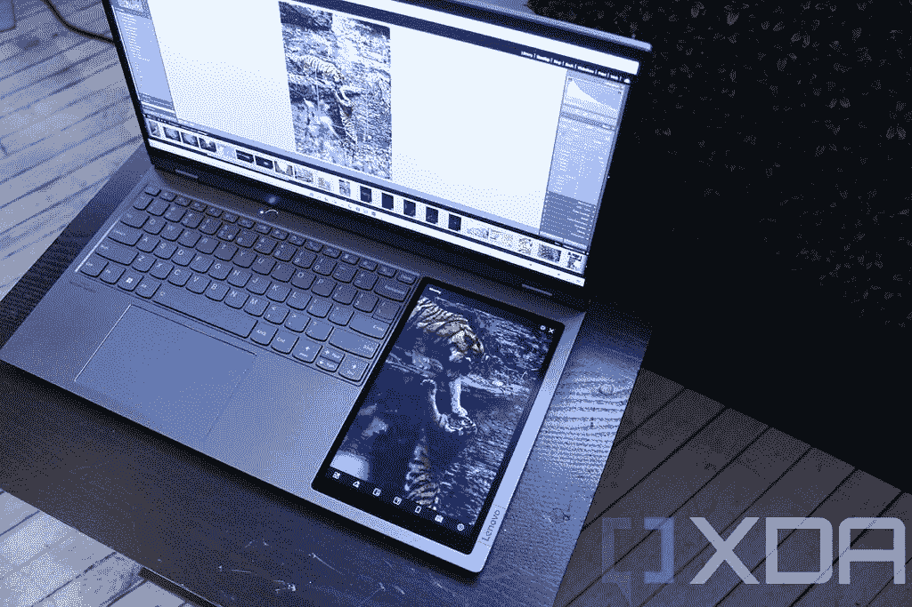

如果 CES 有一点是好的，那就是像联想 ThinkBook Plus Gen 3 这样疯狂的想法。前两代产品足够疯狂，盖子里有一个 E Ink 显示屏。这款电脑有一个不同的辅助显示屏，键盘旁边是一个全彩色的八英寸触摸屏。

在这一点上，你可能会问为什么你需要这样的东西，这是一个合理的问题。它有多种用途。例如，在上面的图像中，它放大了屏幕的一部分，然后您可以使用笔精确地编辑图像。您可以通过捏合来缩放，也可以滚动到屏幕的不同部分。你可以做的另一件事是做手写笔记。如果你在看书或打电话，你可以在 8 英寸的显示屏上做笔记。

默认情况下，微软白板在那里。这是一个非常强大的协作功能，因为白板会自动实时同步。你可以在开会的时候画画，其他人会在你画画的时候看到。他们也可以实时协作，但他们可能需要第二个设备，因为他们没有你的 ThinkBook Plus Gen 3 那么酷。

别忘了，它还有一个 17.3 英寸的 21:10 显示屏。巨大的超宽显示屏导致大底盘，允许全尺寸键盘和八英寸触摸屏。点击查看我们关于联想 ThinkBook Plus Gen 3 的[动手文章。](https://www.xda-developers.com/lenovo-thinkbook-plus-gen-3-hands-on/)

* * *

## 戴尔 XPS 13 Plus

[戴尔 XPS 13 Plus](https://www.xda-developers.com/dell-xps-13-plus/) 是 XPS 系列的全新产品，它不会取代标准的 XPS 13，因为坦率地说，这是一个非常彻底的变化。事实上，如果你正在看上面的图片，你可能会问各种各样的问题，比如触摸板在哪里。

它还在，只是你看不见了。Dell XPS 13 Plus 上的触摸板完全没有边框。它也有一个全新的键盘，更大的键不是孤立的。

不知何故，有比你甚至看不见的触摸板更有争议的东西。你习惯的常规 F 键不见了，取而代之的是电容键。默认情况下，它们显示你习惯的快捷键，如果你按下 Fn 键，它们会变成你习惯的 F 键。有人将其与苹果失败的 Touch Bar 相提并论。

然而，不可否认的是，这款设备的未来设计和戴尔 XPS 的质量。您可以在此查看我们在[对戴尔 XPS 13 Plus 的实际操作。](https://www.xda-developers.com/dell-xps-13-plus-hands-on/)

* * *

## 华硕 Zenbook 17 折

当然，17 英寸的大屏幕很酷，但是你知道什么更酷吗？可折叠的 17 英寸屏幕。事实上，华硕刚刚宣布了第二款带有可折叠显示屏的 Windows PC。虽然它更大，但让它超级有趣的是，它是即将到来的更广泛的可折叠设备浪潮中的第一个。

在 CES 2022 上，英特尔还宣布了其第一个可折叠显示设备的 Evo 规格，而[华硕 Zenbook 17 Fold](https://www.xda-developers.com/asus-unveils-zenbook-17-fold-oled-foldable-pc/) 是第一个符合该规格的产品。这意味着它与联想 ThinkPad X1 Fold 的另一个不同之处是，它拥有 9W 系列的第 12 代处理器。以前 foldables 只能用英特尔的 Lakefield 芯片，不太好。

17.3 英寸 4:3 有机发光二极管显示器的分辨率为 2，560x1，920，你可以将它立起来作为一个巨型显示器。折叠后，它变成了两个 12.5 英寸的 1920 x 1280 3:2 屏幕，还有一个键盘可以插入其中。不幸的是，华硕尚未宣布价格和可用性，但英特尔的 U 系列处理器在今年春天之前不会发货。

* * *

## 宏碁 Chromebook Spin 513

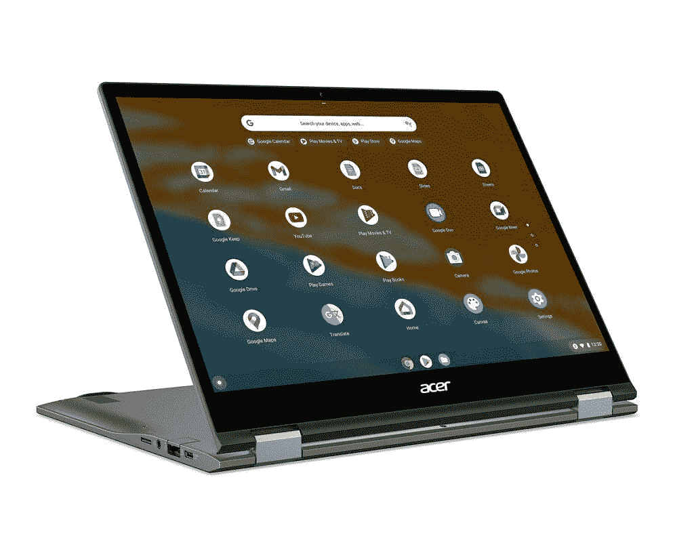

在 CES 2022 上有很多新的芯片，包括英特尔的第 12 代处理器，AMD 的锐龙 6000 芯片，甚至是锐龙 7000 桌面处理器的预告片。联发科(MediaTek)是一家可能有点不为人知的芯片制造商，但该公司在高端市场为 Chromebooks 推出了一款全新的处理器。

宏碁率先使用联发科 Kompanio 1380 及其 [Chromebook Spin 513](https://www.xda-developers.com/acer-chromebooks-ces-2022/) 。Kompanio 1380 是一款与英特尔酷睿 i3 竞争的芯片组，事实上，联发科是 ARM Chromebooks 的领导者。然而，到目前为止，这些 Chromebooks 都是入门级到中低端产品。该公司生产的新芯片正在向中高端市场进军。

至于 Chromebook Spin 513 本身也很棒，芯片组除外。它有一个 13.5 英寸的 3:2 显示屏，分辨率为 2，256x1，504，边框为 7.7 毫米。鉴于新的宽高比，它比 16:9 的屏幕高 18%。这对生产率有很大的影响。它还通过了 MIL-STD-810H 认证，有 DTS 音频，有 Wi-Fi 6，所有这些都是 599.99 美元。

* * *

## Dell UltraSharp 32 4K 视频会议显示器

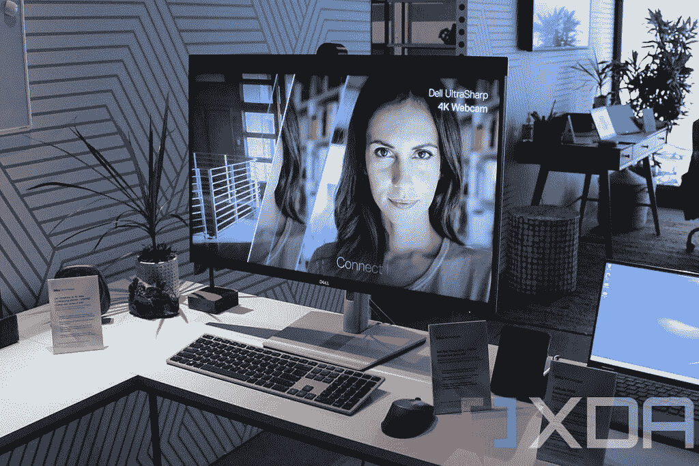

有这么多令人惊讶的公告，我几乎觉得戴尔的 UltraSharp 32 4K 视频会议显示器已经从雷达上消失了；但对我来说不是。当戴尔在展会前几周的预发布会上向我展示这款产品时，我觉得我看到了一些特别的东西。当然，这是 32 英寸的 4K 显示器，对吗？远不止这些。

它还内置了一个 4K 网络摄像头，这真的是一件大事。毕竟，4K 的网络摄像头并不常见。两个主要选项是 Dell UltraSharp 4K 网络摄像头和 Logitech BRIO。UltraSharp 32 4K 视频会议显示器实际上包括 UltraSharp 4K 网络摄像头；它只是小了很多，因为许多内部组件都内置在显示器本身。

最重要的是，它有回声消除双阵列麦克风和 14W 扬声器。在显示质量、视频采集质量、麦克风质量和扬声器质量之间，一切都是你能得到的最好的。将所有这些集成到一个单元中，还可以省去许多桌面电缆。

如果你花很多时间在视频电话和会议上，根本没有更好的显示器可以使用，很难想象你甚至可以改善它。这是在家办公时代的终极显示器。

Dell UltraSharp 32 4K 视频会议显示器将于 3 月 29 日上市。戴尔没有公布定价，但不会便宜。

* * *

## 三星生态遥控器

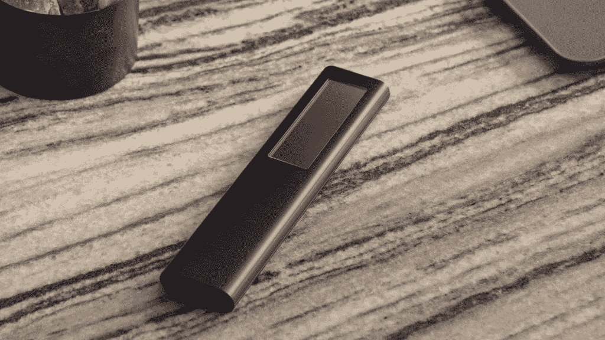

三星首席执行官 JH·韩在 CES 2022 前的主题演讲中重点关注了几个关键领域，其中之一就是可持续发展。该公司推出了一系列可持续发展措施，但可以说最重要的是 Eco Remote。虽然这在技术上并不新鲜，因为它是去年与电视一起推出的，但该公司今年推出的每台电视都将配备 Eco 遥控器，这将大大有助于防止每年数百万电池的不必要处理。今年的型号还通过利用射频波充电，增强了去年型号的太阳能充电功能，这使它成为一项非常有趣的技术。

这本身就是有新闻价值的，但这一举措的特殊之处在于，三星将生态远程技术免费开源，供其他公司使用。目标是去除电视遥控器中使用的所有一次性电池，该公司还希望将这一技术应用于其产品组合中的其他配件。至于拯救地球的措施，很难否认这是一项对地球有直接积极影响的措施。

* * *

## 三星自由式投影仪

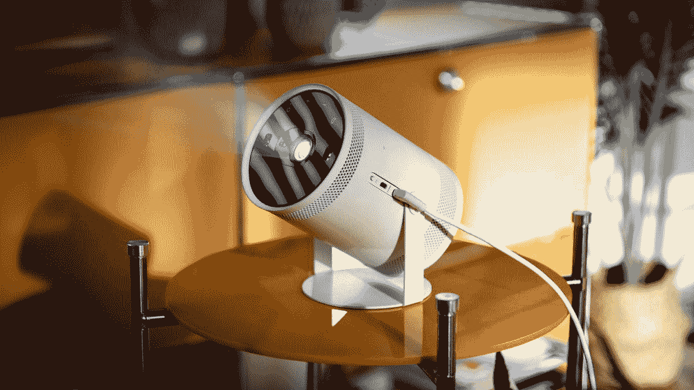

三星的 The Freestyle 是我们在 CES 2022 上最喜欢的宣布之一，尽管奇怪的术语“The”作为前缀。这款便携式投影仪可以由任何输出功率为 50W 的电池组供电，并提供 180 度旋转设计，因此无论您身在何处，都可以指向、播放和欣赏大型显示器。无论是在家里还是在旅途中，它都是完美的选择。如果你喜欢露营、魅力四射或者只是想时尚地旅行，这是你随身携带的理想朋友。

它具有大量的智能功能，包括优化屏幕尺寸以适应内容的能力，投影仪本身的自动对焦和自动调平，因此在观看两三个小时的电影后，您不会有脖子弯曲的机会。还有一个 5 瓦的 360 度扬声器，所以你不需要担心良好的音频质量，它支持流媒体应用程序、播放列表，甚至可以让你使用语音助手。它可以与 Android 和 iOS 兼容，分别使用 SmartThings 和 AirPlay 2 在大屏幕上显示您的内容。

现在可以预购，价格为 899 美元，还有一系列即将推出的配件，包括改变自由泳本身颜色的新皮肤。这款产品小巧玲珑，功能强大，每个人都应该拥有。

### 三星自由式便携式投影仪

这款便携式投影仪是我们在 CES 2022 上最喜欢的产品之一，在小巧的机身中融入了强大的功能。花 899 美元，你就可以买到一台非常有才华的投影仪，无论你去哪里都可以工作，无论是在家里，还是在野营地，甚至是在你的花园里，你都应该买一台自由式的。

**Affiliate Links**

Samsung

[View at Samsung](https://shop-links.co/link/?exclusive=1&publisher_slug=xda&article_name=These+are+the+best+of+the+best+products+at+CES+2022&article_url=https%3A%2F%2Fwww.xda-developers.com%2Fbest-of-ces-2022%2F&u1=UUxdaUeUpU7087&url=https%3A%2F%2Fwww.samsung.com%2Fus%2Ftelevisions-home-theater%2Ftvs%2Fportable-projector%2Fthe-freestyle-sp-lsp3blaxza%2F)

* * *

## 索尼 QD-OLED 电视

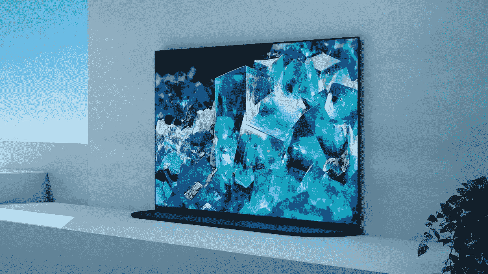

如果有一项技术在 CES 2022 上展出，那就是 QD-有机发光二极管，代表量子点有机发光二极管。下一代有机发光二极管显示技术，QD-有机发光二极管旨在结合两种技术的最佳。多年来，三星一直在销售和营销量子点，作为有机发光二极管(主要由 LG Display 生产)的替代品，索尼新的 QD-有机发光二极管显示面板也由三星显示自己制造。

QD-有机发光二极管基本上结合了有机发光二极管体验的最佳部分(如完美的黑色和无限的对比度)和量子点 LED 体验的最佳部分，如更高的峰值亮度和更高亮度水平下更生动的色彩再现(也就是比有机发光二极管电视在峰值亮度下更低的饱和度)。事实上，索尼表示，QD-有机发光二极管“与传统电视相比，彩色亮度提高了 200%”，鉴于有机发光二极管长期以来一直是电视显示器的王者，当新的 QD-有机发光二极管标准在春天开始发货时，看看它的对比将是非常有趣的。

* * *

## 外星人 34 游戏显示器(AW3423DW)

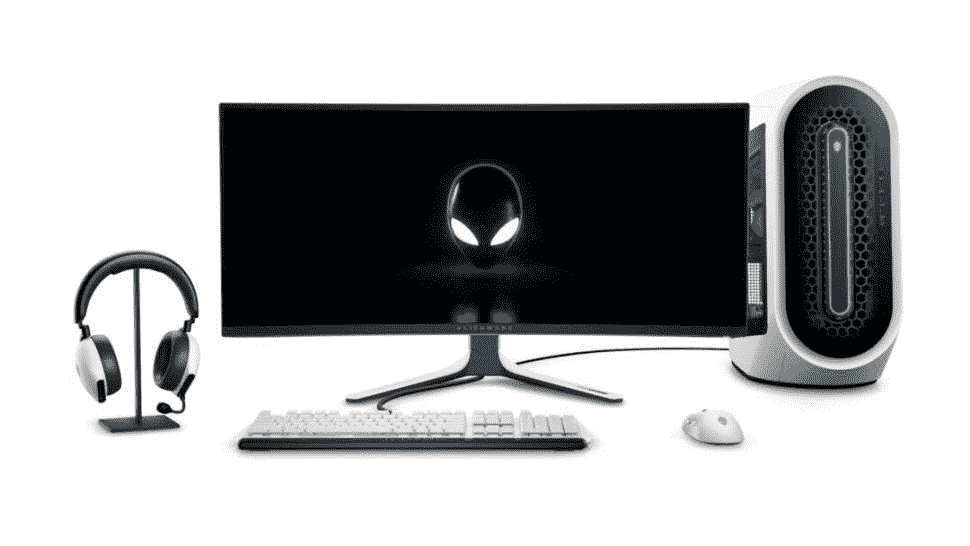

虽然索尼制造了第一台运行 QD-有机发光二极管技术的电视——我们可能已经看到了这一点——但没有人能预见到第一台 QD-有机发光二极管显示器是由外星人制造的。它采用三星显示面板制成，具有大量的功能，可以使它成为游戏玩家的天堂，也是各地创意类型的梦想显示器。

它具有 DisplayHDR 400 True Black 认证，覆盖整个 P3 色域，峰值亮度可达 1，000 尼特。它经过工厂校准，可以通过屏幕菜单在 P3 和 sRGB 颜色配置文件之间切换，并允许您更改伽玛设置。它的宽高比为 24:10(分辨率为 3，440x1，400 像素)，通过 DisplayPort 支持高达 175Hz 的刷新率，通过 HDMI 支持高达 100Hz 的刷新率。然而，如果你想将它用作 Xbox 或 PS5 的显示器，它不支持 HDMI 2.1，这可能是一个交易破坏者。

就显示器而言，外星人 34 游戏显示器有很多令人喜欢的地方，虽然他们没有透露价格，但我们不会有太多时间了。它将于 3 月 2 日在中国上市，3 月 29 日发货，并将于 4 月开始在其他地区上市。然而，有一点是清楚的——QD-有机发光二极管是全新的技术，正如我们过去所看到的，全新的技术从来都不便宜。也就是说，这款显示器似乎物有所值。

https://www.youtube.com/watch?v=gKQPvCeETKw

* * *

## 摩凡诺戒指

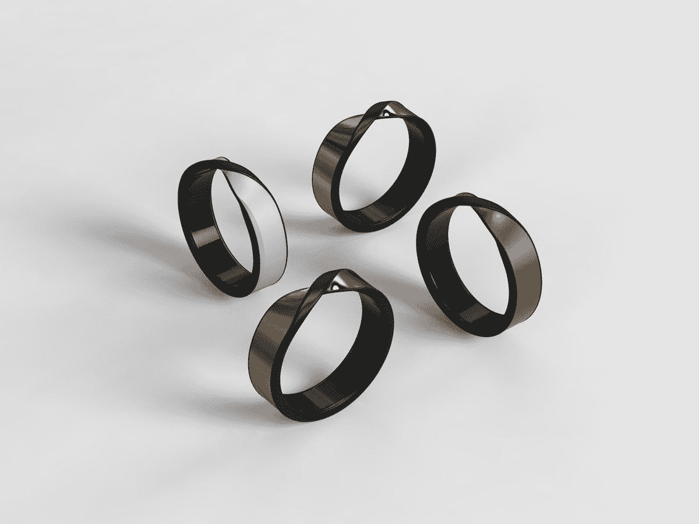

说到可穿戴健康技术，你可能听说过 Oura 生产的戒指，但初创公司 Movano 可能是下一个值得关注的大公司。在 CES 2022 上，Movano 展示了一款智能戒指，它集成了与 Oura Ring 3 ^(rd) 代相同的所有功能，但也承诺了更多功能，并且价格更低。

后者售价 299 美元，我们的 CCO Nirave 非常喜欢他的，在一些医疗问题之后，每天都用它来监测心脏健康。他表示，如果 Movano 能够兑现其戒指的承诺——并获得至关重要的 FDA 批准——它可能会成为今年健康技术领域的必备可穿戴设备，特别是因为 Oura 戒指还要求你每月支付订阅费才能使用所有更高级的功能。

Movano 目前正在进行射频技术的临床试验，这将有助于它收集监测血糖和血压所需的数据。鉴于这两种药物分别用于糖尿病和心脏病的治疗——而这两种疾病是全球最大的杀手——说 Movano 戒指可以拯救生命是一种保守的说法。

* * *

## 带心电图的 Withings 身体扫描量表

虽然 Movano 距离发布还有一段时间，尽管它将在今年发布，但 Withings 在 CES 2022 上展示了其新的智能秤，令人印象深刻。Withings 秤结合了您期望的一切，包括体重、其他身体测量值和体型信息，以及几个新功能，包括身体成分，最重要的是，运行心电图的能力，这是一种希望为您提供全面健康快照的秤。

心电图的加入非常棒，这是第一款内置心电图的电子秤。它能够记录 6 导联心电图-使其成为少数几个可以记录 6 导联心电图的设备之一-一旦它获得 FDA 批准并在 Q2 上市，你就可以将心电图记录发送给有执照的心脏病专家进行检查。睡眠呼吸暂停是一个相当普遍的问题，能够在早上称体重的同时记录心电图应该有助于更多的人被诊断患有心脏疾病。

* * *

## 宝马九流

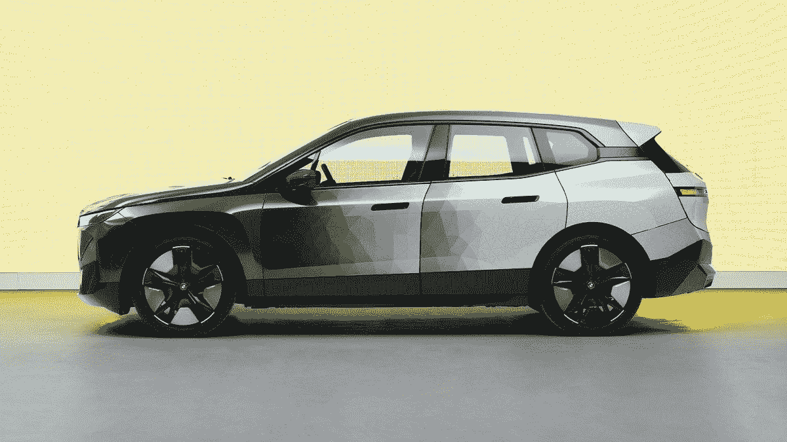

CES 可能是一场技术秀，但它也正在迅速成为最新汽车创新的展示。来自世界各地的公司利用传统的拉斯维加斯会展大厅之外的充足空间来展示一切，从他们最新的信息娱乐系统到新的车内体验和互联体验。然而，有时有一个公告会让所有人大吃一惊。

宝马 iX Flow 在 CES 2022 上做到了这一点。买新车时，我们都经历过决定买什么颜色的决定过程。这是买车过程中最重要的决定之一，因为这是对你个性的公开展示。宝马九流展示了有一天可以帮助这个决定的技术；简单来说就是变色车。是的，再读一遍:这是一辆会变色的车。

这款车使用了一种特别开发的车身包装，材料类似于亚马逊 Kindle。当受到电信号的刺激时，电泳技术会使不同的颜色颜料表面化，这导致了下面视频中展示的颜色变化体验。就技术而言，这是我们很久以来看到的最酷的汽车创新之一。

https://www.youtube.com/watch?v=tcLX9wcPQT4

* * *

## HyperX Cloud Alpha 无线耳机

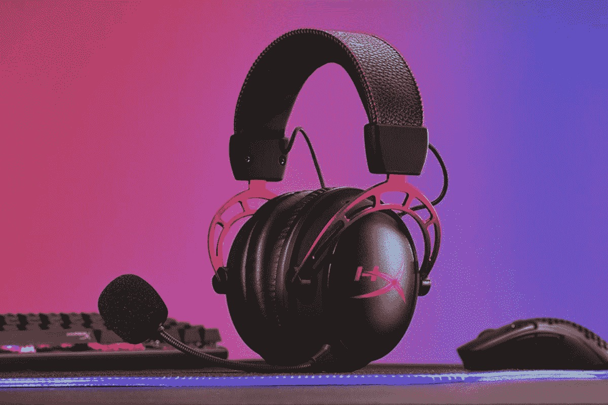

一些游戏玩家仍然使用有线耳机而不是无线耳机，因为后者通常没有足够的电池寿命，而且大多数游戏玩家不想处理充电等问题。新的 HyperX Cloud Alpha 无线耳机有望解决这一问题，基本上可能是游戏玩家的最佳无线耳机，原因很简单:他们声称可以提供 300 小时的电池寿命。

这是不平凡的壮举；几乎所有的游戏耳机都有两位数的电池寿命，尽管有一些超过了 100 小时。森海塞尔 GSP 370 是第一款达到这一目标的产品，据称电池寿命为 100 小时，它引起了人们的关注，因此毫不奇怪，整个游戏行业都在谈论 HyperX Cloud Alpha，声称提供三倍于此的电池寿命。在你需要伸手拿充电器之前，这几乎是一整周的连续使用，如果你花一整周的时间玩游戏，你可能有比电池寿命更大的问题要解决。它将于下个月发布，售价 200 美元，可能会成为每个人的[最佳游戏耳机](https://www.xda-developers.com/best-gaming-laptop-accessories/)。

* * *

## 谷歌快速配对

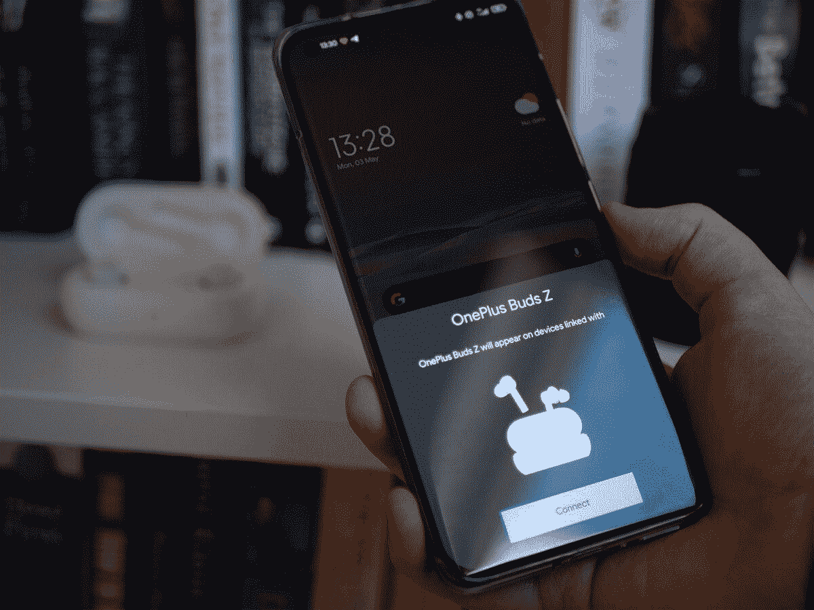

CES 通常是展示新硬件和概念演示的地方，因此包含软件功能可能会感觉不合适。但谷歌确实选择了 CES 2022 来宣布一个对你的个人技术领域来说相当重要和有影响力的变化:更多的设备具有快速配对功能。

从表面上看，这份声明似乎微不足道。毕竟，配对蓝牙设备实际上不是火箭科学。但是...至少对普通大众来说确实如此。苹果展示了与其产品紧密集成的力量，这使其估值超过 3 万亿美元。打开一对新的 AirPods，让它神奇地出现在 iPhone、iPad 或 Mac 上，这对最终用户来说绝对方便，因为他们不再需要摆弄他们几乎不知道的模糊菜单。这种易用性被低估了，谷歌正试图通过 Fast Pair 将他们带入一个更加多样化的产品生态系统。

你将很快能够将设备快速配对，比如来自一加、索尼、微软和许多其他公司的支持耳机和耳塞与 Chromebooks、谷歌电视和安卓电视配对。此外，快速配对支持也正在扩展到支持物质的智能家居设备。 [Android 手机和 Chromebooks 也将很快比以往更好地协同](https://www.xda-developers.com/android-phones-chromebooks-synergize-better-than-before/)。所有这些更小的体验为生态系统增加了一个更无缝的体验，谷歌的 Fast Pair 也同样获得了好评。它可能与苹果的生态系统不在同一水平上，但它仍然是进步。

* * *

## Jabra Elite 4 激活

Jabra Elite 4 Active 是 Jabra TWS 产品系列的补充，位于 Elite 3 之上。它们被宣传为 Jabra 最实惠的健身模型，价格为 120 美元，肯定比仅次于它的 180 美元的 best Elite 7 Active 更实惠。你确实放弃了一些功能，如蓝牙多点配对、耳朵检测传感器和无线充电。但是你得到的是锻炼耳塞的体面选择，具有良好的 ANC 和透明模式。您还可以获得 IP57 等级，这使它们非常适合工作，而不用担心灰尘和汗水。

Jabra Elite 4 Active 的伟大之处在于，对于仍有成熟空间的产品类别而言，它们仍然是一款易于推荐的产品。TWS 有各种形状、大小和价格，但是好的和可靠的 TWS 需要变得更便宜和更容易获得。Jabra Elite 4 Active 不需要像每个人在 CES 2022 上试图做的那样重新发明轮子——他们只需要将自己展示为另一个你不会出错的可行选项。

### Jabra Elite 4 激活

Jabra Elite 4 Active 是一款相对经济实惠的 TWS，以锻炼为主，追求可靠性。有了 ANC 和 IP57 保护，它们成为 Jabra 公司推荐的绝佳选择。

**Affiliate Links**

Amazon

[View at Amazon](https://www.amazon.com/Jabra-Active-Bluetooth-Earbuds-Built/dp/B09MVGQRDD?tag=xda-n2pk74g-20&ascsubtag=UUxdaUeUpU7087&asc_refurl=https%3A%2F%2Fwww.xda-developers.com%2Fbest-of-ces-2022%2F&asc_campaign=Short-Term)

* * *

## 三星 Flex S，Flex G，Flex Note

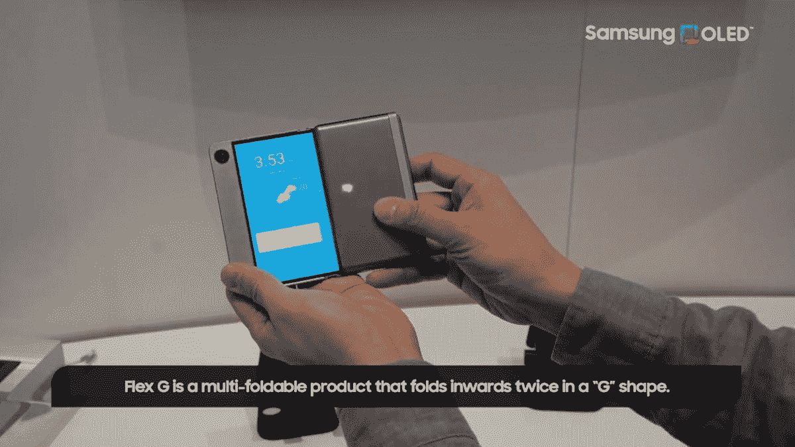

CES 传统上不是一个专注于移动设备的展会，但三星今年逆势推出了 Galaxy S21 FE。Galaxy S21 系列中的最后一款手机——就在几周前，它可能会推出 [Galaxy S22](https://www.xda-developers.com/samsung-galaxy-s22/) 系列——Galaxy S21 FE 不会让世界兴奋。但是，三星展示的其他移动邻近产品肯定会。

在推出第一款 Galaxy Fold 之前，三星在三星开发者大会上推出了新的显示器，在 CES 2022 上，它展示了几款下一代显示器，很可能向我们展示了三星可折叠产品线的未来。我们非常兴奋。

Flex S 和 Flex G 采用 [Galaxy Z Fold 3](https://www.xda-developers.com/samsung-galaxy-z-fold-3/) 并通过添加额外的 Fold 来增加赌注。这实质上使得内部显示屏在展开时包含三个不同的部分，很明显，未来具有这种外形的 Galaxy Fold 将会进入我们的最佳可折叠列表。

https://youtu.be/GxlYOh6L1q4

Flex S 是三星可折叠笔记本电脑的一个例子，我们希望有一天它能成为真正的产品。

https://youtu.be/_WlY19PGyew

请观看上面的视频，了解新概念的实际应用，并在此处阅读更多内容！

* * *

## 摩托罗拉 MA1 无线安卓汽车加密狗

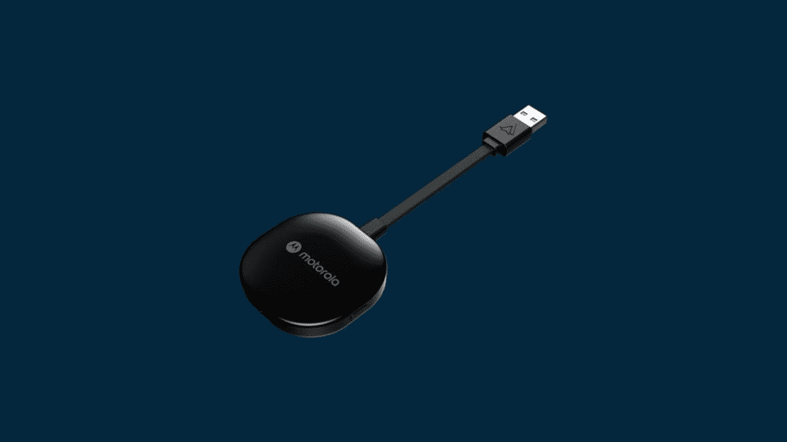

摩托罗拉 MA1 并不是第一款无线安卓汽车加密狗，但它是第一款你很快就能买到的加密狗。Android Auto 处于一个奇怪的位置，其中大多数汽车和娱乐系统需要有线连接，但一些较新的主机支持与您的手机无线连接。无线显然更方便，这就是这些加密狗的用武之地。

摩托罗拉 MA1 将由 SGW Global 以摩托罗拉品牌销售。你只需要将加密狗插入你的汽车或已连接 Android Auto 的主机上的 USB 端口，加密狗就会让你通过蓝牙和 5GHz Wi-Fi 建立与手机的连接。此外，你只需要启动你的汽车，它会自动建立无线连接，甚至不需要你从口袋里拿出手机。对于 89.95 美元，这将是值得的频繁用户。

### 摩托罗拉 MA1

摩托罗拉 MA1 无线 Android Auto dongle 可让您将智能手机与有线 Android Auto head 单元无线连接。对于经常使用 Android 汽车的用户来说，这种便利是值得的，因为他们不再需要从口袋里拿出手机。

**Affiliate Links**

motorolasound

[View at Motorolasound](https://www.motorolasound.com/audio-products/android-auto/ma1)

* * *

## Garmin Venu 2 Plus

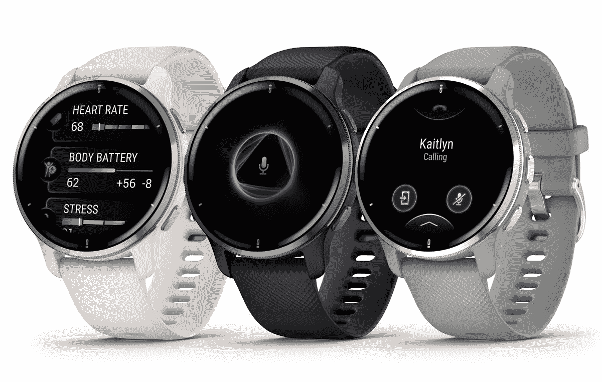

Garmin 因其健康和健身跟踪产品而闻名，Venu 2 Plus 在很大程度上依赖于这些功能。这不是一款成熟的智能手表，因为它没有应用商店或其他高级智能手表功能，但它继承了之前 Venu 2 的大部分功能。

Garmin Venu 2 Plus 配有一个 43 毫米的外壳和一个标准的 20 毫米表带，一个圆形 AMOLED，具有始终开启模式，电池续航时间长达 9 天，Garmin Pay 支持非接触式支付，通知镜像和下载音乐的内部存储。这款手表还可以用作电话通话的扬声器，类似于 Wear OS 智能手表或 Apple Watch。这款手表的价格有点贵，为 449.99 美元，但一些健身爱好者对 Garmin 的健康和健身跟踪功能深信不疑，所以如果这些是你优先考虑的事情，那么它值得一看。

### Garmin Venu 2 Plus

Garmin Venu 2 Plus 以其健身和跟踪功能而自豪。这不是一款成熟的智能手表，但它有足够的智能来完成大多数实用的智能手表任务。如果准确的健身跟踪是你的优先事项，就去做吧。

**Affiliate Links**

garmin

[View at Garmin](https://www.garmin.com/en-US/p/730659/pn/010-02496-01)

* * *

这总结了我们对 CES 2022 的最佳选择，但 CES 2022 有哪些公告让你印象深刻？请通过[推特](https://www.twitter.com/xdadevelopers)或 [XDA 论坛](https://forums.xda-developers.com/)告诉我们吧！