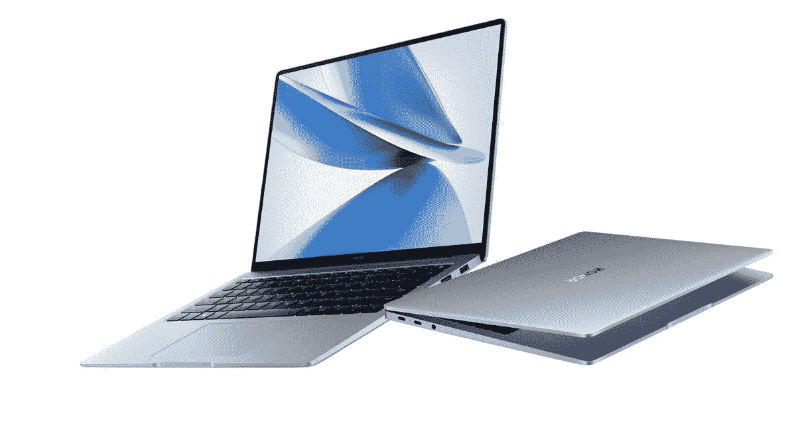
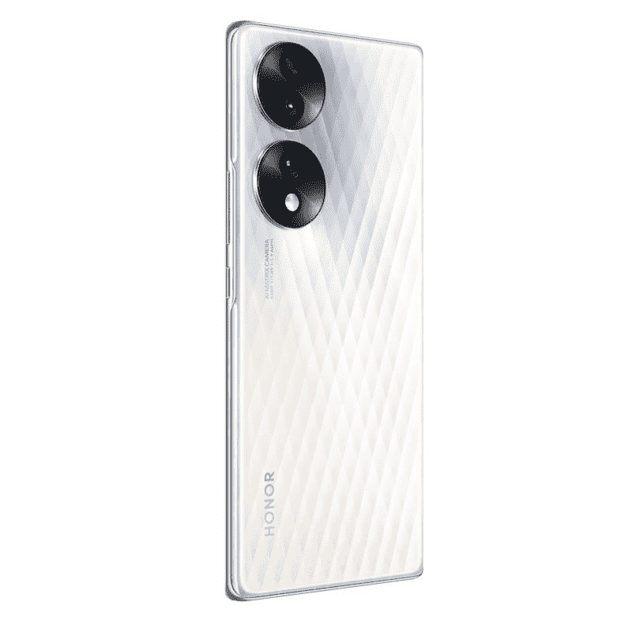
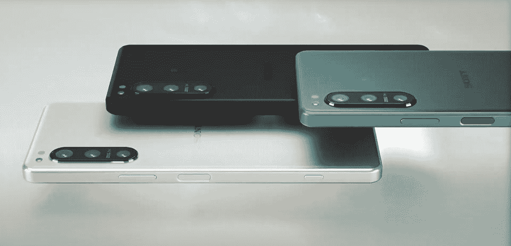

# IFA 2022 之最:柏林技术展上的精英中的精英！

> 原文：<https://www.xda-developers.com/best-of-ifa-2022/>

柏林 IFA 是全球领先的消费电子产品贸易展之一。它为科技品牌推出令人兴奋的产品和消费技术创造了条件，并让参观者有机会在展会上亲自体验这些产品和技术。像往常一样，许多原始设备制造商走上舞台展示他们酷的新技术，包括可折叠笔记本电脑，AR 眼镜，当然，还有一些笔记本电脑和智能手机。

## 联想 ThinkPad X1 Fold Gen 2

联想推出了带有可折叠屏幕的第二代笔记本电脑，它几乎解决了第一代笔记本电脑的所有痛点。屏幕更大，它有一个合适的 1.35 毫米 ThinkPad 键盘，产品完全重新设计。

另一个重大改进是，它配备了英特尔的第 12 代 U9 处理器，该处理器旨在拥有性能核心和效率核心。这有助于您在旅途中更好地管理电源。相比之下，最初的型号有英特尔的 Lakefield 芯片，这是第一个混合架构的芯片，但它们不是很好。只有一个性能核心。

新款 ThinkPad X1 Fold Gen 2 拥有 16.3 英寸 4:3 显示屏，展开后可以在支架上使用，也可以在笔记本电脑模式下使用 12 英寸 3:2 显示屏。键盘与 ThinkPad X1 Nano 上的键盘相同，只是增加了一个与 ThinkPad Z13 类似的触摸板，放弃了物理按钮，转而采用组合式解决方案，使您可以将该空间用作触摸板的扩展。

联想 ThinkPad X1 Fold Gen 2 将于 11 月上市，起价 2499 美元。

## 联想眼镜 T1

联想把显示器放在你脸上的概念并不新鲜。ThinkReality A3 实际上做到了这一点，它可以让你在一个 AR 屏幕上放置多达六个虚拟显示器。你会注意到，联想眼镜 T1 没有“思考”品牌，所以这实际上不是一款商务产品。它更多的是针对消费者，而不是你桌面的延伸。

您仍然可以用它来扩展一个虚拟显示器的桌面。它也不是空间锚定的，所以如果你移动你的头，屏幕也会跟着移动。

但你可以选择将它插入手机，而不是连接到 PC，使用摩托罗拉的 Ready For experience。Ready For 是一个针对您想要做的事情(如流媒体或游戏)进行了优化的 UI。例如，你可以连接一个 Xbox 控制器，开始玩 Xbox Cloud Gaming 的游戏流，所有这一切都可以在路上进行，因为你戴着眼镜，在你的面前有一个大显示屏。或者，你可以用它来观看网飞。

联想眼镜 T1 将于今年晚些时候进入中国，2023 年进入其他市场。定价尚未公布。

## 华硕专家手册 B5 有机发光二极管

华硕一直是笔记本电脑有机发光二极管技术最长期的支持者之一，其产品线中有很大一部分都提供有机发光二极管面板。现在，从新的 ExpertBook B5 和 B5 Flip 开始，我们在该公司的商用笔记本电脑中也看到了它们。默认情况下，这两款笔记本电脑都配有 IPS 面板，但您可以升级到令人惊叹的超高清+有机发光二极管面板，这可能是您在任何商务笔记本电脑上都能找到的最佳显示器之一。

此外，这些笔记本电脑具有强大的规格，包括最高支持博锐的英特尔酷睿 i7-1270P，以及高达 40GB 的内存，这要归功于焊接的 8GB 芯片和支持高达 32GB 的 SODIMM 插槽。如果你想要更多的 GPU 能力，华硕还可以选择获得独立的英特尔 Arc A350M 显卡。借助两个 M.2 插槽，您还可以获得充足的存储空间。

在显示器上方，你可以得到一个带有 Windows Hello 面部识别功能的网络摄像头，笔记本电脑还包括一套漂亮的端口。有两个 Thunderbolt 4 端口、两个 USB Type-A 端口、HDMI、RJ45 以太网和一个耳机插孔，因此您可以获得大量的连接。对于 ExpertBook B5 翻盖有机发光二极管，您还可以在笔记本电脑中内置一支手写笔，以便随时使用。

华硕 ExpertBook B5 有机发光二极管系列将于 2022 年第四季度推出。

## 荣誉魔法书 14

Honor MagicBook 14 于 2022 年早些时候在中国首次亮相，但在 2022 年 IFA 奥运会上，这款笔记本电脑将面向欧洲市场推出。它的 IFA 2022 头像配备了第 12 代英特尔 Alder Lake Core i5-2500H，以及两个图形选项:集成英特尔 Xe 显卡的基本版本和另一个 Nvidia GeForce RTX 2050 GPU。无论哪种方式，你都可以期待从这台机器中获得一些良好的性能和价值，尤其是考虑到它的价格点。

至于笔记本电脑的其余部分，你会得到一个铝制机箱，里面有一个长宽比为 3:2 的 14 英寸 2K 显示屏。IPS 面板声称持续的最大亮度为 300 尼特。板上有一块 75 瓦的电池，尽管你得到的充电器取决于你选择的显卡选项:集成显卡型号的 65 瓦充电器和 RTX 2050 显卡型号的 135 瓦充电器。1 个 USB 3.2 Gen 1 Type-A 端口、2 个 USB 3.2 Gen 2 Type-C 端口、1 个 HDMI 2.0 和 3.5 毫米耳机插孔也很好地解决了连接问题。

MagicBook 14 在€的集成显卡型号价格为 1099 英镑，在€的专用显卡型号价格为 1299 英镑，可以通过 Honor 的 HiHonor 网站和亚马逊网站购买。

 <picture></picture> 

Honor MagicBook 14

##### 荣誉魔法书 14

Honor MagicBook 14 是一款功能强大的笔记本电脑，配备第 12 代英特尔酷睿 H 系列处理器和可选的 Nvidia 显卡。它也有一个夏普四高清显示屏和其他高端规格。

## LG UltraGear 有机发光二极管游戏显示器

LG 最近一直在制造一些非常有趣的有机发光二极管显示器，在今年的 IFA 上，我们从其 UltraGear 品牌获得了一款新的专注于游戏的显示器。新的 LG UltraGear 有机发光二极管游戏显示器承诺为世界各地的游戏玩家提供梦幻般的体验，首先是巨大的 45 英寸曲面面板，非常适合沉浸感。它有 WQHD (3440 x 1440)分辨率和 21:9 的宽高比，适合超宽游戏。

它还具有 240Hz 的刷新率，非常适合快节奏的电子竞技游戏，OLED 面板还支持 0.1 毫秒的响应时间，因此您不会错过任何一个节拍。此外，DCI-P3 98.5%的覆盖率意味着彩色复制对于媒体消费和内容创作来说应该是非常棒的。

因为不是所有的游戏玩家都在 PC 上，所以显示器还配有 HDMI 2.1，所以你可以充分利用 PlayStation 5 和 Xbox Series X 控制台，支持高达 120Hz 的可变刷新率(VRR)。它也像电视一样大，所以你甚至可以在更远的地方玩，就像你用普通的游戏机一样。您也可以使用遥控器来更改显示器的设置。

我们还不知道 LG UltraGear 有机发光二极管(45GR95QE)何时上市，也不知道它的价格，但它肯定值得你睁大眼睛。

## 荣誉 70

没有多少智能手机直接在 IFA 发布，但 Honor 70 凭借其独特而引人注目的设计成功吸引了一大批人。该设备背面的钻石状图案以迷人的图案反射光线，这肯定会让人注意到。两个大的摄像头岛也需要关注，它们配备了良好的硬件来保持这种关注。

一旦你越过手机的设计，荣誉 70 是一个全面的包装。你可以在内部获得一个高通骁龙 778G Plus SoC，具有 8GB RAM、128GB 存储和 5G 功能。显示器是一个漂亮的 6.7 英寸 FHD+显示器，刷新率为 120Hz，支持 HDR 10+。最神奇的是相机的设置，主要拍摄者是索尼 IMX800 54MP 传感器，50MP 超宽传感器和 2MP 深度传感器。前置摄像头是 32MP 的射手。你还可以获得 4800 毫安时的电池，这与设备 178 克的重量很好地互补。软件方面，你可以得到基于 Android 12 的 MagicUI 6.1，是的，这里有现成的 GMS 支持。

Honor 70 在英国的起价为 479.99 英镑(568 美元)，在欧盟的€起价为 549 英镑。这款手机将在 Honor 的 HiHonor 网站、Argos、Currys 和亚马逊上市。

 <picture></picture> 

Honor 70

##### 荣誉 70

Honor 70 是一款中等规格的智能手机，虽然它价格昂贵，但你可能会找到更好的替代品。

## 惠普精英蜻蜓对开

在 IFA 前夕，惠普为其精英蜻蜓家族增加了第三名成员。这是精英蜻蜓对开本，一种新的人造革装订的敞篷车，跟随精英对开本和幽灵对开本的脚步。它配备了英特尔第 12 代 U 系列处理器和 3:2 有机发光二极管显示屏。

最重要的是，它配备了 800 万像素的网络摄像头，提高了惠普已经是同类最佳的摄像头的质量。事实上，我们得到了一个尝试，相机质量非常好。如果你想要最好的网络摄像头，你就买一个惠普，这在这个在家办公的时代很重要。

最终，它只是一个伟大的全能产品，拥有出色的键盘和令人惊叹的有机发光二极管显示屏。这是一款对开风格的敞篷车，这意味着你可以将其用作笔记本电脑，可以像上图一样在演示模式下使用，还可以将显示屏折叠成平板电脑。

惠普精英版蜻蜓 Folio 现已上市，起价 2379 美元。

##### 惠普蜻蜓对开 G3

惠普蜻蜓 Folio G3 是 2022 年最令人兴奋的 Windows 2 合 1 设备之一，拥有人造革表面、800 万像素广角网络摄像头、改进的触控笔和华丽的有机发光二极管显示屏

## AMD 锐龙 7000

AMD 新一代台式机处理器的时代到了，所以在我们了解它之前，这总是令人兴奋的。该公司自夸其 IPC 增长了 13%，而其目标是 8-10%。L2 缓存增加了一倍，达到 1MB，TDP 增加到 170W。虽然它消耗了大量的电力，但 AMD 也拥有更高的能效，其性能功耗比是英特尔第 12 代处理器的 1.47 倍。

它还支持 PCIe 5.0，将提供两倍于 PCIe 4.0 的带宽。这意味着更快的存储速度，以及更快的显卡速度，具体取决于您选择的主板。对于内存，AMD 选择只支持 DDR5，使 DDR4 退出其新的 AM5 平台。

是的，它确实需要一个新的 1718 针 LGA 插座作为 AM5 的一部分。AM4 持续了五年或五代，所以它的时代来了又去。该公司表示，至少到 2025 年，它将在新芯片中使用 AM5。

AMD 的锐龙 7000 处理器将于本月晚些时候上市。

## 宏碁 Chromebook Vero 514

个人电脑制造商一直试图让他们的产品更具可持续性，但没有一家像宏碁那样走得这么远。去年，我们看到该公司推出了 Aspire Vero，现在，我们有了首款注重可持续发展的 Chrome OS 笔记本电脑，即 Acer Chromebook Vero 514。这款笔记本电脑的机箱使用 30%的消费后回收(PCR)塑料制成，并且没有上漆，这使它具有独特的纹理外观，同时有助于保护环境。

键盘上的键帽也使用 50%的 PCR 塑料，甚至触摸板也使用 100%回收的海洋塑料，这意味着它积极帮助减少海洋中的塑料量。最重要的是，显示面板 99%是可回收的，所以即使在笔记本电脑停止使用后，它仍然有一些用处。

谢天谢地，它也没有错过最新的规格，配备了第 12 代英特尔酷睿 U15 系列处理器，高达 16GB 的内存和 256GB 的固态硬盘。对于 Chromebook 来说，这些都是非常可靠的规格。此外，您还可以选择支持触摸的全高清屏幕。

在美国推出的第一款配置将配备英特尔酷睿 i3-1215U、8GB 内存和 128GB 固态硬盘，在百思买的售价为 499.99 美元。

## 索尼 Xperia 5 IV

在 2022 年 IFA 奥运会上，没有太多的智能手机。一款新发布的智能手机确实吸引了我们的注意力，令人惊讶的是它来自索尼。新的索尼 Xperia 5 IV(读作 Xperia 5 Mark 4)是索尼紧凑型旗舰的第四次迭代。“紧凑型旗舰”这个词很有分量，因为现在已经没有太多这样的产品了。因此，当一家 OEM 厂商尽可能地将更多的功能藏在引擎盖下，同时仍然保持比其他玻璃板智能手机更小的外形时，这总是值得赞赏的。

为 Xperia 5 IV 的 6.1 英寸 120Hz FHD+有机发光二极管显示屏提供动力的是旗舰高通骁龙 8 Gen 1 SoC。虽然它不是绝对最新的(骁龙 8 加第 1 代)，但它仍然是一个非常值得尊敬的 SoC，应该能够处理超级用户可能扔给它的任何东西。这里有足够的内存和存储空间，就像你会在其他旗舰中找到的一样。但再次让这款设备与众不同的是，索尼不仅为你提供了用于存储扩展的 microSD 卡插槽，还提供了 3.5 毫米耳机插孔。该设备上的电池就其物理尺寸而言也相当大，并且你还可以获得 IP68 的防尘和防水性能。这款手机还分享了其更大的兄弟 Xperia 1 IV 的主摄像头和超宽摄像头，这意味着你也可以获得一个有能力的摄影师。

Xperia 5 IV 真的没有太多妥协。这意味着它不仅是紧凑型智能手机的首选之一，而且即使你不想要小尺寸的智能手机，它也足以成为一个很好的选择。唯一真正的亮点是定价——999 美元的价格标签，它与顶级旗舰产品比肩，人们肯定会说它值得这样做。

 <picture></picture> 

Sony Xperia 5 IV

##### 索尼 Xperia 5 IV

索尼 Xperia 5 IV 属于罕见的紧凑型旗舰产品，以及提供 microSD 卡插槽和 3.5 毫米耳机插孔的手机。

* * *

这总结了我们对 2022 年 IFA 的最佳选择。IFA 2022 有哪些让你印象深刻的公告？请通过我们的社交媒体渠道告诉我们！