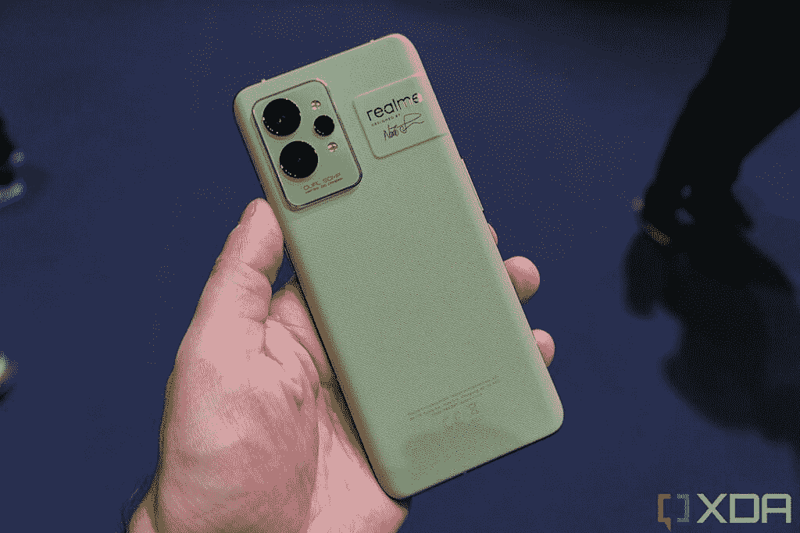
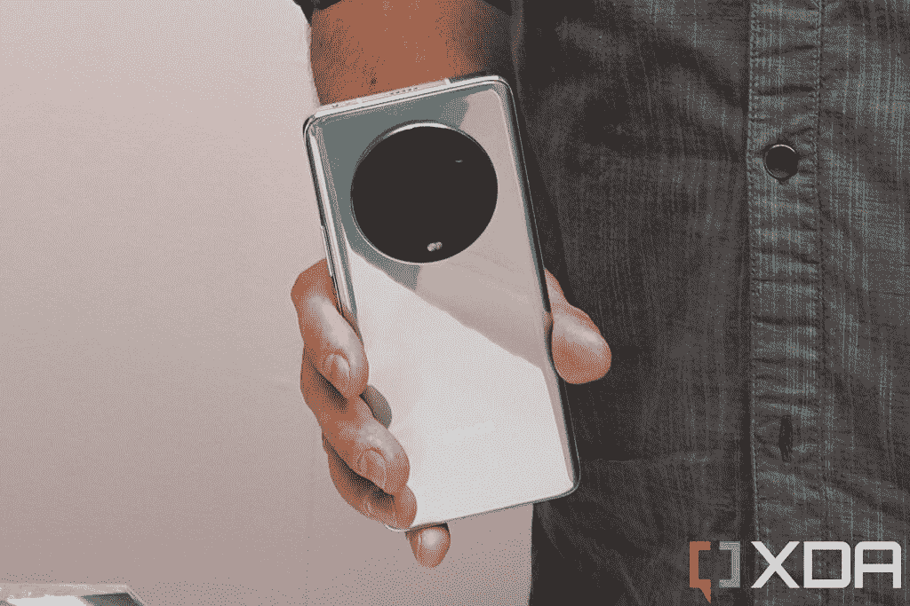
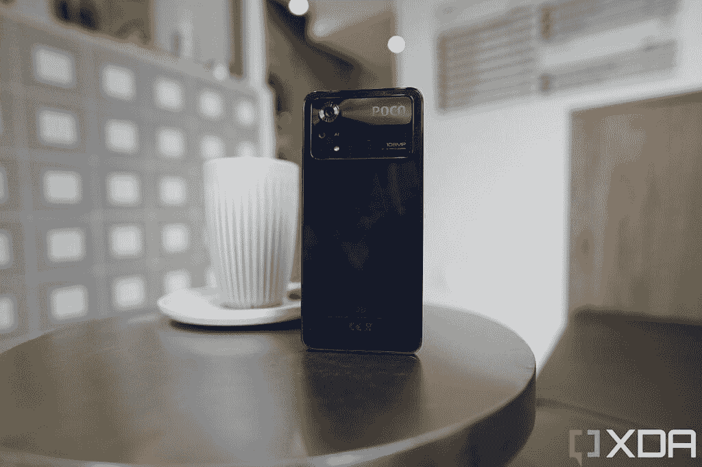
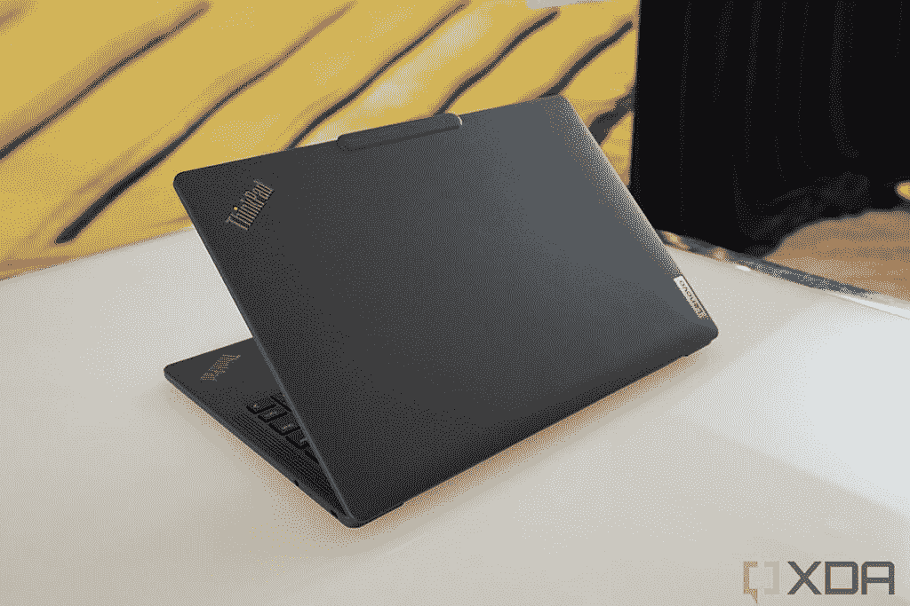
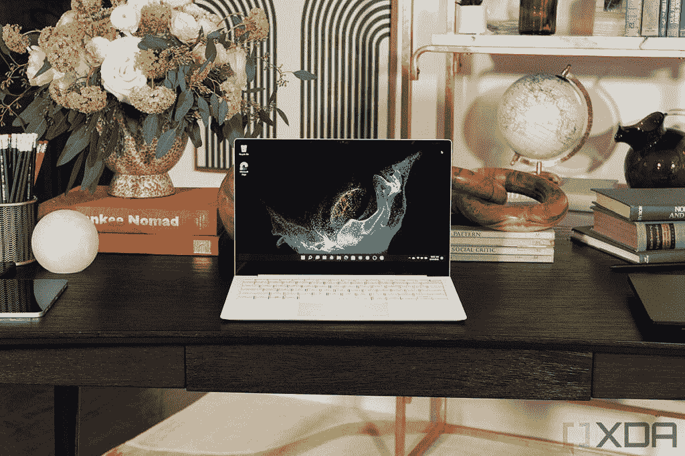
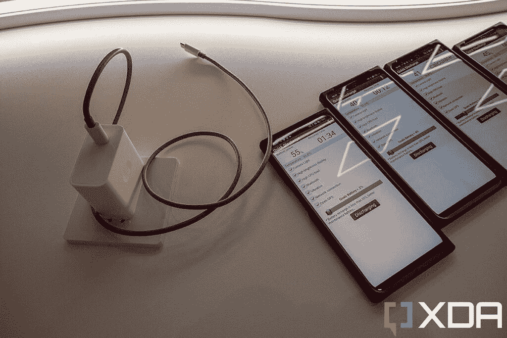

# MWC 2022 之最:巴塞罗纳技术展上的精英中的精英！

> 原文：<https://www.xda-developers.com/best-of-mwc-2022/>

在巴塞罗纳举行的世界移动通信大会(MWC)贸易展通常是一年中最热门的智能手机展会。但是，在过去的两年里，事情没有那么忙了。幸运的是，今年的活动比预期的好得多，因为我们又回到了实体贸易展。

许多原始设备制造商在 MWC 2022 展会上展示了他们的最新创新，我们有幸亲自体验了一批很酷的产品。在过去的四天里，我们已经查看了不少新的智能手机、前沿创新、几台非常酷的笔记本电脑和一些独特的可穿戴设备。在我们在活动中看到的所有事物中，以下是 XDA 团队为 2022 年 MWC 奥运会挑选的最佳事物。

* * *

## OPPO Find X5 Pro

OPPO 在 MWC 发布了其最新旗舰智能手机 OPPO Find X5 和 Find X5 Pro。在这两款手机中，OPPO Find X5 Pro 吸引了我们的注意力，因为它拥有旗舰智能手机的所有功能。它拥有令人惊叹的 QHD+高刷新率 LTPO AMOLED 显示屏，高通的骁龙 Gen 1 芯片，5,000mAh 大电池，支持 80W 有线快充，50W 无线快充，设计独特。

这款设备的背面有一个三摄像头设置，包括一个带 5 轴 OIS 的 50MP 索尼 IMX766 主摄像头，一个带 110 FoV 和自由镜头的 50MP IMX766 超宽摄像头，以及一个带 2 倍光学变焦的 13MP 长焦摄像头。在正面，它有一个 32MP 的 IMX709 自拍相机。除了令人印象深刻的相机硬件，Find X5 Pro 还配备了 OPPO 的内部 MariSilicon X 芯片，该芯片结合了先进的 NPU、ISP 和多层内存架构，进一步提高了相机性能。

OPPO Find X5 Pro 上其他值得注意的功能包括显示器内光学指纹扫描仪、立体声扬声器、IP68 防水防尘和 NFC 支持。这款设备开箱即用，运行基于 Android 12 的 ColorOS 12.1，同时还附带了一系列新的软件功能。

### Oppo Find X5 Pro

OPPO Find X5 Pro 是一款高端手机，可能是最好的超宽相机。

**Affiliate Links**

oppostore

[View at Oppostore](https://oppostore.co.uk/find-x5-series.html)

* * *

## Realme GT 2 Pro

跟随 OPPO 的脚步，Realme 在 MWC 亮相，推出了迄今为止最高端的智能手机 Realme GT 2 Pro。这是一款旗舰手机，具有 Find X5 Pro 的大多数功能，但价格更实惠。其中包括 6.7 英寸 QHD+高刷新率 LTPO AMOLED 显示屏，高通的骁龙 8 Gen 1 芯片，以及支持 65W 有线快速充电的 5,000mAh 电池。

Realme GT 2 Pro 还配备了与 Find X5 Pro 相同的 50MP IMX766 主摄像头，但没有 5 轴 OIS、50MP 超宽摄像头(具有令人印象深刻的 150 FoV)和 2MP 微距摄像头。它还装有一个 32MP 自拍相机。虽然 GT 2 Pro 的摄像头硬件并没有什么不同，但它缺少 MariSilicon X 芯片。因此，我们不指望它能提供与 Find X5 Pro 相同的结果。但鉴于两款手机之间的€649 价格差异，这是一个很多人都愿意做的交易。

尽管价格不同，Realme GT 2 Pro 还配备了一些其他值得注意的功能，如立体声扬声器、光学显示指纹扫描仪、Wi-Fi 6 支持和 NFC。该设备运行基于 Android 12 的 Realme UI 3.0，它提供了 OPPO Android 皮肤的大部分功能。

### Realme GT 2 Pro

Realme GT 2 Pro 是该公司迄今为止最高端的智能手机，平衡了 Realme 的价值主张和使其成为旗舰产品的技术优势。

**Affiliate Links**

realme

[View at Buy.realme](https://buy.realme.com/eu/goods/202)

* * *

## 荣誉魔术 4 专业版

随着两款旗舰手机 Honor Magic 4 和 Honor Magic 4 Pro 的推出，Honor 标志着回归。虽然常规本身是好的，但专业人士得到了所有的好东西。你会得到一个功能强大的 6.81 英寸 AMOLED LTPO 显示屏，以及顶级的高通骁龙 8 代 1 SoC。再加上高达 12GB 的内存和 512GB 的存储，您将获得最佳性能之一。

但是 Magic 4 Pro 还有更多锦囊妙计。这款手机拥有 4,600 mAh 的电池，不仅支持 100W 的有线快充，还支持 100W 的无线快充，意味着你可以享受无线充电的便利，而不会放弃有线充电所获得的速度。

相机的设置也很疯狂，50MP 主相机，50MP 超宽相机，64MP 潜望镜变焦相机，dToF 激光对焦传感器和闪烁传感器。这是一个很大的摄像头，所以你还可以在背面获得一个非常有趣的摄像头模块，让 Honor Magic 4 Pro 在玻璃平板智能手机的海洋中有一个明确无误的身份。对于洒额外的东西，有一个很好的 IP68 认证等级来完成包装。以€1099 英镑的起价，你可以买到一辆争夺顶级位置的旗舰车。

### 荣誉魔术 4 专业版

Honor Magic 4 Pro 是一款高端旗舰产品，包含一些一流的领先功能，如 100W 的快速有线和无线充电，疯狂的相机设置和令人难以置信的价格。

**Affiliate Links**

HONOR

[View at Hihonor](https://www.hihonor.com/global/phones/honor-magic4-pro/)

* * *

## POCO X4 Pro

在 MWC 2022 上，不仅仅是旗舰智能手机。POCO 在今年的展会上展示了两款价格实惠的产品，POCO X4 Pro 和 POCO M4 Pro。POCO X4 Pro 的起价为€299 英镑，它吸引了我们的眼球，因为它提供了 5G 和实用规格的完美结合，而又不会超出我们的财力。

这款手机采用 6.67 英寸 FHD+ AMOLED 显示屏，峰值亮度为 1200 尼特，高通支持 5G 的骁龙 695 SoC，108MP f/1.9 主摄像头，最高 8GB 内存和 256GB 存储，甚至还有一个用于 microSD 扩展的混合插槽。但这还不是全部。该设备还配备了 3.5 毫米耳机插孔(在这个价格范围内是必备的)，侧装指纹扫描仪，以及一个 5000 毫安时的大电池，可以用 67W 充电器快速充电，该电池也包含在包装盒中。

最重要的是，POCO X4 Pro 继续配备 Z 轴线性电机、NFC 和红外发射器等额外功能。这是一个很大的价值，你得到的价格。

### POCO X4 Pro

POCO X4 Pro 以低廉的价格带来了 120Hz 的大有机发光二极管屏幕和非常好的 108MP 摄像头。

**Affiliate Links**

POCO

[View at Po.co](https://www.po.co/global/product/poco-x4-pro-5g/)

* * *

## 联想 ThinkPad X13s

联想的新 ThinkPad X13s 是第一款针对企业的 ARM 设备上的 Windows，当然，联想出售了很多 ThinkPad。X13s 也是第一款骁龙 8cx Gen 3 笔记本电脑，这意味着与之前的 ARM 芯片 Windows 相比，性能有了相当大的提高。自然，卖点是 5G 连接(包括毫米波)和长达 28 小时的电池寿命。

但这还不是全部，因为这是一款完全可配置的 ThinkPad。它将配备不同数量的内存(高达 32GB)、存储等等。虽然这对任何个人电脑买家来说都是正常的，但这不是我们在 ARM 空间的 Windows 中看到的。大多数 ARM 笔记本电脑的销售配置都很有限。

### 联想 ThinkPad X13s

凭借骁龙 8cx Gen 3 芯片组，联想 ThinkPad X13s 在连接性、电池续航时间和性能方面大有可为。

**Affiliate Links**

Lenovo

[View at Lenovo](https://shop-links.co/link/?exclusive=1&publisher_slug=xda&article_name=These+are+the+best+of+the+best+products+at+MWC+2022%21&article_url=https%3A%2F%2Fwww.xda-developers.com%2Fbest-of-mwc-2022%2F&u1=UUxdaUeUpU7392&url=https%3A%2F%2Fwww.lenovo.com%2Fus%2Fen%2Fp%2Fcoming-soon%2Fthinkpad-x13s-13-inch-wos%2Flen101t0019)

* * *

## 三星 Galaxy Book 2 Pro 系列

三星的 Galaxy Book 2 Pro 系列与上一代产品并没有太大不同，这并不是一件坏事。13 英寸的 Pro 重量仍然不到 2 磅，这对于你随身携带笔记本电脑来说是很大的重量。最重要的是，整个系列都配备了全高清 Super AMOLED 显示屏，因此您可以获得有机发光二极管真正的黑色和鲜艳的颜色，而无需消耗 4K 面板的电池。

这一代的新成员是英特尔的第 12 代处理器和 FHD 网络摄像头，这是两个受欢迎的新成员。他们使用英特尔的 P 系列芯片，该芯片具有 28W TDP 和大小内核的混合架构。相对于原 Galaxy Book Pro 中的 15W 芯片应该是一个很大的进步。至于 FHD 的网络摄像头，这是在家办公时代的一个重要进步。

### 三星 Galaxy Book 2 Pro

三星 Galaxy Book 2 Pro 起价仅为 1.92 磅，配备 28W 英特尔处理器和 FHD 显示屏

**Affiliate Links**

Samsung

[View at Samsung](https://shop-links.co/link/?exclusive=1&publisher_slug=xda&article_name=These+are+the+best+of+the+best+products+at+MWC+2022%21&article_url=https%3A%2F%2Fwww.xda-developers.com%2Fbest-of-mwc-2022%2F&u1=UUxdaUeUpU7392&url=https%3A%2F%2Fwww.samsung.com%2Fus%2Fgalaxy-unpacked%2F)

* * *

## 150W SuperVOOC/UltraDart 快速充电技术

智能手机的快速充电技术在过去几年里有了长足的进步，OPPO 在 MWC 2022 上又迈出了一大步。该公司在活动中展示了其新的 150W SuperVOOC 快速充电技术，该技术可以在 5 分钟内将 4,500mAh 充电至 50%，仅在 15 分钟内充电至 100%。与当今市场上的其他快速充电解决方案相比，这是非常快的速度。

除了以惊人的速度给智能手机电池充电，150 瓦的 SuperVOOC 技术还可以使用 OPPO 所谓的“电池健康引擎”将电池寿命延长近一倍。OPPO 声称，BHE 使用定制的电池管理芯片，智能电池健康算法和“电池愈合技术”，以确保电池即使在多达 1600 次充电循环后仍能保持 80%的原始容量。这是目前行业标准的两倍。

OPPO 的 150W SuperVOOC 快速充电技术已投入生产，并将于 2022 年在 Q2 的一加设备上首次亮相。OPPO 的姐妹组织 Realme 也将在其即将发布的 GT Neo 3 上提供相同的技术。

除了 150 瓦的快速充电技术，OPPO 还在 MWC 2022 上展示了其 240 瓦的有线快速充电解决方案，可以在大约 9 分钟内将 4500 毫安的电池从 1%充电到 100%。然而，这种解决方案目前还没有上市，所以你不应该期待在 OPPO，一加或 Realme 设备上看到它。

* * *

这总结了我们对 MWC 2022 年的最佳选择，但 MWC 2022 年有哪些公告让你印象深刻？请在下面的 [Twitter](https://www.twitter.com/xdadevelopers) 或 [XDA 论坛](https://forums.xda-developers.com/)上告诉我们吧！