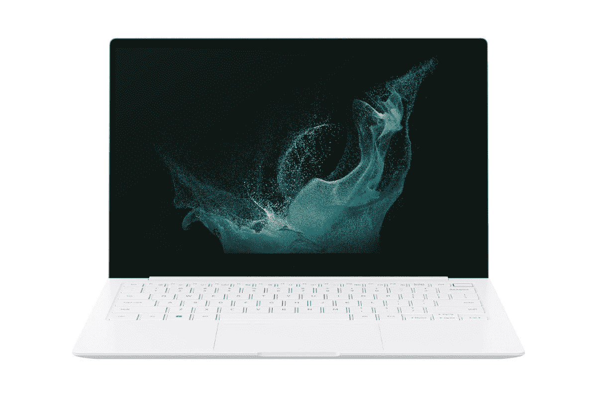
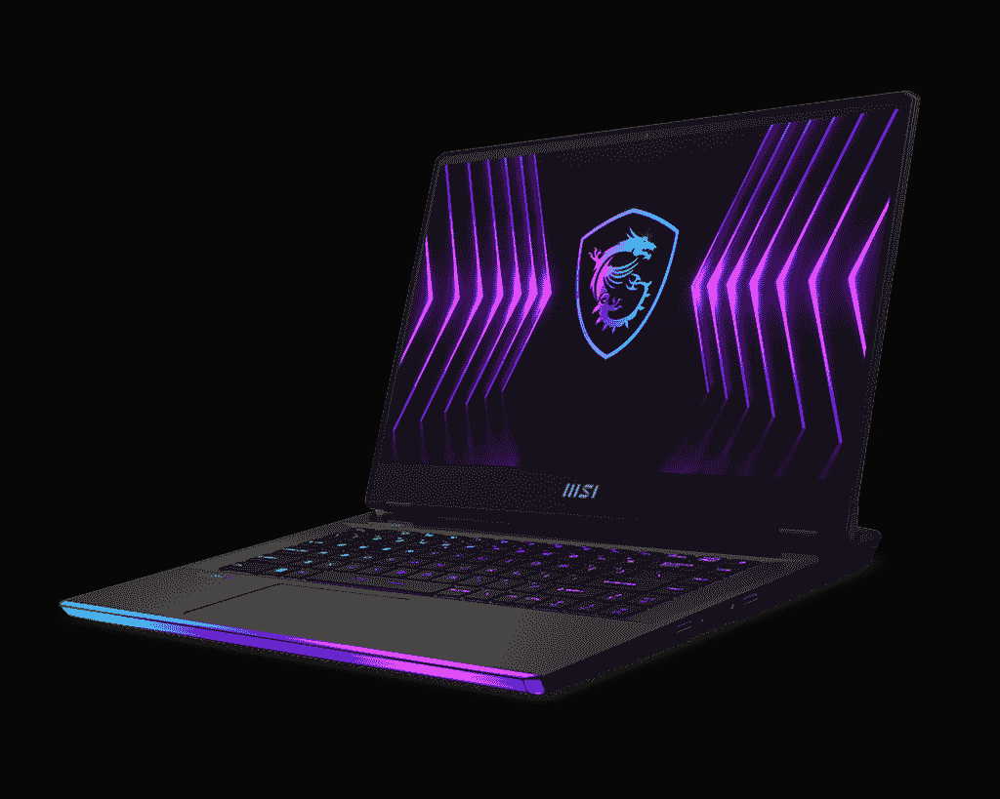

# 2023 年最佳有机发光二极管笔记本电脑

> 原文：<https://www.xda-developers.com/best-oled-laptops/>

当你想到今天你能买到的最好的手机时，在你可能会有的许多期望中，你想到的那些可能有有机发光二极管显示屏。这种类型的面板使显示器更加生动，更加丰富多彩，但也提供真正的黑色，并可能节省电力。由于创新主要集中在智能手机上已经有一段时间了，有机发光二极管显示器在笔记本电脑中占据主导地位需要一些时间，即使在今天，甚至许多最好的笔记本电脑都没有显示器。

但这并不意味着它们不存在，或者它们在任何方面都是不合格的。事实上，在过去的几年里，它们变得比以往任何时候都更常见。今天，你可以找到一些很棒的有机发光二极管显示器的笔记本电脑，不仅它们的屏幕看起来令人惊叹，而且它们在其他方面也很棒。如果你正在寻找下一台笔记本电脑的有机发光二极管显示器的生动性，我们已经收集了你现在可以找到的最佳选项。尽管它们可能不常见，但这里涵盖了许多部分，因此您有相当多的选择。

## 最佳综合:联想 Yoga 9i

联想的消费笔记本电脑不如其面向商务的 ThinkPads 那么受欢迎，但 [Yoga 9i](https://www.xda-developers.com/lenovo-yoga-9i-2022-review/) 非常好，绝对值得在这份名单上占有一席之地。它拥有你想要的所有性能，漂亮的设计，而且不是一个，而是两个奇妙的有机发光二极管面板可供选择，它很容易成为 2022 年最好的笔记本电脑之一。

首先，由于它搭载的英特尔酷睿 i7 P 系列处理器，它具有出色的性能。P 系列是 Windows 笔记本电脑的新产品，它配备了更高的 28W TDP，这意味着您可以获得更高的性能。目前，它只提供 12 核 16 线程的 Core i7-1260P，但也会有更强大的 Core i7-1280P，它有 14 核 20 线程。除此之外，您还可以获得高达 16GB 的 5200 MHz lodd r5 RAM 和高达 1TB 的 SSD 存储，对于大多数日常任务来说绰绰有余。对于图形，您可以使用常见的英特尔 Iris Xe 集成 GPU。

联想 Yoga 9i 真正做对的事情之一是媒体体验。14 英寸的显示器具有 16:10 的高纵横比，虽然基本型号是 IPS 面板，但您可以选择两种非常棒的有机发光二极管面板。首先，公平地说，2.8K (2880 x 1800)对于这种尺寸的显示器来说已经足够锐利了。但更好的是，这款机型的刷新率为 90Hz，因此从动画到滚动的一切都将变得更加流畅。不过，如果你更看重分辨率，你可以选择超高清+ (3840 x 2400) OLED 面板，它有更传统的 60Hz 刷新率。不管怎样，这都是一场非凡的表演。

为了配合这一点，联想 Yoga 9i 在铰链中内置了一个扬声器条形音箱，这意味着声音总是朝着你发出，以获得更身临其境的体验。毫无疑问，这是媒体消费的最佳笔记本电脑之一。在显示器上方，网络摄像头也已升级为 1080p 摄像头，具有 Windows Hello 面部识别功能，因此视频通话和会议看起来比以往任何时候都更清晰。

不过，这个包裹里还有更多好东西。最新的联想 Yoga 9i 经过了显著的重新设计，用更具反射性的惊人曲线取代了曾经平坦乏味的边缘，为整体设计增添了一点亮点。如果您想将笔记本电脑拿在手中，圆形边缘也有助于更舒适地抓握。这也有不好的一面，就是缺少存放钢笔的地方，所以这是你现在必须更加小心的事情。这里还值得一提的是“边到边”键盘，它在右侧包括一些额外的功能键，包括指纹传感器、黑暗模式按钮等。厚度为 15.25 毫米，这也是一款非常薄的笔记本电脑，重量为 3.09 磅，与您预期的这种尺寸的敞篷车一样重。

此外，我们还有端口设置，这也是您对现代高端笔记本电脑的期望。你有一个 USB Type-A 端口，三个 USB Type-C 端口-其中两个支持 Thunderbolt 4-和一个耳机插孔。有些人可能喜欢看到 HDMI 端口，但这是一个不寻常的牺牲。至少你有一个耳机插孔和 USB Type-A，所以你可能不需要任何适配器。

在一天结束时，联想 Yoga 9i 得到了一吨的权利——它有一个惊人的设计，更好的显示屏，足够的性能，等等。它是目前最好的笔记本电脑之一，有两个很棒的有机发光二极管显示器选项，我们不可能不把它列入这个名单。如果你想了解更多，一定要看看我们的[联想 Yoga 9i 评测](https://www.xda-developers.com/lenovo-yoga-9i-2022-review/)。值得注意的是，Yoga 9i 在未来几个月内会有一个更新的版本，但如果你想购买当前的型号，这些变化并不是那么大。

 <picture></picture> 

Lenovo Yoga 9i

##### 联想 Yoga 9i

联想 Yoga 9i 是一款非凡的敞篷车，当然也是 2022 年你能买到的最好的笔记本电脑之一。

## 最佳翻盖式笔记本电脑:戴尔 XPS 13 Plus (9320)

长期以来，戴尔的 XPS 系列一直是高端笔记本电脑的主要产品，但今年，该公司仍然成功地用新的[戴尔 XPS 13 Plus](https://www.xda-developers.com/dell-xps-13-plus-review/) 让我们惊叹不已。难怪这款设备会名列榜首——它可能是我们见过的最具未来感的笔记本电脑，它有着顶级的性能和出色的显示屏。

从性能开始，Dell XPS 13 Plus 配备了英特尔新的第 12 代酷睿处理器，不仅如此，它还使用了具有更高 28W TDP 的新 P 系列型号。您可以选择英特尔酷睿 i7-1280P，这是一款功能强大的 CPU，共有 14 个内核(6p + 8E)和 20 个线程，最高可提升至 4.8GHz。作为参考，以前的 XPS 13 型号最大拥有 4 个内核和 8 个线程。除此之外，您还可以获得高达 32GB 的 5200 MHz lpddr 5 RAM 和 2TB PCIe 4 SSD，因此您可以获得巨大的性能。对于图形，您仍然可以使用英特尔 Iris Xe，这足以应付日常任务和一些非常轻松的游戏。所有这一切的不利方面是，由于处理器功耗增加，电池寿命受到影响。

如果你使用过任何以前的 XPS 13 型号，戴尔 XPS 13 Plus 上的显示屏会感觉很熟悉，它没有太大的变化。这是一个 13.4 英寸的面板，长宽比为 16:10，虽然大多数配置都是 IPS，但你可以通过华丽的 3.5K (3456 x 2160) OLED 面板获得它。这个版本的笔记本电脑也覆盖了 100%的 DCI-P3 色彩空间，它支持 DisplayHDR 500，它是一个受康宁大猩猩玻璃 Victus 保护的触摸屏。基本上，它是您想要的顶级笔记本电脑显示器的一切。除此之外，您还可以获得总输出功率为 8W 的四声道立体声扬声器。

在显示屏上方是戴尔 XPS 13 Plus 的一个缺点，即它的网络摄像头。戴尔仍在使用 720p 摄像头传感器，但值得称赞的是，它将常规网络摄像头与用于 Windows Hello 的红外传感器分开，因此图像质量比上一代有所提高。除了面部识别之外，XPS 13 Plus 还具有用于 Windows Hello 的指纹传感器。

设计是戴尔 XPS 13 Plus 如此独特和吸引人的原因之一。戴尔在这方面做了一些有趣的事情，首先是没有触摸板，至少没有可见的触摸板。相反，触控板无缝融入机箱，并使用触觉电机来模拟点击的感觉。此外，戴尔正在使用零点阵键盘，每个键之间没有空格，使外观格外整洁。此外，在标准键之上，功能行键是基于触摸的，因此您可以随时看到您使用的是功能键还是媒体控制。

这种超级现代和紧凑的设计具有强大的规格，但也有一个缺点，那就是端口。Dell XPS 13 Plus 只提供两个 Thunderbolt 4 端口，仅此而已。盒子里有一个 USB Type-C 到 Type-A 适配器，你可以选择也添加一个 Type-C 到 3.5 毫米耳机适配器(是的，甚至没有耳机插孔)，但这不是最方便的路线。不过，如果你们都在使用无线设备或 Thunderbolt 坞站，这可能不是问题。

即使有缺点，Dell XPS 13 Plus 也绝对是今年你能买到的最好的笔记本电脑之一，尤其是如果你想要一台 OLED 面板的话。它又薄又轻，有一种非常酷的未来感，而且速度非常快。感兴趣的话可以在下面买。

 <picture></picture> 

Dell XPS 13 Plus

##### 戴尔 XPS 13 Plus

Dell XPS 13 Plus 是我们很久以来见过的最具未来感的笔记本电脑之一，它拥有强大的处理器和清晰的有机发光二极管显示屏。

## 最佳商务笔记本电脑:联想 ThinkPad X1 Carbon Gen 10

联想的 ThinkPad X1 Carbon 是有史以来最好和最具标志性的商务笔记本电脑之一，但 Gen 10 型号是第一次你可以通过有机发光二极管显示屏获得它。然而，这不是 2022 年唯一的重大升级，而且这是在已经使以前的车型变得非常棒的基础上的升级。

首先是性能，和其他公司一样，联想已经升级到英特尔的第 12 代酷睿处理器，特别是 P 系列。是的，这意味着更高的 28W TDP 和多达 14 个内核和 20 个线程，如果您选择使用英特尔酷睿 i7-1280P 的话。与其他采用这些处理器的笔记本电脑一样，这可能会对电池寿命产生负面影响，但这仍然是一台伟大的机器。除此之外，你还可以得到 ThinkPad X1 Carbon Gen 10，它拥有高达 32GB 的主频为 5200MHz 的 LPDDR5 RAM，以及高达 2TB 的 PCIe 4 SSD 存储。

该显示器是 2022 年的重大升级之一，特别是因为联想为这场竞争增加了更多选择。当然，这包括新的 2.8K OLED 面板，具有不同寻常的 2880 x 1800 分辨率和 DisplayHDR 500 True Black 认证。虽然这种分辨率直到最近都不常见，但它是一种最佳选择——在这种尺寸下，这将是一种非常清晰的显示，而且它不会像 4K 面板那样浪费大量资源来驱动那么多像素。最重要的是，这款显示器具有 16:10 的宽高比，非常适合商务笔记本电脑。

另一个重大升级就在显示屏上方——联想已经在大多数可用机型中使用了 1080p 网络摄像头，甚至那些没有 Windows Hello 面部识别的机型。这意味着您可以从您的视频通话和会议中获得更好的质量，联想让您可以选择带计算机视觉的 MIPI 摄像头，甚至更进一步。这使笔记本电脑能够检测到您何时接近它来使用它，因此它可以唤醒并准备好为您登录。

在设计方面，并没有太大的变化。标志性的 ThinkPad 外观在这里得到了体现——黑色的表面，红色的口音，键盘上的红色跟踪点，以及触摸板上重复的鼠标按钮。它也是一台非常轻薄的机器，所以它经典的外观并不意味着它感觉很旧。

使用过上一代 ThinkPad X1 Carbon 的人也会对这些端口感到熟悉。如果您选择添加蜂窝连接，您可以获得两个 Thunderbolt 4/USB Type-C 端口、两个 USB Type-A 端口、HDMI、一个耳机插孔和一个 nano-SIM 插槽选项。在这方面，您可以选择 4G LTE 或 5G 网络支持，因此您可以选择最符合您需求的支持。

总而言之，这无疑是今年最好的商务笔记本电脑之一，由于有机发光二极管的展示，它也在这个名单上赢得了一席之地。下面可以买。

##### 联想 ThinkPad X1 碳第 10 代

联想 Thinkpad X1 Carbon 是世界上最具标志性的商务笔记本电脑之一，2022 款配备了有机发光二极管显示屏选项。

## 最佳有机发光二极管显示屏轻型笔记本电脑:三星 Galaxy Book 2 Pro

三星凭借 Galaxy Book Pro 的最初版本引起了轩然大波，而随着其继任者的推出，它甚至做得更好。更高的性能、更好的网络摄像头、更亮的显示屏等等-所有这些都在与以前相同的轻量级封装中。这确实是最好的有机发光二极管笔记本电脑之一。

性能方面，三星 Galaxy Book 2 Pro 配备了第 12 代英特尔酷睿处理器，最高可达酷睿 i7-1260P。这是英特尔新的 28W 处理器之一，它共有 12 个内核(4P + 8E)，16 个线程，速度高达 4.7GHz。此外，它还配有集成的 Iris Xe 显卡。15.6 英寸的机型也将提供独立的英特尔 Arc 显卡，尽管目前还没有提供。你还可以获得高达 32GB 的 RAM 和 1TB 的 SSD 存储(尽管在编写时只有 16GB + 512GB 的配置)。这是一个强大的规格组合，将为您提供大多数类型的生产力工作所需的所有性能。

Galaxy Book 2 Pro 的伟大之处在于，AMOLED 显示屏不是升级选项，也不局限于特定的配置——它是全面的标准。你总是会得到一个 AMOLED 显示屏，在这种情况下，它是一个全高清面板。大多数高端笔记本电脑只有非常高分辨率的有机发光二极管选项，这抬高了价格。如果你想要一个 AMOLED 显示屏，而又不想支付过高的费用，Galaxy Book 2 Pro 可以让你做到这一点。前代产品类似，但三星表示，这款新面板更亮，因此在明亮的条件下，你可以指望更好的可视性。所有这一切的缺点是，如果你想要更清晰的屏幕，你没有超越全高清的选项。

Galaxy Book 2 Pro 的另一个主要卖点是其设计，难以置信的便携。13.3 英寸的 Galaxy Book 2 Pro 厚度仅为 11.2 毫米，非常薄，重量仅为 1.92 磅，是该榜单上最轻的笔记本电脑。即使你拿 15.6 英寸的版本，它也只有 11.68 毫米薄，2.31 磅重(虽然如果你买的是英特尔 Arc 显卡的型号，它会稍微大一点)。这款笔记本电脑的轻薄令人印象深刻，如果你想整天随身携带，就便携性而言，没有比这更好的选择了。

端口选择也没有薄到让你以为的那么差。你有一个 Thunderbolt 4 端口，一个普通的 USB Type-C 端口，USB Type-A，一个耳机插孔和一个 microSD 读卡器。13.3 英寸的型号没有 HDMI，但 15.6 英寸的版本也有。关于连接性的话题，值得一提的是，三星笔记本电脑附带了一些功能，如快速共享，如果你已经有一部三星手机，这可能会很有用。

三星生产的笔记本电脑没有许多最知名的公司那么多，但三星 Galaxy Book 2 Pro 等设备证明，当该公司生产一台笔记本电脑时，它是非常棒的。这是你今天能买到的最好的笔记本电脑之一，尤其是如果你想要一台有机发光二极管显示器的话。还有 Galaxy Book 2 Pro 360，我们实际上已经评测过了。这是笔记本电脑的一个可转换版本，功能更多，只是稍微大一点。不过，敞篷车确实失去了一些端口。

 <picture></picture> 

Samsung Galaxy Book 2 Pro

##### 三星 Galaxy Book 2 Pro

三星 Galaxy Book Pro 是一款令人难以置信的轻薄笔记本电脑，具有高端规格和全高清 AMOLED 显示屏。

## 同样出色的还有:宏基 Swift Edge

如果你想要一个感觉更高端的选择，[宏基 Swift Edge](https://www.xda-developers.com/acer-swift-edge-review/) 是另一款令人惊讶的轻薄笔记本电脑，但它有更大的 16 英寸，规格更高。价格有点贵，但物有所值。

在 Acer Swift Edge 中，您会发现 AMD 锐龙 7 6800U 处理器，它具有 8 个内核和 16 个线程，能够提升到 4.7GHz，为您提供各种日常任务的高性能。此外，它还集成了镭龙 680M 显卡，因此一些轻度游戏也是可行的。除此之外，目前唯一存在的配置是 16GB 内存和 1TB 固态硬盘，因此多任务处理应该是轻而易举的，您将有足够的空间来存储文件。

这里的展示才是真正的明星。这是一个 16 英寸的面板，长宽比为 16:10，这使得它的工作效率更高。但它也是一个令人难以置信的锐利显示器，具有超高清+ (3840 x 2400)分辨率，因此它在 OLED 面板下看起来锐利而充满活力。无论您是在工作还是在观看内容，这都是一种非凡的显示。除此之外，您还可以获得 1080p 全高清网络摄像头，因此在视频通话和会议期间，您应该看起来很棒。没有 Windows Hello 面部识别，但你确实有一个指纹传感器。

宏碁称 Swift Edge 是世界上最轻的 16 英寸笔记本电脑，这要归功于镁铝合金结构。尽管屏幕很大，但这款笔记本电脑的重量仅为 2.4 磅，令人印象深刻。它最厚处也只有 13.95 毫米，因此这是一款非常便携的机器。它有一种“橄榄石黑”配色，本质上是黑色，带有一些绿色底色。

即使采用超薄设计，这款笔记本电脑仍然有几个端口。你有两个 USB Type-C 端口(3.2 Gen 2)，两个 USB Type-A 端口，HDMI，一个耳机插孔和一个 microSD 读卡器。这为您提供了一些无需适配器的外围设备和外部存储选项。不幸的是，没有 USB4 支持，但这在 AMD 笔记本电脑中并不少见。

如果您想要出色的性能和绝对漂亮的有机发光二极管显示器，Acer Swift Edge 是周围最好的笔记本电脑之一，虽然价格有点高，但它是您可以通过如此出色的显示器获得的最便宜的选择之一。

 <picture></picture> 

Acer Swift Edge

##### 宏碁 Swift Edge

Acer Swift Edge 是一款令人惊讶的轻薄 16 英寸笔记本电脑，配有超高清有机发光二极管显示屏和高端 AMD 处理器。

## 最佳 15 英寸笔记本电脑:戴尔 XPS 15

戴尔的 XPS 阵容不仅仅是 XPS 13 Plus，尽管 [XPS 15](https://www.xda-developers.com/dell-xps-15-2022-review/) 没有像较小的兄弟姐妹一样具有超未来主义的外观，但它仍然是一款非凡的笔记本电脑。事实上，如果您需要一台配有有机发光二极管显示屏的更强大的 PC，戴尔 XPS 15 是您的最佳选择之一，它只是[最好的戴尔笔记本电脑](https://www.xda-developers.com/best-dell-laptops/)之一。

从性能开始，Dell XPS 15 配备了来自 H 系列的英特尔第 12 代处理器，TDP 为 45 瓦。您可以使用酷睿 i9-12900HK，这是一款非常强大的 CPU，具有 14 个内核、20 个线程，能够提升至 5GHz。支持强大的 CPU 是一个可选的(取决于您的配置)独立 GPU，阿尔 GeForce RTX 3050 或 RTX 3050 Ti。这些并不意味着高端游戏，但如果你调整一些设置，它们将允许你运行任何现代游戏——此外，它们还可以帮助像视频编辑这样的创造性工作。此外，高达 64GB 的主频为 4800MHz 的 DDR5 RAM 和 2TB 的 SSD 存储使笔记本电脑能够处理几乎任何事情。

这确实是 2022 版 Dell XPS 15 的所有新功能，但其他功能一如既往。15.6 英寸的面板具有 16:10 的宽高比，让您可以选择令人惊叹的 3.5 英寸(3456 x 2160) OLED 面板，在这种更大的尺寸下，它仍然看起来非常出色。这仍然是一个非常高的分辨率，所以你肯定不会在这个屏幕上计算单个像素。OLED 面板还包括触摸支持，它覆盖了 100%的 DCI-P3，因此媒体体验一定会很棒。此外，峰值输出高达 10W 的四扬声器设置也能提供出色的音频。

不幸的是，与去年的型号相比，戴尔没有做太多的升级摄像头，我们仍然看到这样一款高端笔记本电脑使用 720p 网络摄像头，这很奇怪。不过，它确实有 Windows Hello 面部识别功能，如果你更喜欢使用指纹，笔记本电脑也有这个选项。

2022 年的设计也不变，但这并不意味着它不好。考虑到其显示屏尺寸和内部强大的规格，Dell XPS 15 是一款令人惊讶的紧凑笔记本电脑。它的两种配色看起来都很棒——一种是黑色碳纤维内饰，一种是更暗的银色外壳；另一种是由编织玻璃纤维复合材料制成的白色内饰，与外部的浅银色相匹配。

戴尔 XPS 15 的紧凑设计有限制您获得的端口的缺点-有两个 Thunderbolt 4 端口，一个标准 USB Type-C 端口，一个全尺寸 SD 读卡器和一个 3.5 毫米耳机插孔。包装盒中包括一个适配器，可以将一个 USB Type-C 端口转换为 USB Type-A 端口和 HDMI 端口，因此您并不是完全没有选择，但对于这种尺寸的笔记本电脑来说，这不是最方便的方法。

虽然我们希望 2022 年型号的戴尔 XPS 15 能够获得更多升级，但这仍然是一款非凡的笔记本电脑，它在外观现代和紧凑之间取得了惊人的平衡，并且仍然提供了出色的性能。再加上令人惊叹的有机发光二极管显示屏，这无疑是最好的笔记本电脑之一。

 <picture></picture> 

Dell XPS 15 (9520)

##### 戴尔 XPS 15 9520

Dell XPS 15 是一款小巧的 15 英寸笔记本电脑，功能强大，足以满足轻度游戏和创意工作的需求。

## 最佳有机发光二极管游戏笔记本电脑:微星突袭机 GE67HX

如果你正在寻找一款能够处理最新 AAA 游戏，同时仍能给你带来 OLED 面板般惊艳视觉体验的笔记本电脑，微星突袭机 GE67HX 真的很难击败。这是目前世界上最强大的笔记本电脑之一，它拥有你想要的所有 RGB 颜色，加上快速的有机发光二极管显示。

首先，微星突袭机 GE67HX 配备了英特尔的第 12 代酷睿处理器，但在这种情况下，它们来自新的 HX 系列，并且它们具有 55W 的默认 TDP。你可以使用英特尔酷睿 i9-12900HX，它拥有 16 个内核和 24 个线程，速度高达 5GHz。这几乎是当今笔记本电脑上最强大的 CPU，该功能由高达 NVIDIA GeForce RTX 3080 Ti GPU 支持，该 GPU 可以使用高达 175 瓦的功率(带动态增强)，这意味着您可以在笔记本电脑中获得您想要的所有性能。任何你想运行的游戏，你都可以运行，没问题。除此之外，该笔记本电脑支持高达 64GB 的 4800 MHz DDR 5 RAM，并有两个 M.2 插槽用于 PCIe SSD 存储。

当然，你来这里是为了展示，微星突袭机 GE67HX 基本上拥有最好的游戏 OLED 面板。这是一个 15.6 英寸的四高清面板(2560 x 1440)，它有一个超级平滑的 240Hz 刷新率。这是清晰图像质量和平滑帧速率的完美平衡，使其非常适合在更具竞争力的游戏中以极高的视觉保真度运行游戏，而不会影响反应时间。除了高刷新率之外，与 IPS 屏幕相比，有机发光二极管面板具有出色的响应时间，低至 0.2 毫秒，因此您永远不会错过任何一个节拍。再加上屏幕支持 DisplayHDR 真黑 600，所以只是看起来很棒。

对于网络摄像头，微星幸好没有偷工减料太多。这是一个 1080p 网络摄像头，符合 2022 年大多数高级笔记本电脑的标准。你无法通过面部识别或指纹识别器获得 Windows Hello 支持，但至少如果你想打视频电话或玩游戏，这款相机足够好。

如果你对 MSI Raider GE67HX 是一款游戏笔记本电脑有任何疑问，这一设计让这一点变得非常明显。厚度为 23.4 毫米，这是一款很厚的笔记本电脑(尽管令人惊讶的是，对于这些疯狂的规格来说，它并没有那么糟糕)，重量也是 5.25 磅。但让它更加明显的是笔记本电脑前面的巨型 RGB 灯条，如果你在公共场合拿出来，肯定会引起所有人的注意。键盘也是 RGB 背光，不过也就这样了。

Raider GE67HX 还利用那个大底盘打包了大量端口，包括一个 Thunderbolt 4 连接、一个常规 USB Type-C 端口、三个 USB Type-A 端口、2.5Gb 以太网、HDMI 2.1、一个耳机插孔和一个 SD 读卡器。坦率地说，如果你尝试，你不能要求更多。

如果你想要终极游戏体验，微星突袭机 GE67HX 可能是你的最佳选择，考虑到它的规格，它实际上并不太贵。它拥有最好的有机发光二极管游戏显示屏，是目前最强大的笔记本电脑之一。

 <picture></picture> 

MSI Raider GE67HX

##### 微星突袭机 GE67HX

微星突袭机 GE67HX 是终极游戏笔记本电脑，具有令人难以置信的强大性能和惊人的有机发光二极管显示速度也非常快。

## 创作者的最佳笔记本电脑:华硕 ROG 西风 Pro Duo 15 有机发光二极管

华硕生产双屏笔记本电脑已经有一段时间了，但它仍然是最独特的想法之一。华硕 ZenBook Pro Duo 15 有机发光二极管不仅功能强大，还包含了任何笔记本电脑上最有趣的功能之一——键盘上的第二块屏幕。最新版本还配备了英特尔的第 12 代处理器。

这是今年发生变化的主要方面:性能。Zenbook Pro Duo 15 有机发光二极管的最新迭代配备了英特尔第 12 代 H 系列处理器，特别是酷睿 i9-12900H。这是一个具有 20 个线程的 14 核 CPU，速度高达 5GHz，使其成为最快的笔记本电脑之一。不仅如此，还有一个 NVIDIA GeForce RTX 3060，这是一个相当强大的 GPU，允许你在这台机器上运行各种创造性的工作负载。四舍五入，你得到 32GB 的 LPDDR5 内存和 1TB 的固态硬盘存储，

主显示屏是一台 15.6 英寸的 OLED 面板，分辨率为 4K (3640 x 2160)，因此它既生动又清晰。这也是一款经过 Pantone 验证的显示器，它覆盖了 100%的 DCI-P3，亮度高达 550 尼特，通过了 DisplayHDR 500 认证，并支持触摸。有些人可能更喜欢更高的 16:10 宽高比，但它仍然是内容消费和创作的绝佳显示器，但它下面的东西让它变得更加特别。

键盘面板包含第二个屏幕，与主显示器一样宽(分辨率为 3840 x 1100)，但这是一个 IPS 面板。当你打开笔记本电脑时，第二个屏幕会抬起来，所以当你正常观看笔记本电脑时，它处于正确的角度。你可以在 Premiere Pro 或 Photoshop 等一些内容创作应用程序中使用第二个屏幕进行直观控制，但你也可以在其上放置其他应用程序，以满足任何使用情况。例如，您可以在主屏幕上观看电影，并使用第二个屏幕给某人发送消息。这是你在其他地方看不到的多功能设置。

当然，在键盘面板上有一个大屏幕对设计有一些影响。键盘被推到左侧，笔记本电脑的右侧有一个触摸板，用于控制鼠标。触摸板还可以在您需要时随时变成虚拟数字键盘，如果您愿意，第二块屏幕也可以用作超大触摸板。还有一点值得注意的是，这里的摄像头是 720p，但它确实支持 Windows Hello 面部识别，这点很好看。

拥有所有这些确实使这款笔记本电脑有点笨重，但它可能会更糟。它的厚度为 21.5 毫米，重量为 5.16 磅，所以它不是你想整天随身携带的东西，但如果你需要在不同的地方工作，你可以把它带到办公室和家里。不过，你确实有充足的端口供应，包括两个 Thunderbolt 4 端口、一个 USB Type-A、HDMI 2.1 和一个耳机插孔，涵盖了你可能需要的所有基本功能。

华硕 ZenBook Pro Duo 15 有机发光二极管是你今天可以买到的最有趣的笔记本电脑之一，如果你是一个内容创作者，它是最好的之一。

 <picture></picture> 

ASUS Zenbook Pro Duo 15 OLED

##### 华硕 ZenBook Pro Duo 15 有机发光二极管

华硕 ZenBook Pro Duo 15 有机发光二极管有一个清晰的 4K 显示屏，加上键盘上的第二个屏幕，以提高生产力。它还包含强大的规格。

## 也很棒:惠普 Spectre x360 16

如果您正在为创作者寻找一款更典型的笔记本电脑，HP Spectre x360 16 可能会满足您的需求。这是一款非常强大的可转换笔记本电脑，由令人惊叹的(尽管是可选的)有机发光二极管显示屏和漂亮的设计提供帮助。

从性能开始，HP Spectre x360 16 可以采用英特尔酷睿 i7-12700H(一款 45W 处理器，具有 14 个内核和 20 个线程)或酷睿 i7-1260P(具有 28W TDP、12 个内核和 16 个线程)。之所以选择这些选项，是因为 P 系列处理器配有独立 GPU，即英特尔 Arc A370M，可为您的内容创作提供更出色的图形性能。您可以选择是要酷睿 i7-12700H 的更高 CPU 性能，还是要酷睿 i7-1260P 和 Arc 370M 的更高 GPU 性能。您还可以为笔记本电脑配置高达 32GB 的内存和 2TB 的固态硬盘存储，因此您不会错过太多。

继续展示，这是一个很棒的作品。这是一个 16 英寸的面板，长宽比为 16:10，这可能是大多数以创作者为中心的笔记本电脑的预期。基本型号不是有机发光二极管，但如果你选择走这条路线，它是一个非常清晰的超高清+ (3840 x 2400)面板，亮度为 400 尼特，看起来非常棒。当然，作为一个可转换的也意味着它支持触摸和笔输入。

Spectre x360 16 的另一个奇妙之处是它的网络摄像头，它使用了高分辨率的 500 万像素传感器。这在笔记本电脑中并不常见，虽然它只能录制全高清视频，但它具有自动取景、光线校正等智能功能。这无疑是目前最好的笔记本电脑相机之一。当然，Windows Hello 面部识别也在这里，不过如果你喜欢的话，你也可以使用指纹识别器。

在设计方面，Spectre x360 16 实际上改变了标志性 Spectre 设计中的一些东西，用更多的弯曲外观取代了棱角分明的边缘。然而，铜色的口音仍然在这里，虽然有点柔和，笔记本电脑的感觉一如既往地优质。4.45 磅，有点重，但对于这种尺寸的敞篷车来说，这是意料之中的。

你也可以得到稳定的港口供应。两个 Thunderbolt 4 端口、USB Type-A、HDMI、耳机插孔和 microSD 读卡器构成了一个全面的设置，对大多数用户来说应该足够了。

总的来说，这是惠普制造的最好的笔记本电脑之一，而且它甚至不一定只是为创作者准备的。它有强大的功能，令人惊叹的设计，梦幻般的有机发光二极管显示屏，以及最好的网络摄像头之一——它是几乎任何人都可以使用的最好的笔记本电脑之一。

 <picture></picture> 

HP Spectre x360 16

##### 惠普 Spectre x360 16

HP Spectre x360 16 是一款功能强大的可变形笔记本电脑，具有清晰的显示屏和出色的设计。

* * *

这些是我们认为你今天能买到的最好的有机发光二极管显示器的笔记本电脑。所有这些都是很好的选择，但我们将最佳整体位置给了[联想 Yoga 9i](#BestOverall) ，因为铰链条形音箱的整体出色媒体体验、令人惊叹的设计和出色的性能。列表中的其他笔记本电脑在更具体的事情上表现出色，它们可能是你最喜欢的。无论您是游戏玩家、创意专业人士还是商业用户，这里都有您喜欢的东西。