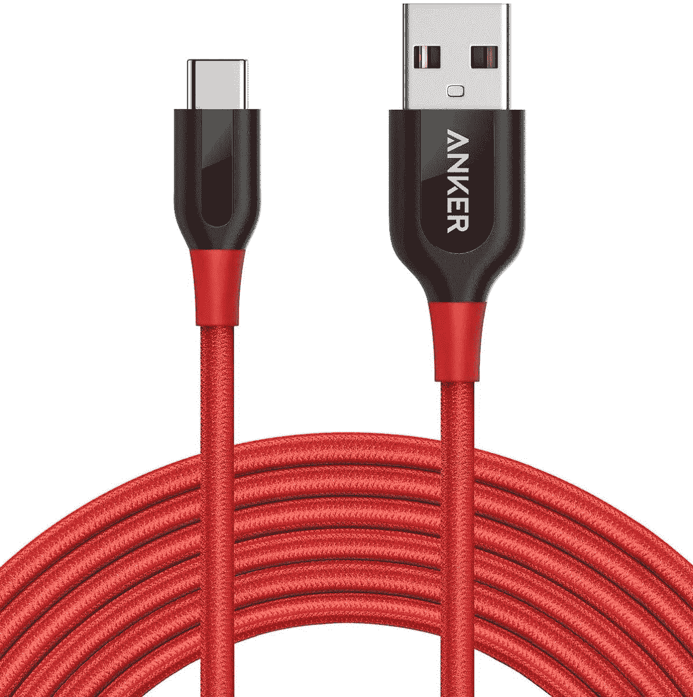
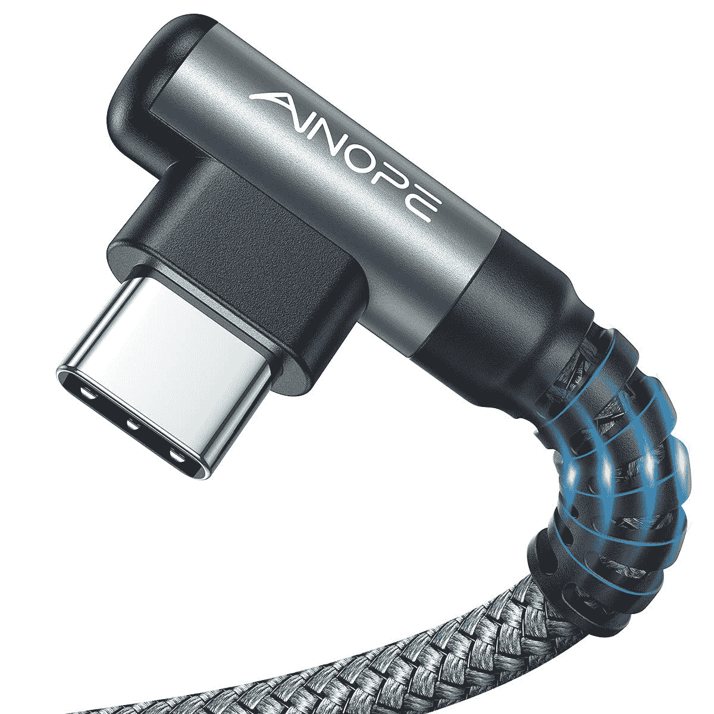
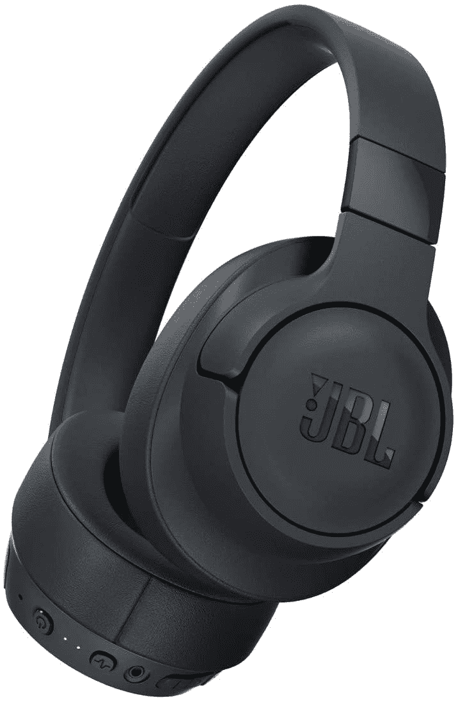
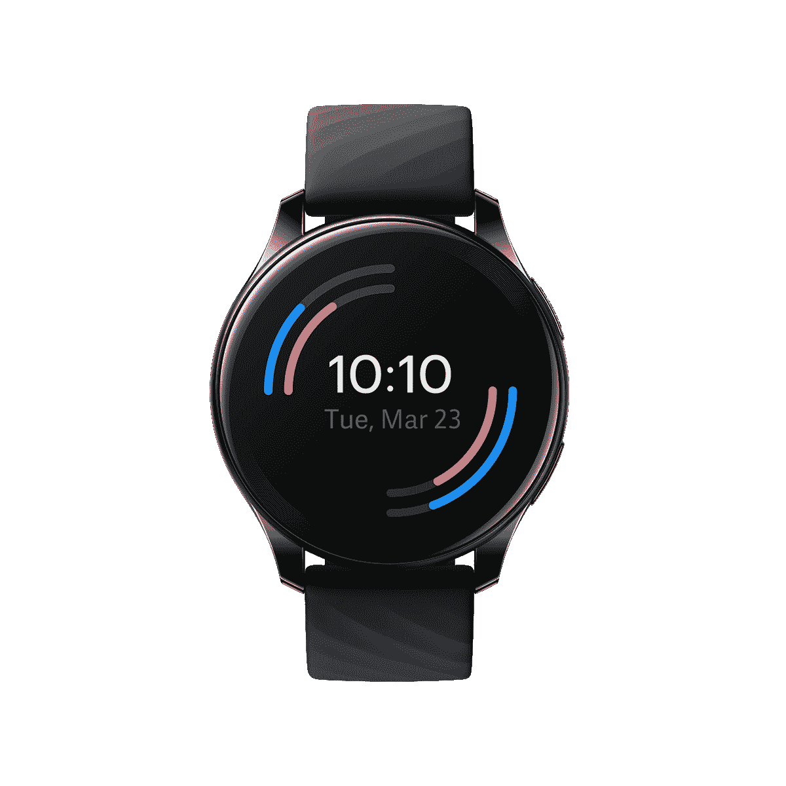

# 2023 年最佳一加 10 款专业充电器、电缆和其他配件

> 原文：<https://www.xda-developers.com/best-oneplus-10-pro-chargers-cables-accessories/>

一加 10 Pro 有很多令人喜欢的地方，包括其敏捷的性能、大胆的设计、功能强大的摄像头和极快的充电速度。同样值得称赞的是，与许多其他制造商不同，一加决定不跳过在包装盒中包括充电器。虽然将充电器和电缆放在盒子里很好，但额外的附件仍然可以派上用场。无论是同时为两个设备供电的双端口充电器，免提导航的车载支架，还是一副无干扰音乐和通话的真正无线耳机，这些额外功能都可以增加您对一加 10 Pro 的整体体验。

## 一加 10 Pro 的最佳快速充电器

一加 10 Pro 支持 65W 快速有线充电，但你需要使用官方充电器才能获得最高速度。如果你正在寻找官方有线充电器的替代选择，无论你是想要一次为多个设备充电的东西，无线充电器，还是汽车的东西，我们都在下面列出了最佳选择。

*   ##### 一加 SUPERVOOC 125W 充电器

    如果你需要为你的一加 10 Pro 更换充电器，这款是个不错的选择。虽然可以在 125W 充电，但手机本身只能支持 65W 充电。但这仍然意味着你的手机将获得最快的速度。

*   ##### 一加 SUPERVOOC 80W 车载充电器

    一加 80W SUPERVOOC 充电器是目前最快的车载充电器之一，只需 37 分钟即可为您的一加 10 Pro 充满电。它有一个 USB-A 端口和一个 USB-C 端口，支持 USB PD 协议。

*   ##### Anker 715 充电器(Nano II 65W)

    这款来自 Anker 的微型 GaN 充电器提供 65W 的功率输出，并具有可折叠的插头，便于运输。它支持 USB PD 协议，最高可为一加 10 Pro 充电 45W。它还附带 18 个月的无忧保修。

*   <picture></picture>

    u green 100 w 双端口 USB GaN 充电器

    ##### u green 100 w 双端口 USB GaN 充电器

    u green 100 w 充电器有两个 USB-C 端口，让你可以同时为你的一加 10 Pro 和笔记本电脑充电。它支持几乎所有主要的快速充电协议，包括 USB PD 3.0、QuickCharge 4.0+、USB PD PPS 和自适应快速充电。

*   ##### 一加 AIRVOOC 50W 无线充电器

    这是唯一一款以 50W 速度为您的一加 10 Pro 充电的无线充电器。双线圈系统让您可以在垂直和水平方向为手机充电，同时内置的冷却风扇可以防止过多的热量积累。还支持 Qi 充电，可以给耳塞充电，也可以给手表充电。

*   <picture></picture>

    三星 15W 无线充电器 Duo

    ##### 三星 15W 无线充电器 Duo

    这款三星无线充电器虽然没有官方充电器快，但它为您的手机和其他配件提供了无线充电的便利。最大充电速度为 15W，充电器还内置了冷却风扇，以控制热量。

## 一加 10 Pro 的最佳充电电缆

如果你想为你的一加 10 Pro 挑选一根备用 USB 线，我们建议你看看这些选项。这些电缆非常耐用，传输速度快。

*   ##### 一加 SUPERVOOC Type-C 转 Type-C 线缆

    这款一加官方 SUPERVOOC 线缆使用高级铜和镍，以实现高效的功率传输，两端均有 USB-C 连接器。它有 100 厘米长，可以与所有的 SUPERVOOC 充电器配合使用。

*   <picture></picture>

    Anker power line+

    ##### Anker USB-C 转 USBC-C 线

    Anker power line+配有双层编织尼龙外壳，更加耐用，并配有 USB-A 连接器。它有 10 英尺长，你可以买到灰色或红色的。

*   <picture></picture>

    A nope

    ##### A nope USB-充电器

    A nope USB-A 转 USB-C 线采用 L 形设计，方便在充电的同时使用手机进行游戏和观看视频。该电缆长 6.6 英尺，支持快速充电和数据传输速度。

## 一加 10 专业版最佳无线耳机

虽然任何一对无线耳机都可以与一加 10 Pro 配合使用，但这些耳塞是最佳搭配。它们都价格合理，具有主动噪声消除(ANC)，并拥有较长的电池寿命。

*   <picture></picture>

    一加蓓蕾 Pro

    ##### 一加蓓蕾 Pro

    一加蓓蕾 Pro 拥有别致的设计，有效的主动噪音消除，以及绝佳的音效。它们还拥有杜比 Atmos 支持和长达 38 小时的总电池寿命。

*   ##### 一加诺德蓓蕾

    一加诺德蓓蕾超越自身重量，提供时尚的设计、卓越的声音、超长的电池寿命和 IP55 等级，售价仅为 40 美元。

    T34
*   ##### Nothing Ear 1

    Nothing Ear 1 无线耳塞凭借其半透明的设计在众多真正的无线耳塞中脱颖而出。这些耳塞听起来性价比不错，而且它们还提供有效的 ANC、长电池寿命等功能。

*   <picture></picture>

    Anker Soundcore Life Q35

    ##### Anker Soundcore Life Q35

    这款 Soundcore Life Q35 是最好的预算过耳式耳机之一。它们支持主动噪声消除和高质量的 LDAC 编解码器，并且电池续航时间长达 40 小时。它们还采用时尚的设计，有三种颜色可供选择。

*   <picture></picture>

    JBL t 750 btnc 耳机

    ##### JBL Tune t 750 btnc

    如果你想要更便宜的耳挂式耳机，JBL 的这些蓝牙选项是个不错的选择。它们具有主动噪音消除功能，一次充电可使用 15 小时，因此您可以整天呆在这个区域而不会分心。

## 一加 10 Pro 的最佳智能手表和其他配件

智能手表是一种方便的配件，允许您直接从手腕上访问通知、天气等信息。这些智能手表非常适合一加 10 Pro，提供最佳的兼容性和功能。

*   <picture></picture>

    一加手表

    ##### 一加手表

    如果你想留在一加的生态系统中，一加手表是最完美的选择。它可能不会运行 Wear OS，但它确实提供了出色的性能、持久的电池续航时间和舒适的设计。

*   Galaxy Watch 5 是最好的穿戴式操作系统智能手表，提供先进的健康跟踪功能，耐用的设计，超长的电池续航时间，以及丰富的软件体验。

    T32
*   谷歌 Pixel 手表是谷歌 Pixel 品牌下的首款智能手表。它在某些方面已经过时了，但就其本身而言还是很有魅力的。

这些是一加 10 Pro 最好的充电和配件。无论您喜欢留在一加生态系统中使用第一方配件还是与第三方选项混合搭配，都有许多很好的选择来增强您对一加 10 Pro 的体验。当你在这里的时候，一定要检查一下[最佳一加 10 Pro 保护套](https://www.xda-developers.com/best-oneplus-10-pro-cases/)和[屏幕保护器](https://www.xda-developers.com/best-oneplus-10-pro-screen-protectors/)，以保护你的新手机免受划痕、跌落和其他伤害。

 <picture></picture> 

OnePlus 10 Pro

##### 一加 10 专业版

一加商店提供忠诚度折扣，并接受红币。如果你购买更高的存储版本，每次购买还可以获得一双一加 Buds Pro 和一个官方保护套