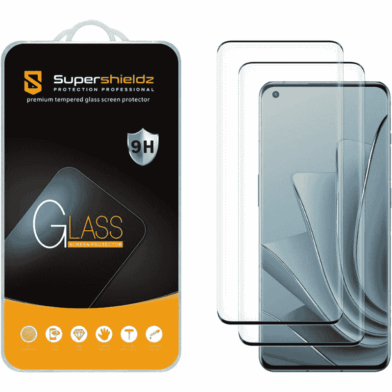
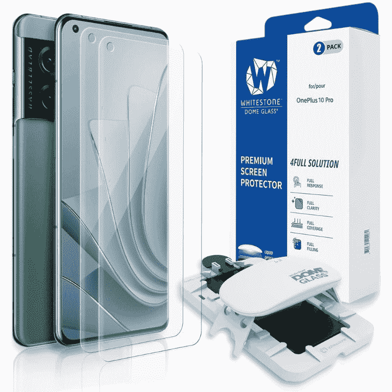
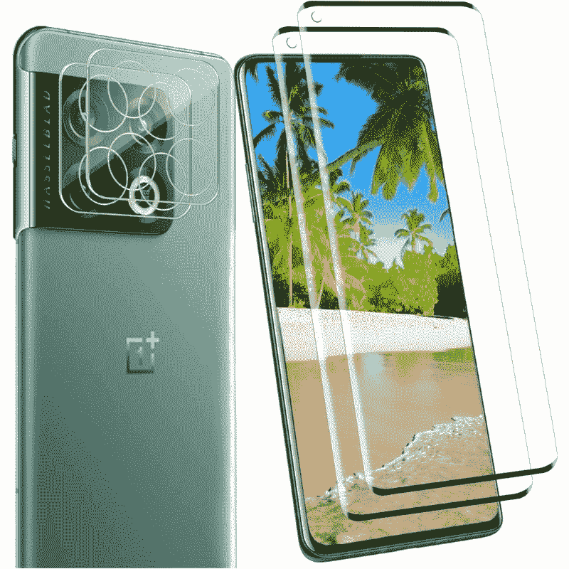
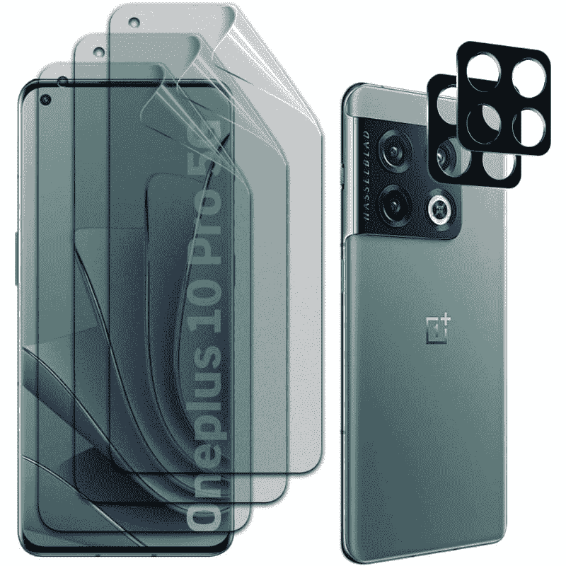

# 2023 年最佳一加 10 Pro 屏幕保护器

> 原文：<https://www.xda-developers.com/best-oneplus-10-pro-screen-protectors/>

# 2023 年最佳一加 10 Pro 屏幕保护器

抓住这些一加 10 专业版屏幕保护器，保护曲面屏幕免受划痕、裂缝等伤害。

一加 10 Pro 与 2022 年市场上的许多其他旗舰智能手机一样耐用。它的前面有一个 Gorilla Glass Victus 面板，众所周知，这是一个可靠的保护显示器免受意外跌落和碰撞的保护。然而，归根结底，它是玻璃，这意味着随着时间的推移，它肯定会被划伤或破裂，这取决于你有多笨拙。

如果你想保护那个闪亮的 AMOLED 显示屏，你需要买一个屏幕保护器。你很幸运，我们梳理了几十个在线列表，找到了一些你现在可以买到的最好的一加 10 Pro 屏幕保护器。

*   ##### Spigen Neoflex 屏幕保护器

    Spigen neo flex 是一款简单的 TPU 膜屏幕保护器，可以很好地保护一加 10 Pro 的显示器。如您所见，尽管侧面有弯曲的边缘，它仍能提供边到边的保护。另外，一包有两个。

*   <picture></picture>

    super shieldz 钢化玻璃屏幕保护器

    ##### super shieldz 钢化玻璃一加 10 Pro 屏幕保护器

    super shieldz 钢化玻璃屏幕保护器为一加 10 Pro 提供了完整的正面保护，包括挡板。它还带有疏油涂层，以减少污迹。

*   <picture></picture>

    白石圆顶玻璃保护罩

    ##### 白石圆顶玻璃一加 10 屏幕保护罩

    白石圆顶玻璃保护罩最棒的一点就是它附带了一个安装套件，使其易于安装。每次购买时，您还可以获得一个安装框架和紫外线固化灯。

*   <picture></picture>

    Surbuid 软 TPU 屏幕保护器

    ##### sububid 软 TPU 一加 10 Pro 屏幕保护器

    Surbuid 还为一加 10 Pro 提供软 TPU 屏幕保护器。软 TPU 屏幕保护器是那些想容易安装的伟大。这些都是友好的情况下，提供全面的覆盖，并相对负担得起的相比，强硬的钢化玻璃选项。

*   <picture></picture>

    YRMJK 钢化玻璃保护

    ##### YRMJK 钢化玻璃一加 10 Pro 屏幕保护器

    YRMJK 钢化玻璃屏幕保护器适用于一加 10 Pro，包括一个玻璃屏幕保护器、几个相机镜头护罩、灰尘吸收器、湿巾等。

*   <picture></picture>

    哑光屏幕保护器适用于一加 10 Pro

    ##### 哑光一加 10 Pro 屏幕保护器

    这些屏幕保护器提供哑光、防眩光处理，以获得更平滑的外观和感觉。它们还提供了足够的保护，使您的显示器免受意外跌落和碰撞。

这就是我们收集的 2022 年可以买到的最好的一加 10 Pro 屏幕保护器。我们会密切关注市场，当更多的选择出现时，我们会相应地更新这篇文章。同时，如果你想要一个简单的解决方案，你可以考虑购买 Spigen NeoFlex TPU 屏幕保护器。如果你想要更坚固的东西，Supershieldz 钢化玻璃也是一个很好的选择。如果你喜欢市场上的标准屏幕保护器，我们还增加了一个哑光表面选项。

他一加 10 专业版，你可能已经知道，前面有弯曲的玻璃边缘，这使得安装屏幕保护装置有点困难。你可能会考虑选择带有安装框架的白石圆顶玻璃保护，使事情变得更容易。

那么，你打算为你的一加 10 Pro 购买哪种屏幕保护装置呢？请在下面的评论中留言告诉我们。此外，如果你想为你的手机增加一层保护，请查看我们的[最佳一加 10 大专业案例](https://www.xda-developers.com/best-oneplus-10-pro-cases/)综述。如果你还没有购买这款手机，那么一定要停下来看看我们收集的[最佳一加 10 Pro 交易](https://www.xda-developers.com/best-oneplus-10-pro-deals/)，看看你现在是否可以在这款设备上节省一些钱。