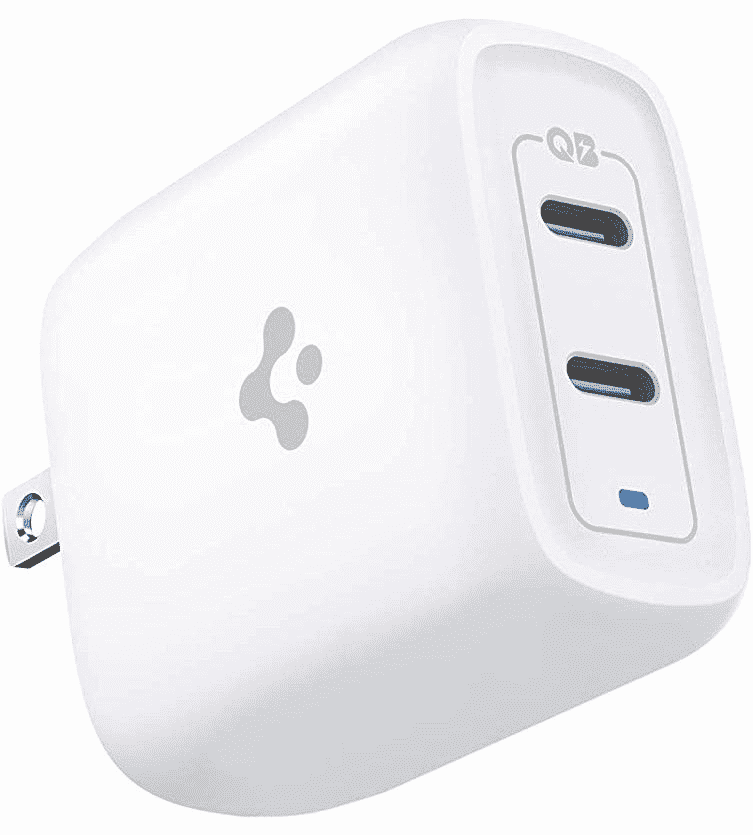

# 2023 年最佳一加 10T 充电器、电缆和其他配件

> 原文：<https://www.xda-developers.com/best-oneplus-10t-chargers-cables-accessories/>

一加 10T T1 可能没有所有的花哨功能来对抗市场上最好的手机，但它给 T2 一加 10 Pro T3 带来了一些令人兴奋的改进。这款手机的一大亮点是它支持 150W 的充电速度(北美为 125W)，在我们的测试中，它能够在短短 19 分钟内将手机从 1%充电到 100%。一加将其手机与所有必需品捆绑在一起，包括充电器、USB-C 电缆，甚至在某些地区还有 TPU 保护套，所以你可以开箱即用手机，而不用花更多的钱。

但是，如果您想购买替换充电器或其他配件来改善您的用户体验，我们可以满足您的需求。以下是你能为 2022 年的一加 10T 买到的最好的充电器、电缆和其他配件。

一加 10T 依靠捆绑的 SUPERVOOC 充电器和 USB-C 电缆来提供 150W 的功率，这意味着你不会获得普通 USB-PD 充电器的充电速度。根据我们的测试，一加 10T 在 100W USB-PD 充电器上的充电速度最高为 18W，因此只能作为替代方案使用。

## 一加 10T 最佳充电器

当您收到一加 10T 时，包装盒内会有一个充电器，但如果您需要额外的充电器或车上的充电器，也有一些选项。

*   ##### Anker 511 Nano 3

    Anker 511 Nano 3 是市场上最小的 30W 充电器之一，支持 USB 供电(PD)，具有可编程电源(PPS)。这种特殊的 GaN 充电器只有 1.12 英寸厚，比市场上许多其他 30W 充电器小 70%。

*   <picture></picture>

    Spigen 40W arc station Pro

    ##### Spigen 40W arc station Pro 双 USB-C 充电器

    Spigen 的这款 GaN 供电充电器有两个 USB-C 端口，让您可以同时为两台设备充电。每个端口最多可输出 30W，如果两个端口都使用，则总共可输出 40W(每个端口 20W)。充电器智能控制热量和功率输出，从而减少过热和过度充电。

*   ##### 一加 SUPERVOOC 80W 车载充电器

    一加 80W SUPERVOOC 充电器是目前最快的车载充电器之一。它使用 SUPERVOOC 协议，通过 USB-A 端口提供最大 80W 的输出功率，通过 USB-C 端口提供最大 30W 的输出功率。您可以同时使用两个端口为两台设备同时充电。

## 一加 10T 最佳电缆

正如我们前面提到的，一加 10T 需要官方的 SUPERVOOC USB-C 电缆来提供广告中的充电速度。但是，您可以使用其他电缆作为替代。

*   ##### 一加 SUPERVOOC Type-C 转 Type-C 线

    这款一加官方的 SUPERVOOC 线两端都有 USB-C 接口。它有 100 厘米长，可以与所有的 SUPERVOOC 充电器配合使用。如果您需要额外的电缆，这是获得的选项。

    T17
*   ##### Anker 尼龙 USB-C 转 USB-C 编织电缆

    Anker 的这款特殊尼龙 USB-C 转 USB-C 电缆长 10 英尺，支持 100W 充电。它有银色和红色可供选择，所以一定要选择你喜欢的那一款。

*   ##### Ugreen USB-C 线

    这包 Ugreen 线随机附送两根 USB-C 转 USB-C 线，最大支持 60W 充电。这是一种编织电缆，一侧带有直角连接器，在玩游戏时更容易使用。

    T37

## 与一加 10T 配合使用的最佳无线耳塞

一加 10T 就像目前大多数智能手机一样，没有耳机插孔。这意味着你要么必须依赖 USB-C 到 3.5 毫米的适配器，要么选择一对真正的无线耳塞。如果你的预算允许，我们总是建议选择后者，因为无线耳塞，尤其是较新的耳塞，也有一些其他优势。如果这些耳塞都没有引起你的兴趣，那么你可以在我们收集的[最佳无线耳塞](https://www.xda-developers.com/best-wireless-earbuds/)中探索更多选项。

*   <picture></picture>

    一加蓓蕾 Pro

    ##### 一加蓓蕾 Pro

    这款耳塞套装售价 150 美元，具有主动降噪功能，设计非常棒。软件体验需要做一些工作，但是除此之外，没有留下什么抱怨的空间。

*   <picture></picture>

    一加耳塞 Z2

    ##### 一加耳塞 Z2

    一加耳塞 Z2 是你能买到的最好的一对经济型真无线耳塞。它具有所有基本功能，包括主动降噪、直观的触摸控制等。

*   <picture></picture>

    虚无耳 1

    ##### 虚无耳 1

    虚无耳(1)耳塞有很多优点，包括独特的设计、出色的音质、直观的触摸控制、无线充电等等。值得注意的是，您还可以获得入耳式检测、两级主动噪音消除和可定制的触摸控制。

## 最佳智能手表和其他配件

这里快速浏览一下最好的智能手表和其他一些杂项配件，帮助你充分利用你的一加 10T。

*   <picture></picture>

    谷歌 Pixel 手表

    谷歌 Pixel 手表是谷歌 Pixel 品牌旗下的首款智能手表。它在某些方面过时了，而且很贵，但它很有魅力。它有健身跟踪，一个像样的应用程序商店，看起来出奇的好。

*   ##### Fitbit Charge 5

    Fitbit Charge 5 是一款坚固的健身追踪器，价格合理，功能齐全。你将获得你所期待的 Fitbit 跟踪功能，包括睡眠和月经跟踪。

    T32
*   <picture></picture>

    Vicseed 手机支架

    ##### Vicseed 手机支架

    Vicseed 汽车支架是一种基于吸盘的支架，可以在您驾驶时轻松地将您的智能手机固定到位。

这就把我们带到了终点。该公司使用 OPPO 专有的 SUPERVOOC 充电协议来提供高速充电，这限制了与手机配合使用的充电器的数量。USB 线也是一样，但如果你需要一个应急的替代品，这本集子里提到的那些就足够了。此外，我们还推荐了一些其他配件来搭配手机，以改善您的整体用户体验。

 <picture></picture> 

Official bumper case

一加 10T 是该公司产品组合中的性能旗舰，它当然名副其实。出色的性能和超长的电池寿命是我们对一加 10T 的评价。这并不是说手机在其他方面做得很差，它在这两方面做得最好。

我们也有专门的关于一加 10T 的[最佳案例](https://www.xda-developers.com/best-oneplus-10t-cases/)和[最佳屏幕保护器](https://www.xda-developers.com/best-oneplus-10t-screen-protectors/)的综述，所以如果你想给你的手机增加一些保护，一定要探索它们。