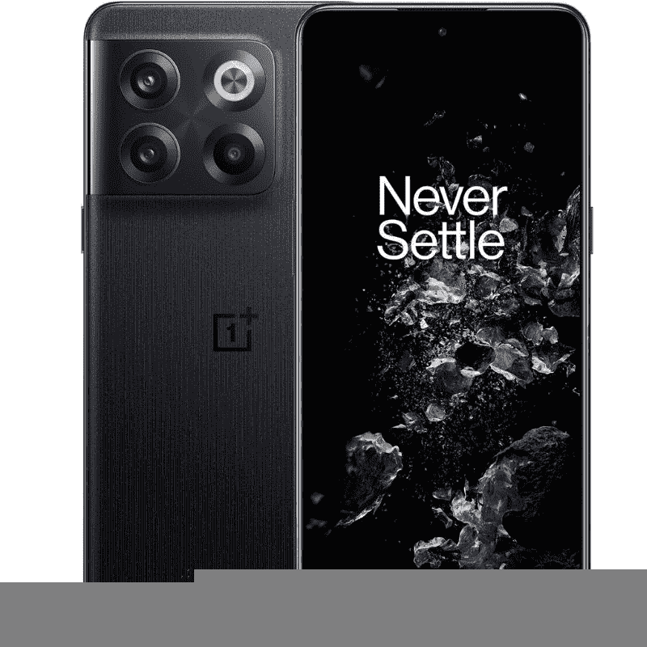

# 2023 年最佳一加 10T 交易

> 原文：<https://www.xda-developers.com/best-oneplus-10t-deals/>

一加 10T 是一加 10 系列的第三款产品，它在一些关键领域改进了已经很棒的一加 10 Pro。它由高通的骁龙 8 Plus Gen 1 芯片组驱动，因此它比在它之前进入市场的一加 10 Pro 和一加 10R 显示出更多的性能潜力。你可以在我们的[一加 10T 评测](https://www.xda-developers.com/oneplus-10t-first-impressions/)中了解更多关于这款手机的性能和更多信息，所以如果你有兴趣购买这款手机，请阅读一下。如果你已经下定决心购买一加 10T，那么我们在下面突出了一些交易供你查看:

## 最佳一加 10T 5G 解锁交易

如果你想买一个一加 10T 的解锁版本，而不是选择运营商锁定的型号，那么这里有一些最好的购买地点:

### OnePlus.com

一加的官方网站仍然是在美国购买一加 10T 的最佳地点之一。它有月光石黑和翡翠绿两种配色，你也可以在 8GB + 128GB 或 16GB + 256GB 之间选择配置。该公司目前不提供任何折扣，但你可以带着你的旧手机以旧换新，并在购买时使用现有的红色硬币。

 <picture></picture> 

The OnePlus 10T

##### 一加 10T

一加的在线商店不提供一加 10T 的任何折扣，但你可以带着你的旧手机以旧换新。

### 亚马孙

亚马逊现在对一加 10T 的两种型号都提供 100 美元的折扣，这使得它比一加的官方在线商店更适合购买这款手机。你可以花 550 美元买到 12GB 内存和 128GB 存储空间的基本型号，而 16GB 内存和 256GB 存储空间的高端型号要花 650 美元。此外，您还可以将旧手机以旧换新，最高可获得 400 美元。

 <picture></picture> 

The OnePlus 10T

##### 一加 10T

亚马逊现在就可以在一加 10T 上节省 100 美元。您还可以通过将旧设备以旧换新来节省更多费用。

### 百思买集团

百思买对一加 10T 的解锁版本提供 200 美元的折扣，前提是你愿意在百思买的在线或零售商店上通过运营商激活它。那些不想从百思买激活他们的手机的人仍然会毫无疑问地得到至少 100 美元的折扣。此外，您还可以将旧手机以旧换新，节省更多购买费用。

 <picture></picture> 

The OnePlus 10T

##### 一加 10T

百思买现在正在提供一些关于一加 10T 的可靠交易，选择百思买而不是一加官方商店，你一定会在购买上节省一些钱。

* * *

## 最佳一加 10T 5G 运营商交易

如果你从运营商那里购买智能手机，并用一个新的或现有的号码激活它，那么一加 10T 只能从美国的 T-Mobile 购买。

### T-Mobile

T-Mobile 在美国独家销售一加 10T，这意味着它是美国唯一一个可以买到运营商锁定版本手机的地方。然而，该运营商正在提供一些可靠的交易，所以它可能值得一试。T-Mobile 不仅提供一对免费的一加芽 Z2 与您的购买，但它也可以让你有免费的手机，只要你有一个新的品红色最大线。但运营商只提供 128GB 存储的月光石黑色手机，所以记住这一点。

 <picture></picture> 

The OnePlus 10T

##### 一加 10T

T-Mobile 在美国独家销售一加 10T，如果你在 Magenta MAX 中添加一个新系列，它会让你免费拥有一个。

* * *

如你所见，百思买是目前在美国购买一加 10T 的最佳地点。这是唯一一个为您的购买提供高达 200 美元折扣的零售渠道。那些希望购买运营商锁定版本手机的人将不得不转向 T-Mobile，因为它是美国唯一一家承载一加 10T 的运营商。当有新的交易时，我们将继续更新此页面。如果你已经拿起了手机，那么你可能想看看我们收集的[最佳案例](https://www.xda-developers.com/best-oneplus-10t-cases/)和[屏幕保护器](https://www.xda-developers.com/best-oneplus-10t-screen-protectors/)，以保护它免受意外跌落和碰撞。