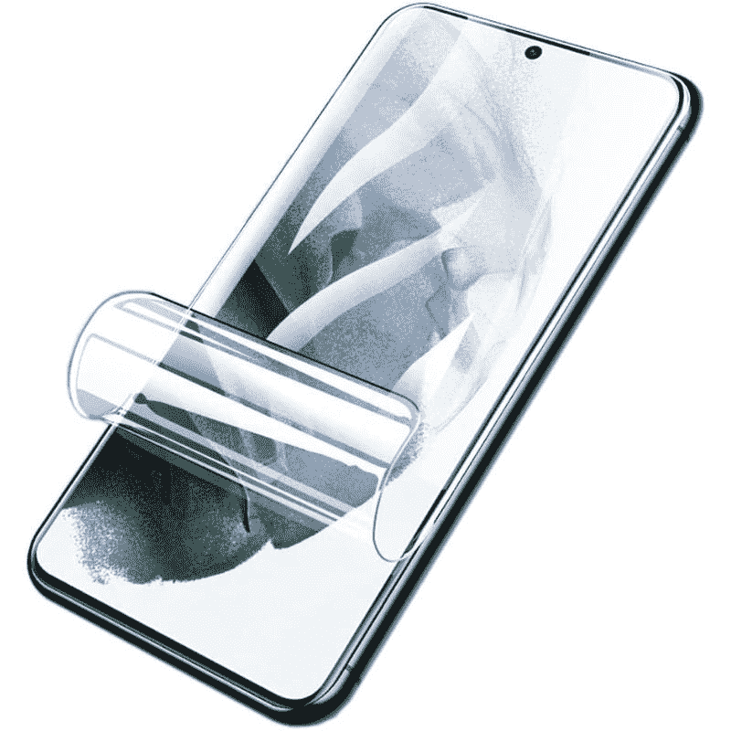

# 2023 年最佳一加 10T 屏幕保护器

> 原文：<https://www.xda-developers.com/best-oneplus-10t-screen-protectors/>

# 2023 年最佳一加 10T 屏幕保护器

一加 10T 有一个大而漂亮的 6.7 英寸 AMOLED 显示屏。以下是你能买到的保护屏幕的最好的保护物。

月光石黑色一加 10T

与今年早些时候推出的一加 10 Pro 相比，一加 10T 带来了许多改进。然而，它仍然是一个玻璃平板，具有 6.7 英寸的大液晶 AMOLED 屏幕，支持高达 120Hz 的刷新率。显示器受到 Gorilla Glass 5 的保护，但你可能需要一个屏幕保护器，以确保它仍然像你第一次从盒子里拿出来时一样崭新。市场上并不缺少一加 10T 的屏幕保护器，但我们为您收集了一些最好的屏幕保护器:

*   <picture></picture>

    super shieldz 钢化玻璃

    ##### super shieldz 钢化玻璃一加 10T 屏幕保护器

    super shieldz 钢化玻璃是你能为一加 10T 买到的最好的屏幕保护器之一。它有圆形的边缘，使用起来很舒服，它带有特殊的涂层，可以减少汗水和指纹。

*   ##### 一加 10T 3D 钢化玻璃

    这款一加 10T 的官方 3D 钢化玻璃将提供完美的贴合性，并保护显示屏免受意外跌落和磨损。它的边缘还具有 3D 曲率，以确保感觉舒适。

*   <picture></picture>

    Draxlgon 水凝胶膜

    ##### Draxlgon 水凝胶膜一加 10T 屏幕保护器

    Draxlgon 水凝胶膜本质上是一种柔性 TPU 保护器，其工作方式就像普通屏幕保护器一样。它耐刮擦，耐穿刺，甚至耐紫外线，这意味着它不会像 TPU 的外壳那样变黄。

*   <picture></picture>

    Suttkue 屏幕保护器

    ##### Suttkue 钢化玻璃一加 10T 屏幕保护器

    这款钢化玻璃屏幕保护器还自带一对后置摄像头镜头保护器。它们非常耐刮擦和破裂，易于安装，并能长时间保护您的设备。

*   <picture></picture>

    or zero 钢化玻璃

    ##### 奥热罗钢化玻璃一加 10T 屏幕保护器

    or zero 钢化玻璃是我们在亚马逊上能找到的最实惠的产品之一。不到 8 美元，你就可以为你的设备获得三层钢化玻璃保护。这款屏幕保护器最棒的一点是，它甚至提供终身保修。

*   <picture></picture>

    Osophter 钢化玻璃

    ##### Osophter 钢化玻璃

    我们已经收集了一加 10T 的一些最佳案例，但这款可能值得在此重点介绍，因为它为您的设备提供了完整的保护。Osophter 商店正在为一加 10T 提供两件屏幕保护器和一个 TPU 保护套，价格低至 10 美元。

* * *

好了，这就把我们带到了这个特别系列的结尾。一加 10T 现在可以从美国的各种零售商和运营商处购买。XDA 的资深编辑 Adam Conway [几周前评论了这款手机](http://www.xda-developers.com/oneplus-10t-review/)，并指出它提供了惊人的性能和电池寿命。然而，一加 10T 确实在屏幕和构建质量等一些方面有所下降，但由于新的骁龙 8 Plus Gen 1 芯片组，它以 150W 的充电和性能部门弥补了这些缺点。您可以点击下面产品框中提到的链接，立即在线获得最佳价格。

 <picture></picture> 

OnePlus 10T

一加 10T 是该公司产品组合中的性能旗舰产品，它确实名副其实，具有出色的性能和电池续航时间。总而言之，你可以从一加得到一个全面的包装，比顶级旗舰产品更便宜，并做到盒子上说的那样，等等。

正如在我们的[一加 10T 拆箱](https://www.xda-developers.com/oneplus-10t-unboxing/)中提到的，该设备在印度只配有保护壳。如果你在美国和欧盟这样的市场购买，你必须单独拿起一个箱子。嗯，我们已经收集了一些你现在可以在市场上买到的一加 10T 的[最佳案例](https://www.xda-developers.com/best-oneplus-10t-cases/)。如果你想保护你的手机免受意外跌落和碰撞，一定要检查一下。