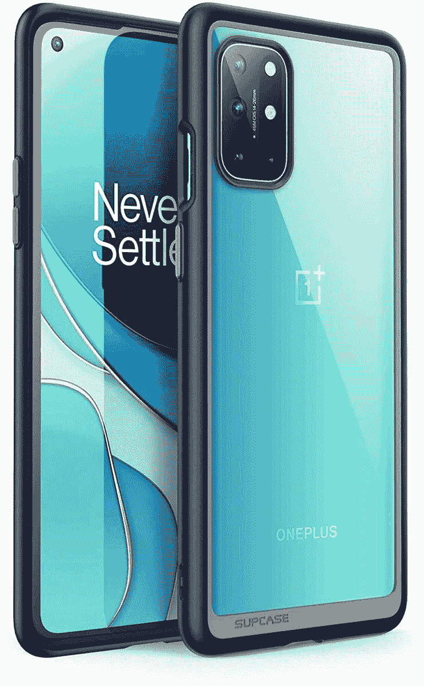

# 2023 年最佳一加 8T 案例

> 原文：<https://www.xda-developers.com/best-oneplus-8t-cases/>

# 2023 年最佳一加 8T 案例

刚买了一加的最新旗舰，需要一些保护？你很幸运——这里是我们的最佳一加 8T 案例综述！

如果你刚刚为自己订购了一辆可爱的新一加 8T(如果没有，请查看我们的[一加 8T 评论](https://www.xda-developers.com/oneplus-8t-review/))，或者如果你自发布以来一直在使用一辆，你会想确保你可以防止指纹、划痕和灰尘。像往常一样，这款手机有一个基本的塑料外壳——透明的乙烯基，柔韧，贴身，并在右手边垂直印有磨砂的“永不妥协”的口号。

这是一个很好的接触，使它比一个简单明了的案件更有吸引力，但它也只能提供有限的保护。如果你想要更多呢？市场上有成百上千的手机壳，但是你怎么知道你买的是好东西还是坏东西呢？请允许我们为您提供最佳一加 8T 案例指南。

 <picture></picture> 

OnePlus Sandstone Case

##### 一加砂岩案

老经典又回来了。砂岩是一个刚性的夹式表壳，以前的 OnePlussers 可能会很熟悉。这款手机的最大吸引力在于它有一个稍微粗糙的表面，这使得它更容易握持，因为让我们面对它，这些光滑的手机可能是光滑的小吸盘。砂岩表壳有黑色和青色可选。

 <picture></picture> 

Supcase Unicorn Beetle

##### SUPCASE UB 一加 8T 案例

Supcase 的这款保护套提供了充分的保护，即使在边缘和角落也不会掉落。它有加固的减震器来减震。这个外壳的背面是透明的，这样你就可以炫耀你的手机的颜色。

 <picture></picture> 

OnePlus Karbon Bumper Case

##### 一加 8T 卡邦保险杠外壳

一加案件世界的老信徒，卡本是在官方设计的顶端。熟悉的硬外壳带有微妙的斜条纹，旨在最大限度地增加撞击和跌落保护，同时保持最低的姿态，最能引起您的性感新手机的共鸣。这种水平的设计当然是非常珍贵的。

 <picture></picture> 

Otterbox Symmetry 8T Case

##### OtterBox 对称一加 8T 表壳

Otterbox 并不总是做出最令人兴奋的案例，但它们像旧靴子一样坚韧，我们是以最美好的方式表达这一点。很大程度上，这种对称与官方的 Karbon 保护套一样低调，但相机和触摸屏周围的边缘稍微凸起，这提供了更好的保护。对称外壳符合 DROP+，这是军用级外壳保护的 3 倍。

 <picture></picture> 

dBrand OnePlus 8T Grip Case

##### dbrand Grip 一加 8T 表壳

一箱。许多定制。这就是 dBrand 的承诺，它提供了一个 2mm 厚的外壳，包括一个包围侧按钮的设计，在保护它们的同时保留更多的屏幕自由-这是一个近乎无边框设备的重要考虑因素。侧面有扣人心弦的边缘，可以从巨大的色域中定制您喜欢的颜色，整个东西达到了军事保护等级。dBrand 还提供直接贴在手机外壳上的皮肤，但要获得全面保护，Grip Case 是最佳选择。

 <picture></picture> 

Poetic Affinity

##### 诗意的亲和一加 8T 案例

Poetic 的手机壳是我们见过的最坚固的，将坚硬的半透明机身与坚硬的钢化框架结合在一起。因此，它们确实会增加你手机的体积，但即便如此，也不会增加任何重量。与以往一样，它符合军用级跌落保护标准，但谢天谢地，它不会影响非接触式支付。半透明部分完美地补充了手机。如果你想要更大的保护，并且不介意制造更大的手机，这款一加 8T 保护套绝对应该在你的候选名单上。

 <picture></picture> 

Olixar OnePlus 8T Leather-Style Wallet Stand Case

##### Olixar 皮革钱夹一加 8T Plus 包

作为第一款上榜的对开型保护套，我们选择了 Olixar，这是因为该公司在生产高品质保护套方面有着良好的记录。有常见的碳纤维产品，但我们决定在钱包支架上放一盏灯，这要归功于它的人造革，三个卡槽，加上一个更大的纸币或收据槽，磁性扣，以及与无线充电和 NFC 支付的完全兼容。整个对开本可以重新组合，打造一个手机支架——非常适合玩游戏和看视频。

 <picture></picture> 

Sidande OnePlus 8T Ultra-Slim Patterened Silicone Case

##### Sidande 超薄一加 8T 表壳

我们选择这一款纯粹是为了向您展示，并非所有的一加 8T 机箱都是一种颜色！这些 Sidande 手机套是简单透明的硅胶手机套，类似于你在手机包装盒中找到的那种。但是，如果你不想在接下来的一年里带着“永不安定”的字样在手机背面走来走去，有六种贴花设计可供选择。不是这个列表中最高规格的情况，更多的是 Insta 人群。

 <picture></picture> 

Qitayo Crystal Clear Case

##### 齐塔约水晶般透明的一加 8T 表壳

如果你喜欢看到你的手机背面，你一定会想要一个清晰的外壳。Qitayo 的外壳薄而清晰，为您提供少量保护，同时仍然能够看到您的一加 8T 的全部荣耀。它也是这个列表中最便宜的，所以试试简单又甜蜜的东西吧。你得到了相当不错的保护，而且你可以让你的手机保留它的大部分特性。虽然没有包括在内，但如果你喜欢摇滚皮肤，但有时在外出时需要一些保护，这种情况也可能奏效。

 <picture></picture> 

Spigen Ultra Hybird Case

##### 斯皮根超混合动力一加 8T 案例

寻找一种可以防止大多数正常智能手机磨损的东西，但不想让你的手机变大？使用 Spigen Ultra Hybrid 外壳，获得两个世界的优势。这种情况下有一个很好的保护保险杠，但不是那么厚，它会得到你的方式。两个世界之间的甜蜜点。

 <picture></picture> 

Ringke Fusion-X Case

##### 林克 Fusion-X 一加 8T 案例

比如迷彩？你会喜欢林克的 Fusion-X 的情况。这种耐用的外壳具有独特的半透明设计，让您的一加 8T 的部分外部透过迷彩设计窥视。当你看着它的时候，它非常整洁，但是如果迷彩不是你的东西，它也有清晰的版本。

 <picture></picture> 

Nillkin CamShield Case

##### 尼尔金卡姆希尔一加 8T 案例

大多数情况下不会很好地保护你的相机镜头。它们也会被抓伤！然而，Nillkin 的 CamShield 外壳背面有一个滑块，可以帮助您在不使用时保护您的相机。当你想拍照时，只需将保护套拉开，你就可以拍照了！

在所有案例中，我们最喜欢的是一加 8T 砂岩案例。Karbon 系列也很好，从一加早期就有了，并且一直被证明是可靠的。如果你的手指很滑，不能在学校的鸡蛋和勺子比赛中运送鸡蛋，你会想拿起 Otterbox 对称盒。即使是 Supcase 和 Spigen 也能制造出很好的箱子，是一些最著名的箱子制造商。

 <picture></picture> 

OnePlus 8T

##### 一加 8T

一加 8T 是一加去年的旗舰产品，但在 2021 年仍然是一个不错的选择，特别是如果你找到一个优惠的话。

一加 8T 还配有一个基本的透明硅外壳，在第一周的使用中，应该可以满足大多数用户的需求。但是由于透明硅表壳的性质，当你在阳光下自然使用时，它会随着时间的推移而变黄。所以，如果你想保护你的手机，你最好探索一些选择。

我们推荐的手机套应该能很好地保护您的手机，让您在使用手机时少一些顾虑。因此，抓住一个，并确保你不会得到任何严重损害你的全新手机！