# 2023 年最佳一加 9 和一加 9 专业配件

> 原文：<https://www.xda-developers.com/best-oneplus-9-accessories/>

一加 9 系列已经上市几个月了，有三种型号可供选择。高端的一加 9 Pro 是其中最好的，拥有升级的相机阵列和最快的充电速度，但也有中端的一加 9 和印度独家的一加 9R。无论你得到(或者已经买了)哪部手机，你都会有一部相当棒的手机，尤其是考虑到[一加现在承诺对所有三种型号](https://www.xda-developers.com/oneplus-flagships-three-major-android-upgrades-four-years-security-updates/)提供四年的软件支持。

当然，大多数人想要一些额外的配件来搭配他们的新手机——保护壳、屏幕保护器、更多充电器等等。一加自己出售一些最好的手机配件，但当然也有来自其他公司的选择。在本期综合报道中，我们将回顾一加 9 和 9 Pro 的一些最佳配件。

如果你还在决定买哪部一加手机，看看我们详细的[一加 9 Pro 评测](https://www.xda-developers.com/oneplus-9-pro-review/)。我们也有一个[审查一加 9 的相机](https://www.xda-developers.com/oneplus-9-camera-review/)。

## 一加 9 和一加 9 专业配件

以下是一加 9 和 9 Pro 的一些最佳配件。无论你得到哪一个，这些产品都将与他们一起工作。一些设备，如无线充电器和 Type-C 适配器，也与非一加设备兼容。

 <picture>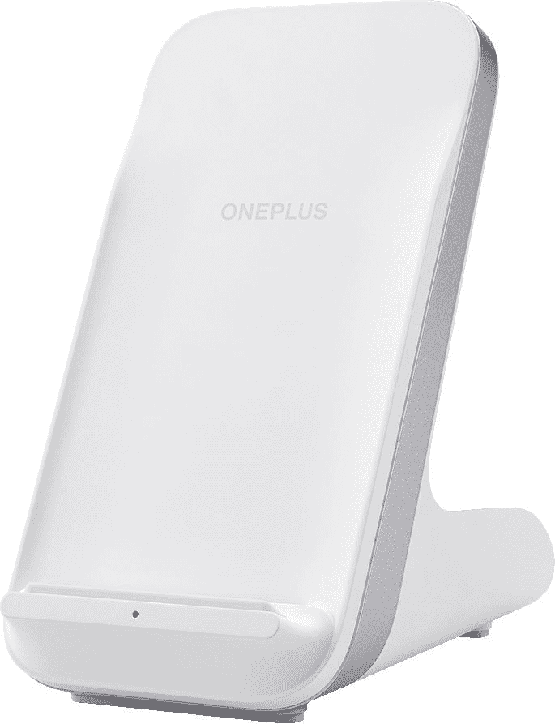</picture> 

OnePlus Warp Charge 50 Wireless Charger

##### 一加翘曲充电 50 无线充电器

如果你想要一个可以达到超快的速度的无线充电器，这个来自一加的充电支架是唯一的选择。它还可以以高达 15W 的功率为 Qi 兼容设备(iPhones，谷歌像素，Galaxy 手机)充电。

 <picture></picture> 

VELOGK Warp Car Charger 30W

##### VELOGK Warp 车载充电器 30W

目前还没有任何用于 Warp Charge 65T 的汽车充电器，但这种适配器至少可以在你开车时为你提供 30W 的充电功率。它有一个额外的 USB 端口，用于为第二个设备充电，尽管当两个设备连接时，主端口的速度会变慢。

 <picture></picture> 

Amazon Basics USB Type-C to USB 3.1 Adapter

##### 亚马逊基础 USB USB-C 转 USB 3.1 适配器

需要在手机上使用闪存盘、键盘、耳机或其他 USB 配件吗？这个适配器就是你所需要的。你可能还需要在手机设置中启用 OTG，因为大多数一加设备默认关闭。

 <picture>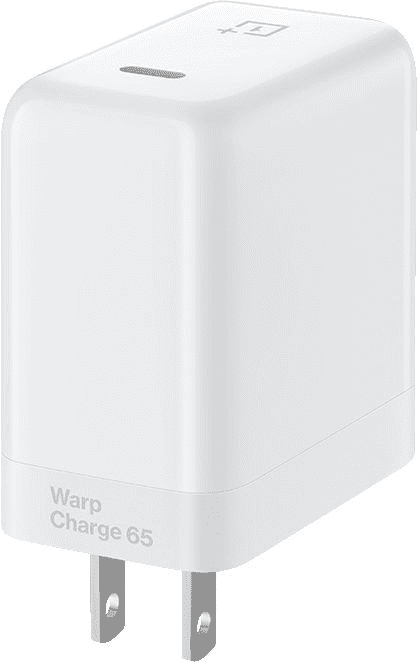</picture> 

OnePlus Warp Charge 65 Power Adapter

##### 一加曲速充电 65 电源适配器

如果你有丢失墙壁适配器的习惯，或者你只是出于某种原因想要一个备用的，你可以从一加的在线商店得到一个。

 <picture>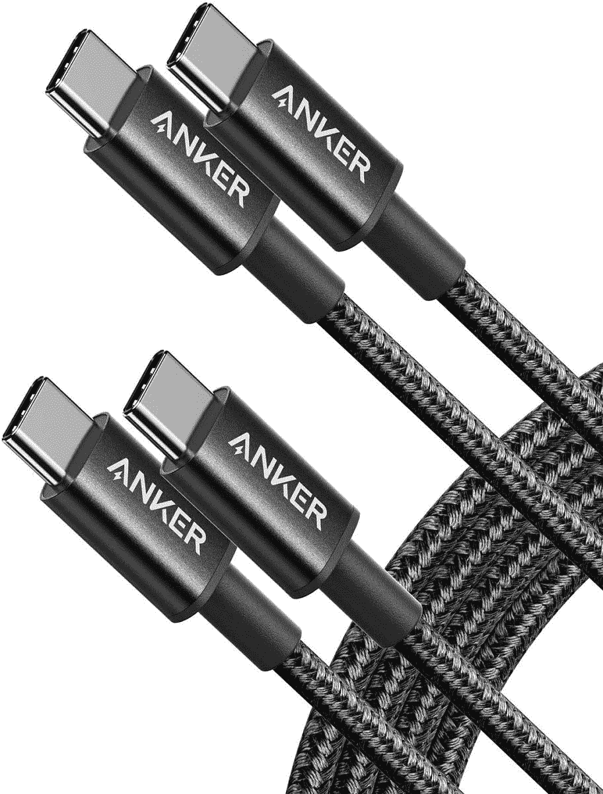</picture> 

Anker Braided Cable

##### 安科 USB-C 到 USBC-C 电缆

如果您想要更换手机自带的原装充电线，并且正在寻找更长更耐用的充电线，这是您的最佳选择。

 <picture></picture> 

Anker PowerWave II 15W Wireless Charger

##### Anker PowerWave II 15W 无线充电器支架

如果你不想为官方的 50W 无线充电器支付 70 美元，这款 Anker dock 可以以高达 15W 的功率为一加 9/9 Pro 充电。它还可以为 iPhones、Galaxy 设备和其他手机充电。

## 一加 9 专业版专用配件

这些是更贵的一加 9 Pro 的最佳案例。如果你有更便宜的一加 9，不要买这些，因为它们不合适。

 <picture>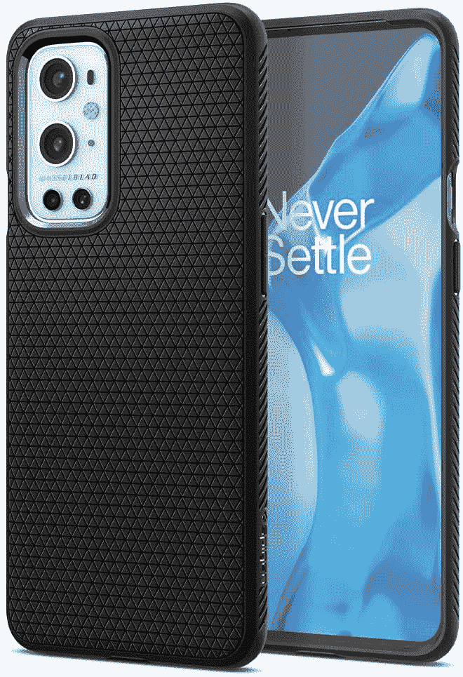</picture> 

Spigen Liquid Air Armor

##### Spigen 液态空气装甲一加 9 盒

Spigen 的液态空气装甲保护你的手机免受碰撞和(小)跌落，同时保持非常薄。这个版本是专为一加 9 专业版。

 <picture></picture> 

OnePlus 9 Pro Sandstone Bumper Case

##### 一加 9 专业砂岩保险杠盒

一加多年来一直出售砂岩手机外壳，这款一加 9 Pro 版本有黑色或“岩灰色”(即浅蓝色)可供选择。

 <picture>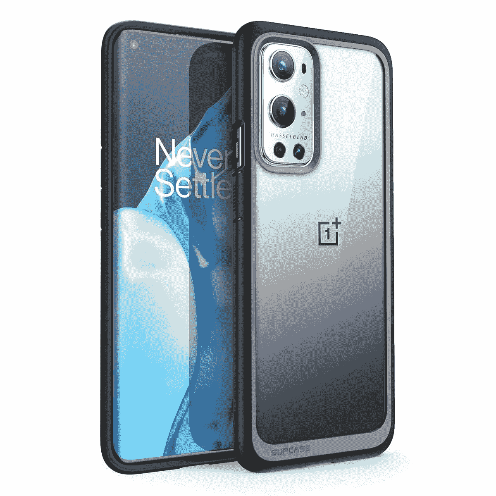</picture> 

Supcase Unicorn Beetle

##### SUPCASE UB 一加 9 案

这种混合外壳有一个半透明的后盖来展示你的手机的颜色，还有一个额外的 TPU 保险杠来增加保护。

 <picture>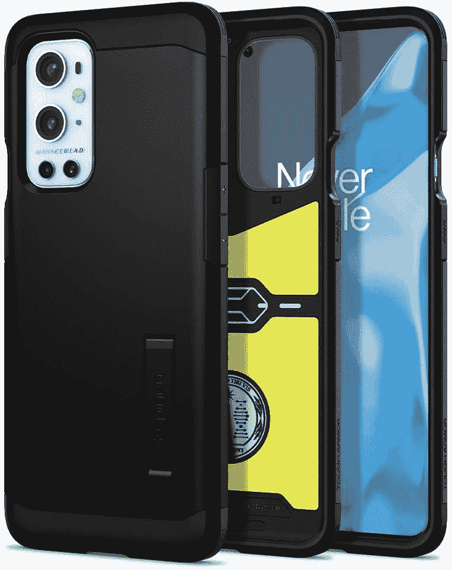</picture> 

Spigen Tough Armor

##### 斯皮根坚韧装甲一加 9 盒

Spigen 的坚固装甲外壳比其他选择稍显笨重，但它会保护你闪亮的新手机的安全。它还有一个支架，便于在桌子上观看媒体。

 <picture>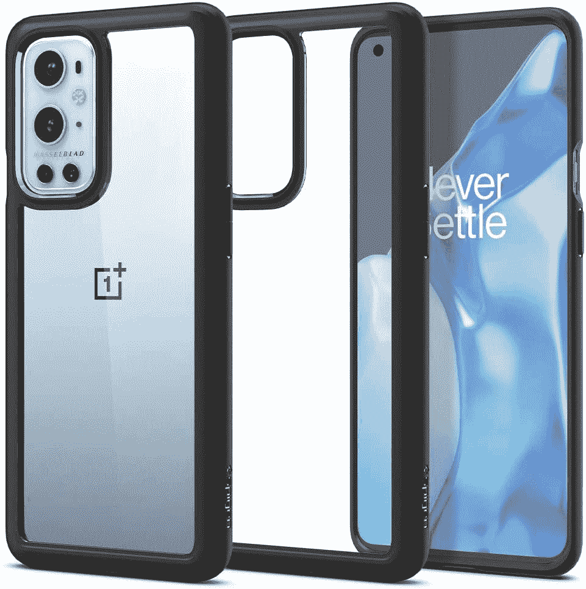</picture> 

Spigen Ultra Hybrid

##### Spigen 超混合动力一加 9 箱

这种情况下使用聚碳酸酯后盖和 TPU 保险杠来保护您的一加 9 Pro，同时仍然展示手机自己的设计。

 <picture>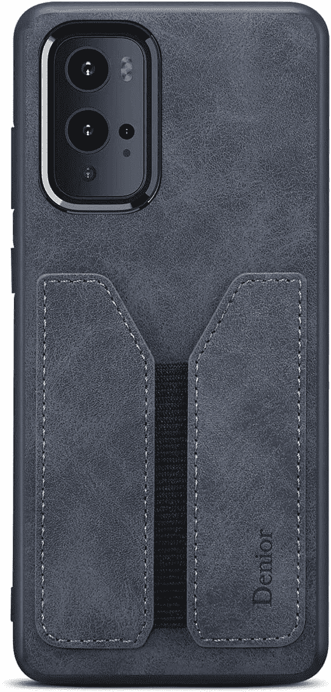</picture> 

Kowauri Wallet Case

##### 科沃瑞一加 9 钱包盒

这是一款超薄皮夹，采用 PU 皮革制成。它可以保护你的手机，同时也给你一个地方存放几张卡片。

如果你正在寻找更多的案例选择，我们有一个专门为一加 9 Pro 策划的[最佳案例列表。](https://www.xda-developers.com/best-oneplus-9-pro-cases/)

 <picture></picture> 

OnePlus 9 Pro

##### 一加 9 专业版

凭借 6.7 英寸的大尺寸四高清有机发光二极管显示屏和智能 120Hz 刷新率，一加 9 Pro 可能拥有市场上最好的显示屏。与 Hasselblad 合作调整的相机可拍摄出出色的静态照片，并捕捉精彩的 4K 视频。

## 一加 9-仅限配件

最后，这些是我们最喜欢的常规一加 9 的案例。如果你有专业型号，就不要买这些——它们不合适。

 <picture>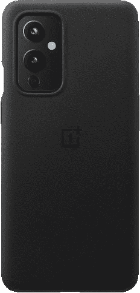</picture> 

OnePlus 9 Sandstone Bumper Case

##### 一加 9 砂岩保险杠盒

一加已经为它的大多数手机出售砂岩外壳，这个版本的普通 OP9 看起来很棒，会保护你的手机安全。

 <picture>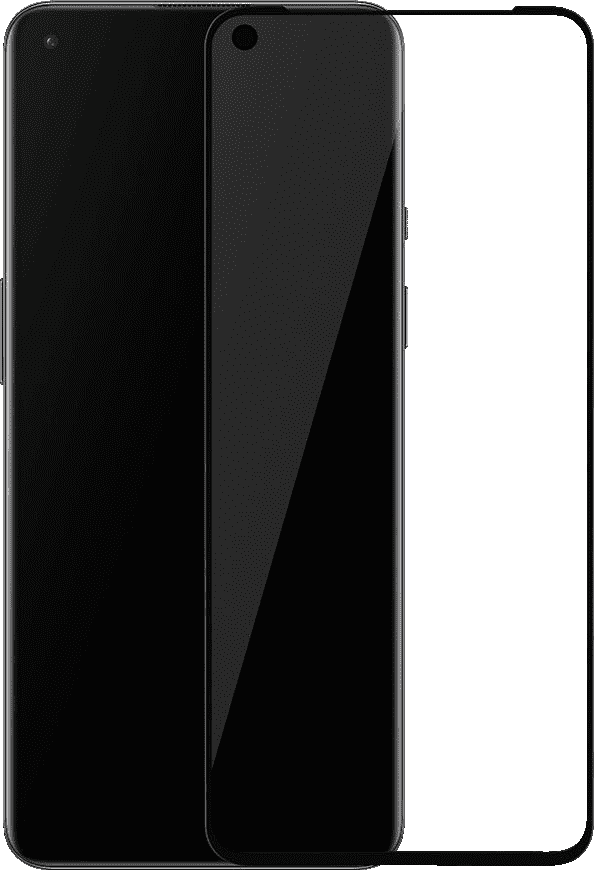</picture> 

OnePlus 9 3D Tempered Glass Screen Protector

##### 一加 9 3D 钢化玻璃屏幕保护器

曲面显示器的屏幕保护器通常没有平板显示器的保护器好，但一加的这款保护器是 OP9 的最佳选择。

 <picture>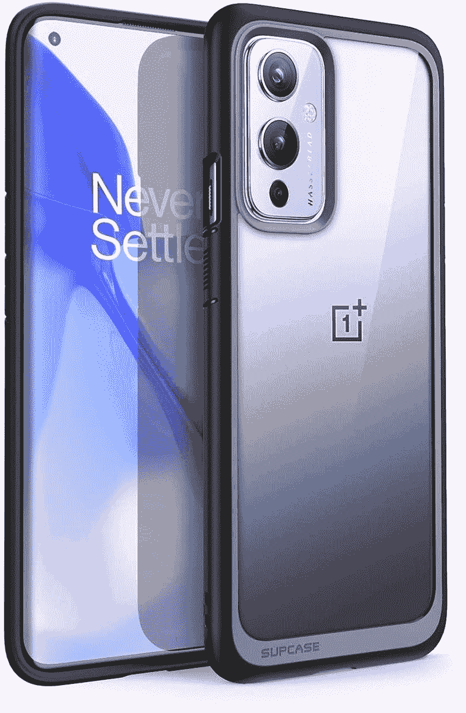</picture> 

Supcase Unicorn Beetle

##### SUPCASE UB 一加 9 案

这种混合外壳有一个半透明的后盖来展示你的手机的颜色，还有一个额外的 TPU 保险杠来增加保护。

如果你正在寻找更多的案例选择，我们有一个专门为一加 9 号策划的[最佳案例列表。](https://www.xda-developers.com/best-oneplus-9-cases/)

 <picture></picture> 

OnePlus 9

##### 一加 9

香草一加 9 是为那些谁想要旗舰性能，但不想支付最高美元。它提供了 6.5 英寸 120Hz AMOLED 显示屏，由哈苏调整的三摄像头设置，以及骁龙 888 SoC。