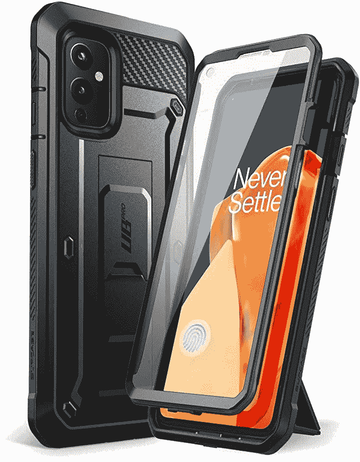
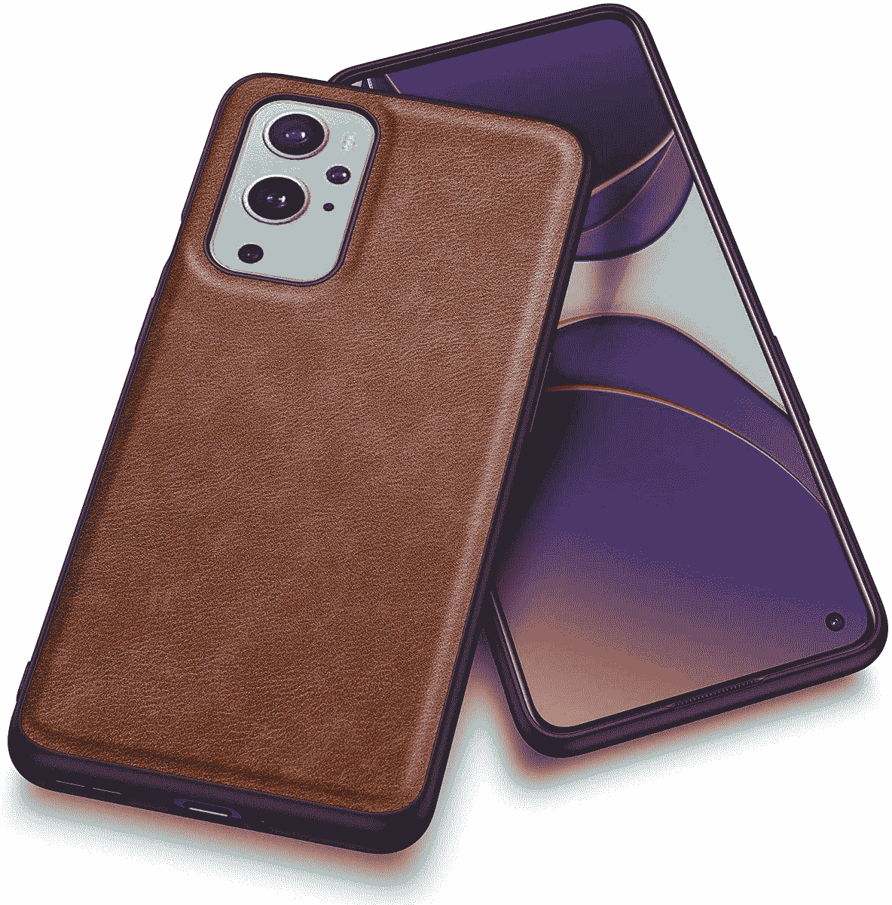
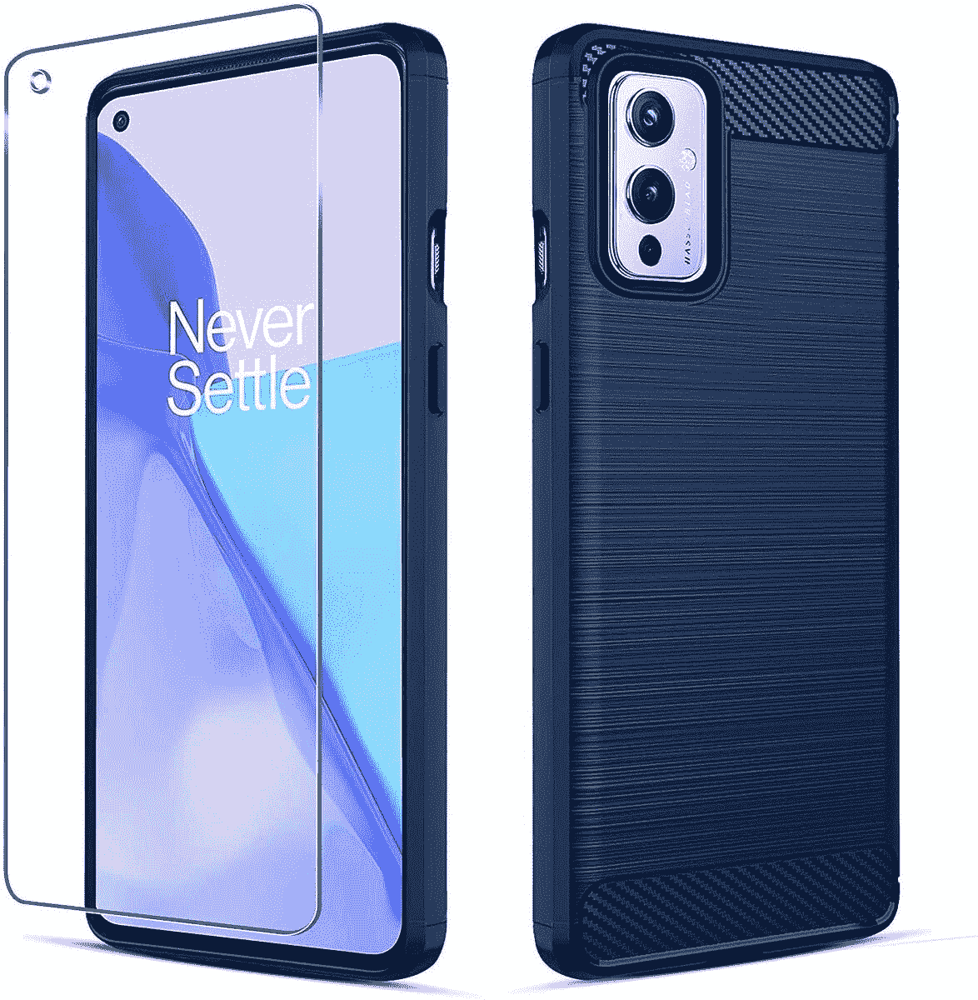

# 2023 年最佳一加 9 例

> 原文：<https://www.xda-developers.com/best-oneplus-9-cases/>

# 2023 年最佳一加 9 例

我们挑选了一些目前最好的一加 9 号案例。从高级保护套到预算选项，每个人都有自己的选择！

一加 9 号和 T2 9 号专业版于三月份正式亮相。两款智能手机都比前代产品有了实质性的改进，包括可靠的摄像头、更快的芯片组、更新的设计和更快的充电速度。尽管一加 9 Pro 无疑抢了风头，但香草一加 9 本身也不逊色。它配备了 6.55 英寸全高清+ AMOLED 显示屏，刷新率为 120Hz，高通顶级的骁龙 888 芯片组，高达 12GB 的 RAM 和 256GB 的存储空间，以 48MP 索尼 IMX689 传感器为首的三摄像头设置，支持 65W 快速充电的 4,500mAh 电池等等。

虽然一加在盒子里扔的是一个基本的透明盒子，但投资一个提供更多保护和一点点风格的盒子总是明智的。为了帮助您找到新一加 9 的最佳外壳，我们精心挑选了市场上的一些最佳选项。我们的选择涵盖了从优质产品到经济实惠的产品，以及介于两者之间的所有产品。

 <picture></picture> 

OnePlus 9 Sandstone Bumper Case

##### 一加 9 砂岩保险杠盒

听着，我们明白。你已经花了一大笔钱买了一辆闪亮的一加 9，不想掏空钱包买一个别致的箱子。但这并不意味着你应该解决盒子里的那个明显的案例。一加的官方砂岩保险杠 TPU 盖不仅价格合理，而且其经典的砂岩纹理提供了良好的手感和令人放心的抓地力。

 <picture></picture> 

Supcase Unicorn Beetle

##### SUPCASE UB 一加 9 案

如果你想展示你的一加 9 的背面，同时确保它能很好地防止划痕和跌落，Supcase 独角兽甲虫是你应该得到的一个箱子。这种情况下有一个很好的强硬的保险杠，和一个透明的背部来炫耀你的手机的颜色。

 <picture></picture> 

Poetic Guardian Series case

##### 诗意守护者一加 9 临案

这款来自 Poetic 的军用级透明外壳配有内置屏幕保护器，可提供真正的 360 度保护。如果你去徒步旅行或者你经常摔手机，并且想确保它即使在坚硬的表面上也能防止摔落，那么这个来自 Poetic 的案例绝对不会出错。它确实增加了相当大的体积，所以在拿到这个箱子之前要记住这一点。

 <picture></picture> 

Supcase Unicorn Beetle Pro

##### SUPCASE UB Pro 一加 9 案

Supcase Unicorn Beetle Pro 是一款坚固耐用的外壳，可提供极致的跌落保护。它配有一个内置的屏幕保护装置和一个支架以及一个皮带皮套。

 <picture></picture> 

Kqimi

##### Kqimi 皮革一加 9 盒

这款来自 Kqimi 的时尚表壳由高端皮革、TPU 保险杠和聚碳酸酯内壳制成，是其他普通硅胶表壳的一股清新之气。它的背面有 1.0 毫米厚的缓冲层，增加了对跌落的保护。

 <picture></picture> 

TUDIA Carbon Fiber

##### 图迪亚碳混合动力一加 9 箱

碳纤维设计的透明外壳(既然可以从 TUDIA 获得这款时尚的透明外壳，为什么要满足于普通的透明外壳呢？它具有坚硬的聚碳酸酯背部和减震 TPU 保险杠，背后是酷碳纤维设计。

 <picture></picture> 

Poetic Spartan series

##### 诗意的斯巴达一加 9 案

Poetic 的 Spartan 系列保护套使用硬框架保险杠、吸收冲击的 TPU 和内置屏幕保护器的前 PC 框架，为您提供全方位的全身保护。它还配有一个可伸缩的支架，用于免提视频通话和狂欢式观看。

 <picture></picture> 

PULEN TPU case

##### 普伦 TPU 一加 9 例

POLEN 表壳采用柔软的拉绒 TPU 设计，具有精确的切口和橡胶内框，有助于吸收突然跌落带来的冲击。它还配有免费的屏幕保护器。

 <picture></picture> 

Spigen Tough Armor

##### 斯皮根坚韧装甲一加 9 盒

如果一加的官方案例对你来说太贵了，你可能想看看这个 Spigen Tough Armor 案例。外壳由 TPU 和聚碳酸酯制成，摄像头和屏幕周围的边缘被抬起，以增加保护，同时还有一个加固的支架，让您不用手就可以欣赏您最喜欢的节目。

 <picture></picture> 

Spigen Liquid Air Armor

##### Spigen 液态空气装甲一加 9 盒

Spigen Liquid Air Armor 厚度仅为 0.11 毫米，具有完美的轻薄外形，可轻松放入和滑出牛仔裤口袋。它有一个带防滑哑光表面的纹理背部，确保舒适的手握和抗指纹。

 <picture></picture> 

Spigen Ultra Hybrid

##### Spigen 超混合动力一加 9 箱

Spigen Ultra Hybrid 具有透明的聚碳酸酯背面和灵活的 TPU 保险杠，让您尽可能多地展示您的一加 9 的美丽配色方案，同时还可以防止碰撞和跌落。它还有明显的按钮和凸起的嘴唇，以保护你的显示器和后置摄像头。

 <picture></picture> 

Caseology Parallax

##### 案例学视差一加 9 例

如果你有心情尝试一些大胆的东西，案例学视差绝对值得一看。它的触觉 3D 设计脱颖而出，你可以在两种时尚的颜色之间选择:灰灰和午夜蓝。双层外壳由硬聚碳酸酯和软 TPU 制成，并通过了跌落测试。

这些是你现在能为你的一加 9 抓到的最好的箱子。如果你正在寻找一种简约而又不失高贵的东西，经典的一加砂岩保险杠是一个很好的选择。我们也有一些来自 Spigen 的可靠选项，如 Spigen Tough Armor、Spigen Liquid Air Armor 和 Spigen Ultra Hybrid，所有这些选项的价格都很合理，而且建造得非常好。如果你预算紧张，普伦的 TPU 案件是我们 10 美元以下的首选。对于一流的保护，诗意的守护者系列和斯巴达系列案件是你的最佳选择。

 <picture></picture> 

OnePlus 9

##### 一加 9

香草一加 9 是为那些谁想要旗舰性能，但不想支付最高美元。它提供了 6.5 英寸 120Hz AMOLED 显示屏，由哈苏调整的三摄像头设置，以及骁龙 888 SoC。

我们将继续更新这份名单，当有更多的案例时，请务必回来查看。