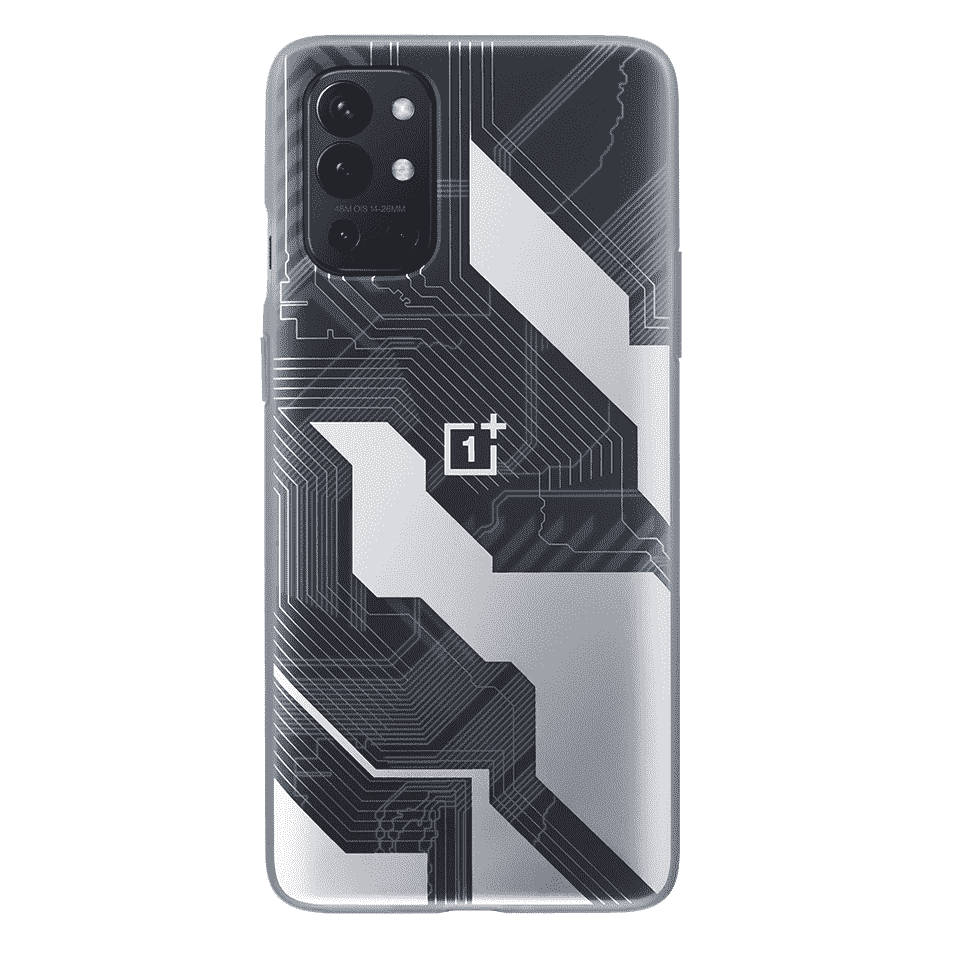
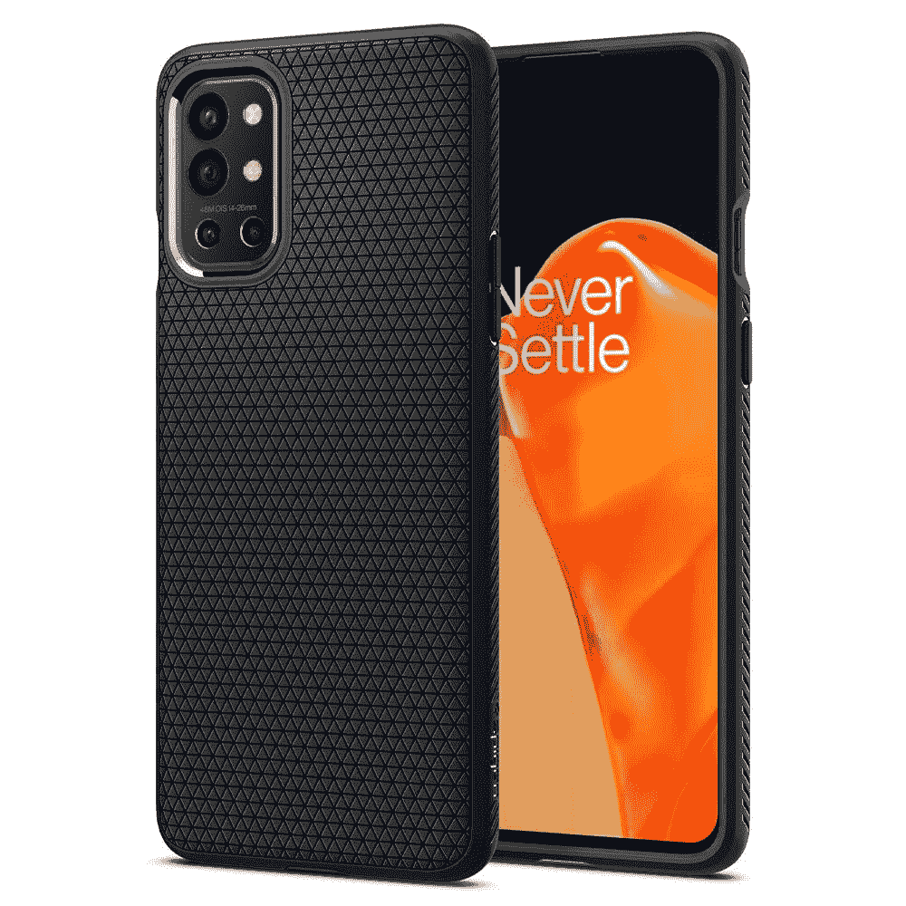
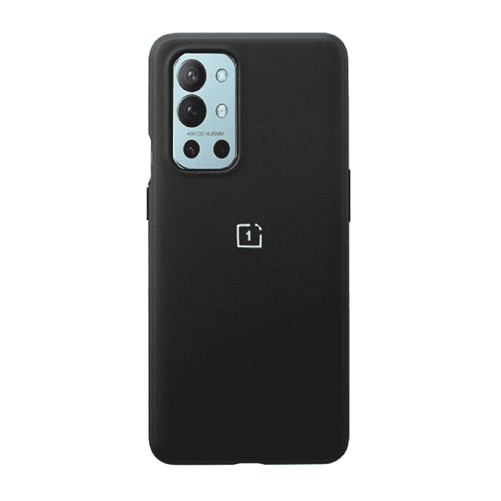
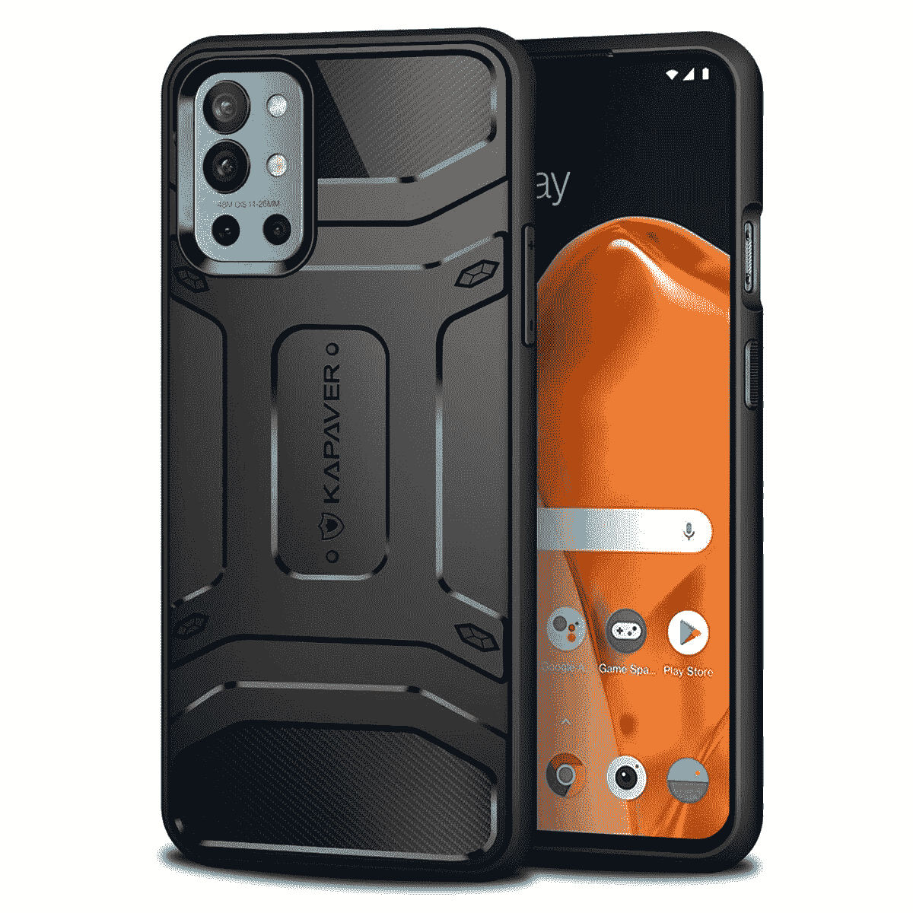
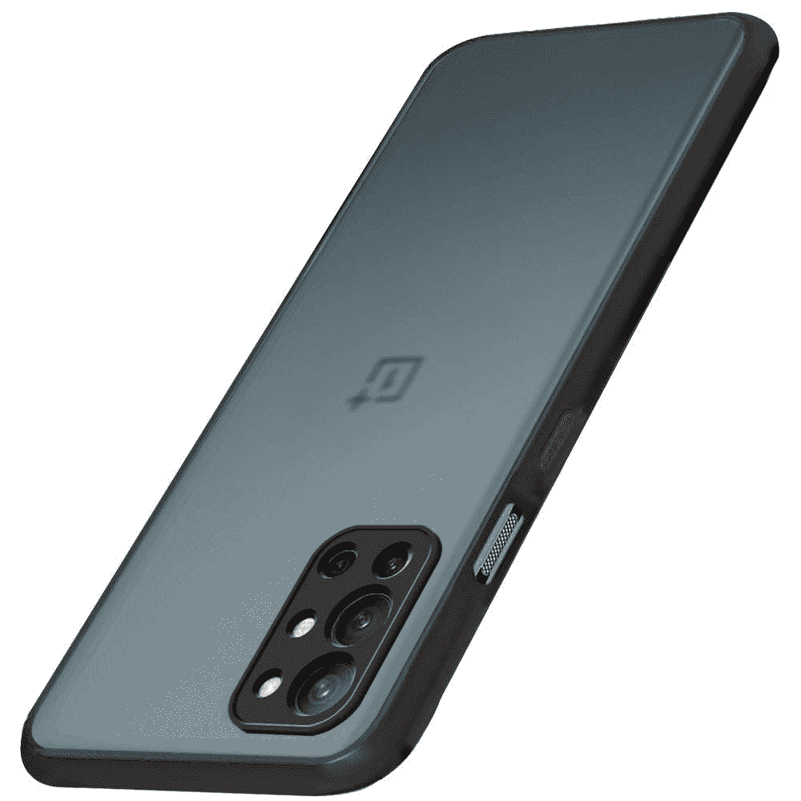
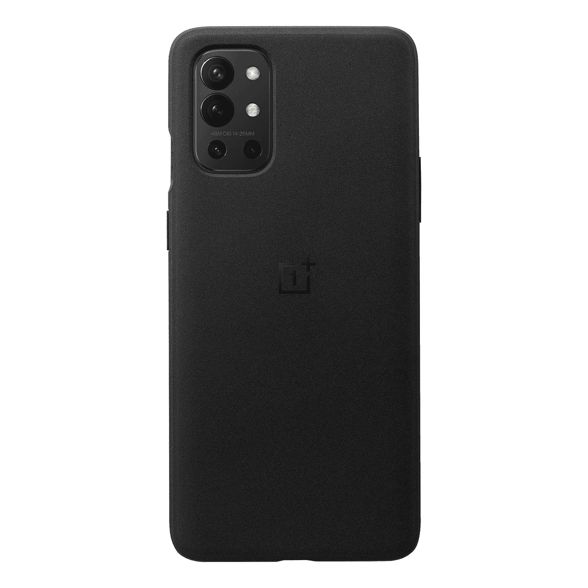
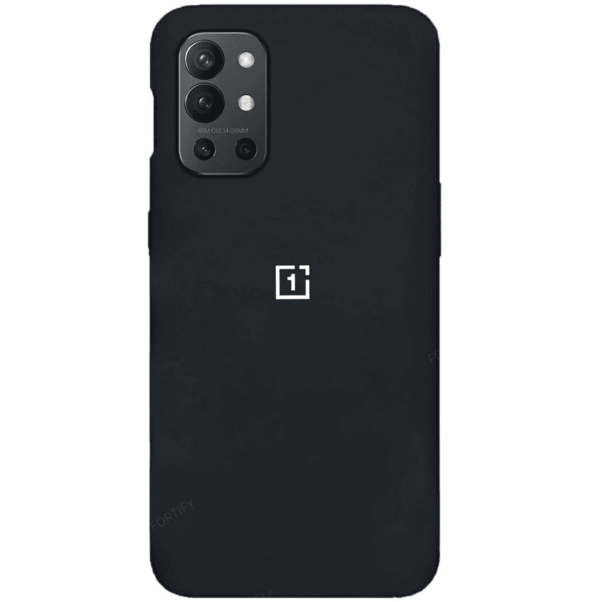
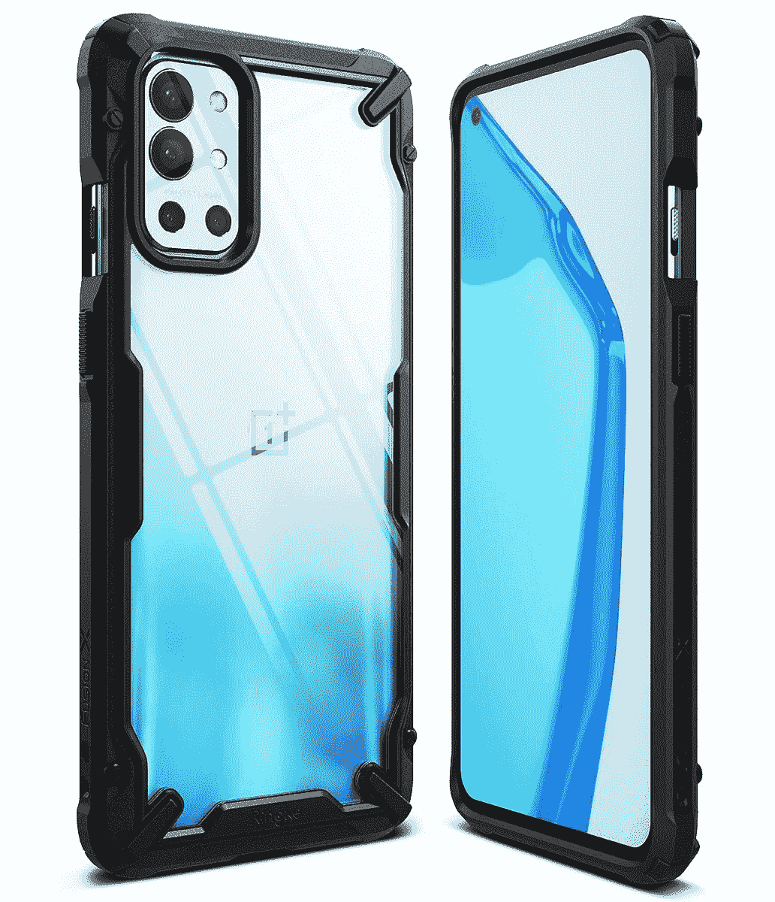
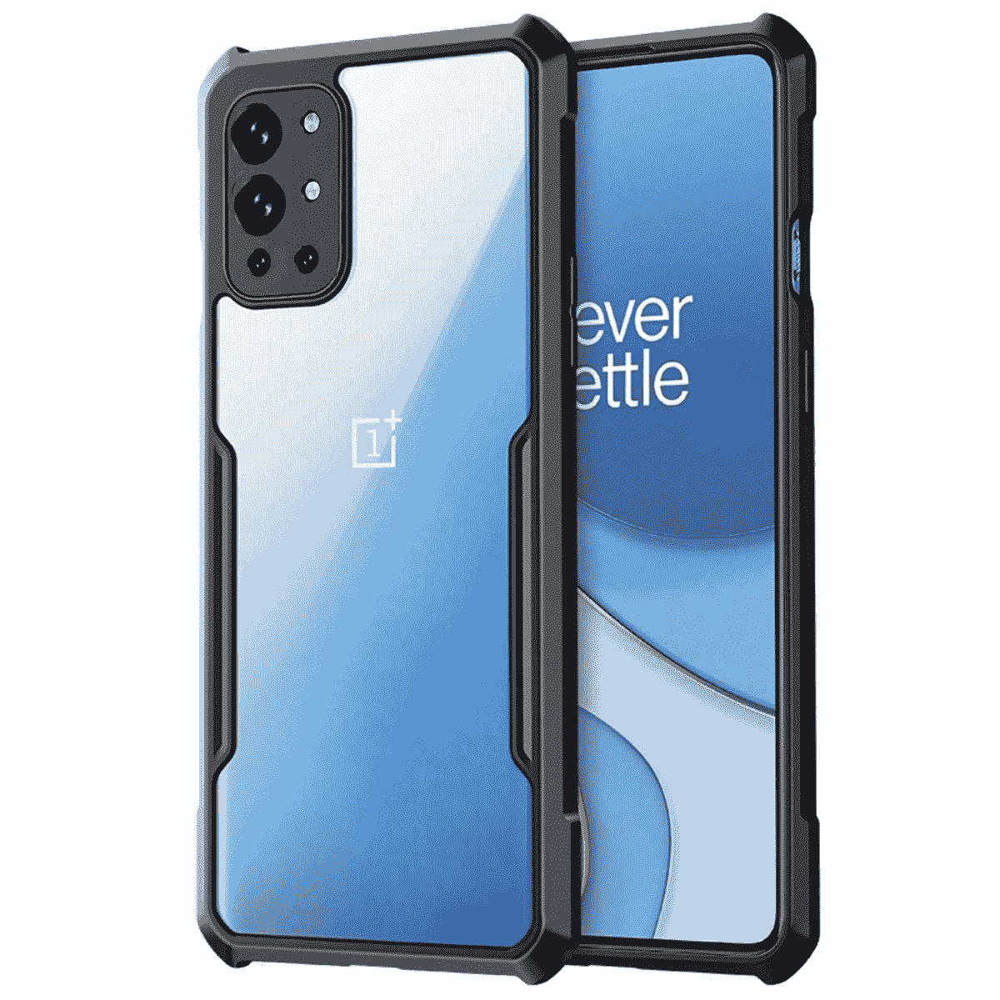
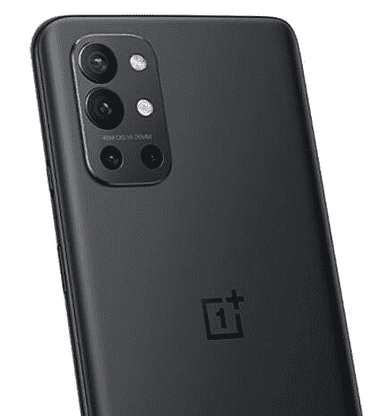

# 2023 年最佳一加 9R 案例

> 原文：<https://www.xda-developers.com/best-oneplus-9r-cases/>

一加被认为是将“旗舰杀手”的概念带入聚光灯下的品牌。然而，多年来，一加将自己重新定位为高端品牌，其最新手机更符合旗舰品牌的形象，而不是旗舰杀手。最近推出的[一加 9](https://www.xda-developers.com/oneplus-9) 系列是他们迄今为止最高端的智能手机系列，尤其是一加 9 Pro。除了旗舰 duo，该公司还特别为印度推出了[一加 9R](https://www.xda-developers.com/oneplus-9r-launch/) 。在这篇文章中，我们列出了一些你能买到的最好的一加 9R 机箱。

一加 9R 比其更昂贵的兄弟更接近于旗舰杀手。它沿用了去年的[一加 8T](https://www.xda-developers.com/oneplus-8t-review/) 的大部分规格，但配备了一个稍微更强大的处理器，即高通骁龙 870。除了改进的处理器，一加 9R 还将比一加 8T 多提供一年的软件更新。与专业版相比，它与普通版[一加 9](https://www.xda-developers.com/oneplus-9-camera-review/)的差异更小。

## 最佳一加 9R 保护套:轻薄保护套、坚固保护套等等

一加 9R 是印度独有的，可以通过[亚马逊印度](https://www.amazon.in/Test-Exclusive_2020_1178-Multi-3GB-Storage/dp/B089MTJVLD/?tag=xdaportalin-21)购买，如果你想以不太贵的价格获得可靠的性能，这可能是一个不错的选择。这看起来是一个有利可图的选择，尤其是如果你喜欢 OxygenOS 提供的干净快捷的体验。如果你已经在摇一加 9R 或者打算马上买一个，我们强烈建议你买一个，以确保长寿。以下是我们为您推荐的一加 9R 手机套。

 <picture></picture> 

Official Quantum Bumper Case

##### 量子一加 9R 案例

如果你想让你的智能手机外壳象征你对技术的热爱，你的搜索在一加 9R 的官方量子保险杠外壳电路板处结束。提供了相当程度的保护。

 <picture></picture> 

Spigen Liquid Air Armor

##### Spigen 液态空气装甲一加 9R 盒

这款来自 Spigen 的保护套提供了非常好的保护，同时足够薄，以确保手机不会变得太笨重。背面带人字形图案的哑光黑色设计也很好看。

 <picture></picture> 

Winble Silicon Case

##### Winble 硅胶一加 9R 表壳

如果你想为你的一加 9R 提供最基本的保护而不使它超载，像 Winble 这样的硅胶盒是理想的选择。外观简洁大方，有多种颜色可选。

 <picture></picture> 

Kapaver Rugged Case

##### Kapaver 坚固的一加 9R 表壳

黄油手指是你的中间名吗？别担心，一加 9R 的 KAPAVER 坚固外壳旨在保护您的手机免受跌落。它还提供了良好的握持手机的感觉。

 <picture></picture> 

The Gift Kart Smoked Cover

##### 礼品卡丁车熏一加 9R 案件

如果你想要体面的保护而又不花费太多，这是理想的选择。它甚至有一个半透明的背面来展示你的手机。

 <picture></picture> 

Official Sandstone Case

##### 砂岩一加 9R 表壳

这个来自一加的案例试图模仿 OnePlus One 的砂岩背面，并在握持手机时提供良好的握持感。还能提供良好的防跌落保护。

 <picture></picture> 

Riggear Fortify Silicone Case

##### Riggear Fortify 一加 9R 盒

找一个手感好的软胶保护套？你的搜索到此结束。这种情况下，从 Riggear 看起来隐形，也很实惠。

 <picture></picture> 

Ringke Fusion-X Case

##### 林克 Fusion-X 一加 9R 案例

如果你想要一个透明背面的箱子，Ringke 的这个箱子可以满足你。侧面抗冲击，也可以防止硬摔。

 <picture></picture> 

Riggear Xundd Clear Case

##### Riggear Xundd OnePlsu 9R 案例

如果 Ringke 的 clear hard case 太贵或者你不喜欢这个设计，你可以试试 Riggear 的这个 case。它有一个清晰的精装版，边缘有黑色的 TPU 保险杠作为保护。

与一加 9 或一加 9 Pro 相比，一加 9R 显然是一个降级产品，缺乏有光泽的哈苏相机或无线充电等功能。但它提供了更具竞争力的价格优势，甚至低于一加 8T。

至于箱子，我们会推荐 [Spigen Liquid Air](https://www.amazon.in/Spigen-Thermoplastic-Polyurethane-Compatible-OnePlus/dp/B08QTS93BD/?tag=xdaportalin-21) ，因为它提供了足够保护的超薄设计。如果你想要一个清晰的背部和坚固的保护，那么 [Ringke Fusion-X](https://www.amazon.in/Ringke-Fusion-X-Ergonomic-Transparent-Protection/dp/B092HYLTGC/?tag=xdaportalin-21) 是个不错的选择。对于预算有限的坚固保护，你应该选择 [Kapaver 保护套](https://www.amazon.in/dp/B08ZY9CN5J/?tag=xdaportalin-21)。

 <picture></picture> 

OnePlus 9R

##### 一加 9R

一加 9R 是一加今年推出的价格更实惠的手机之一，目标是寻求稳定性能而又不花太多钱的手机游戏玩家。

再说一次，如果你花了那么多钱，别忘了多花点钱，为你的手机买个保护套。此外，如果你决定今年买更贵的一加旗舰，一定要看看一加 9 和一加 9 Pro 的最佳配件。