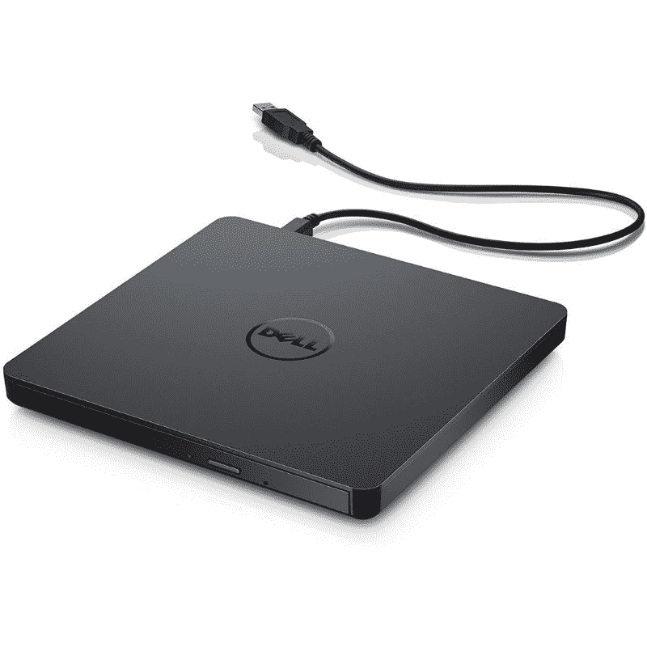

# 2023 年最佳光驱

> 原文：<https://www.xda-developers.com/best-optical-drives/>

即使您的电脑没有内置光驱，最适合您电脑的光驱也能让您使用或制作光盘。随着在线流媒体服务的兴起和随时下载内容的能力，许多最好的笔记本电脑和电脑已经抛弃了好的光驱。也就是说，仍然有很多人带着一个电影和音乐图书馆。可以肯定地说，物理驱动器仍然有许多用户。从小巧经济的光驱到功能强大、功能丰富的光驱，我们已经收集了市场上一些最好的光驱供您使用。无论您是寻找强大蓝光驱动器的发烧友，还是寻找基本 CD/DVD 刻录机的普通人，我们都有一些可靠的推荐给您。

## 整体最佳:华硕 BW-16D1X-U

如果你想在 2022 年买一个光驱，那就买华硕 BW-16D1X-U 蓝光光驱吧。这款功能齐全的光驱提供了一长串功能，而且它能够做到这一点，而不会在您的口袋里烧出一个大洞。你首先注意到的是这款硬盘的现代设计。很多这样的光驱都倾向于反映它们古老的设计，但是我们在这里挑选的华硕设备是不同的。

该驱动器顶部有一个哑光黑色光滑表面。还有一个很酷的 LED 指示灯，当驱动器处于活动状态时会亮起。华硕 BW-16D1X-U 蓝光驱动器比市场上的许多选项都要大，但它也比市场上的许多其他驱动器更强大。这种蓝光刻录机提供了即插即用的设计；你所要做的就是把硬盘连接到电脑上，它就开始工作了。

说到兼容性，华硕 BW-16D1X-U 蓝光光驱几乎支持任何蓝光、DVD 和 CD 格式。它还支持专为长期存档而设计的 M 盘。华硕宣称最长可使用 1000 年，相当有前途。如果你是一个喜欢归档或者喜欢做大量备份的人，那么这可能是你的驱动器。请注意，不支持超蓝光光盘。

华硕 BW-16D1X-U 还提供了超强的读写速度。Windows 上的支持软件在功能上也非常可靠。也就是说，市场上并不缺少支持软件。您可以使用从 Power2Go 到 NeroBackItUp 的一系列工具来提取或备份文件。很多这种软件也有加密功能来保护你的数据。此外，华硕还提供 BW-16D1X-U 云存储系统的六个月免费订阅。

综合考虑，我们认为华硕 BW-16D1X-U 是一个可靠的选择，可以考虑 130 美元左右。价格与大多数蓝光驱动器不相上下，但这一款恰巧提供了所有重要功能的良好性价比。如果你不介意多花一点钱，OWC 水星 Pro 外置 USB 3.1 Gen 1 光驱等其他选项也值得考虑。

##### 华硕 BW-16D1X-U 蓝光光驱

华硕 BW-16D1X-U 是一款可靠的蓝光光驱，以相对实惠的价格提供了一系列良好的功能。它速度快，设计现代，而且几乎什么都能做。

## 亚军:OWC 水星 Pro

如果你不想选择华硕的顶级产品，OWC 水星 Pro 光驱也是一个不错的选择。唯一的缺点就是稍微贵一点。关于 OWC Mercury Pro 外置光驱，您会注意到它坚固耐用的外观。与华硕 BW-16D1X-U 驱动器不同，这款驱动器采用哑光铝外壳。

在 IO 方面，OWC 水星 Pro 外置硬盘有一个 USB 3.0 插槽，一个 DC 输入，一个电源开关和一个肯辛顿安全插槽。OWC 水星 Pro 驱动器是托盘装载，这意味着驱动器托盘滑出蓝光光盘。托盘装载更容易使用，也更少机会打破或损坏您的光盘。

OWC 水星专业版几乎兼容所有主流格式。这包括 M-Disc，它本质上是一种存档质量的光盘格式，比任何其他标准都耐用。大多数其他蓝光驱动器与这些长效光盘不兼容。OWC 水星 Pro 硬盘的整体性能也是首屈一指的。将文件提取和复制到光盘上的速度非常快。如果你想刻录很多蓝光光盘，OWC 水星硬盘是一个不错的选择。它也非常可靠和易于使用。你所要做的就是用 USB 线把它连接到你的电脑上，然后你就可以开始了。

##### OWC 水星光驱

OWC 水星 Pro 外置硬盘是目前市场上最可靠的外置光驱之一。它速度快，性能可靠，包装坚固。

## 最佳预算:LG GP65NB60

虽然能够使用蓝光光盘是件好事，但我们知道并不是每个人都需要蓝光光盘驱动器。尽管蓝光驱动器很好，但它们往往比只支持 CD/DVD 的标准驱动器更贵。如果你不需要蓝光功能，那么你会想看看 LG GP65NB60。这种特殊的光驱通常售价不到 30 美元，对于那些精打细算的购物者来说是一个很好的选择。

LG GP65NB60 采用了低调的设计，在桌面上占用的空间更少，便于随身携带。LG GP65BN60 的尺寸为 0.6 x 5.4 x 5.6 英寸，小到足以装入您的背包。该驱动器还兼容多种标准。它可以读写不同类型的光盘格式，包括 CD/DVD、DVD+R、RW DVD-R、RW DVD-RAM 等。这种特殊的驱动器还支持用于备份和存档过程的 M-disc，对于那些喜欢收集数据或媒体文件的人来说，这是一个很好的选择。M-disc 使用专利的岩石状记录表面，而不是有机染料将数据蚀刻到光盘上。m 盘通常被证明比市场上现有的 DVD/CD 更耐用。

说到驱动器的整体性能，LG GP56BN60 也很可靠。它能以 24 倍的速度读取 CD-ROM，以 8 倍的速度读取 DVD-ROM。LG GP65BN60 在 CD-R 上最多可以写入 24 倍，在 DVD-R 上最多可以写入 8 倍，它可能不是市场上最快的驱动器，但它仍然值得称赞，并且价格非常可靠。LG 的这款硬盘最大的优点之一就是它只需要一个 USB 接口。这是为了满足驱动功率和数据传输需求。

它支持 Windows 和 Mac，使其成为 Mac 用户的另一个可靠选择。事实上，它还可以刻录档案质量的 M-disc，这使它成为一个非常好的光驱选择，尤其是在这个价格上。这里唯一缺少的是读写蓝光光盘的能力。对于那些不想要蓝光兼容驱动器的人来说，这不一定是一个大问题。LG GP65BN60 也有黑色、金色、银色和白色可供选择，因此请选择适合您的设置。

##### LG GP65BN60 光驱

对于那些不需要蓝光功能的人来说，LG 的 GP65NB60 光驱是一种低调、经济的选择。它可以在 Windows 和 Mac 上工作，只需要一个 USB 端口就可以工作。

## 超值:戴尔 DW316

如果您正在寻找简单易用、价格低廉的光驱，戴尔 DW316 USB DVD 光驱是另一个值得考虑的好选择。就像 LG GP65BN60 驱动器一样，戴尔设备不支持蓝光。也就是说，如果您只需要一些东西来满足您的 CD/DVD 需求，这是一个很好的选择。戴尔 DW316 的尺寸仅为 0.55 x 5.41 x 5.67 英寸，这意味着它与我们之前看到的 LG 选件一样便携。您只需一个 USB 连接器就可以连接和使用这些硬盘，增加了便携性。戴尔 DW316 正式支持 Windows，但众所周知，它也适用于 Mac 电脑。您可能需要加密狗或支持的适配器来配合新的 MacBooks 使用它。

这款戴尔硬盘预装了 CyberLink 媒体套件，让您可以轻松连接硬盘并探索所有可用选项。你可以用它来刻录 DVD/CD，甚至从光盘上抓取一些数据。你可能需要下载一个第三方应用程序来让这个驱动器在 macOS 上运行，因为没有官方支持。

Dell DW316 的整体性能可与目前市场上的许多其他驱动器相媲美。据戴尔称，DW316 驱动器拥有最高 24 倍的 CD 读取速度和 8 倍的 DVD 读取速度。戴尔 DW316 还以负载时噪音较小而闻名。戴尔为 DW316 驱动器提供一年保修，以防出现问题。还值得指出的是，戴尔 DW316 为光盘提供托盘装载，这是众所周知的比顶部主轴装载驱动器更好、更可靠的方法。

##### 戴尔 DW316 光驱

戴尔 DW316 光驱是市场上又一款价格合理、性能可靠的产品。它很纤薄，很时尚，使用一根 USB 线供电。

## 最佳 DVD 刻录机:华硕 ZenDrive

在讨论没有蓝光支持的光学 DVD/CD 驱动器时，华硕 ZenDrive 是另一个可靠的选择。我们认为华硕 ZenDrive 是你现在能买到的最好的 DVD 刻录机之一。您将获得一个高质量的驱动器，具有惊人的构建质量和许多其他出色的功能，而且价格合理。与市场上的许多其他光驱不同，华硕 ZenDrive 只需要一个 USB 连接器。它使驱动器非常容易使用，而不必携带一堆电缆来启动和运行它。

ZenDrive 是可靠的，就其大小而言性能很好。它处理 CD 和 DVD 的读写速度分别高达 24 倍和 8 倍。这些速度与目前市场上的大多数其他光驱不相上下。事实上，ZenDrive 与我们在本系列中提到的许多其他高级驱动器都有所不同。此外，ZenDrive 还可以在 160 毫秒内访问 CD 和 DVD 内容。

另外值得一提的是 ZenDrive 支持刻录到 M 盘。相比之下，很多光驱都不支持这个功能，所以这是一个很好的补充。能够刻录到 M-Disc 使 ZenDrive 成为那些寻求创建可持续长达 1000 年的长期存档数据的人的一个好选择。我们推荐挑选华硕 ZenDrive 的另一个原因是它同时支持 Windows 和 macOS。该驱动器配有 CyberLink 软件，可帮助您入门，无论是将内容存储在光盘上还是提取内容。

华硕还提供 ZenDrive 六个月的免费云存储，这是这款光驱独有的另一项额外功能。总的来说，如果你想刻录或翻录 DVD 和 CD，这是一个很好的选择，蓝光对你来说不是必需品。

 <picture></picture> 

Dell DW316 optical drive

##### 华硕 ZenDrive

如果你只是需要一个可以处理 CD 和 DVD 的驱动器，华硕 ZenDrive 是一个很好的选择。它纤薄、时尚、超级实惠。它适用于 Windows 和 Mac。

## 最适合存储格式:LG WP50NB40

LG 拥有市场上一些最好的光驱，包括我们挑选的最佳预算光驱。我们还将 LG WP50NB40 驱动器添加到列表中，作为我们为不同存储格式选择的最佳驱动器。想要同时支持蓝光和 DVD 吗？没问题。想要支持 M 盘？也没问题。

LG WP50NB40 拥有超薄的外形，厚度仅为两英寸。事实上，这是市场上为数不多的支持多种不同格式的超薄光驱之一。这种特殊的驱动器只有半英寸厚，使其成为最便携的驱动器之一。整体尺寸也足够小，可以放在一个小背包里。

LG WP50NB40 在写入速度方面不是最快的(6 倍蓝光写入和读取)，但它通过格式支持弥补了这一点。它既支持 M 盘，也支持 BDXL 盘，这本身就令人印象深刻。m 盘是档案媒体格式，BDXL 盘是高容量蓝光格式。BDXL 光盘能够存储数倍于标准蓝光光盘的数据。

这可能是市场上支持这么多存储格式的极少数驱动器之一。当然，它会比许多其他驱动器慢一点，但我们会用它来换取对这么多格式的支持。另一件值得指出的事情是，它需要两个 USB 连接。你需要一个给你的电脑，另一个给电源。这不一定是一个交易破坏者，但许多其他驱动器只需要一个连接。这可能会使工作变得有点棘手，尤其是当你在移动的时候。LG WP50NB40 在 Windows 和 macOS 上都能很好地工作，所以你应该不会有任何问题来启动和运行它。

##### LG WP50NB40 光驱

LG WP50NB40 光驱非常适合那些希望购买支持各种不同存储格式的驱动器的人。它既纤薄又时尚，虽然速度不如其他一些选择，但在多功能性上弥补了它的不足。

## 最适合 Mac 的:先锋 BDR-XU03

先锋 BDR-XU03 可能是目前市场上最好看的光驱之一。这个驱动器也是列表中唯一一个只与苹果 Mac 电脑兼容的驱动器。

先锋 BDR-XU03 的设计反映了苹果设备的时尚美学。它的尺寸仅为 5.2 x 0.8 x 5.2 英寸，重量约为 220 克。先锋 BDR-XU03 采用镁制机身，并配有垂直方向的支架。能够垂直定向驱动器使其更加紧凑。除此之外，先锋 BDR-XU03 还支持包括 BDXL 在内的各种不同格式，这意味着你可以使用这个驱动器来刻录或提取高容量数据。该驱动器还支持一些智能播放模式，包括 PowerRead、PureRead2+和自动静音模式。所有这些功能汇集在一起，带来独一无二的全方位体验。

PowerRead 和 PowerRead2+允许硬盘在播放音乐和电影等其他媒体文件时提供更流畅的播放效果。顾名思义，自动静音模式通过在播放媒体文件时降低读写速度来自动降低硬盘的整体噪音输出。至于读写速度，先锋 BDR-XU03 提供了 6 倍的蓝光写入速度和 6 倍的蓝光读取速度。这些速度更符合市场上的许多其他驱动器。综合考虑，我们认为先锋 BDR-XU03 对于 Mac 用户来说是一款非常好的光驱。

##### 先锋 BDR-XU03

先锋 BDR-XU03 是该列表中唯一一款仅与 Mac 电脑兼容的光驱。速度很快，看起来很棒，镁制的机身应该可以搭配大部分 MAC。

## 获得最佳光驱

现代计算机可能会抛弃这些光驱，但对于那些仍然依赖 CD、DVD 和蓝光的人来说，显然有很多光驱仍然存在。光驱在大小、性能和兼容性方面有很大差异，但我们在这里收集了一个完整的集合，应该会吸引大多数用户。

华硕 BW-16D1X-U 蓝光光驱是目前可以考虑的最佳光驱之一，如果你想要一个具有快速性能和多功能性的完整包，并且你不介意更大的尺寸。如果你不介意为了更便宜的价格放弃对蓝光的支持，戴尔 DW316 USB DVD 驱动器也值得考虑。那些想探索不同存储格式的人绝对应该看看 LG WP50NB40，尽管它价格昂贵。

由于你需要一台 PC 或 Mac 来使用这些 USB 光驱，你可能想看看我们收集的[最佳笔记本电脑](https://www.xda-developers.com/best-laptops/)。如果你有一个现代化的系统，更多的[最好的雷电配件](https://www.xda-developers.com/best-thunderbolt-accessories/)可以最大限度地提高性能和通用性。