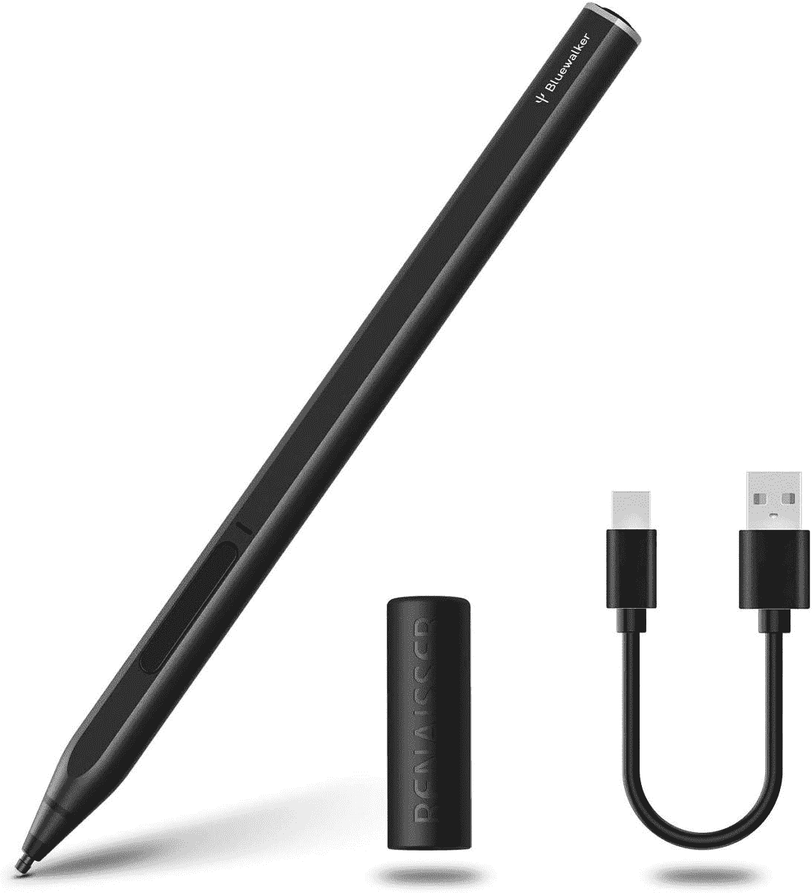
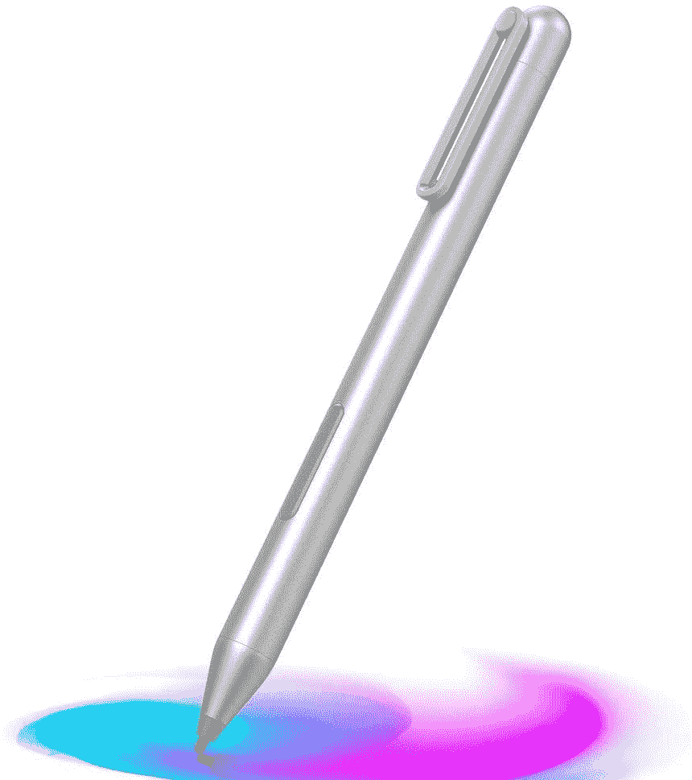
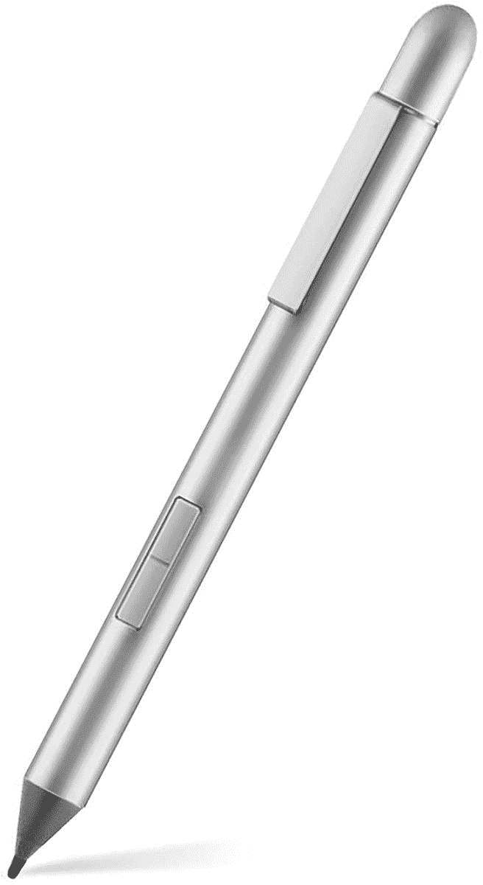

# 支持 Windows Ink 的最佳 PC 第三方笔

> 原文：<https://www.xda-developers.com/best-pc-pens/>

Windows Ink 是微软在 Windows 10 中推出的最酷的功能之一，可以更容易地使用数字活动笔在 PC 上做笔记和绘图，今天它仍然是 [Windows 11](https://www.xda-developers.com/windows-11/) 的重要组成部分。如今，许多敞篷车、平板电脑和一些[最好的笔记本电脑](https://www.xda-developers.com/best-laptops/)都支持 Windows Ink，但不管它们是否附带钢笔，还是你碰巧放错了你的钢笔，你可能会发现自己需要一个替代品。为了帮助您，我们收集了一些您可以为支持 Windows Ink 的 Windows 电脑购买的最佳活动笔。

虽然有很多支持 Windows Ink 的[笔记本电脑，但它们的工作方式并不相同。主动笔的工作要归功于专用的数字化仪，而且它们在每个设备上都不一样。Windows PCs 上使用的主要数字化技术有两种:微软笔协议(MPP ),这是微软几年前收购 N-Trig 的结果，以及 Wacom AES。这两种协议互不兼容，所以如果你要买一支笔，确保它与你的电脑支持的协议相匹配是很重要的。](https://www.xda-developers.com/best-laptops-windows-ink-support/)

## Windows 电脑的最佳混合笔

虽然我们刚刚说过 MPP 和 AES 笔是不兼容的，但是有一些笔支持这两种协议。如果你想要一个安全的赌注，你买的笔几乎肯定能与你的笔记本电脑一起工作，这些是你能使用的最好的。奇怪的是，Wacom 自己也做了几支既支持自己的 AES 协议又支持 MPP 的笔，所以你这里有一些高配置的笔。

*   ##### Wacom Bamboo Ink(第二代)

    Wacom Bamboo Ink 钢笔具有 4，096 级压力和高级金属设计。它与 Wacom AES 和 MPP PCs 都兼容。

    T13
*   <picture></picture>

    拉扎 M Pen

    ##### 拉扎 M Pen

    如果你想要一只稍微高级一点的笔，拉扎 M Pen 黑色附带倾斜支持、4096 级压力和同样广泛的兼容性。

*   ##### Wacom Bamboo Ink Plus

    这款高端 Wacom 笔采用了特别时尚的设计，包括可充电电池、更换笔尖和倾斜支架。虽然有点贵。

    T34

## 最佳 MPP 笔

如果你想确保你的设备受到支持，混合笔是理想的，但如果你知道你的设备支持什么协议，你也可以专门为它购买一些东西，通常会更便宜。支持因设备而异，但支持 MPP 的设备包括[微软的 Surface](https://www.xda-developers.com/best-microsoft-surface-pcs/) 系列，大部分[惠普面向消费者的笔记本电脑](https://www.xda-developers.com/best-hp-laptops/)(一些商务笔记本电脑使用 Wacom AES)，以及许多[戴尔笔记本电脑](https://www.xda-developers.com/best-dell-laptops/)。这只是一般的指导-我们建议你看看你的笔记本电脑具体支持什么。

*   <picture></picture>

    RENAISSER Raphel 520 Bt

    ##### RENAISSER Raphael 520 Bt

    这款笔包括了你所期望的所有高级墨迹功能，如倾斜支持和 4，096 级压力，而且还有蓝牙，因此你可以为它的按钮指定快捷键。它也可以通过 USB-C 充电。

*   ##### Uogic Surface 手写笔

    uo gic 的这款手写笔是一个很棒的实惠选择，支持 4096 级压力，并配有可通过 USB-C 充电的电池。它还有两种颜色，冰蓝色和白色，比大多数其他有源笔都更独特。

*   <picture></picture>

    MoKo Stylus Pen for Surface

    ##### 可比 Stylus

    这是一款相对基本的 Windows Ink-capable pen，支持 1，024 级压力和手掌排斥，但也是最实惠的一款如果你只是想要写作和涂鸦的基本支持，这是一个很好的选择。

也有很多笔记本电脑支持 Wacom AES 协议，同样，如果你知道你的笔记本电脑支持 Wacom AES 协议，你可以用一个更便宜的选项来省钱。联想和宏碁笔记本电脑、LG gram 二合一机型以及其他品牌的一些精选机型支持 Wacom AES。同样，值得检查以确保你得到的是一只兼容的笔，或者如果你想安全起见，你可以使用顶部的混合笔，它可以支持两种协议。

*   ##### 联想数码笔 2

    联想数码笔 2 是一款基于 Wacom AES 协议的实心 Windows 墨水笔。像大多数高端笔一样，它支持 4096 级压力，并且它有两个侧按钮用于附加功能。

*   ##### 戴尔 premier 可充电活动笔

    戴尔 Premier 可充电活动笔是一款非常高端的手写笔，除了支持蓝牙之外，还支持 Wacom AES。它甚至配有瓷砖支架，这样你就可以在丢失钢笔时找到它。该笔本身支持 4，096 种压力和倾斜级别，因此它是一种全方位的优质体验。

    T17
*   <picture></picture>

    特莎活动笔

    ##### 特莎活动笔

    如果你想要更实惠的东西，这款特莎笔支持 Wacom AES 笔记本电脑 2048 级压力和手掌拒绝防止误触。它附带一个额外的替换小费。

这些是我们为您的 Windows PC 推荐的最佳活动数字笔。当然，我们最大的建议是混合笔，不仅因为如果你不知道你的笔记本电脑到底支持什么，它们是一个更安全的赌注，而且因为当你买了新的笔记本电脑时，它们更有可能与你的下一台笔记本电脑一起工作。然而，其他一些选择更实惠，所以也值得研究一下。

如果你在为你的 Chromebook 寻找笔，记住它们使用不同的协议。我们有一个【Chromebooks 最佳 USI 笔的列表，你可能想看看。