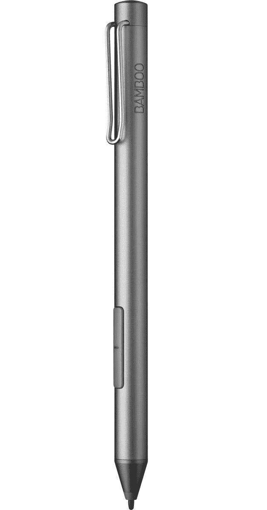
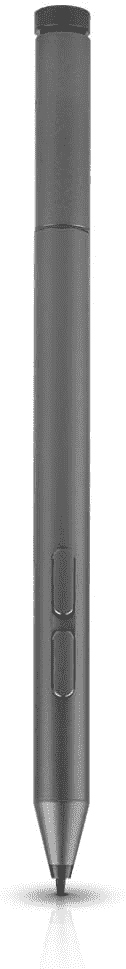

# 戴尔 XPS 13 二合一设备的最佳笔款(2022 年)

> 原文：<https://www.xda-developers.com/best-pens-dell-xps-13-2-in-1-2022/>

# 戴尔 XPS 13 二合一设备的最佳笔款(2022 年)

戴尔 XPS 13 二合一设备支持 Wacom AES 笔，因此您不必再使用新的 XPS 触控笔。这里有一些其他的选择。

戴尔最近为 2022 年推出了完全重新设计的 [XPS 13 二合一设备。这款新机型现在采用平板电脑外形，带有可选的键盘附件，而不是过去几代产品的可转换设计。当然，就像以前的那些型号一样，戴尔 XPS 13 二合一设备仍然支持活动笔，如果你想要完美匹配的东西，戴尔甚至会在平板电脑旁边推出 XPS 触控笔。](https://www.xda-developers.com/dell-xps-13-2-in-1-2022-review/)

公平地说，如果您正在购买一台 Dell XPS 13 2 合 1 设备，您的最佳选择是也购买 XPS 触控笔，因为它旨在通过磁力附着在平板电脑上，并以无线方式充电。不过，100 美元还是有点贵，所以如果你想要便宜一点的东西，或者只是不同的东西，我们可以帮助你。我们收集了一些您可以购买的用于 Dell XPS 13 二合一设备的最佳笔。为了清楚起见，XPS 13 2 合 1 支持使用 Wacom AES 2.0 协议的笔，这就是我们在这里寻找的。

*   <picture></picture>

    戴尔高级活动笔

    ##### 戴尔高级活动笔

    戴尔目录中实际上有几款笔，如果您想要比 XPS 手写笔稍便宜的正式产品，戴尔高级活动笔可能适合您。它有 4，096 级压力，倾斜支持，甚至蓝牙快速应用快捷键。而且，就像 Wacom 模型一样，它支持 AES 和 MPP。

*   <picture></picture>

    联想 Pen Pro

    ##### 联想 Pen Pro

    将联想 Pen 与戴尔平板电脑配合使用可能有些荒谬，但如果你是这种金色笔尖的经典设计的粉丝，联想 Pen Pro 是一个很好的选择。它有 4，096 级压力，倾斜支持和蓝牙。然而，它仍然很贵，而且只支持 AES，所以这一点要记住。

*   <picture></picture>

    拉扎 M 笔

    ##### 拉扎 M 笔

    越来越便宜的笔中，拉扎 M 笔是一个绝佳的选择。它拥有您期望的所有功能，包括 AES 和 MPP 支持、4，096 级压力和倾斜。它没有蓝牙功能，使用 AAAA 电池，但售价 55 美元，这对于任何 Windows Ink 笔记本电脑来说都是一款非常棒的笔。

*   <picture></picture>

    Wacom 竹墨

    ##### Wacom 竹墨

    如果你不想花 100 美元，但你仍然想要一支 Wacom 笔，普通竹墨是一个很好的选择。它便宜得多，去掉了蓝牙，但它仍然有 4，096 级的压力，倾斜，并支持 AES 和 MPP。它便宜得多，但仍然是戴尔 XPS 13 二合一设备的最佳笔之一。

*   <picture></picture>

    戴尔活动笔

    ##### 戴尔活动笔

    如果您想继续使用戴尔品牌的配件，但又想让钱包更方便，戴尔活动笔是一个不错的选择。它省略了一些功能，如蓝牙或 MPP 支持，但它仍然有 4096 级压力，并为基本的笔记提供了可靠的体验。

*   <picture></picture>

    特莎活动笔

    ##### 特莎活动笔

    如果你正在寻找最便宜的活动笔，这款来自特莎的笔可能就是它了。它有 2048 种压力等级，没有蓝牙这样的花哨功能，但价格不到 30 美元，是紧急情况下记笔记的可靠选择。

*   <picture></picture>

    联想主动笔 2

    ##### 联想主动笔 2

    如果你喜欢笔快捷键的便利，联想主动笔 2 是一款更便宜的笔，具有 4096 级压力，并且它带有蓝牙支持来启用这些快捷键，与其他蓝牙笔相比价格相当低。

*   <picture></picture>

    digi root 手写笔

    ##### digi root 通用手写笔

    如果你只是想要一支可以在触摸屏上充当手指的笔，这是一个有效的选择。这不是一个主动笔，所以除了比用手指更精确一点之外，它没有其他功能。它不需要电池，也不需要充电。

如果您想要在新的 Dell XPS 13 2 合 1 设备上使用，这些是您可以买到的最好的笔。这些大多是功能强大的笔，许多是知名品牌，它们一定会为你服务很长一段时间。如果你想在以后购买不同的笔记本电脑时仍能工作，Wacom Bamboo Ink Plus 和其他支持多种协议的笔是不错的选择。当然，你可以用一些简单的东西来省钱，比如特莎笔。

如果您还没有，您可以使用以下链接购买 Dell XPS 13 2 合 1 设备，还可以购买 XPS Folio 键盘或 XPS 触控笔。否则，如果你想要一些有点不同但仍然可以用作平板电脑的东西，你可能想看看现在可用的[最佳敞篷车](https://www.xda-developers.com/best-convertible-laptops/)。如果你不一定需要的话，也可以看看 T2 最好的笔记本电脑 T3。

 <picture></picture> 

Dell XPS 13 2-in-1

##### 戴尔 XPS 13 二合一设备

Dell XPS 13 2 合 1 是一款时尚的 Windows 平板电脑，配有清晰的 3:2 显示屏、两个出色的摄像头和第 12 代英特尔处理器